<!-- dig-section: 15 -->
## 팔란티어 위협 조건과 현재 AI 업계의 관점

지난 영상에서 제시된, 팔란티어가 위협받을 수 있는 세 가지 조건은 다음과 같았습니다. 첫째, 세상의 모든 물리적 법칙과 현상을 이해하는 '월드 모델 AI'가 출시되고 , , 둘째, 이 AI가 인간은 이해하지 못하는 기업의 '디지털 트윈'을 만들 수 있으며 -, 셋째, 기업들이 자신의 모든 소중한 데이터를 이 AI에 넘겨줄 고객사가 등장하는 경우입니다 -. 이 조건들이 모두 충족된다면 팔란티어뿐만 아니라 모든 기업이 위험해질 수 있습니다 -.

하지만 반대로 이 세 가지가 만족되지 않는다면, 팔란티어의 입지는 여전히 강력하며 쉽게 대체될 수 없다는 것이 이번 영상의 핵심 주장입니다 -. 이를 뒷받침하기 위해 최근 AI 업계의 동향을 보여주는 사례를 소개합니다.

그중 첫 번째는 Anthropic 직원이 공유한 경험입니다. 그에 따르면, AI 에이전트는 보통 `markdown`이라는 텍스트 파일 형태로 결과물을 사용자에게 전달합니다 -. 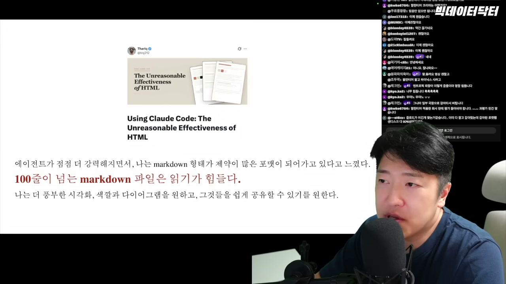 하지만 이 텍스트 파일이 100줄만 넘어가도 사람이 읽고 이해하기가 매우 힘들어집니다 -. 결국 공유해도 동료들이 잘 읽지 않게 되어, AI가 생성한 정보는 활용되지 못하는 '죽은 정보'가 되어버립니다 , . AI 입장에서는 텍스트 생성이 효율적일지 몰라도, 사용자 입장에서는 매우 비효율적인 방식인 것입니다 -.

이에 대한 해결책으로 그는 AI가 결과물을 `HTML` 형태로 시각화하여 제공하는 방식을 제시합니다. 데이터를 표나 그래프로 간결하게 표현해주자, 훨씬 이해하기 쉬워지고 정보를 받아들이는 부담감도 줄어들었습니다 -. 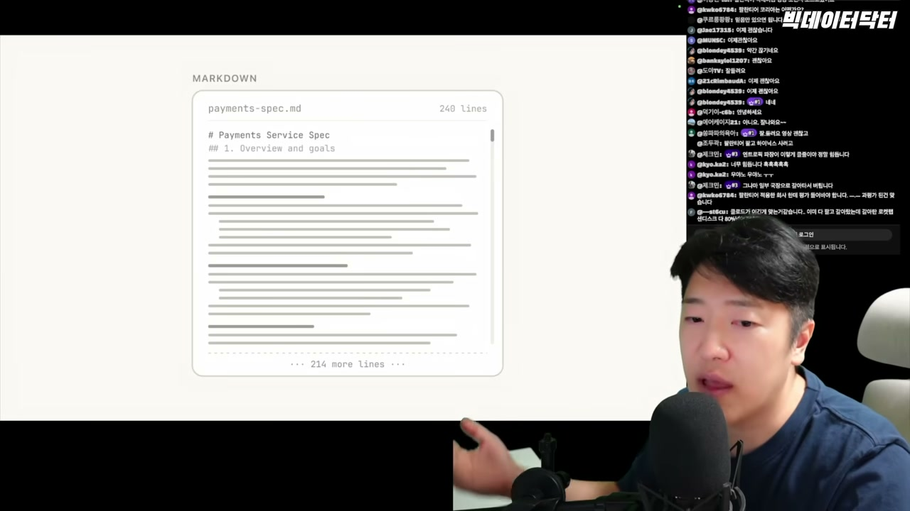 이 방식은 링크 하나로 쉽게 공유할 수 있다는 장점도 있습니다 -.

그러나 가장 결정적인 이유는 따로 있었습니다. HTML을 사용하자 AI(Claude)와 함께 의사결정 '루프(loop) 안에 있다'는 느낌이 훨씬 강해졌기 때문입니다 -. 이전처럼 방대한 텍스트를 일방적으로 받으면, 사용자는 이해를 포기하고 AI에게 모든 선택을 맡겨버리는 두려운 상황이 올 수 있습니다 -. 반면, 시각화된 HTML로 소통하면 사용자는 AI와 함께 문제를 해결하고 있다는 안정감을 느끼며, 의사결정 과정에서 주도권을 잃지 않게 됩니다 -.

이는 '이해(Understanding)'의 본질과 연결됩니다. '이해'란 개별적인 것들 사이의 '관계(relationship)'를 파악하는 능력입니다 -. AI가 생성한 데이터의 관계를 인간이 쉽게 파악할 수 있도록 돕는 시각적 소통 방식이 중요해지면서, 인간의 이해를 배제하는 방향보다는 인간과의 협업을 강화하는 방향으로 AI가 발전하고 있음을 보여주는 사례입니다.
<!-- /dig-section -->

<!-- dig-section: 233 -->
## AI 결과물 이해와 온톨로지의 중요성

발표자는 '이해'의 본질이 무엇인지 간단한 예시로 설명하며 시작합니다. "철수가 화를 냈어"라는 문장은 그 자체로는 하나의 사실일 뿐, 진정한 이해는 아닙니다. - 하지만 "내가 모르고 철수를 쳤어"라는 선행 사건, 즉 맥락이 주어지면 우리는 비로소 철수가 왜 화를 냈는지 연결해서 파악할 수 있게 됩니다.  이처럼 진정한 이해는 단편적인 사실이 아니라, '대상과 대상의 연결'에서 비롯됩니다. -

이 원칙은 엔트로픽 직원이 AI가 생성한 마크다운 문서를 동료들이 더 잘 이해하도록 HTML로 변환한 사례에도 적용됩니다.  단순히 보기 좋은 형태로 바꾸는 것은 표면적인 이해를 돕는 수준에 그칩니다.  프로젝트의 본질을 제대로 이해하기 위해서는 현재의 결과물을 과거의 데이터(예: 1주 전, 1달 전의 HTML 파일) 및 연관된 다른 부서의 프로젝트 결과물과 연결해야 합니다. - 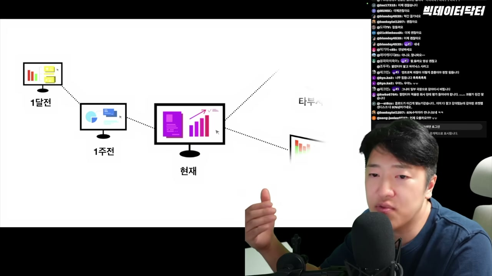 이는 의사가 환자를 진료하는 것과 같습니다. 오늘 나온 피검사 결과만으로는 환자의 상태를 온전히 파악할 수 없으며, 과거의 기록(1주 전, 한 달 전)과 다른 진료과(정형외과, 신경과 등)의 데이터를 모두 연결해서 볼 때 비로소 환자의 본질을 제대로 이해할 수 있는 것과 같은 이치입니다. -

나아가 AI와의 협업에서는, AI가 제공하는 데이터를 이해하는 것을 넘어 'AI가 이 상황을 어떻게 이해하고 있는가'를 파악하는 것이 중요해집니다.  우리는 다음과 같은 질문을 던져야 합니다: "AI는 우리가 무엇을 중요하게 여기는지 알고 있을까?", "지난번의 판단을 참고했을까?", "이번에는 왜 다르게 이야기하지?" - 이처럼 인간과 AI가 서로의 맥락을 공유하고 같은 방식으로 상황을 이해할 때, 프로젝트의 본질에 더 깊이 다가갈 수 있습니다.  이렇게 모두가 공유하는 이해의 틀, 즉 '온톨로지(Ontology)'가 바로 팔란티어가 지속적으로 주장하는 핵심입니다. -

인간이 AI가 제시한 데이터를 '이해'하고 그에 기반해 '결정'을 내리는 의사결정 루프의 효율을 극대화하려면, 데이터의 출처부터 결정의 영향까지 모든 과정을 추적하고 명확하게 파악할 수 있어야 합니다. - 이를 위해서는 온톨로지 구축이 필수적입니다. 

안드레이 카르파티(Andrej Karpathy)는 "생각은 외주화할 수 있지만, 이해는 외주화할 수 없다"고 말했습니다. - AI의 사고(처리) 능력은 이미 인간을 앞서고 있으며, 글의 핵심을 요약하는 등의 작업은 AI에 맡길 수 있습니다.  그러나 시스템 전체의 목적, 방향, 기준과 같은 상위 개념을 조정하는 '이해'의 과정은 외주화해서는 안 됩니다. - 이것은 문제 해결 과정의 '병목(bottleneck)'이 아니라, 시스템을 올바른 방향으로 이끄는 필수적인 조타수 역할이기 때문입니다.  결국 인간이 사는 사회이기에, 그 중심에는 인간의 이해가 자리 잡아야 합니다. - 만약 인간이 이해하지 못하는 기업의 디지털 트윈이 등장한다면, 이는 특정 기업을 넘어 세상 전체에 위험이 될 수 있습니다. - 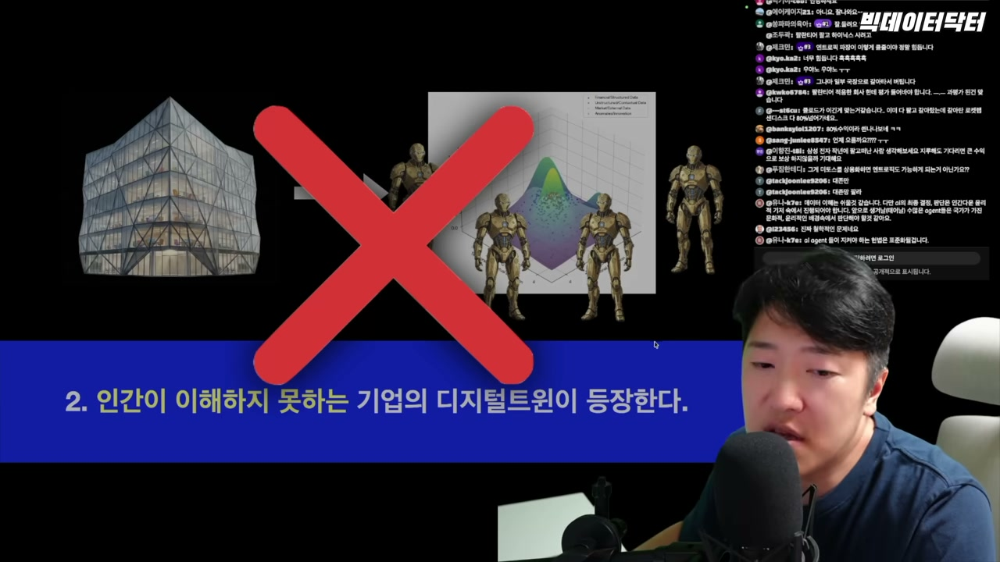

이러한 철학은 구글 AI 디렉터의 주장과도 일맥상통합니다. 그는 평범한 AI 모델에 '훌륭한 하네스 엔지니어링'을 결합한 것이, 훌륭한 AI 모델에 '나쁜 하네스 엔지니어링'을 결합한 것보다 일관되게 더 나은 성능을 보인다고 말했습니다. - 여기서 하네스 엔지니어링이란 AI가 도구를 잘 사용하고, 메모리를 관리하며, 안전한 환경(샌드박스)에서 시뮬레이션하고, 권한을 통제받도록 하는 주변 시스템 전체를 의미합니다. - 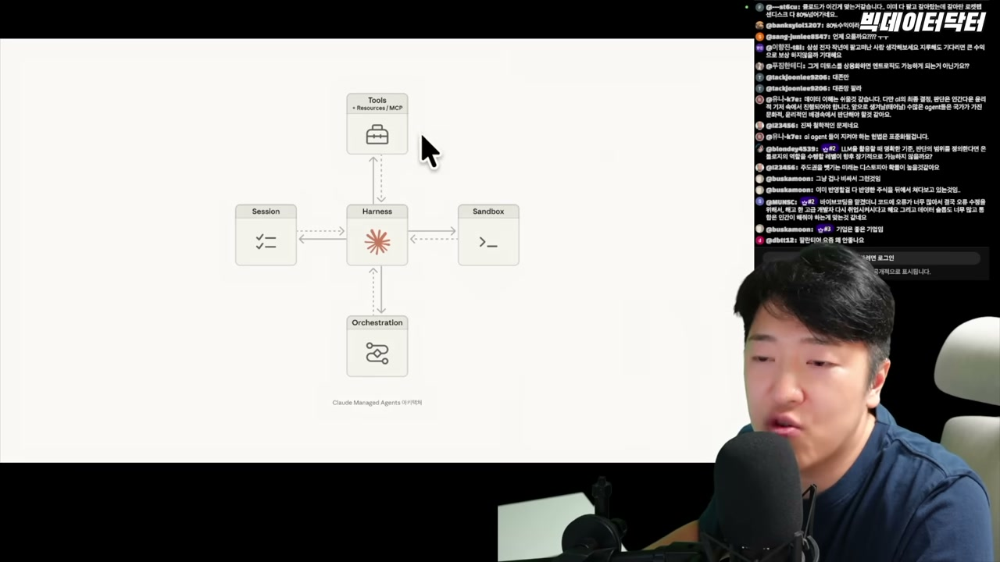 이는 AI 모델 자체의 성능보다 그것을 어떻게 인간의 이해와 통제하에 두는지가 훨씬 더 중요하다는 점을 시사합니다.
<!-- /dig-section -->

<!-- dig-section: 537 -->
## 인간 이해와 하네스 엔지니어링의 역할

구글 AI 디렉터는 오늘날 AI 모델이 이론적으로는 할 수 있는 일을 현실에서 제대로 못 하는 이유가 모델 자체의 문제가 아니라, 그 모델을 둘러싼 '하네스 엔지니어링'이 부족하기 때문이라고 지적합니다 . 즉, AI의 성능과 안전성을 결정하는 핵심은 모델 그 자체가 아니라, 모델을 어떻게 제어하고 활용하는지에 대한 설정과 구조(하네스)에 달려 있다는 것입니다. 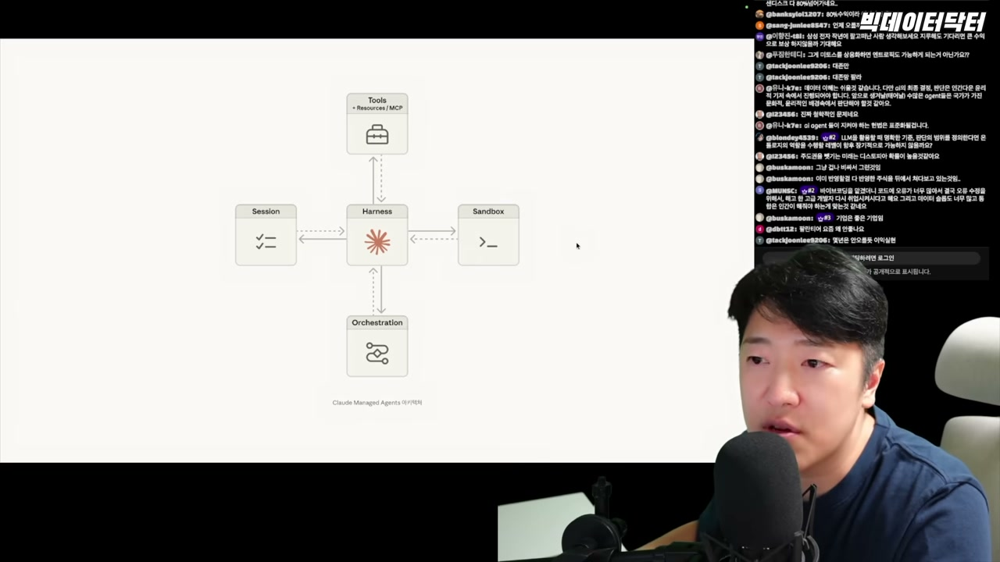

이러한 관점은 최근 AI 업계의 주요한 두 가지 흐름을 보여줍니다. 첫 번째는 앤스로픽(Anthropic)이 제시한 방향입니다. 과거에는 모델(LLM 4.0)과 이를 제어하는 인프라(하네스)가 강하게 결합되어 있었습니다. 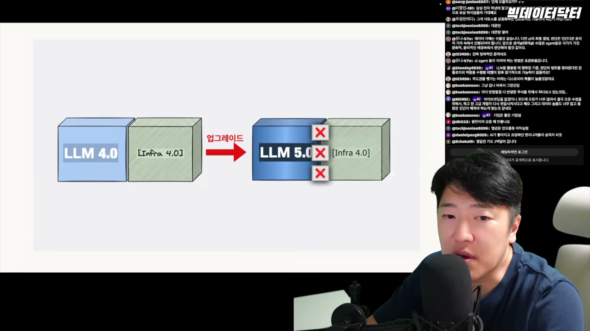 하지만 이 구조에서는 모델이 LLM 5.0으로 발전했을 때, 구버전의 하네스가 오히려 더 발전된 모델의 성능을 저해하는 문제가 발생했습니다 . 앤스로픽은 앞으로 모델이 어떻게 발전할지 예측하기 어렵기 때문에, 특정 방식의 하네스를 고정하지 않고 유연하게 대응해야 한다고 주장했습니다. 이는 모델이 발전할수록 하네스의 역할이 점차 줄어들 것이라는 가능성을 시사한 것입니다 .

하지만 구글 AI 디렉터는 이에 대해 반대 의견을 제시합니다 . 그는 모델이 발전하더라도 하네스 엔지니어링의 중요성은 줄어드는 것이 아니라, 그 역할과 형태가 '이동'하고 진화할 뿐이라고 강조합니다 . 스피커는 이를 ChatGPT의 발전에 빗대어 설명합니다. 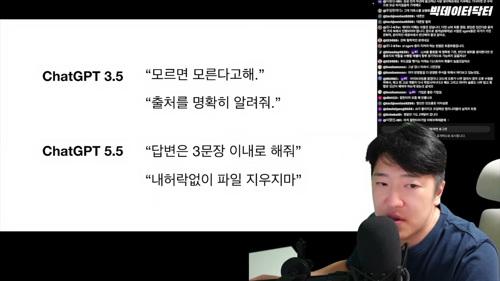
*   **ChatGPT 3.5 시대**: 주된 문제는 '환각(Hallucination)'이었습니다. 따라서 당시의 하네스 엔지니어링(주로 프롬프트를 통한 제어)은 "모르면 모른다고 해", "출처를 명확히 알려줘"와 같이 사실성을 확보하고 사소한 거짓말을 막는 데 집중되었습니다 .
*   **ChatGPT 5.5 시대 (가상)**: 모델이 파일 삭제와 같은 실제 행동을 할 수 있는 자율성을 갖게 되면, 문제는 '환각'에서 '통제'와 '안전'으로 이동합니다. 이제 하네스 엔지니어링은 "내 허락 없이 파일을 지우지 마"와 같이, 모델의 강력해진 자율성이 초래할 수 있는 위험을 막는 방향으로 진화해야 합니다 . 즉, 모델의 능력이 확장됨에 따라 하네스가 다뤄야 할 문제의 성격과 범위도 함께 변하는 것입니다 .

결론적으로 현재 AI 업계에는 두 가지 중요한 공감대가 형성되어 있습니다. 첫째, 모델이 아무리 발전해도 그를 제어하는 하네스 엔지니어링은 사라지지 않고 계속해서 중요하다는 것 . 둘째, 안드레이 카파시(Andrej Karpathy)가 강조했듯, 모든 기술의 근간에는 '인간의 이해'가 반드시 전제되어야 한다는 것 .

이 두 가지 원칙이 지켜진다면, 스피커가 이전에 우려했던 "인간이 이해하지 못하는 기업의 디지털 트윈 등장"이나 "AI 기업에게 영혼까지 넘겨주는 상황" 같은 극단적인 시나리오는 현실화되지 않을 것입니다 . 반대로 이 원칙들이 무너질 때 비로소 AI는 진정으로 위험해질 수 있습니다 . 결국 AI 경쟁의 핵심은 단순히 더 뛰어난 모델을 만드는 것을 넘어, 인간이 이해하고 통제할 수 있는 정교한 하네스 엔지니어링을 구축할 수 있느냐의 문제로 귀결됩니다 .
<!-- /dig-section -->

<!-- dig-section: 666 -->
## 팔란티어의 독보적인 온톨로지 기반 하네스 엔지니어링 역량

팔란티어의 창업자 조 론스데일(Joe Lonsdale)은 기술의 진정한 경쟁력은 단순히 영업력에 있는 것이 아니라, 핵심 기술에 얼마나 오랫동안 깊이 있게 투자했는지에 달려 있다고 주장합니다. 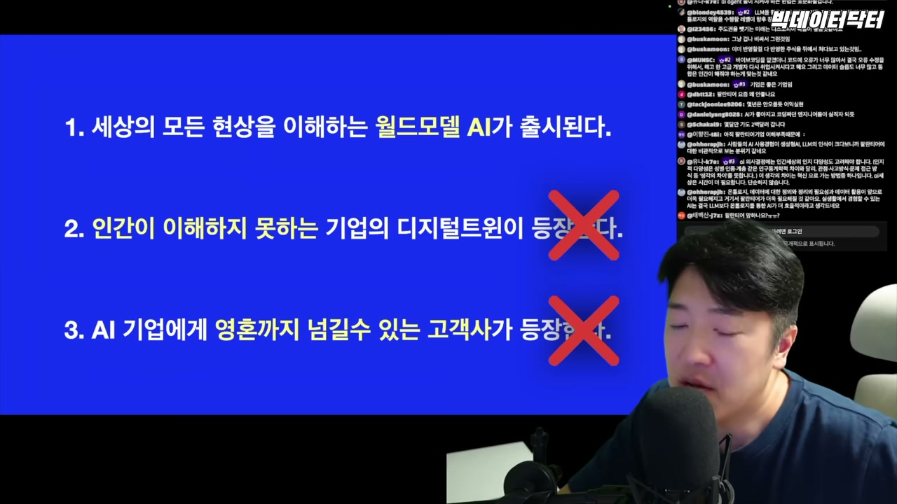 그는 많은 기업이 기술 자체에 대한 투자보다는 영업과 같은 외적인 부분에 더 많은 돈을 쏟아붓고 있으며, 이러한 기업들은 AI 기술의 발전에 의해 쉽게 대체될 수 있다고 지적합니다.  반면 팔란티어는 '온톨로지(Ontology)'라는 핵심적인 '하네스 엔지니어링(Harness Engineering)' 영역에 20년 이상 꾸준히 투자해 왔습니다.  이처럼 기술 자체에 대한 장기적이고 집중적인 투자가 있었기 때문에, 팔란티어는 다른 기업들이 쉽게 대체하기 어려운 독보적인 위치를 점하고 있다는 것입니다. 

이러한 팔란티어의 비전은 ‘팔란티어 시대가 온다’의 저자 변우철 본부장에게서도 확인할 수 있습니다. 그는 팔란티어가 가고자 하는 미래에 대한 질문에 "하네스 엔지니어링이 반영된 B2B Agentic AI의 끝판왕"이 되려는 것이라고 답했습니다.  여기서 핵심은 인간의 이해를 근간으로 하는 온톨로지 시스템입니다.  인간 사회의 복잡한 구조와 관계는 인간의 이해를 바탕으로 하는데 , 팔란티어의 온톨로지는 이러한 인간의 주체성을 지키면서 AI를 활용하도록 설계된 시스템입니다.  따라서 인간이 AI의 주도권을 놓지 않으려는 한, 온톨로지 시스템은 사라지기 어려울 것입니다.  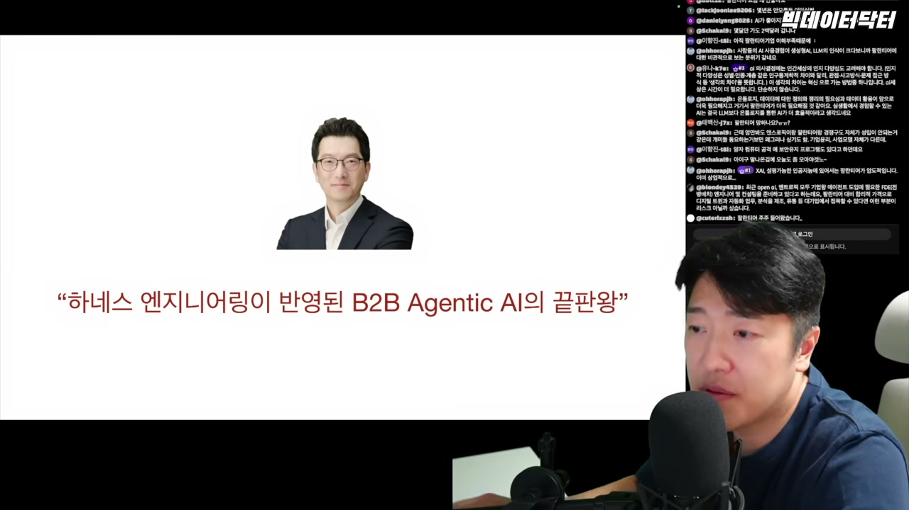

그렇다면 이 온톨로지 시스템을 현재 '실전'에서 가장 잘 활용하는 기업은 누구일까요?  팔란티어 영국 대표는 "실리콘 밸리는 AI에 대해 이야기하지만, 우크라이나는 팔란티어의 AI로 실제 전쟁을 치르고 있다"고 말합니다.  AI가 전쟁이라는 극한의 환경에서 실제로 어떻게 활용되고 어떤 의미를 갖는지에 대해, 우크라이나 국방부나 팔란티어만큼 깊이 이해하는 곳은 없다는 것입니다. 

이는 다른 AI 기업들과의 근본적인 차이를 보여줍니다. 대부분의 AI 기업들이 개인의 업무 프로세스를 자동화하는 등 비교적 작은 규모의 프로젝트에 집중하고 있을 때 , 팔란티어는 우크라이나 전쟁과 같은 거대한 프로젝트에 참여하며 기술을 실전에서 검증하고 있습니다.  이는 단순히 개인이나 기업 차원을 넘어선 '국가 단위의 하네스 엔지니어링'이 이루어지고 있는 것으로 , 다른 AI 기업들과는 비교 자체가 불가능한 스케일의 경험과 역량을 축적하고 있음을 의미합니다.  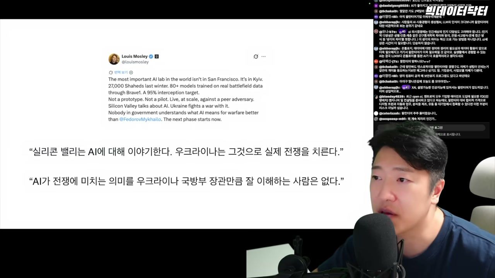
<!-- /dig-section -->

<!-- dig-section: 839 -->
## Conclusion

영상 초반에 제시된 'AI 대 팔란티어' 구도는 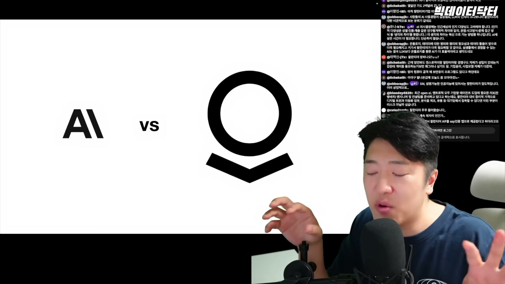 비교 자체가 성립하지 않는다고 발표자는 주장합니다 . 대신, 그는 AI가 팔란티어를 대체할 수 있는 가상 시나리오의 조건을 제시하며 논의의 초점을 전환합니다 . 이 시나리오가 현실화되기 위해서는 세 가지 매우 까다로운 조건이 동시에 충족되어야 합니다.

첫째, 세상의 모든 물리적 현상을 완벽하게 이해하는 '월드 모델 AI'가 출시되어야 합니다 . 둘째, 이 AI가 구축한 디지털 트윈은 인간이 전혀 이해할 수 없는 수준이어야 합니다 . 마지막으로, 고객사 스스로 자신의 모든 데이터, 심지어 '영혼'까지도 이 AI에게 기꺼이 바칠 수 있어야 합니다 . 발표자는 이 세 가지 조건이 만족된다면, 이는 단지 팔란티어만의 위기가 아니라 모든 기업이 위험에 처하는 상황이 될 것이라고 설명합니다 .

하지만 현재 AI 기술계가 지향하는 발전 방향은 이러한 극단적인 시나리오와는 거리가 멉니다 . 현재의 AI 개발은 '인간의 이해'를 근간으로 삼아야 한다는 원칙을 모두가 지키려 하고 있습니다 . 이러한 관점에서 볼 때, 인간과 인간, 그리고 인간과 AI 사이의 이해를 공유하기 위한 체계, 즉 '온톨로지 시스템'의 중요성은 더욱 커집니다 .

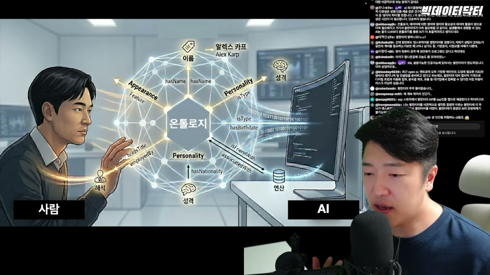에 나타나듯, 온톨로지는 사람의 개념(이름, 성격 등)과 AI가 처리하는 데이터(엔진, 코드 등) 사이를 잇는 다리 역할을 합니다. 인간이 계속해서 주체성을 가지고  세상을 인간의 이해 체계 안에서 바라보는 한, 사람과 AI가 서로의 이해를 공유하는 이 온톨로지 시스템은 쉽게 사라지기 어렵습니다 . 따라서 이러한 시스템을 핵심으로 하는 팔란티어 역시 쉽게 대체되기 어렵다는 것이 현시점에서 가장 합리적인 판단이라고 발표자는 강조합니다 .

결론적으로, 팔란티어가 AI에 의해 대체된다는 것은 단순히 한 기업의 기술이 도태되는 문제가 아닙니다. 그것은 곧 인간 사회 자체가 AI에게 완전히 대체되는 상황을 의미합니다 . 따라서 현재 시장에서 나타나는, AI가 팔란티어를 대체할 것이라는 공포는 과장된 것이며 , 이는 발표자 자신의 현재 이해 체계에 기반한 관점이라고 덧붙입니다 . 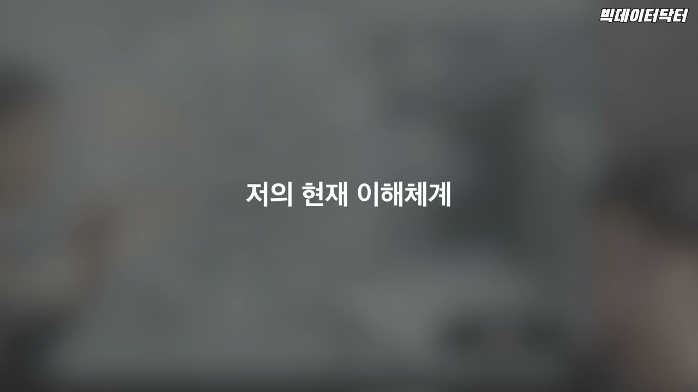
<!-- /dig-section -->
