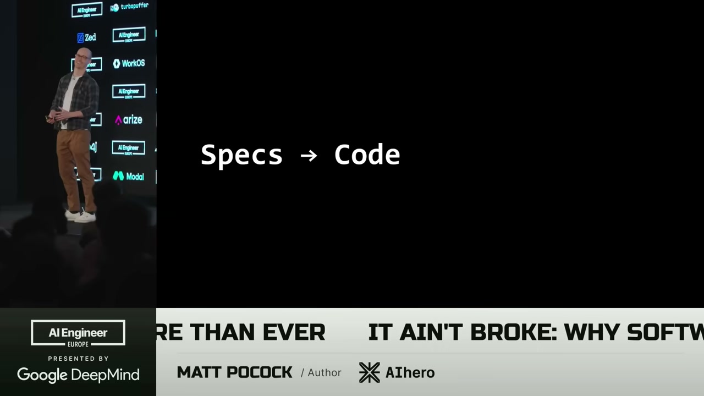
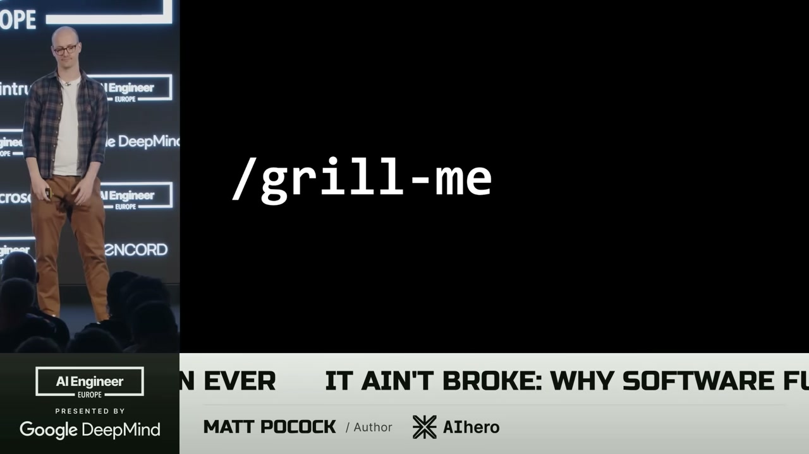
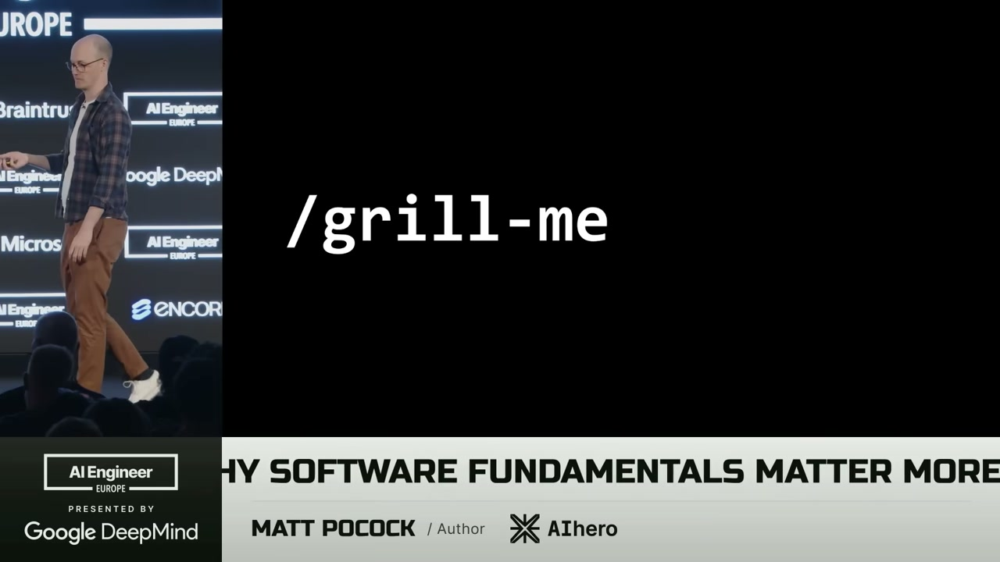
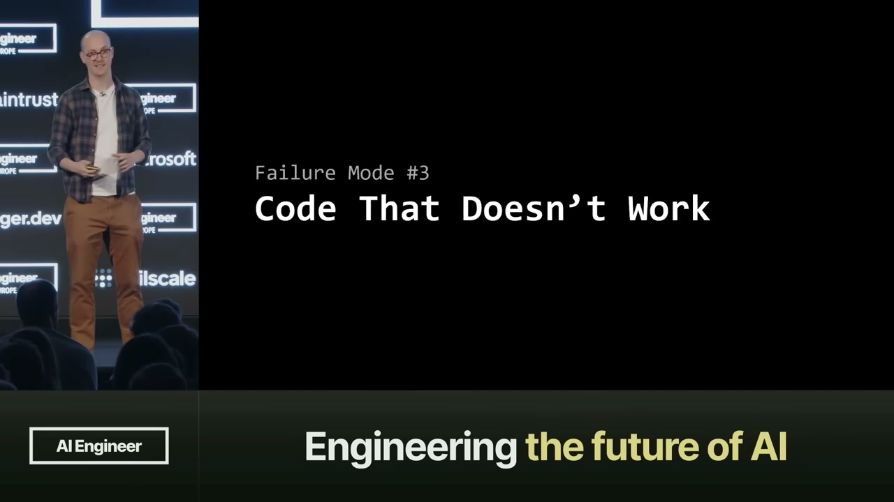
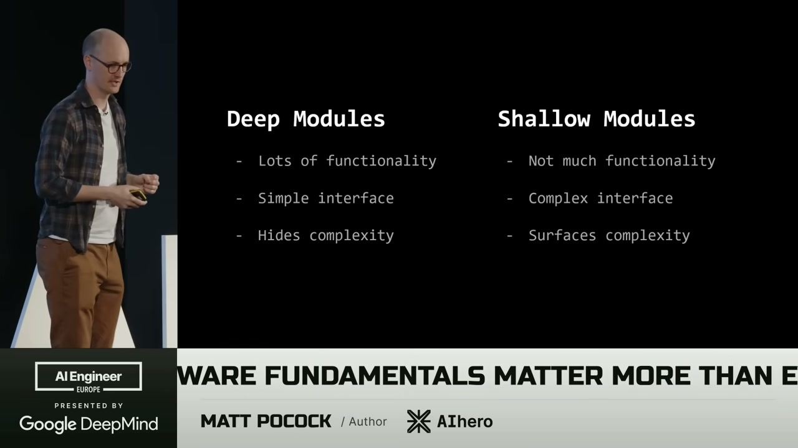

<!-- dig-section: 33 -->
## The Enduring Value of Software Fundamentals in the AI Age

The speaker, Matt Pocock, opens with his core thesis: software fundamentals matter now more than ever before . He explains that while creating a curriculum for an "AI coding" course, he was confronted with the idea that AI is a new paradigm that should render old rules obsolete .

A key part of this new paradigm is the "specs-to-code" movement . The concept is that a developer writes a specification for how an application should work, and an AI generates the corresponding code. If the application has a problem, the developer shouldn't touch the code directly; instead, they should go back, modify the specification, and rerun the AI "compiler" to generate new code .

However, Pocock shares his personal experience with this process, which many in the audience seem to share . He found that while the first run might produce usable code, subsequent iterations, where he tried to fix issues by only changing the spec, led to a rapid decline in quality. Each run of the "compiler" produced "worse code," then "even worse code," until it devolved into "garbage" . . He dismisses this workflow as ineffective, calling it "vibe coding by another name" .

Instead of abandoning AI, he tried to "fix the compiler" by teaching the LLM what a good codebase looks like . To do this, he turned to classic software engineering texts. First, from John Ousterhout's *A Philosophy of Software Design*, he pulls a key definition of complexity: anything about a system's structure that makes it "hard to understand and modify" . . This leads to a practical conclusion: a bad codebase is one that is hard to change, while a good one is easy to change .

Next, he references *The Pragmatic Programmer*, which introduces the concept of "software entropy" . Entropy is the natural tendency of systems to decay into disorder. In software, this means that every change made without considering the overall design of the system contributes to the codebase getting progressively worse . This, Pocock realized, was exactly what he was seeing in the specs-to-code experiment .

Pocock argues that the specs-to-code movement is driven by the misguided idea that "code is cheap" . He strongly refutes this, stating that "code is not cheap" and, more importantly, "bad code is the most expensive it's ever been" . The reason is that a poorly structured, hard-to-change codebase prevents developers from leveraging the power of AI tools. In contrast, AI performs "really, really well" within a well-designed, good codebase . This reinforces his central argument: because good codebases are necessary to unlock AI's potential, "software fundamentals matter more than ever" . He concludes the section by stating he will now examine specific AI failure modes and how to solve them with these fundamental practices .
<!-- /dig-section -->

<!-- dig-section: 276 -->
## Fostering Shared Understanding with AI for Design Clarity

The first and most common failure mode when working with AI is the simple frustration that "The AI didn't do what I want."  A developer might have a clear idea in their head, but the AI produces something entirely different or misses key specifications.  The speaker argues this isn't just an AI flaw, but a fundamental communication challenge. Citing "The Pragmatic Programmer," he notes that "no one knows exactly what they want" from the outset.  The interaction between a human and an AI has a communication barrier, and the initial prompt is merely the start of a requirements gathering process. 

To solve this, he turns to Frederick P. Brooks' book, "The Design of Design," and its core idea of the "design concept."  When multiple people collaborate, they develop a shared, "ephemeral idea" of what they are building.  This "design concept" isn't a concrete asset like a document; it's the "invisible theory of what you're building" that floats between collaborators.  The problem is that the developer and the AI often don't share this crucial concept. 

The speaker's solution is a custom skill called "/grill-me."  The prompt for this skill is very specific: "Interview me relentlessly about every aspect of this plan until we reach a shared understanding. Walk down each branch of the design tree, resolving dependencies between decisions one-by-one."  This simple instruction transforms the AI's behavior. Instead of trying to immediately produce a solution, it becomes an "adversary" that relentlessly probes the user's plan.  This interrogation can involve dozens of questions—the speaker mentions seeing cases of 40, 60, or even 100 questions—until the AI is satisfied that a truly shared understanding has been reached.  The popularity of this technique is evident, with the public repository for the skill garnering over 13,000 stars. 

This intensive back-and-forth generates a rich conversation that can then be used to create high-quality artifacts, like a formal Product Requirements Document (PRD) or, for smaller tasks, a set of well-defined issues for an agent to execute.  The speaker believes this is superior to the default "Plan Mode" in many AI coding tools, which he finds is "extremely eager to create an asset" and start working prematurely without establishing deep context.  This leads to the first key takeaway: before you start coding with an AI, you must first establish a shared understanding. 
<!-- /dig-section -->

<!-- dig-section: 585 -->
## Driving Quality Through Feedback Loops and Test-Driven Development

Even when the AI seems to have understood the requirements and has "built the right thing," a common failure mode is that the resulting code simply "doesn't work" [[3-4]]. . The immediate solution is to provide the AI with better feedback loops [[10]]. This includes using static types like TypeScript, giving a front-end AI access to the browser so it can observe its own output, and, most importantly, providing automated tests [[11-19]].

However, a significant problem arises: the AI doesn't use these feedback loops effectively, unlike a veteran developer [[22, 25]]. It tends to "outrun [its] headlights" [[35]], a phrase from *The Pragmatic Programmer* describing the act of moving forward faster than you can see. The AI will often generate "huge amounts of code" all at once and only consider type-checking or running a test as an afterthought [[28-30]]. This violates a fundamental principle of effective development: "the rate of feedback is your speed limit" [[38-39]]. To work effectively, one must take small, deliberate steps, checking for feedback along the way—a process the AI is not naturally good at [[42-44]].

The speaker's "Tip #3" is to enforce this discipline through Test-Driven Development (TDD) [[45]] . TDD forces the AI into a structured, incremental workflow: create a test first, write the code to make that test pass, and then refactor the code to improve its design [[49-52]]. This approach breaks down the "doing way too much" failure mode.

The challenge, however, is that "testing is really hard" [[54]]. Writing good tests requires making numerous complex and interdependent decisions [[58, 65]]: How large should the unit under test be? [[60]] What dependencies should be mocked? [[62]] Which specific behaviors are worth testing? [[63]] These are nuanced skills developed over years of experience [[74-75]].

This difficulty leads to a critical insight: "Good codebases are easy to test" [[76-77]]. The quality of the codebase directly impacts the quality of the feedback loops [[81-82]]. To create a testable codebase, the speaker, citing John Ousterhout, advocates for designing "deep modules" rather than shallow ones [[87-90]]. . Deep modules offer a large amount of functionality hidden behind a simple interface, effectively hiding complexity [[96-98]]. In contrast, shallow modules provide little functionality through a complex interface, surfacing complexity to the user. An ideal system is built from a relatively small number of large, deep modules with clean, simple interfaces [[93-94]]. By designing the code this way, testing becomes easier, feedback loops become faster and more effective, and the AI is better guided to produce correct, working code.
<!-- /dig-section -->
