<!-- dig-section: 16 -->
## Introduction to Google's Edge AI and Gemma Models

Chintan Parekh, a Product Manager for Lite RT within the Google AI Edge team, begins the session on accelerating AI on edge devices . After introducing his colleague who will assist with the Q&A, Parekh polls the audience to gauge their involvement and interest in edge AI deployment, with several attendees raising their hands . He outlines the presentation's agenda, promising to cover new models, key use cases, a new gallery app, and Google's deployment stack . 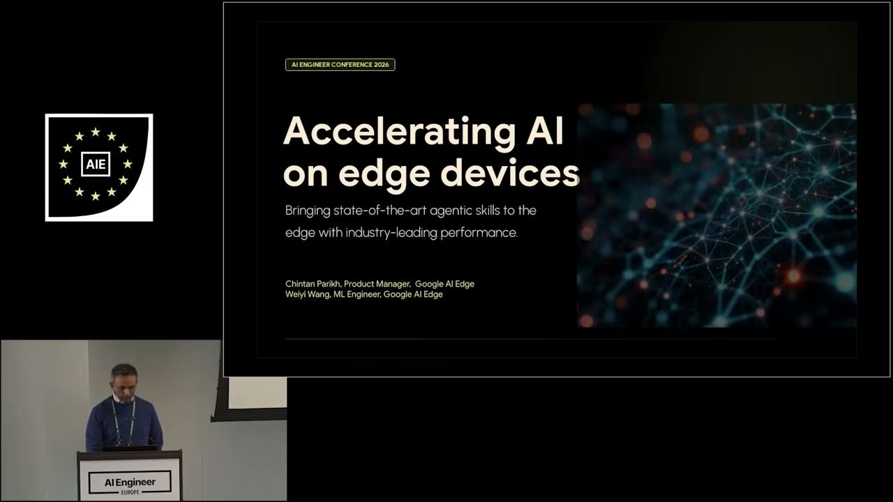 A crucial point he intends to emphasize is the cross-platform support, recognizing that developers are targeting a wide range of hardware beyond just mobile devices .

The core of the talk will focus on Google DeepMind's recently launched Gemma 4 models . Specifically, Parekh will concentrate on the 2B and 4B (billion parameter) variants that have been optimized as "Edge models" for on-device deployment . 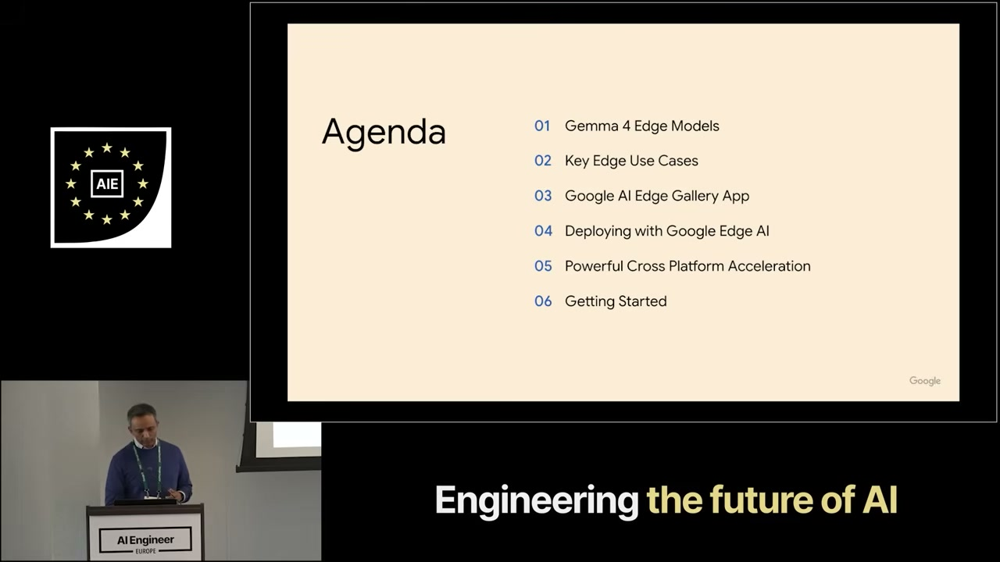 However, he notes that Google's ecosystem of open models is broader. For those with even tighter constraints, the Gemma 3 family offers models as small as 270 million parameters, which are ideal for fine-tuning on extremely resource-limited hardware . He mentions that these models are available on a Hugging Face page for developers to explore .

Parekh frames Gemma 4 not as an incremental update but as a "big evolution" in on-device AI . The primary shift is moving beyond the capabilities of a typical chatbot . Instead, Gemma 4 is designed to enable "more autonomous agents" that can operate locally on a device . These agents are distinguished by their support for advanced "reasoning capabilities and more sophisticated features," allowing for more complex and intelligent on-edge applications . This evolution, he concludes, will make it possible to deploy powerful, agentic AI across a diverse set of devices .
<!-- /dig-section -->

<!-- dig-section: 133 -->
## Key Advantages of On-Device AI Deployment

Running AI models directly on edge devices provides numerous advantages over relying solely on cloud-based processing . 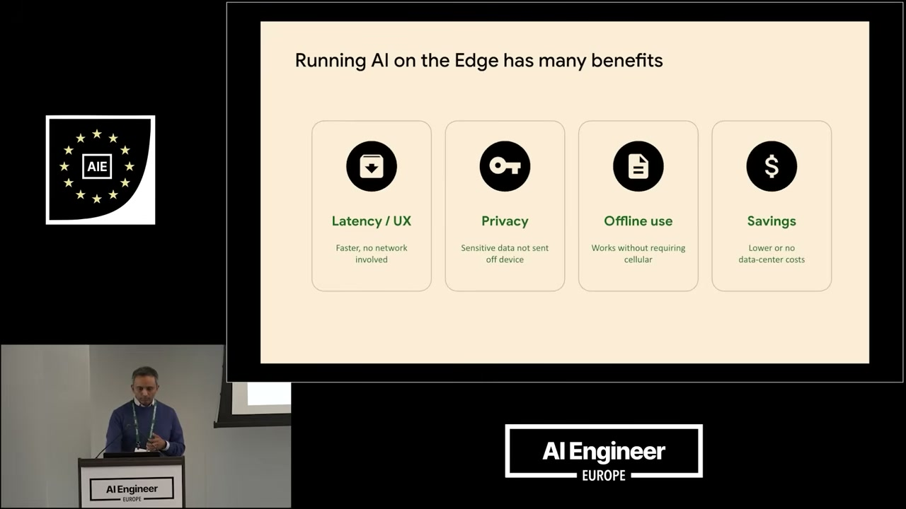 A primary benefit is improved **Latency and User Experience (UX)**. For any real-time application, minimizing delay is critical. The speaker highlights "real-time camera use cases" , such as applying filters to replace backgrounds or conducting video calls, where "real-time latency is king" . Processing on-device eliminates the network round trip to a data center, resulting in a faster, more responsive experience .

**Privacy** is another crucial advantage. By processing data locally, sensitive information is never transmitted off the device . This is critical for use cases involving personal or confidential data, such as an application that summarizes sensitive documents .

Furthermore, on-device AI enables robust **Offline Use** . Applications can function reliably even with poor or no network connectivity, which is impossible for services that depend entirely on the cloud . This allows for continuous operation regardless of the user's location or network quality.

Finally, running AI on the edge can lead to significant cost **Savings**. The speaker notes a common complaint at the conference regarding the high cost and token consumption of cloud-based models . By reducing or eliminating the need for data center inference, developers can lower operational costs . This fosters a "hybrid approach"  where developers can strike the "best balance"  between on-device and cloud processing to optimize for performance, privacy, and cost.

To facilitate these on-device applications, the speaker introduces two specific models. 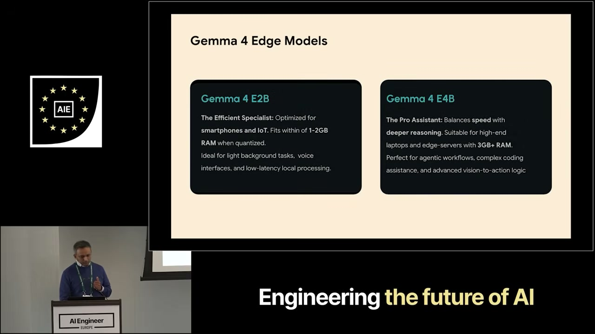 The **Gemma 4 E2B** model is "The Efficient Specialist," designed for smartphones and IoT devices. When quantized, it requires only 1-2 GB of RAM, making it suitable for tasks like voice interfaces, summarization, and other low-latency local processing . The more powerful **Gemma 4 E4B** model is "The Pro Assistant," a "heavy duty"  option for laptops and more capable edge platforms. It demands more RAM but offers deeper reasoning for complex agentic workflows and coding assistance. The speaker clarifies that these RAM requirements are post-quantization, a process that optimizes the model for a specific device's constraints .
<!-- /dig-section -->

<!-- dig-section: 231 -->
## Advanced Capabilities of Gemma 4 Edge Models

The Gemma 4 E2B and E4B models introduce several new native agentic capabilities, which are fundamental to their on-device performance . 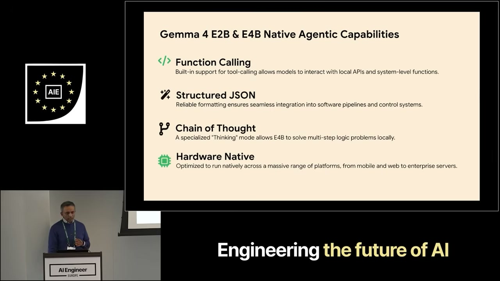. The first is **Function Calling**, which provides built-in support for tool-calling, allowing the models to interact with local APIs and system-level functions . This enables a hybrid approach where the core inferencing runs on the edge device, but the model has a "path to essentially... call other APIs outside" for extended functionality . This means the main workload stays local while still allowing access to external data or services.

Second, the models support **Structured JSON** output natively . This feature ensures reliable formatting, which is crucial for seamless integration into software pipelines and control systems. Crucially, this capability is built directly into the model's architecture, rather than being a workaround achieved through "specific prompt engineering" . This architectural integration makes the structured output more consistent and efficient.

A significant new feature is **Chain of Thought** . This is a specialized "Thinking" mode that allows the E4B model to solve multi-step logic problems locally . It provides transparency into the model's reasoning, helping developers and users "understand like the thought process that the model is going through" . This capability is demonstrated in a gallery app mentioned by the speaker .

Finally, these models are **Hardware Native**, meaning they are optimized to run seamlessly across a massive range of platforms, from mobile and web to enterprise servers . The goal is to give developers "the flexibility of deploying into various platforms" without compatibility issues .

For developers looking to get started, these Gemma 4 models are readily available on the Hugging Face LiteRT Community page . 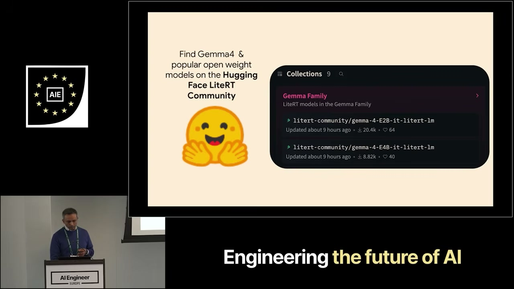. They are released under an Apache 2.0 license, allowing developers to download them and begin building applications immediately . The speaker then transitions to demonstrating some of the many possible use cases for these on-device models .
<!-- /dig-section -->

<!-- dig-section: 343 -->
## Demonstrating On-Device AI with the Gallery App

To showcase the practical application of on-device AI, Google provides the AI Edge Gallery App, which serves as a "playground" for developers to explore the capabilities of models like Gemma 4 . This app, which has been demonstrated live, runs entirely on the user's device and includes features like agent skills, audio transcription ("audio scribe"), and image analysis ("ask image") . 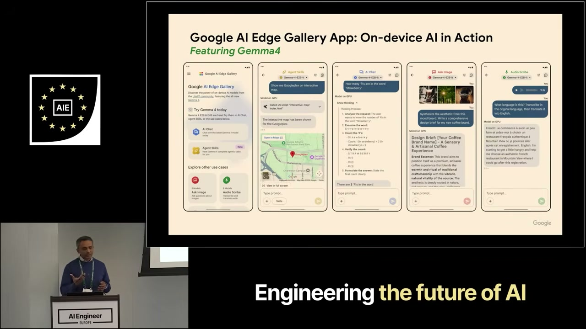. The primary goal is to inspire and motivate developers by providing a hands-on experience; the app is open-source, and each capability is accompanied by sample code that can be used to build new experiences .

The presentation highlights several key use cases for Gemma 4 Edge, which are built on three main pillars: being privacy-first, enabling voice agents, and supporting local agents . 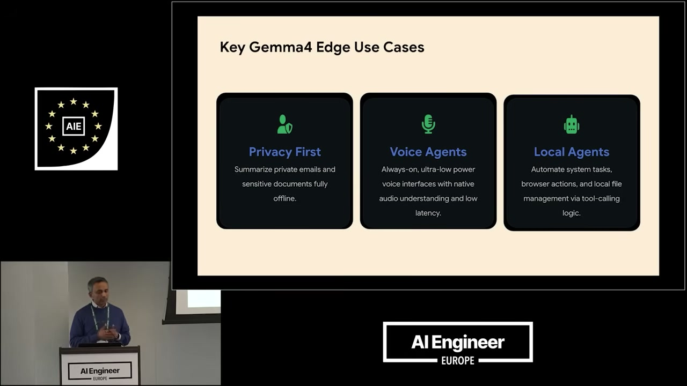. One demonstration shows how an agent can augment its knowledge base. In the video, a user asks about the "95th Academy Awards," and the on-device model uses a skill to query Wikipedia and provide a detailed summary, showing it can access and process external information beyond its initial training data .

Another use case involves producing rich, interactive content. A user dictates a journal entry about their mood and sleep, and then asks the agent to analyze the trend over the past week . The model processes the unstructured text, extracts the relevant data, and generates a "Mood Tracker" interface with a summary and a graph visualizing the trend, all without sending data to the cloud . The speaker notes that the enhanced reasoning and thinking capabilities of the new model make such on-device workflows possible .

The model's core abilities can also be expanded by integrating it with other on-device models. For instance, a user sends a photo of their breakfast and asks the agent to "pair this vibe with some music" . The model performs image understanding to grasp the context of the photo and then synthesizes a new Lo-Fi music track that matches the mood, demonstrating multi-modal, on-device generation . 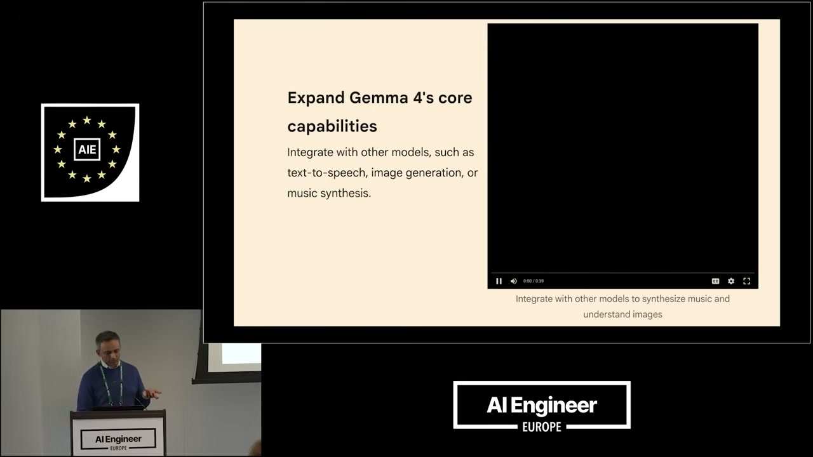. Similarly, the app can manage complex, end-to-end experiences. A user asks about a lion, and the agent not only provides a description but also generates the sound of a lion's roar on-demand . This entire workflow is managed within the single conversational interface, showcasing how these agents can orchestrate multiple skills .

To facilitate development, Google provides extensive resources, including QR codes to download the app and access the open-source code on GitHub . Developers can create and load their own skills directly in the app, with instructions available on GitHub to guide them . The community is actively contributing, with examples of custom skills for web search, weather queries, and more, all designed to run locally on the device .
<!-- /dig-section -->

<!-- dig-section: 663 -->
## Lite RT Framework for Cross-Platform Edge Deployment

The discussion shifts to deploying AI models on edge devices, introducing Google's on-device framework, LiteRT . LiteRT is presented as an evolution of the widely-used TensorFlow Lite, built upon the same foundational technology . This foundation is already massively deployed, with a proven track record of running on over 2 billion active Android devices across more than 100,000 third-party apps, handling millions of daily inferences . 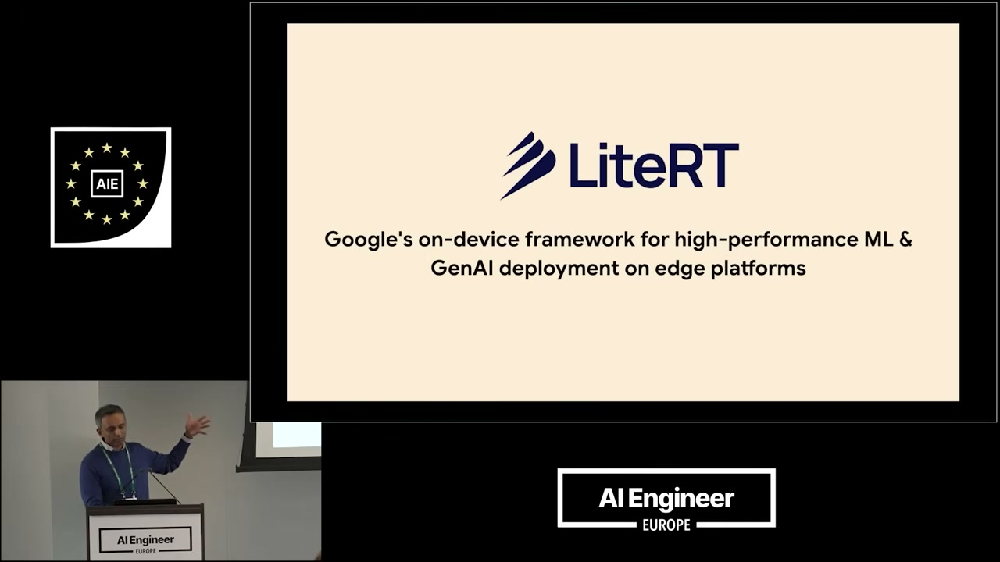

A core advantage of LiteRT is its cross-platform capability . While the focus is often on Android, the same `.tflite` model file format is designed to be portable and can run on a wide array of operating systems and hardware, including iOS, macOS, Windows, Linux, web browsers, and even IoT devices like the Raspberry Pi . 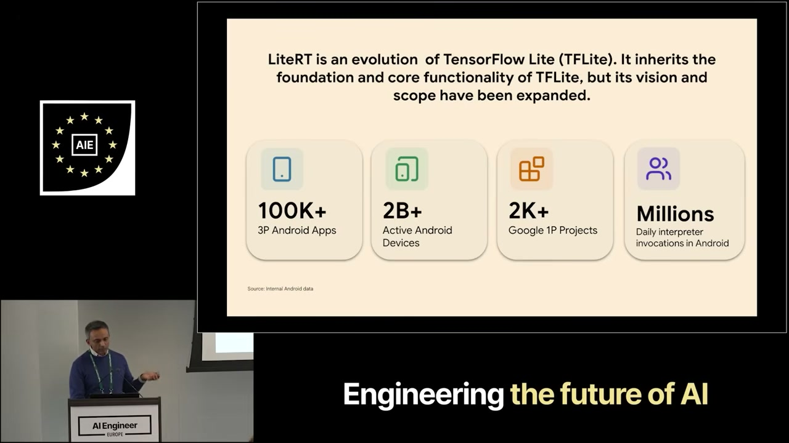

Crucially, LiteRT is not limited to TensorFlow models. A key motivation for its rebranding was to emphasize its multi-framework support . Developers can bring their own models built in other popular frameworks like PyTorch and JAX, convert them into the universal `.tflite` format, and then deploy them through the LiteRT stack .

The framework provides a complete, unified solution for this entire process . It includes tools for each stage of the deployment pipeline:
*   **Model Conversion**: `LiteRT Torch` handles the conversion of models from frameworks like PyTorch .
*   **Optimization**: Models can be optimized for on-device execution through quantization. The `Model Explorer` tool allows developers to visually inspect a model's graph to make strategic decisions about how and where to apply quantization, such as using mixed precision .
*   **Pipelines**: For Large Language Models, a specialized `LiteRT LM` pipeline is available to handle their specific requirements .
*   **Benchmarking**: The `AI Edge Portal` is a cloud-based benchmarking service that helps developers understand how their model will perform across a vast and diverse fleet of real-world devices . This is critical for ensuring an app will work reliably on older or lower-spec phones, helping developers find the right "recipe" of compilation and optimization strategies for broad compatibility .

Finally, LiteRT is heavily focused on hardware acceleration to maximize performance . While it provides optimized libraries for CPU and GPU execution across all platforms, it also has deep integrations with major NPU (Neural Processing Unit) vendors like Google Tensor, Qualcomm, and MediaTek . 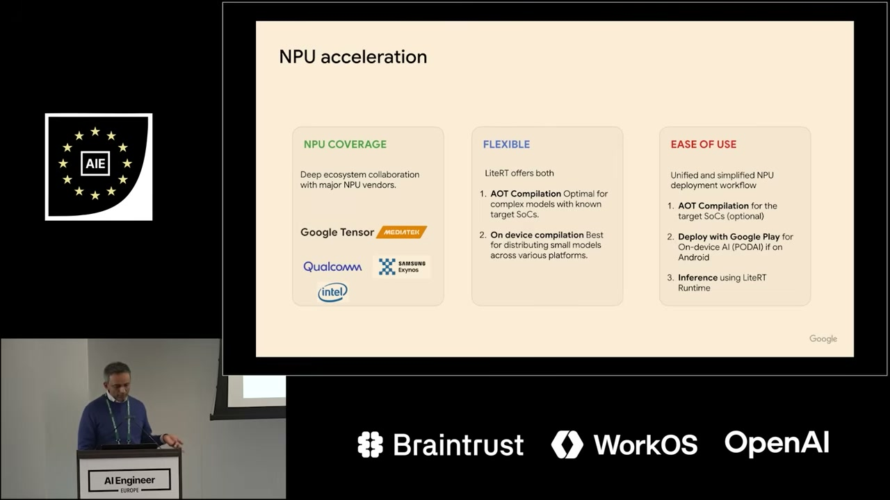 Leveraging the NPU can provide a 3x to 10x performance improvement, a "game-changer" for latency-sensitive and real-time use cases like AR/VR applications or speech recognition, while also reducing energy consumption . The framework offers flexible compilation options—either Ahead-Of-Time (AOT) or on-device (Just-In-Time)—to best utilize these powerful hardware accelerators .
<!-- /dig-section -->
