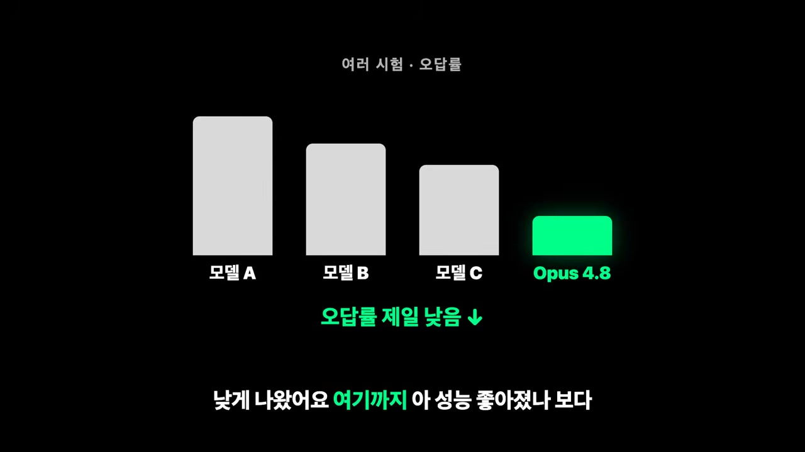

<!-- dig-section: 57 -->
## 최신 AI 모델의 변화: 환각 감소

최근 AI 모델이 교체되면서 이전의 문제점들이 완전히 개선되었습니다. 그중 첫 번째로 눈에 띄는 변화는 AI의 '환각(Hallucination)' 현상이 크게 줄었다는 점입니다.

### AI의 가장 위험한 문제, '환각'

환각이란 AI가 잘 모르는 정보에 대해 마치 아는 것처럼 자신 있게 거짓 정보를 만들어내는 현상을 의미합니다. 이는 AI를 사용할 때 가장 무서운 부분 중 하나입니다. 사람이 틀린 정보를 말할 때 자신감 없는 태도를 보이면 듣는 사람이 한 번쯤 의심하고 검증해볼 여지가 있습니다. 하지만 AI가 너무나도 당당하게 틀린 정보를 말하면, 사용자는 그것이 사실이라고 믿어버리기 쉽고, 이는 결국 심각한 문제나 사고로 이어질 수 있습니다.

### 오답률을 낮춘 새로운 방식

새로 도입된 Opus 4.8 모델은 여러 테스트에서 다른 모델들(A, B, C)에 비해 가장 낮은 오답률을 기록했습니다. 언뜻 보면 단순히 성능이 향상되어 정답을 더 잘 맞히게 된 것처럼 보일 수 있습니다. 하지만 핵심은 그 방식에 있습니다.

Opus 4.8은 더 많은 문제를 맞혀서 오답률을 낮춘 것이 아닙니다. 대신, 확실하게 알지 못하는 질문에 대해서는 섣불리 추측하여 답하는 것을 멈추고 '모르겠다'라며 답변을 보류하는 방식으로 오답률을 획기적으로 낮춘 것입니다. 실제로 앤트로픽(Anthropic)의 자료에 따르면, Opus 4.8이 생성한 코드에 결함이 있을 때, 이를 인지하지 못하고 아무 말 없이 넘어가는 경우가 이전 모델에 비해 약 4배나 줄었습니다.

### 아는 척하는 신입 vs 모르면 물어보는 신입

이러한 변화를 두 명의 신입 사원에 비유할 수 있습니다.
*   **첫 번째 신입 (아는 척):** 잘 모르면서도 아는 척하며 무작정 일을 진행합니다. 그 결과물은 틀린 코드로 가득 차 있을 가능성이 높습니다.
*   **두 번째 신입 (모르면 물어봄):** 업무 중 막히거나 불확실한 부분이 있으면, "이 부분은 확실하지 않은데 확인해 주실 수 있나요?"라고 솔직하게 물어봅니다.

처음에는 계속 질문하는 두 번째 신입이 답답하게 느껴질 수 있습니다. 하지만 며칠만 함께 일해보면 두 번째 신입이 훨씬 낫다는 것을 깨닫게 됩니다. 왜냐하면, 첫 번째 신입이 자신 있게 만들어 낸 틀린 코드를 찾아내고 수정(디버깅)하는 데 드는 시간과 노력이, 두 번째 신입의 질문에 잠시 답해주는 것보다 훨씬 크기 때문입니다. 결국, 모르는 것을 솔직하게 인정하고 확인을 요청하는 AI가 장기적으로는 훨씬 더 안정적이고 효율적인 파트너가 되는 셈입니다.
<!-- /dig-section -->
