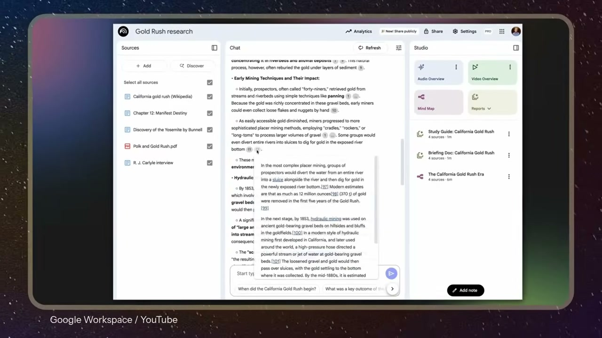

<!-- dig-section: 7 -->
## The Power of Cognitive Uploading with AI

The segment introduces Steven Johnson, the co-founder and editorial director of Google's NotebookLM -, an AI product presented as a tool that could fundamentally alter how people learn, remember, and write -. The interface for NotebookLM is shown, illustrating how a user can create a project, such as "LIT 300," and populate it with various sources like PDFs, Google Docs, and even YouTube videos . Once loaded, the tool provides a workspace for research and analysis, with sources listed on the left, a chat-based AI assistant in the center, and a "Studio" for notes on the right .

The narrator contrasts two ways of thinking about AI's role in cognition. The common fear is "cognitive offloading," or the over-reliance on AI to do our thinking for us -, a risk acknowledged as particularly relevant in academic settings . However, Johnson advocates for a different paradigm: "cognitive uploading" . This concept involves using AI to create a "second brain"—a personalized, digital repository for all the information, notes, and ideas one might otherwise forget -. The true power of this approach lies not just in storage but in synthesis; users can then "prompt it and find amazing new connections" within their own curated knowledge base -.

Johnson himself observes that this "second brain" application is not yet a central part of the "popular conversation about AI" -. He suggests this may be because most people "aren't using it the right way yet" - and haven't built up the necessary "memory collections" or "second brain collections" to make it work -. He argues that for those who do maintain a personal "archive of your thinking and of ideas that influenced you," the ability to interact with it via AI is "incredibly powerful" -. The clip concludes with the host, Dan Blumberg, welcoming viewers to the podcast "Future Around and Find Out" -.
<!-- /dig-section -->
