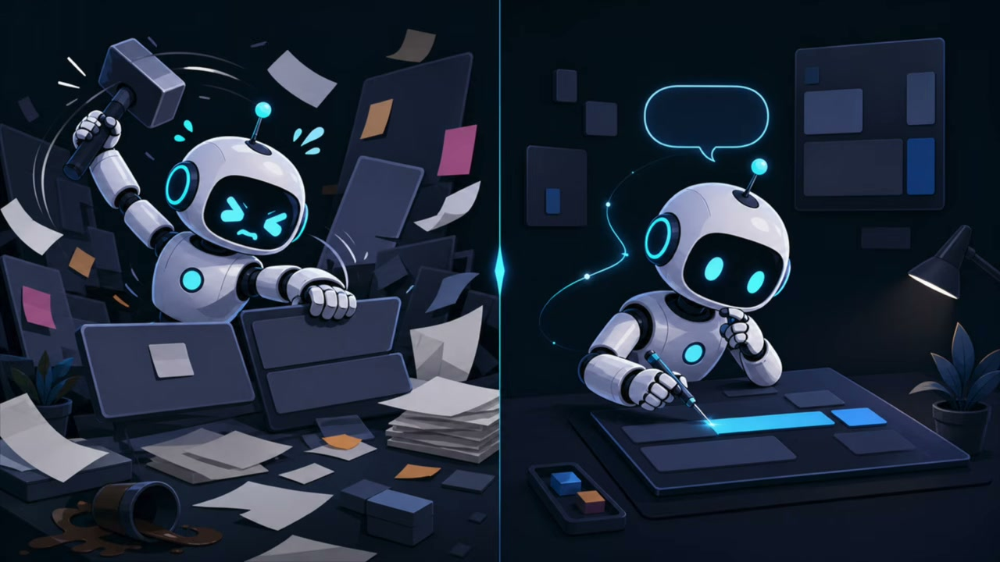
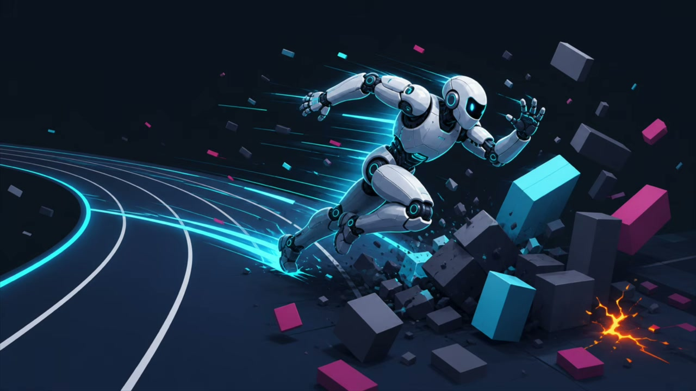
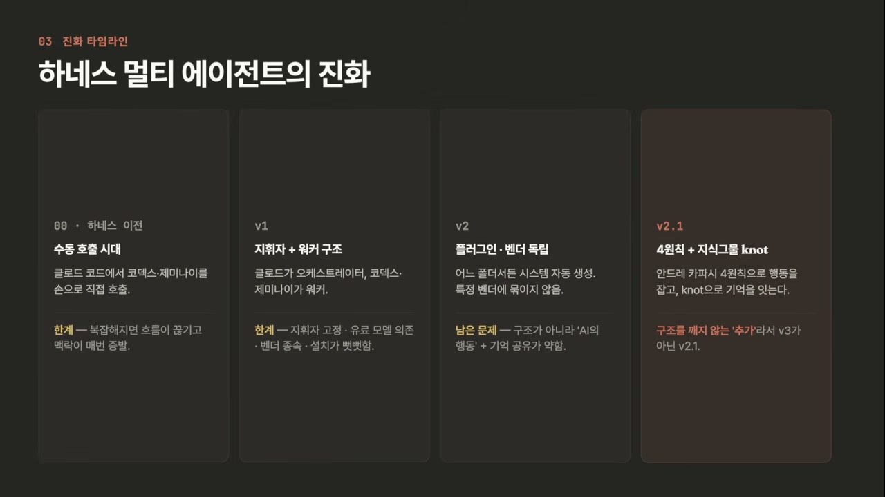
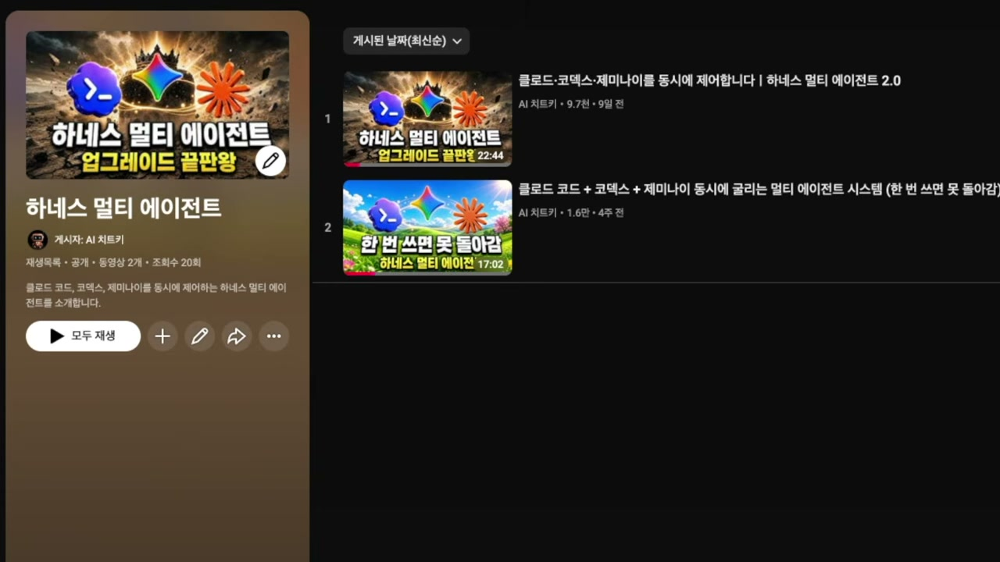
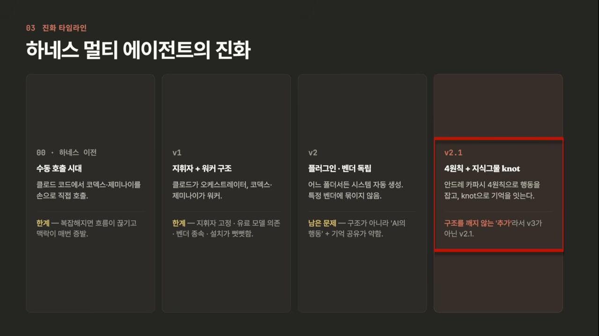

<!-- dig-section: 33 -->
## Harness 멀티에전트 시스템 소개 및 배경

이 영상은 '무적'이 된 하네스 멀티에이전트(Harness MultiAgent)를 소개하며 시작합니다 [[0 @0:33]]. 발표자는 개발자들이 AI 코딩 어시스턴트를 사용하며 겪는 흔한 좌절의 순간을 먼저 언급합니다. 예를 들어, 간단한 기능 수정을 AI에게 요청했는데 [[1 @0:35]], AI가 오랜 시간 동안 코드를 수정하고 난 뒤 전혀 예상치 못한 곳에서 새로운 에러가 발생하는 경험을 해본 적이 있을 것이라고 말합니다 [[3 @0:41]- [4 @0:43]]. 또한 AI가 "분명 다 고쳤습니다"라고 자신 있게 말했지만 [[5 @0:44]], 막상 코드를 실행해 보면 기존 버그가 전혀 해결되지 않은 채 그대로 남아있는 황당한 경우도 지적합니다 [[6 @0:47]- [7 @0:49]].

 이러한 문제들의 근본 원인은 AI가 똑똑하기는 하지만 '브레이크'가 없기 때문이라고 진단합니다 [[8 @0:52]]. AI는 사용자에게 다시 질문하여 의도를 명확히 하기보다는 스스로 추측해서 코드를 수정해버리고 [[9 @0:54]], 간단한 작업을 불필요하게 복잡하게 만들며 [[10 @0:56]], 심지어는 수정하라고 지시하지도 않은 멀쩡한 코드를 건드려 새로운 문제를 일으키기도 합니다 [[11 @0:59]- [12 @1:00]].

이러한 통제 불가능한 AI의 폭주를 막기 위한 해법으로 '안드레 카파시(Andrej Karpathy)의 코딩 원칙'과 '하네스 멀티에이전트'의 결합을 제시합니다 [[12 @1:00]- [13 @1:03]]. 이 두 가지가 합쳐지면 AI 시스템이 '무적'이 된다고 강조하며, 이것이 영상의 핵심 내용임을 밝힙니다 [[14 @1:05]- [15 @1:07]]. 구체적으로, 카파시의 4원칙은 폭주하는 AI에게 '브레이크' 역할을 하여 무분별한 수정을 막아주고 [[15 @1:07]- [16 @1:10]], 발표자가 직접 개발한 '낫(knot)'이라는 지식 그물(knowledge web)은 AI에게 '기억'을 부여하는 역할을 합니다 [[17 @1:12]- [18 @1:14]].  '낫'은 시중에서 구할 수 있는 도구가 아니라, 이 시스템을 위해 특별히 만든 지식 관리 도구라고 명확히 설명합니다 [[18 @1:14]- [20 @1:18]].

영상은 이 두 가지 핵심 요소(카파시 원칙과 '낫')를 하네스 멀티에이전트 시스템에 어떻게 통합했는지 보여주는 것을 목표로 합니다 [[20 @1:18]- [22 @1:22]]. 본격적인 설명에 앞서, 하네스 멀티에이전트가 생소한 시청자들을 위해 그것이 무엇인지부터 간략히 짚고 넘어갈 것을 예고하며 이 섹션을 마무리합니다 [[22 @1:22]- [24 @1:26]].
<!-- /dig-section -->

<!-- dig-section: 91 -->
## Harness 멀티에전트의 진화 및 주요 용어

'하네스(Harness)'는 본래 말에 채우는 고삐나 안장, 즉 '제어 장치'를 의미합니다.  코덱스나 제미나이 같은 AI는 강력하지만 제멋대로인 말과 같아서 , 이들을 고삐로 단단히 묶어 통제하는 엔지니어링 원리 위에서 '하네스 멀티 에이전트 시스템'이 탄생했습니다. 

이 시스템의 핵심 구성 요소는 다음과 같습니다.
*   **오케스트레이터(Orchestrator):** 우리말로는 '지휘자'로, 작업을 어떻게 나눌지, 누구에게 시킬지 결정하고, 그 결과들을 하나로 합치는 역할을 합니다. 
*   **워커(Worker):** 지휘자가 시킨 일을 실제로 수행하는 '실무 AI'입니다. 클로드-코덱스, 제미나이 등이 여기에 해당합니다.  지휘자 한 명이 여러 워커를 지휘하는 구조입니다. 
*   **MCP/CLI:** AI들이 서로를 호출하는 '통로'입니다.  MCP는 AI용 USB 포트 같은 표준 규격이고, CLI는 터미널 명령어를 통해 호출하는 방식이라고 이해하면 충분합니다. 

이 시스템은 여러 단계를 거쳐 진화해왔습니다. 
처음에는 이런 시스템 없이, 클로드 코드에서 작업하다가 필요하면 제미나이를 수동으로 직접 호출했습니다.  하지만 작업이 조금만 복잡해져도 누가 무슨 결정을 내렸는지 흐름이 끊기고, 대화의 맥락이 매번 사라지는 한계가 명확했습니다. 

이 문제를 해결하기 위해 **v1(버전 1)**이 개발되었습니다.  클로드를 '지휘자'로 고정하고, 코덱스와 제미나이를 '워커'로 두어 제어하는 구조였습니다.  하지만 v1은 네 가지 명백한 한계를 가졌습니다. 
1.  **지휘자 고정:** 오케스트레이터가 클로드로 고정되어 다른 AI로 자유롭게 바꿀 수 없었습니다. 
2.  **비용 문제:** 당시에는 제미나이의 최고 성능 모델을 무료로 외부에서 호출할 방법이 없어 비용 부담이 있었습니다. 
3.  **벤더 종속:** 시스템이 특정 벤더(클로드)에 묶여 있어, 만약 코덱스를 메인 지휘자로 쓰고 싶어도 시스템이 대응하지 못했습니다. 
4.  **설치 유연성 부족:** 설치는 쉬웠지만, 사용자 환경이 조금만 바뀌어도 작동하지 않을 수 있는 경직된 방식이었습니다. 

이러한 구조적 문제들을 해결하기 위해 시스템을 완전히 재설계한 것이 **v2(버전 2)**입니다.  v2는 플러그인 방식으로 한 번만 설치하면 어느 폴더에서나 시스템이 자동으로 생성되었고 , 모델, 도구, 지휘자를 자유롭게 교체할 수 있는 '벤더 독립'을 실현했습니다.  설치 과정 또한 훨씬 간결해졌습니다.  

그러나 v2를 사용하면서 구조가 아닌, AI 자체의 '행동' 문제가 드러났습니다.  작업이 복잡해지자 AI가 간단한 수정에도 시간을 오래 끌거나, 다했다고 보고하는데도 버그가 남아있고, 심지어 묻지도 않고 제멋대로 코드를 수정하는 등의 예측 불가능한 행동을 보였습니다.  이는 테슬라 AI 디렉터였던 안드레 카파시가 지적했던 문제와 정확히 일치했습니다.  또한 클로드, 코덱스, 제미나이가 서로의 작업 내용을 기억하지 못해 "지난번에 정리했던 카파시 관련 링크 기억해?"와 같은 질문에 답할 수 없는 '기억 공유'의 부재라는 문제도 발견되었습니다. 

이 두 가지 문제를 해결하기 위해 탄생한 것이 현재의 **v2.1(버전 2.1)**입니다.  AI의 제멋대로인 행동 문제에는 안드레 카파시의 '4원칙'을 적용해 제어하고,  기억 공유 문제에는 카파시의 위키 개념을 차용해 'knot(지식 그물)'이라는 공유 메모리 시스템을 직접 만들어 해결했습니다.  
<!-- /dig-section -->
