<!-- dig-section: 0 -->
## Google's Open Knowledge Format (OKF): A New AI Standard

Google has introduced a new AI standard that, on the surface, seems almost comically simple: it standardizes a plain folder containing text files. The concept, called the Open Knowledge Format (OKF), was formalized by Google Cloud with the release of version 0.1 in June.

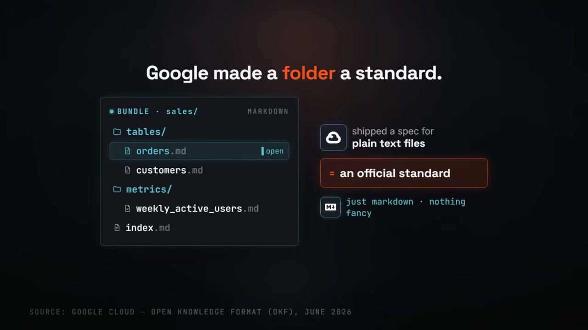

This standard elevates a simple directory of markdown files into an official format that AI agents can use. The idea is to structure knowledge in a way that is human-readable and machine-navigable without complex infrastructure.

The most significant and bold implication of this approach is that it makes the expensive, specialized vector databases—often considered essential for AI applications—optional. The video directly contrasts the two approaches. On one side is a simple collection of curated markdown files. On the other is a vector database, complete with the overhead of creating embeddings, managing indexes, and paying a recurring monthly bill.

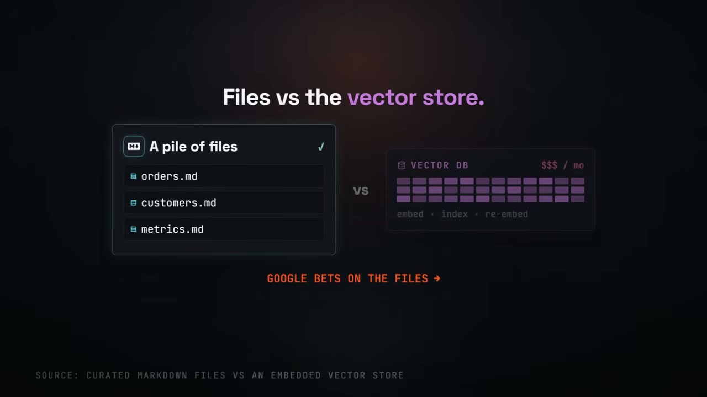

Google's position is a clear bet on the simplicity and cost-effectiveness of files for many use cases. By creating a standard for how this information is organized, an AI can navigate the data directly, much like a human would, rather than relying on the similarity search of a vector store. The narrator describes this new format as "beautifully boring" in its simplicity.

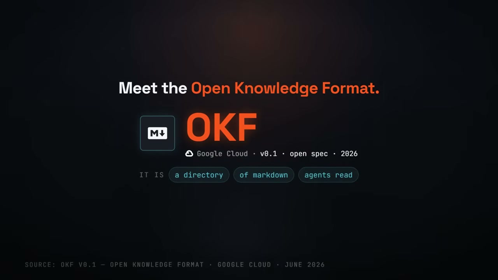
<!-- /dig-section -->

<!-- dig-section: 34 -->
## Addressing the Context Problem for LLMs

The Open Knowledge Format (OKF) simplifies how AI agents access information by grounding them in a straightforward, readable format: Markdown. The process is demonstrated with a query to an agent: "How do we compute weekly active users?" Instead of a complex database search or embedding-based retrieval, the agent's process is direct. It opens a specific Markdown file (`metrics/weekly_active_users.md`), which defines the metric as "Distinct users active in a rolling 7-day window" and contains a cross-link to the relevant data source, the `orders` table. By simply reading the file and following the link, the agent can provide a precise answer: "COUNT(DISTINCT user) over a 7-day window." This simple file-reading mechanism is the core principle.

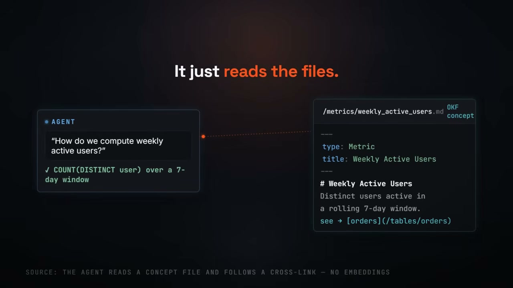

This highlights a fundamental misunderstanding about the limitations of large models. The primary obstacle isn't a lack of intelligence, but a lack of *context*. A powerful model is perfectly capable of writing the logical structure of a SQL query to count distinct users. However, it will stall when it needs to fill in the specific, contextual details, such as which table to query (`FROM ??unknown_table??`) or how to join necessary tables (`WHERE ??which join path??`). Without access to your organization's specific schemas, metrics, and join paths, the model can't complete the query.

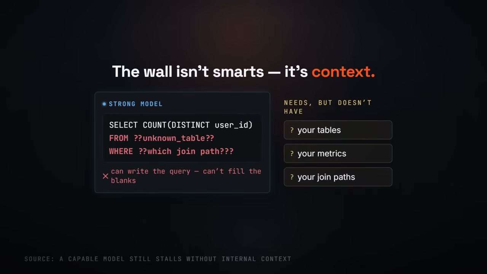

The problem is that this critical context is fragmented and scattered across an organization. It doesn't exist in one unified place. Instead, it lives in disparate, often incompatible silos: technical metadata catalogs, collaborative team wikis, documents in shared drives, comments within source code, and, crucially, the unwritten institutional knowledge inside the heads of senior engineers. Because this knowledge is so dispersed, every AI agent must painstakingly reassemble this context from scratch for every new task, a highly inefficient and brittle process.

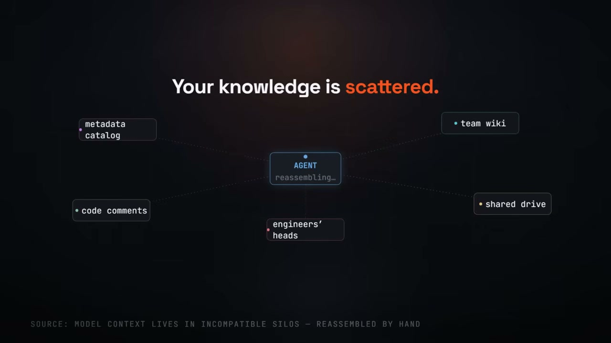
<!-- /dig-section -->

<!-- dig-section: 69 -->
## OKF vs. RAG and the LLM Wiki Concept

The standard fix for giving a Large Language Model (LLM) new knowledge has been Retrieval-Augmented Generation, or RAG. The process is straightforward: you upload your documents, which are then chopped into smaller chunks. Each chunk is converted into a numerical representation—a vector—and stored in a specialized vector database. 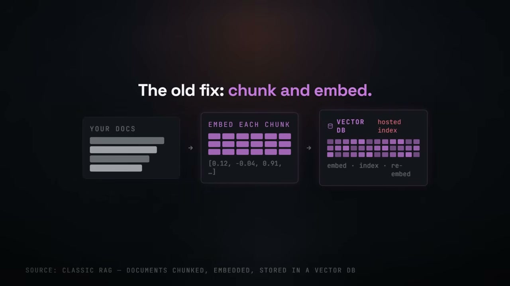 When a user asks a question, the system finds the most semantically similar chunks from the database and provides them to the LLM as context to form an answer.

While this works, it has a major inefficiency: the model is stateless. It effectively "re-learns" the answer from scratch for every single query. If you ask the same question three times, the system performs the same search-and-synthesis process three times, piecing the answer together from raw fragments each time. No knowledge is ever accumulated or refined; the "knowledge kept" is zero.

An alternative, framed by Andrej Karpathy, is the concept of an "LLM wiki." In his analogy, if a note-taking app like Obsidian is the IDE (the development environment) and the LLM is the programmer, then the wiki is the codebase—a living, structured body of knowledge that the LLM actively maintains.

Instead of retrieving raw, disconnected chunks, the model builds and curates a wiki. When you introduce a new source, like a quarterly report PDF, the model reads, extracts, and integrates the new information. This might involve updating a dozen existing wiki pages—modifying summaries, adding new entities, creating cross-links, and even flagging new facts that contradict old information. The knowledge compounds, growing richer and more interconnected over time, rather than being rediscovered.

This "LLM wiki" approach is built on a three-layer architecture. 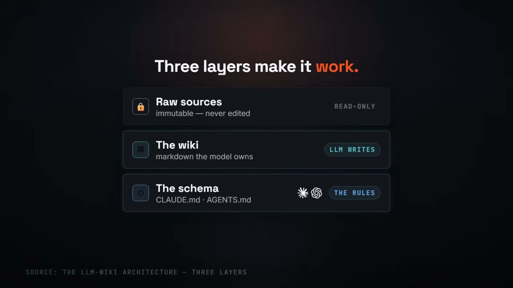 First are the **Raw sources**, which are immutable and never edited; they are the ground truth. Second is **The wiki** itself, a collection of markdown files that the LLM exclusively owns and writes to. Third is **The schema**, a configuration file (e.g., `agents.md`) that provides the rules and instructions for how the LLM should maintain the wiki, ensuring it stays organized and tidy.

This pattern has appeared in various bespoke forms—Obsidian vaults connected to coding agents, `agents.md` files for defining agent behavior, and metadata-as-code repositories. The problem is that these are all great ideas that can't talk to each other; they are isolated, non-interoperable systems. OKF (Open Knowledge Format) fills this gap by providing a standard set of conventions. It is not a runtime or an SDK. 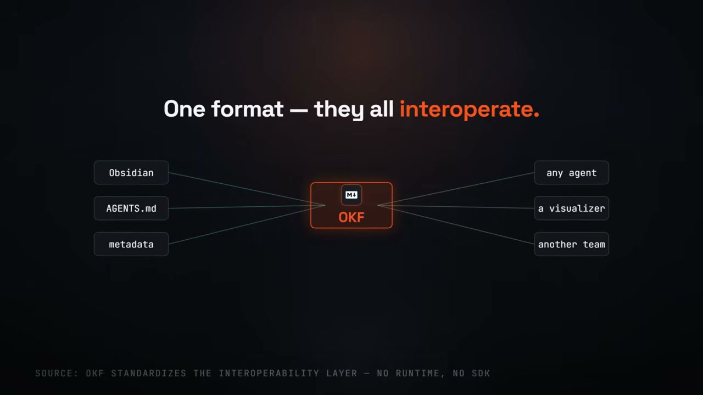 It's simply a common format that allows a wiki written by one tool to be read and understood by another team's agent without any need for translation, enabling true interoperability between these powerful, knowledge-compounding systems.
<!-- /dig-section -->

<!-- dig-section: 160 -->
## Structure and Design Principles of an OKF Bundle

An Open Knowledge Format (OKF) bundle is fundamentally just a directory of markdown files. In this structure, each file is designed to represent a single, distinct concept, such as a database table, a business metric, a procedural runbook, or an API definition. The identity of each concept is its file path within the directory, like `/metrics/weekly_active_users.md`, which provides a unique and human-readable identifier.

The contents of these files are deliberately simple. 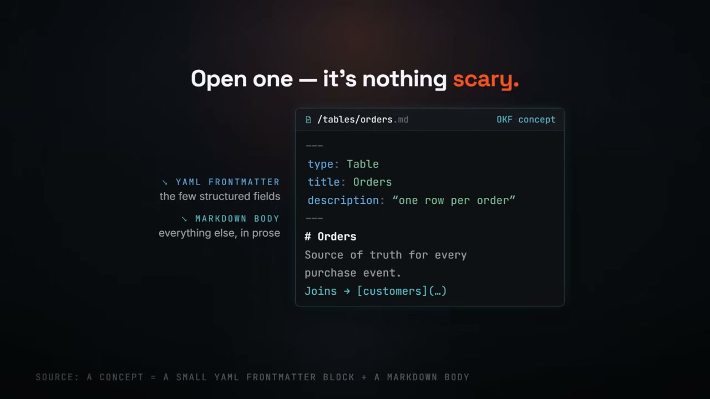 Each file consists of two parts: a small block of YAML front matter at the top for structured metadata, followed by standard markdown for all other descriptive content. The front matter has a few reserved fields like `title`, `description`, `tags`, and a `timestamp`. However, to remain as simple as possible, only one field is required: `type`, which declares what kind of concept the file represents (e.g., `type: Metric`). All other fields are optional, giving users the flexibility to add only the metadata they need.

While the directory provides a hierarchical structure, the real power comes from the connections between concepts. These connections are made using ordinary markdown links. For example, a file for an `orders` table might include a link like `joins [customers](...)` to reference the `customers` concept. 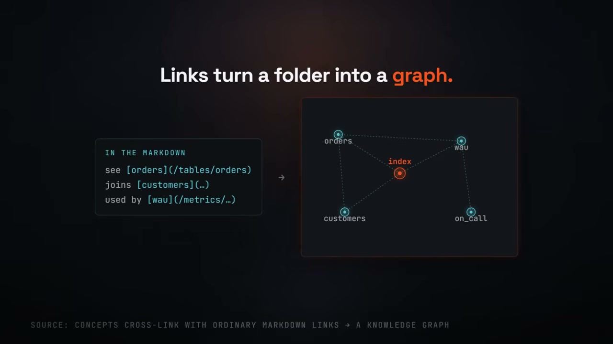 These simple links quietly transform the flat collection of folders and files into a rich, interconnected knowledge graph, capable of representing complex relationships that go beyond a standard parent-child file tree.

To enhance usability, the format supports two optional special files. An `index.md` file can serve as a top-level entry point, providing an overview and links that allow a user or an AI agent to navigate and drill down into the bundle's contents. A `log.md` file can be used to maintain a human-readable change history, recording every modification to the bundle in a clear, accessible format.

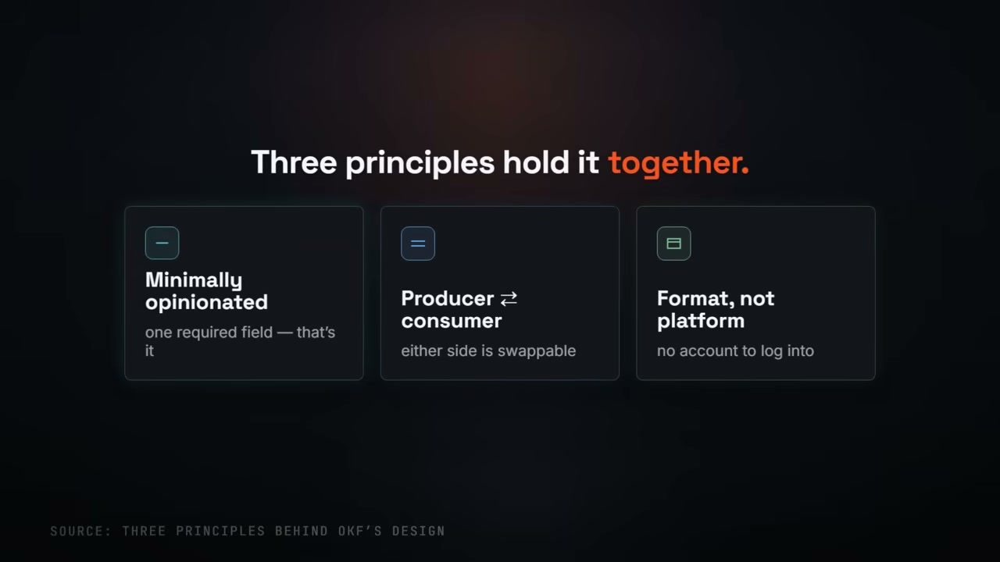 The design of OKF is guided by three core principles. First, it is **minimally opinionated**, imposing very few rules beyond the single required `type` field. Second, it ensures that **producers and consumers are independent** and swappable, preventing lock-in to specific tools. Finally, it is strictly a **format, not a platform**; there is no service to log into or account to create.

Because an OKF bundle is just a collection of text files, it is incredibly portable and requires no special installation. It renders natively on platforms like GitHub, can be easily packaged and shared as a simple tarball, and can be mounted on any standard filesystem. This file-based approach ensures that knowledge is not trapped within a proprietary product, but remains open, accessible, and under the user's control.
<!-- /dig-section -->

<!-- dig-section: 233 -->
## Practical Advantages and Use Cases

OKF differs fundamentally from Retrieval-Augmented Generation (RAG) by shifting from processing "chunks" to operating on "concepts." RAG systems re-derive knowledge on every query by searching through a large corpus of raw, unstructured text fragments. This process is repeated from scratch each time. OKF, by contrast, stores information in curated, cross-linked, structured files called concepts. An AI agent can read and directly edit these concepts, creating a persistent, evolving knowledge base rather than a temporary, query-specific one.

This approach offers distinct advantages over other common knowledge management systems. While a tool like Notion provides structure, it locks data into a proprietary database. A vector index, often used in RAG, provides semantic search over text but returns "fuzzy chunks"—fragments that are semantically similar to a query but are not discrete, well-defined concepts. OKF uses portable markdown files, which agents can read with zero translation, avoiding the lock-in of databases and the ambiguity of vector search.

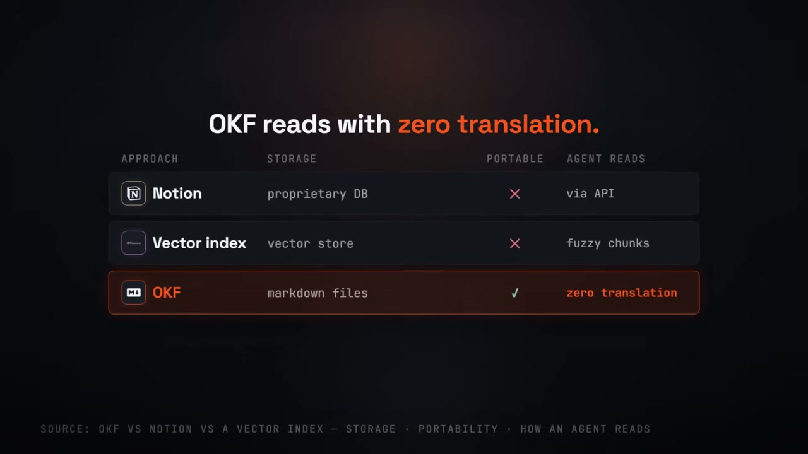

The practical implications for cost and infrastructure are significant. A vector database is an expensive piece of infrastructure that requires hosting, an initial process to embed all content, and a continuous process of re-embedding every time a document is edited. This also involves "babysitting drift," ensuring the vector representations remain accurate over time. In contrast, OKF is simply a folder of text files. The required "infrastructure" consists of standard, often free developer tools like `git` for versioning, `grep` for searching, and pull requests for reviewing changes. This reduces the operational overhead and cost to nearly zero.

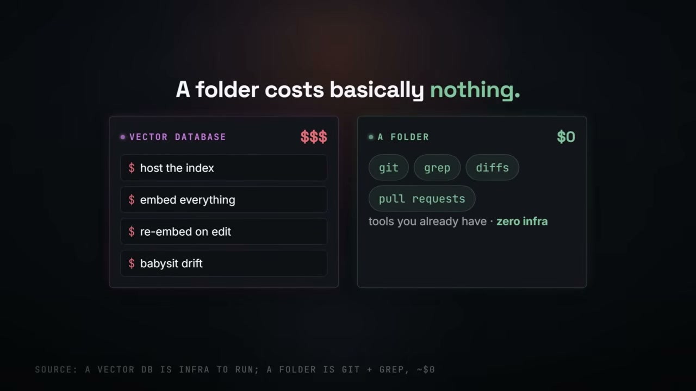

To prove this is more than just a specification, Google has shipped a set of practical tools. These include a BigQuery agent that can automatically generate OKF bundles from database metadata, a static visualizer for browsing the knowledge graph, and three sample bundles to serve as templates.

The most powerful initial use case is "metadata as code." Teams can export their BigQuery table schemas and metric definitions into an OKF bundle. This bundle is then committed to a git repository alongside the SQL that defines the data transformations. When a business definition changes—for example, altering the window for "Weekly Active Users" from 30 days to 7 days—the change is made directly in the corresponding markdown file. This modification is then reviewed and approved through a standard pull request, making metadata management as transparent, version-controlled, and collaborative as code.

From this foundation, the use of OKF can spread throughout an organization. On-call agents can read runbooks written in OKF and follow the embedded links to related concepts for troubleshooting. Vendors can ship product catalogs as OKF bundles that a company's purchasing agent can directly consume. Team wikis, notoriously difficult to keep current, can finally stay up-to-date because the AI model itself can maintain and update the underlying OKF files.
<!-- /dig-section -->

<!-- dig-section: 307 -->
## Conclusion

Despite its advantages, the Open Knowledge Format (OKF) is not a silver bullet that marks the death of the vector database. The two approaches serve different purposes and excel in different scenarios. For a huge, messy pile of documents—millions of them, too large to ever fit into an agent's context window—the vector database and semantic search still win. Their strength lies in handling recall at a massive, fuzzy scale. OKF, in contrast, shines when the knowledge it contains is carefully curated.

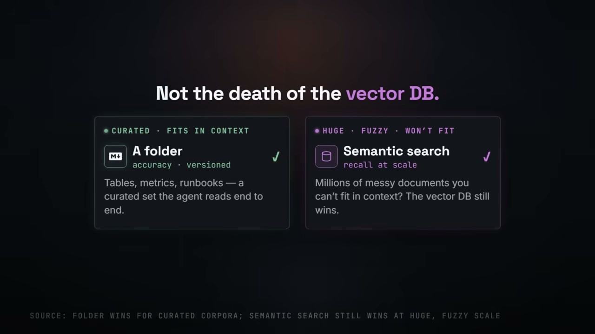

A folder-based approach like OKF beats a database under four specific conditions. First, it works best when **the knowledge is curated**. This means the information is accurate, relevant, and structured, not just a raw data dump. Second, it is ideal when you need **accuracy and version history**. Because OKF is just files in a folder, it can be version-controlled like source code, providing a clear, auditable history of changes and ensuring the agent is using a precise and trusted set of information. Third, the format is designed for knowledge that **fits within the agent's context**. The agent can read the entire curated set from end to end. Finally, a folder wins when **portability actually matters**. Files and folders are inherently portable, easily moved and used across different systems without being locked into a specific database technology.

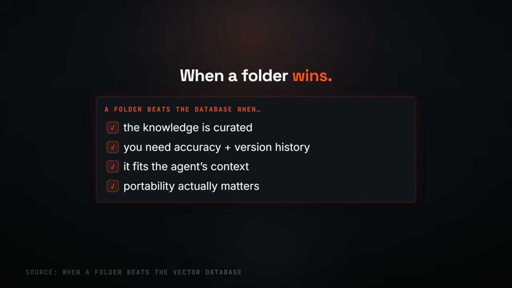

This distinction is part of a larger shift where context itself is becoming a portable, version-controlled artifact. This mirrors a previous evolution in technology. In what could be called "the data era," open formats like CSV, JSON, and Parquet won because they enabled interoperability and portability for data. Now, as we enter "the agent era," open formats like OKF, based on simple markdown context, are poised to win for the same reasons.

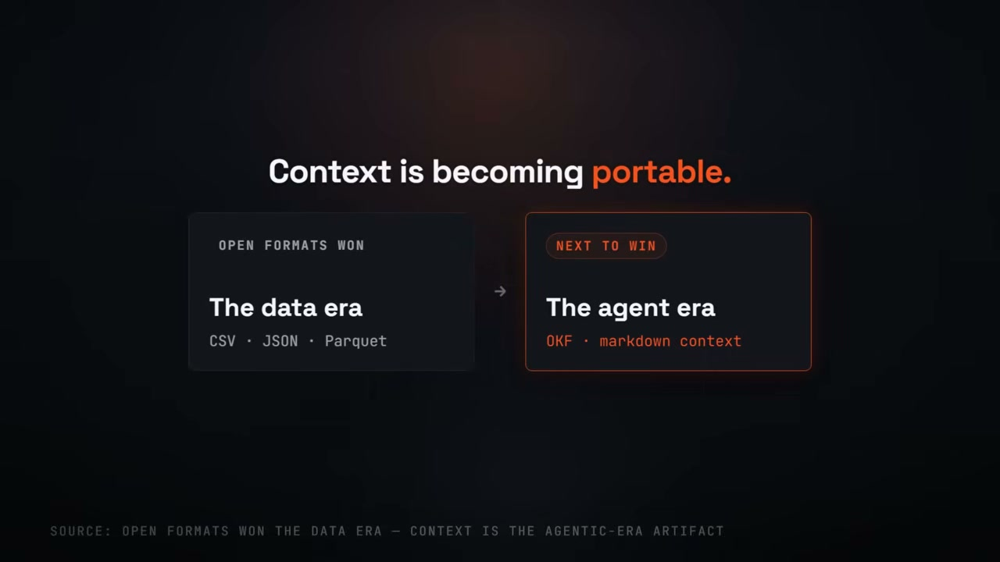

At its core, OKF is a folder of markdown files representing individual concepts. These concepts are linked together to form a graph, which an agent can then read and, crucially, keep current. This process requires no complex embeddings, distinguishing it from vector-based approaches. It underscores the idea that sometimes the "boring" answer—a simple folder of text files—is the better and more effective solution.

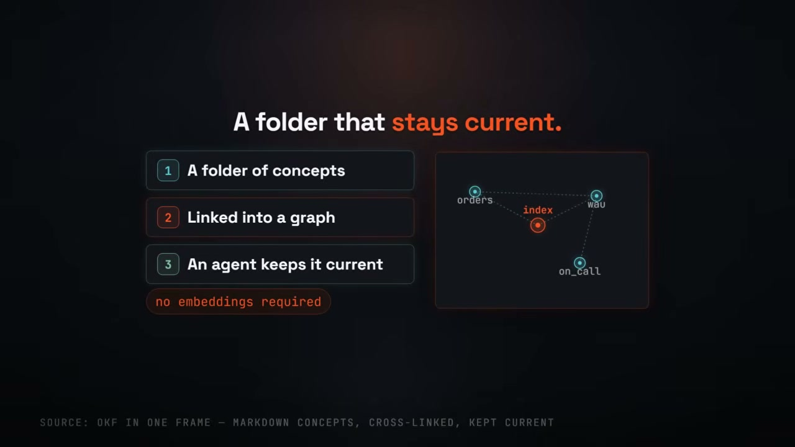
<!-- /dig-section -->
