<!-- dig-section: 2 -->
## The Traditional Approach to AI Memory: RAG

For a time, the AI industry settled on a standard method for giving a model external knowledge, or "memory."  The process, known as Retrieval Augmented Generation (RAG), involved a multi-step pipeline. First, you would take your source documents and break them down into thousands of smaller fragments, or "chunks."  Each of these text fragments was then converted into a vector embedding—a long list of numbers representing its semantic meaning.  Finally, these numerical representations were stored in a specialized, and often expensive, vector database. 

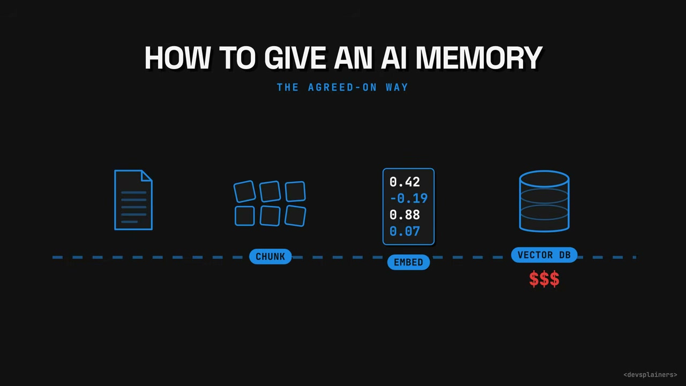

This complex approach was recently challenged by a much simpler idea from a respected figure in the AI community: "Just use a folder of text files."  Surprisingly, this method performed better.  Google has since developed this concept into an official standard, which developers have called "the most obvious idea they've ever seen." 

The complicated RAG system existed to solve a real problem: the information an AI needs to perform its job is typically scattered across many different systems.  For example, a metric's technical definition might live in a database, the business logic that calculates it could be in a separate data pipeline, the justification for a recent change to that logic might be buried in a six-month-old pull request, and crucial context might only exist in the memory of an engineer who has since left the company. 

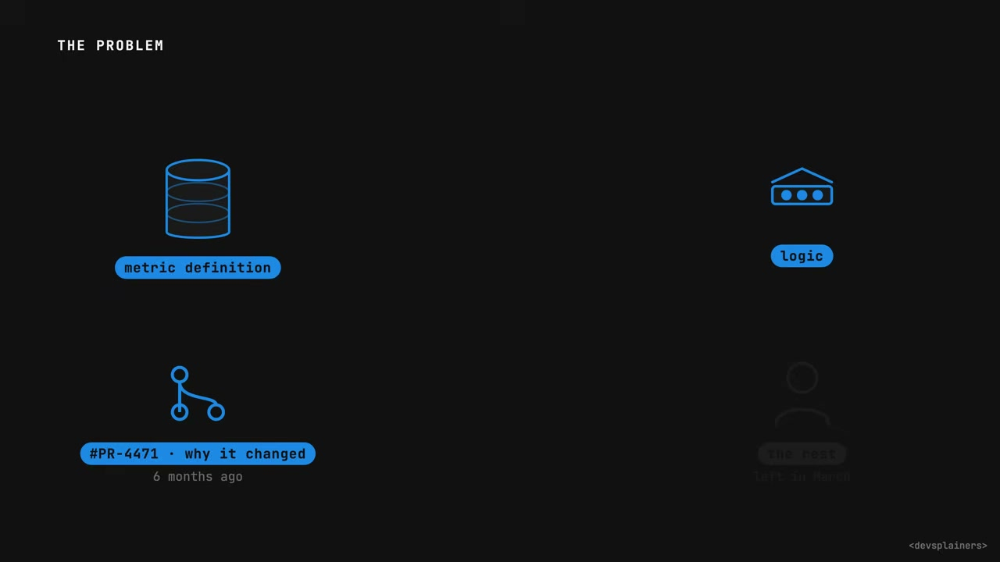

RAG was the "standard fix" for this fragmentation.  When a user asks a question, the system queries the vector database to find the text chunks whose embedded "meaning" is closest to the query's meaning.  It then retrieves these relevant chunks and provides them to the AI model as context along with the original question. 

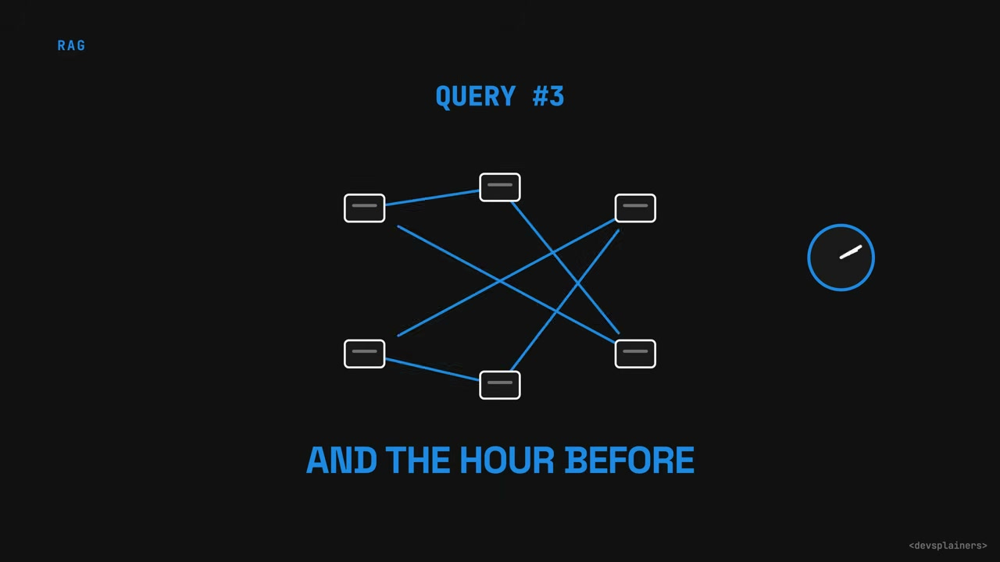

While this process works, it has a fundamental flaw: the model never truly remembers anything from one query to the next.  Each query starts from zero.  The model is handed a "fresh pile of disconnected snippets" and must figure out the relationships and connections between them from scratch, every single time.  It re-does the same analytical work it might have just completed an hour ago, or the hour before that, never building a persistent understanding.
<!-- /dig-section -->

<!-- dig-section: 88 -->
## Andrej Karpathy's LLM Wiki: A Simpler Alternative

A core idea presented is the "LLM Wiki," a concept from Andrej Karpathy, a co-founder of OpenAI and the former head of AI at Tesla . In April, he posted the idea to GitHub, proposing a system that inverts the typical Retrieval-Augmented Generation (RAG) process . Instead of the LLM re-deriving information every single time a user asks a question, the LLM Wiki approach involves building up a knowledge base once .

This knowledge base is structured as a folder of plain text files that are internally linked, creating a "living encyclopedia" that the model can navigate . The system is designed to be read by the LLM in the same way a software developer reads a codebase . 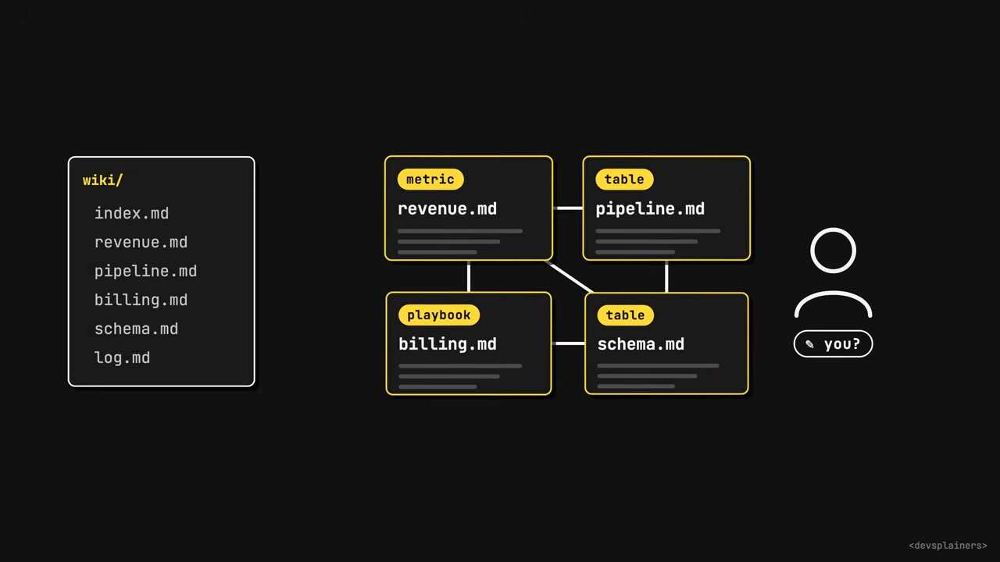

A common misconception is that the human user would be responsible for creating and writing these notes . The video stresses that this is the "wrong way around" . In Karpathy's vision, the AI is the author and maintainer of the wiki . The human's role is to bring it new material and ask good questions . In response, the AI handles all the difficult maintenance tasks, such as summarizing content, creating cross-references between notes, and filing information correctly—the kind of "upkeep nobody ever keeps up with" . 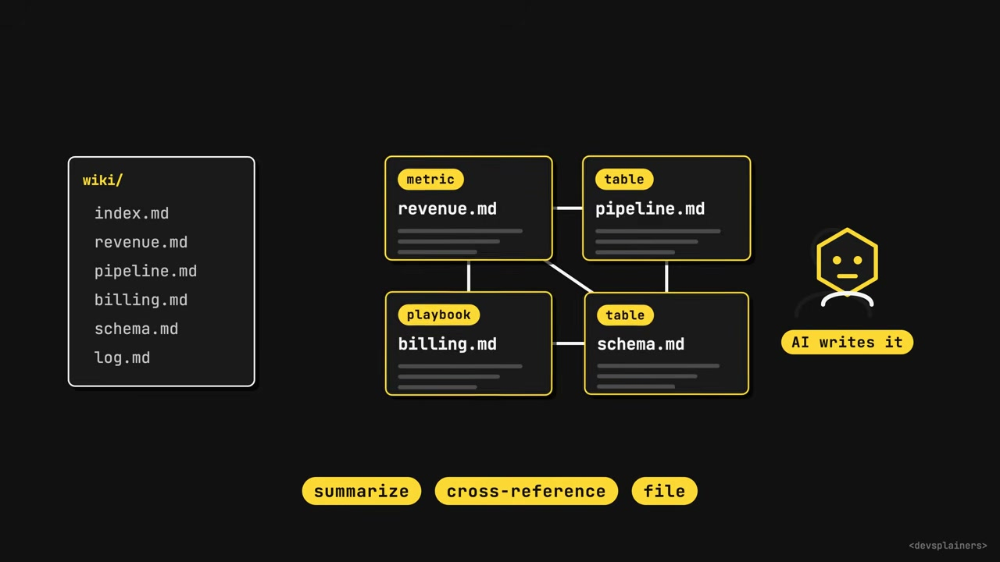

To clarify this relationship, the video shares Karpathy's own analogy for the system:
*   The note-taking software (like Obsidian) acts as the **IDE**.
*   The LLM is the **programmer**.
*   The collection of linked text files (the wiki) is the **codebase**.
*   The folder containing the wiki is the **part you own**.
*   The model itself is the **worker who maintains it** .
<!-- /dig-section -->

<!-- dig-section: 149 -->
## Google's Open Knowledge Format (OKF)

On June 12th, Google Cloud took Andrej Karpathy's concept of an LLM-maintained wiki and formalized it into an official specification called the Open Knowledge Format (OKF). [[1]] [[3]] The resulting spec is "comically small," designed for maximum simplicity and flexibility. [[5]]

The core of the OKF is the "bundle," which is simply a folder. [[5]] Inside this folder, every file represents a single, distinct concept. [[6]] These concepts can be anything a team needs to define, such as a business metric, a database table, or an operational playbook. [[7]] The file's path within the folder serves as its unique name, and links between the files create an interconnected knowledge graph. [[8]] [[9]] The spec also defines two special, optional filenames: one to list the folder's contents (`index.md`) and another to log changes over time (`log.md`). [[10]] [[11]] [[12]]

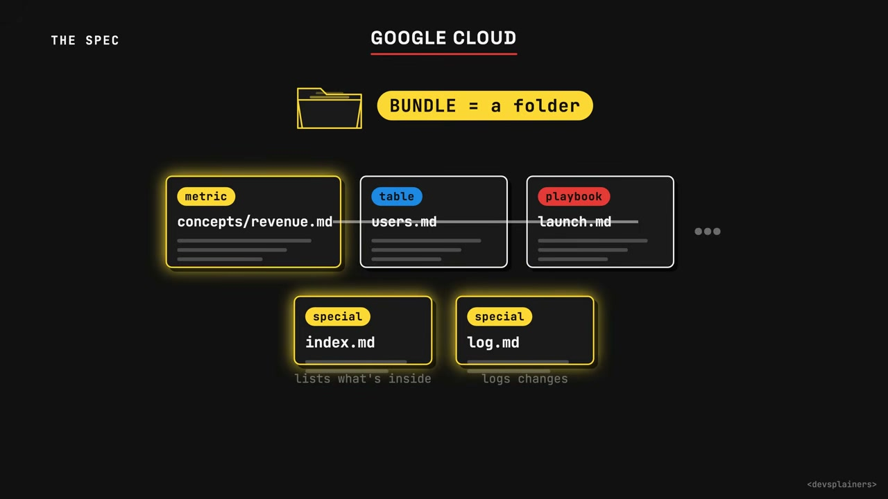

Amid this flexibility, the OKF enforces exactly one hard rule: every file must contain a field specifying its `type`. [[12]] [[13]] This single, required piece of metadata tells any processing tool what kind of thing the file represents, for example, `type: metric`. [[14]]

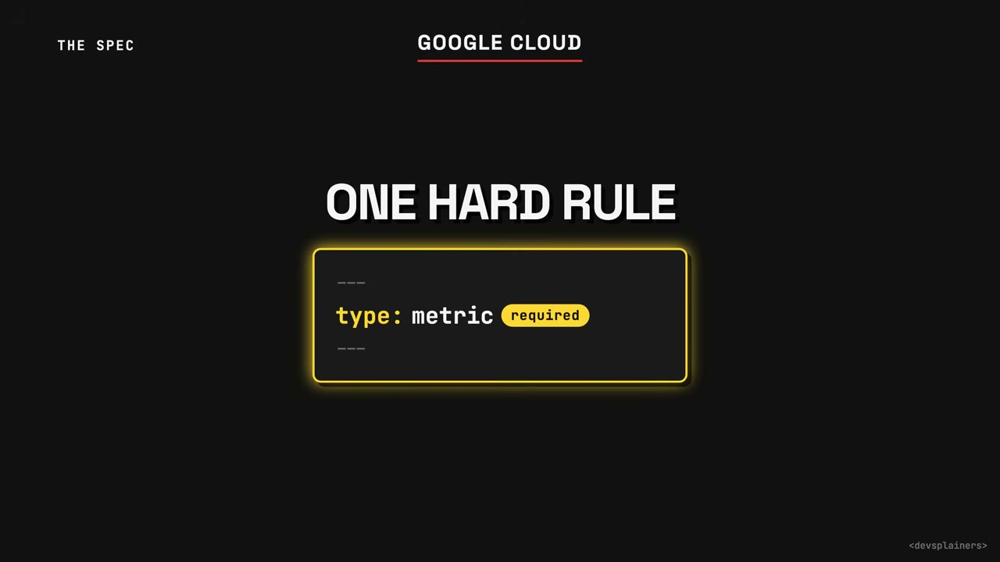

A defining feature of the standard is its principle of permissive reading. The spec mandates that any tool built to read an OKF bundle must "forgive almost everything." [[15]] [[16]] This means the reader should gracefully ignore unknown fields, broken links, and even files it cannot parse. [[16]] [[17]] This "Reader Must Forgive" approach makes the system resilient to errors and partial implementations.

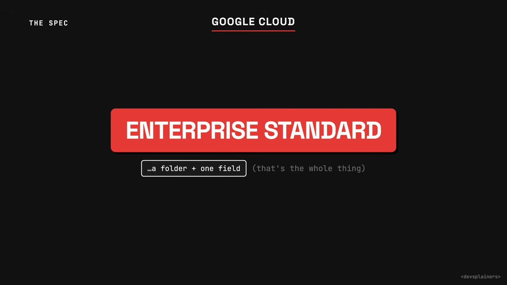

This results in an enterprise standard from Google whose main feature is how little it demands and how much it allows to be broken. [[19]] [[22]] It's a standard so minimal that a developer could build a compliant tool in a single afternoon. [[23]] [[26]] However, in creating this specification, Google adopted Karpathy's idea of the folder-based wiki but dropped his instructions for how an AI would actively maintain it. [[24]] [[25]] As the video puts it, "They kept the folder and left out the part that keeps it alive." [[26]] [[27]]
<!-- /dig-section -->

<!-- dig-section: 217 -->
## Why the Plain Text Folder Wins

The video argues that the folder-based approach is superior to a traditional Retrieval-Augmented Generation (RAG) system for three primary reasons. [[0-1]]

First, the approaches differ fundamentally in *when the work happens*. [[2]] A RAG system does its "thinking" at the moment a question is asked, processing information on the fly. [[3]] In contrast, the folder-based "wiki" does its heavy lifting once, upfront, when the knowledge bundle is built. [[4]] During this build process, an AI connects concepts, flags contradictions between documents, and writes summaries. [[5-7]] This means you pay the computational cost a single time, and subsequent reads of the "finished answer" are essentially free. [[7-8]]

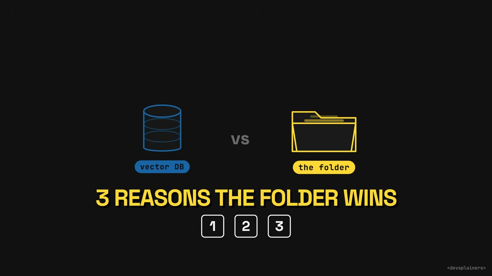

Second, the folder method addresses the issue of *scale*. [[9]] Any language model has a finite context window, meaning it can only hold a certain amount of information in its "head" at once. [[9-10]] For a large company with thousands of documents, this is a significant limitation. [[11-12]] The folder system solves this by having each folder contain a short table of contents, like an `index.md` file. [[12-13]] The model reads this index first to understand the folder's contents, allowing it to select the single file it needs while skipping the other 9,000+ irrelevant ones. [[15-17]] This prevents the model from choking on the entire library of information, a risk in systems that try to ingest everything at once. [[17-18]]

Third, the system's foundation is simple: *it's only text*. [[18]] This knowledge base lives in Git, just like source code, and benefits from the same developer-centric workflows. [[19]] You can `diff` changes and review them in a standard pull request. [[19-20]] Its simplicity also makes it highly portable. You can zip the entire knowledge base into a single file and give it to a model running completely offline on a laptop. [[21-22]] This eliminates the need for supporting infrastructure like a database, a server, or an API key. [[23-24]] If you can open a file, you have everything you need. [[24-25]]

The video concludes by clearing up two potential misunderstandings. [[25]] First, this knowledge format does not compete with a system like MCP. MCP is the "pipe" that moves data around live, whereas this format is the "cargo" that moves through the pipe. [[26-29]] Second, this is not an SEO trick designed for public search engines. [[29]] It is intended for creating a private knowledge base for your own internal AI agents. [[30-32]] The core pitch is that AI performs the tedious bookkeeping and organization that humans often neglect. [[32-33]]
<!-- /dig-section -->

<!-- dig-section: 298 -->
## Criticisms and Challenges of OKF

The Open Knowlege Format (OKF) has several critical flaws, or "catches," that undermine its utility.

The first issue is that the specification provides no mechanism for keeping information current.  While the format includes a field for a timestamp, this is merely a piece of static data, not an active process.  Nothing in the format itself ensures that the knowledge it contains is automatically updated or verified.  This system works well for an individual managing their own folder, but its weakness becomes apparent in a collaborative environment.  On a shared team folder, the information can become stale in as little as a month because no one is designated to maintain it.   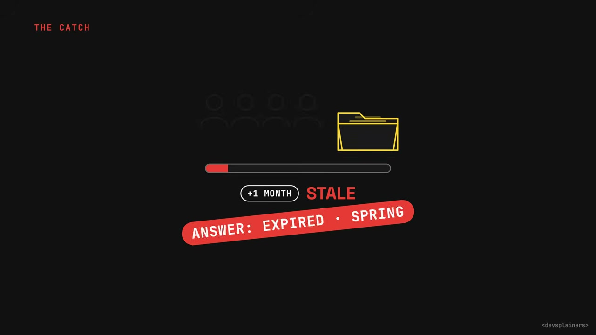 Consequently, an AI agent relying on this folder will begin providing answers based on knowledge that expired long ago. 

The second catch is more fundamental to the role of AI. The entire concept relies on the premise that an AI can act as a "tireless, accurate librarian."  In practice, however, language models are surprisingly poor at writing clean, well-structured markdown at scale.  They frequently make errors like botching the formatting, mangling headers, or even inventing links to files that were never created.   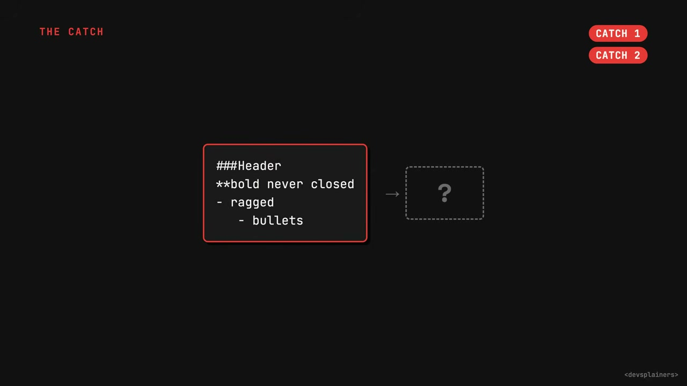 Instead of fixing this "messy librarian" problem at the source—by improving the AI's output—Google's solution was to change the specification.  The spec now mandates that any program reading an OKF file must be "permissive," forgiving any formatting errors it encounters.  This rule is less a solution and more a form of "damage control with a nicer name." 

The third and deepest flaw is that OKF standardizes the container but not the semantic meaning of the content.  The one required field, which defines the "type" of the knowledge asset, is a free-form text label.  This leads to a lack of consistency. For the same kind of asset, one team might write "BigQuery Table," another might simply write "table," and a third could use "relational asset."   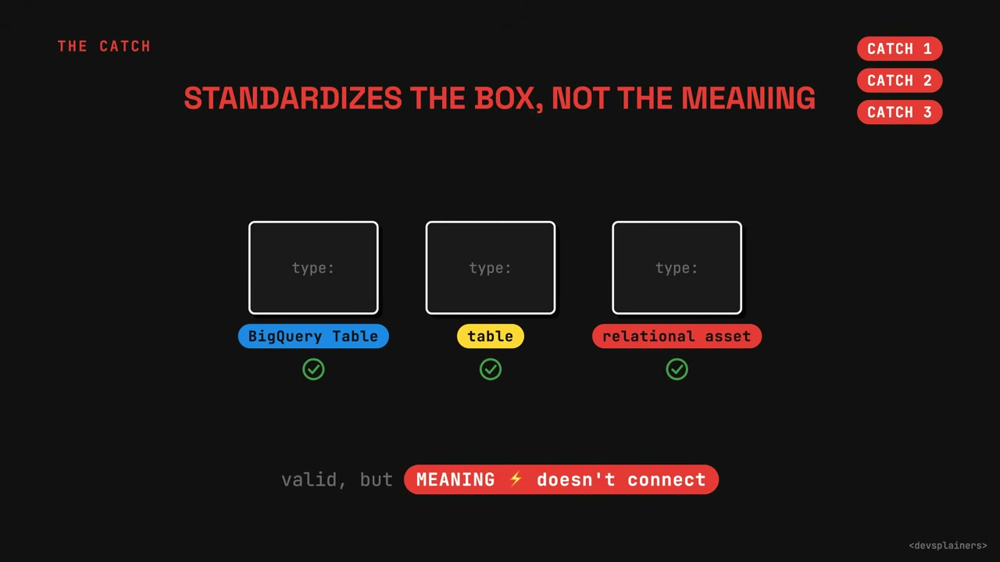 While all of these are technically valid according to the spec, they represent different "languages," preventing a shared understanding of the data.  The format allows you to ship the box anywhere, but agreeing on what's actually inside remains an unresolved problem for the users.
<!-- /dig-section -->

<!-- dig-section: 374 -->
## The Broader Implications and Google's Strategy

The real value and competitive advantage—the "moat"—of this approach isn't the format itself, but the unseen organizational skill behind it.  The video boils this down to a developer's core insight: "An agent is basically just a folder of markdown files."  Since anyone can write markdown, the barrier to entry seems low.  However, the true skill lies in how that folder is structured.  This involves crucial decisions about which files are locked and static versus which files the AI is permitted to rewrite and evolve.  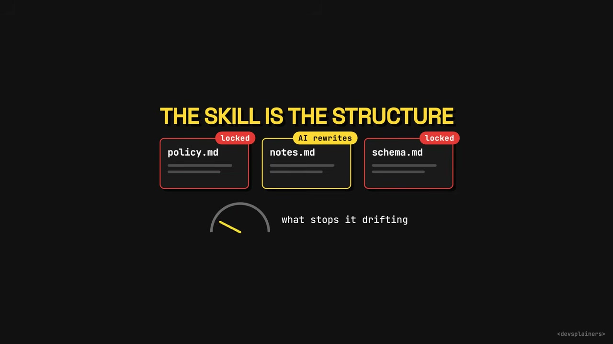 It also requires building in mechanisms that prevent the agent's knowledge from "drifting" off-course during long-term operation. 

This organizational expertise is described as an "invisible moat" because two agent folders can look identical at a glance.  Yet, one will be robust and reliable in production, while the other "slowly rots" as its integrity degrades over time.  You cannot discern which is which just by reading the files; this deep structural quality is something no file format specification can simply grant you. 

The discussion then pivots to the business strategy behind the Open Knowledge Format (OKF). It is revealed that OKF did not originate from Google's dedicated AI lab, as one might expect.  Instead, it came from the BigQuery team.  This origin story is the key to understanding the strategic play. The entire workflow is designed to funnel users into Google's ecosystem. 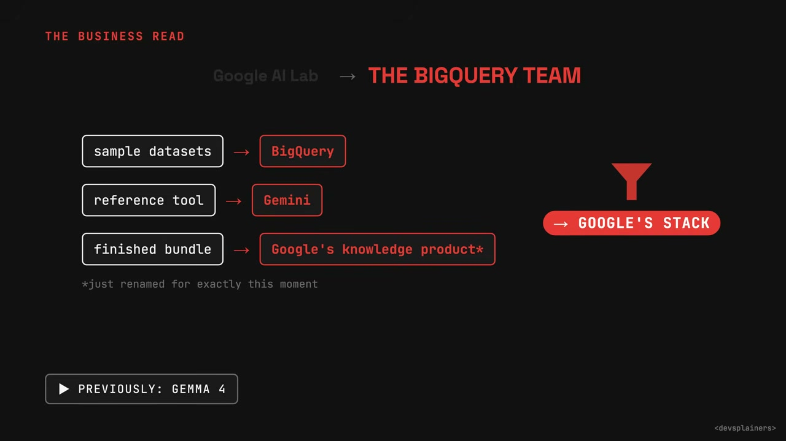 The process begins with sample datasets shipping on BigQuery.  The reference tool used to write the knowledge bundles runs on Gemini, Google's AI model.  Finally, the easiest place to deploy the finished bundle is into Google's own knowledge product, which was conveniently renamed for this purpose.  This end-to-end integration reveals a clear strategy to leverage an open format to strengthen the lock-in of Google's cloud and AI stack.
<!-- /dig-section -->

<!-- dig-section: 433 -->
## Conclusion

The long-term success of the Open Knowledge Format (OKF) is framed as an open question: "Will it stick? Hard to say." . Its primary vulnerability is a lack of initial adoption. On the day it was released, its user base was almost exclusively internal to Google . As the video notes, a standard with only one significant user is not a true standard but "just a suggestion" . This positions the format precariously, making it a potential candidate for abandonment, like many previous company initiatives. It "could easily be the next Google project added to their graveyard" , a point emphasized by an animation showing a tombstone labeled "OKF?" being added to a row of graves. 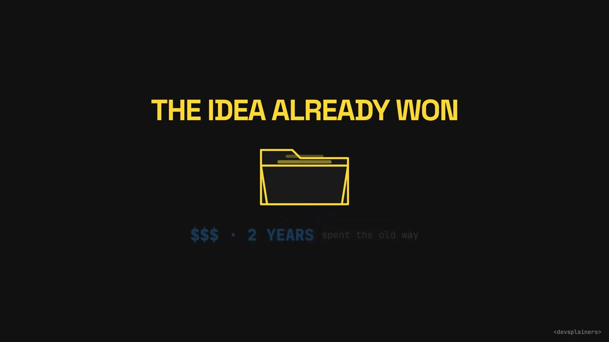

However, the video argues that the fate of the specific format is less important than the principle it represents, asserting that "The idea underneath it has already won though" . This winning idea is a direct challenge to the prevailing approach for giving AI applications a persistent memory. For the prior two years, the AI industry—described as the "most overfunded field in tech"—invested a "fortune" convincing itself that AI memory required "exotic infrastructure" . This complex approach involved converting documents into numerical vectors (embeddings) and storing them in specialized vector databases. 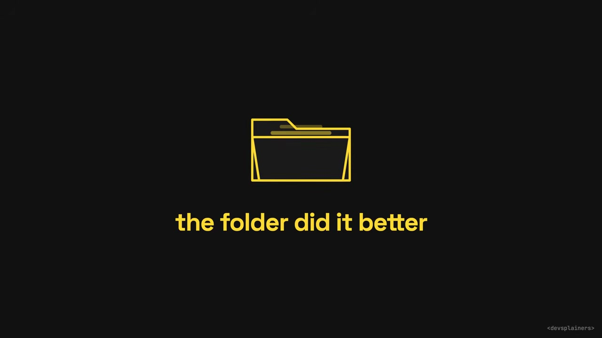

The breakthrough realization, embodied by OKF, is that this complexity was unnecessary. A much simpler solution, "a tidy folder of text files," was found to do the "job better" . This paradigm shift from proprietary, complex databases to simple, human-readable text files is the core victory. Therefore, whatever happens to the OKF specification itself, the discovery that this simpler approach is superior cannot be undone. That insight "isn't going back in the box" .
<!-- /dig-section -->
