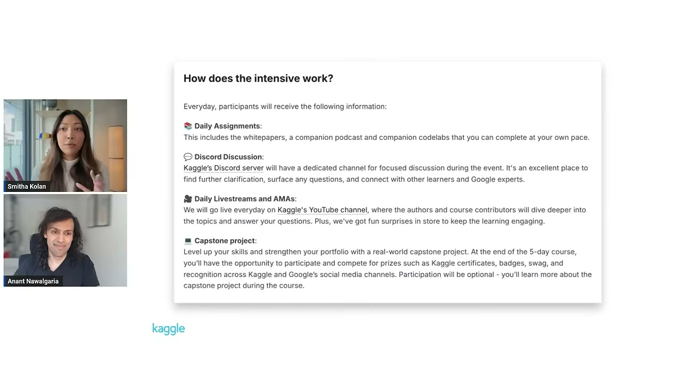
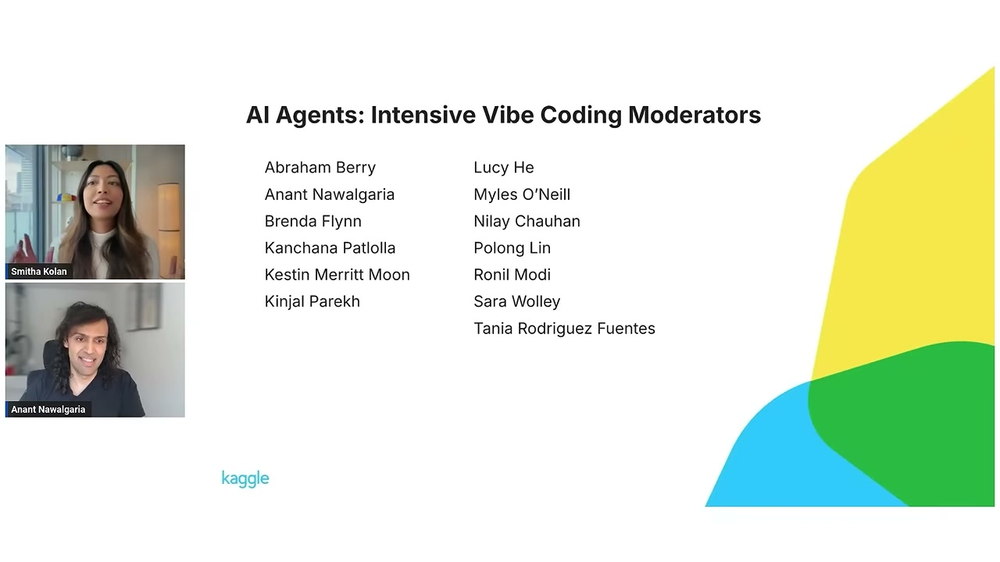
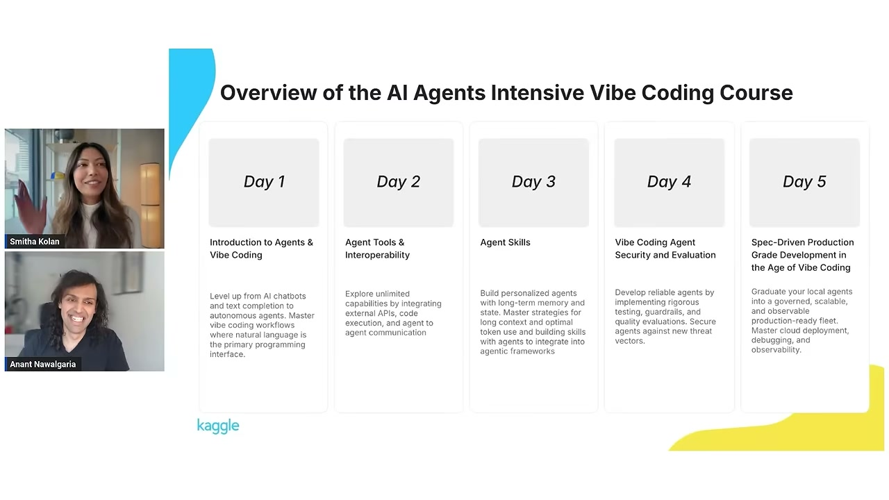
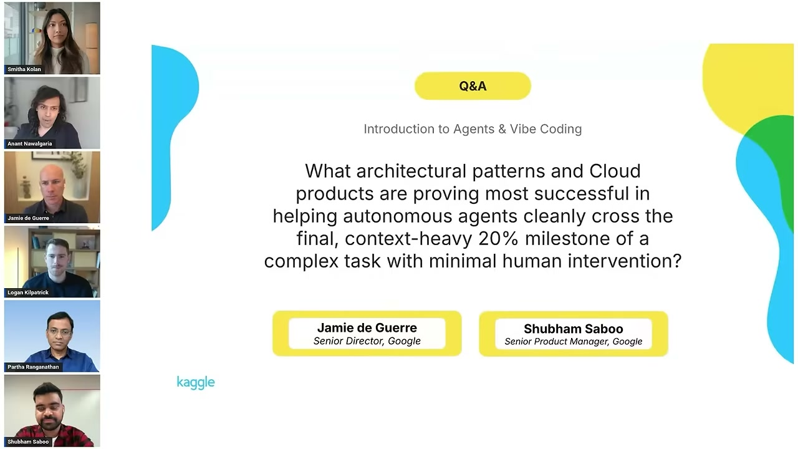

<!-- dig-section: 63 -->
## Course Overview and Evolution of Software Development

The intensive course provides several key resources each day to facilitate learning.  Participants receive daily assignments that include white papers for in-depth technical understanding, companion podcasts, and hands-on codelabs to be completed at their own pace.  The podcasts were a particularly popular format in previous sessions because they helped make the most "dense material easier to absorb."  In addition to self-paced materials, there are daily livestreams and "Ask Me Anything" (AMA) sessions, similar to the one being conducted, where authors and course contributors explore topics and answer questions.  Community interaction is facilitated through a dedicated channel on Kaggle's Discord server for focused discussions, clarifications, and connecting with peers and Google experts.

At the end of the five-day course, there is an optional capstone project.  This project offers a chance to apply the learned skills, strengthen a portfolio with a real-world project, and compete for prizes.  These prizes include Kaggle certificates, badges, swag, and recognition across both Kaggle's and Google's social media channels.  Course content is delivered directly to the inboxes of registered participants; for others, all materials are available on the Kaggle learner portal and announced in the Discord. 

The speakers extend their gratitude to the many people who made the course possible, including the Google researchers, the engineers who authored the white papers, the speakers participating throughout the week, and the Discord moderators who have been "answering questions non-stop."  Anant also adds a special thanks to the "awesome Kaggle team." 

The course itself exists because "the way software gets built has fundamentally shifted."  This is not just a future trend but the "current baseline."  The speaker cites projections that by early 2026, 85% of professional developers will regularly use AI coding agents, and that currently, about 41% of all new code is AI-generated.  The primary challenge that this course addresses is closing the gap between simply prompting an AI model and successfully building and deploying a production-grade application, an area where most teams are currently struggling. 

Day 1 focuses on "Introductions to Agents & Vibe Coding."  The session covers the conceptual shift from writing explicit syntax to expressing high-level intent.  It also explores the full spectrum of development, from "casual vibe coding" on one end to disciplined "agentic engineering" on the other.  Participants will have the opportunity to build their first application using tools called antigravity and AI Studio.
<!-- /dig-section -->

<!-- dig-section: 206 -->
## The New SDLC and Agentic Engineering

Recapping the white paper for day one, the speaker highlights a "profound shift in computing history" [[5 @3:39]]. The paradigm is moving away from developers translating ideas into specific syntax and is instead transitioning toward expressing high-level intent using natural language [[6 @3:40]-[8 @3:46]]. This new approach exists on a spectrum. At one end is casual "vibe coding," where a developer prompts an AI and then iteratively copy-pastes error messages back into the prompt to refine the output [[9 @3:49]-[12 @3:56]]. At the other end is disciplined "agentic engineering," where AI operates within structured and deterministic boundaries to achieve a goal [[13 @3:58]-[15 @4:03]].

A core concept in this new paradigm is "context engineering," which the speaker calls the "real skill of modern engineering" [[16 @4:06]-[18 @4:11]]. This involves managing the difference between expensive, static context (like persistent system instructions) and cost-efficient, dynamic context (like agent skills that are loaded on demand) [[19 @4:13]-[23 @4:22]]. This shift fundamentally changes the traditional Software Development Life Cycle (SDLC) [[27 @4:31]]. The implementation phase, which used to take weeks, can now collapse into minutes [[29 @4:36]-[30 @4:38]]. Consequently, the new human bottlenecks in the process become requirements specification and verification [[31 @4:41]-[32 @4:42]].

Under this "factory model" of software development, the output of a developer is no longer just raw code; it is the entire system that produces the code [[34 @4:47]-[38 @4:57]]. This system is defined by a critical formula: `Agent = Model + Harness` [[39 @4:59]-[40 @5:03]]. In this equation, the underlying model accounts for only about 10% of the system's effectiveness [[41 @5:06]-[42 @5:10]]. The remaining 90% is the "harness," which comprises the sandboxes, tools, orchestration logic, and guardrails that make the agentic system reliable [[42 @5:10]-[46 @5:19]].

The developer's role also evolves, shifting between two modes. In "conductor mode," they direct real-time edits within an IDE [[50 @5:30]-[51 @5:33]]. In "orchestration mode," they asynchronously delegate complex tasks to autonomous agent networks or swarms [[51 @5:33]-[54 @5:41]]. The session then moves to a guest Q&A, with the host offering a quick tip: listen to the podcast to understand the "why" before reading the white paper for the technical details, as this helps the concepts stick better [[63 @6:03]-[68 @6:14]].
<!-- /dig-section -->

<!-- dig-section: 413 -->
## Impact on CS Education, Hiring, and AI Tools

Logan Kilpatrick addresses the future of computer science education and hiring in an era of AI-driven coding. He argues that this shift is a positive development, reinforcing the core purpose of computer science education, which has always been about teaching *how to think* rather than just mastering the syntax of a programming language .

Reflecting on traditional computer science curricula, Kilpatrick describes a "two-track" system . One track focused on high-level, theoretical concepts like algorithms, logic, and architectural decisions . The other track was applied, focusing on learning the specific syntax—like Python's—to implement those concepts . The new paradigm, where AI systems can generate large volumes of code , automates much of the applied, syntactic work. This allows developers to focus more on high-level judgment and architecture. He compares this to the invention of the calculator : while calculators handle the arithmetic, learning to do math is still crucial because it forces a deeper understanding and expression of mathematical concepts . Similarly, knowing how to code remains a useful way to express one's thoughts, but mastery of its syntax becomes less of a priority than the ability to design and architect systems.

The most exciting change for Kilpatrick is what this new paradigm means for students and aspiring developers . He envisions a future where students graduate not just with a degree, but with a tangible "proof of work" —a fully built system or even an entire business created during their studies . This shift moves education towards a model more akin to a "trade craft," where practical application and demonstrable results define one's qualifications .

When asked about the role of Google AI Studio in this vision, Kilpatrick confirms this is precisely the direction his team is headed . He outlines a progression of capabilities:
1.  **Prompt to Prototype:** The ability to generate a working prototype from a text prompt is already well-established .
2.  **Prompt to Production:** The next stage, which is becoming a reality, is generating and deploying a fully functional website or application directly from prompts .
3.  **Prompt to Profitable Company:** The ultimate goal is to support the entire business lifecycle . This goes beyond just generating code; it involves using AI to find product-market fit, acquire the first users, and iterate on the business model .

Kilpatrick concludes with an analogy to YouTube's impact on content creation . Before YouTube, video and audio distribution were controlled by a few gatekeepers like TV and radio networks . YouTube democratized the medium, allowing anyone to become a creator. He predicts that AI will do the same for software. What once required hiring large teams of developers and raising significant capital will soon be achievable by individuals, enabling anyone to build a software business .
<!-- /dig-section -->

<!-- dig-section: 741 -->
## Advanced AI Agent Capabilities and Architectural Patterns

Self-evolving AI agents like Google DeepMind's Alpha Evolve represent a significant step in optimizing complex problems. Partha Ranganathan describes Alpha Evolve as an "evolutionary algorithmic agent" that uses a large language model, such as Gemini, in conjunction with an evaluator function.  This combination allows it to iteratively discover and refine algorithms for a given use case.  Initially demonstrated by solving decades-old math problems, such as finding new, more efficient ways to perform matrix multiplication, Alpha Evolve has since been applied to a wide spectrum of real-world challenges.  Its applications range from designing new hardware and building large-scale schedulers within Google to scientific use cases like DNA sequencing and molecular simulations.  It has also been used to optimize systems in cloud computing, finance, and retail.  Ranganathan frames these agents as an "expert optimizing agent at your fingertips," a powerful tool to add to a developer's arsenal during the coding process. 

The discussion then pivots to the practical challenge of making autonomous agents reliable enough for production, specifically addressing how to cross the "final, context-heavy 20% milestone of a complex task with minimal human intervention."  Shubham Saboo explains that while engineering power is now abundant and accessible through tools like AI Studio, the critical skills have shifted to understanding a core problem, communicating it effectively to an AI, and verifying the output.  He outlines a core "scaffold, build, observe, and optimize" loop for agentic systems.  This iterative process, supported by platforms that allow developers to build, evaluate, deploy, and trace agent behavior, is what closes the gap to production readiness.  To handle tasks with extensive context, he highlights the concept of "agent skills," which allow an agent to dynamically inject context as needed, rather than bloating its main prompt. 

Jamie de Guerre adds that this "last mile" of ensuring quality, consistency, and robust error handling is often the biggest hurdle.  He identifies two architectural patterns that are proving particularly successful:

1.  **Agents as Code Writers**: Instead of treating an agent as just a series of LLM calls with a prompt, a more effective pattern is to give it a sandboxed environment. In this environment, the agent can write and execute its own code, create its own tools on the fly, and even spawn sub-agents to evaluate its work.  This approach shows "much more success" than simpler, prompt-based architectures. 
2.  **Robust Verification Loops**: Successfully crossing the last mile requires strong verification. This involves both automated loops, where one agent or sub-agent evaluates the work of another and forces iteration, and Human-in-the-Loop (HITL) steps.  By setting conditions that flag for human review, developers can not only correct errors but also create a valuable dataset from that feedback, which enables the agent to achieve self-improvement over time.
<!-- /dig-section -->

<!-- dig-section: 1265 -->
## Risks and Use Cases for Long-Running Agents

Jamie de Guerre opens by outlining three significant long-term risks associated with a fully AI-driven Software Development Life Cycle (SDLC), assuming the AI becomes highly successful at writing, evaluating, and maintaining code .

The first and most fundamental risk is the **erosion of human expertise** . As AI takes over more of the codebase creation and management, developers and architects will have less direct, hands-on experience . This diminishing expertise poses a critical problem: it weakens the human's ability to effectively orchestrate the AI, make sound architectural decisions for the future, and troubleshoot complex issues when they inevitably arise . The second risk, **accountability**, flows directly from the first . When a system largely written and managed by an AI fails, it becomes difficult to determine who is responsible. As human expertise with the code dwindles, assigning accountability for issues to a specific engineer or architect becomes a major challenge . The third risk is the potential for **lost opportunities for innovation** . De Guerre argues that many crucial engineering innovations are born from a deep, nuanced understanding of a product and its codebase—an understanding that only comes from direct engagement . If developers drift too far from the code, these human-driven insights and opportunities for improvement may be lost, as the AI might not identify them on its own . To mitigate these risks, he stresses the need for careful, proactive planning to ensure human expertise and understanding are maintained . Anant Nawalgaria adds that this erosion of expertise also presents serious security vulnerabilities, as a deep understanding of the codebase is essential for identifying and preventing security gaps .

The discussion then shifts to a panel Q&A format. Shubham Saboo fields a question about combining Open Knowledge Format (OKF) with a GraphRAG architecture to allow agents to map system designs before coding . Saboo explains that OKF, inspired by Andrej Karpathy's "LLM-Wiki" concept, uses a simple set of linked markdown files to represent different components of a system, like services or databases . He confirms that combining this with GraphRAG is a promising approach . Currently, agents often start coding without a full understanding of the repository's context . GraphRAG would allow the agent to traverse the OKF's linked structure, giving it a "map of the entire system" to understand the connections and dependencies . This enables the agent to reason about the downstream effects of a change before writing any code, much like a human architect would, by asking, "If I change X, what gets affected?" .

Next, Logan Kilpatrick addresses a question on reasonable use cases for long-running autonomous agents . He identifies two major successes so far:
1.  **Deep Research:** Google's Deep Research was an early example, where an agent performs an extended, autonomous research loop to collate information and present synthesized artifacts to a user . This works because the task isn't about finding one finite answer but about navigating a complex information ecosystem and building contextual understanding .
2.  **AI Coding:** This is currently the most prevalent use case for long-running agents . Its effectiveness stems from a tight feedback loop where the agent can be **continuously tested and verified** . By running the code it generates, the agent can check for errors and ensure its incremental changes are productive, which is crucial for preventing the agent from wasting time and resources on a flawed path .

Kilpatrick also notes that as agents run longer, new bottlenecks appear, particularly with external tools. Many existing APIs and systems were built for human interaction and are not optimized for the speed and parallelism of AI agents, creating new challenges to solve . Other panelists add that any task that is time-consuming for humans is a good candidate for long-running agents, including multimedia generation (e.g., creating long videos)  and processes in dynamic environments like loan processing or legal case management, where an agent must continuously adapt to new information over weeks or months .

Finally, Parthasarathy Ranganathan answers a question about real-world examples of "vibe coding" and the challenges of moving from chatbots to fully autonomous systems . He gives a concrete example from Google: using an agentic approach to automate the migration of code from TensorFlow to JAX, a process that is extremely difficult for humans. This AI-driven migration on YouTube's codebase was six to eight times faster than a manual effort .

Regarding challenges, Ranganathan highlights three key areas:
1.  **Safety and Responsibility:** Developers must contend with the "three H's": hate, harm, and hallucinations . This requires careful grounding, addressing data bias, and implementing robust safety and verification measures .
2.  **Holistic Workflow Optimization:** He uses a "Whac-A-Mole" analogy to warn against optimizing one part of the development process in isolation . For instance, if you use AI to speed up coding by 10x, testing may become the new bottleneck . The challenge is to view and optimize the entire AI-infused workflow, not just individual components .
3.  **The "IUS Journey":** He describes a three-stage evolution for AI applications: **Impressive, Useful, and Sustainable** . It's easy to create an *impressive* demo. The next step is to make it genuinely *useful* and broadly applicable. The final, and hardest, challenge is making it *sustainable*—meaning it's scalable, secure, and economically viable, not just a cool but prohibitively expensive tool . Navigating this journey is a major hurdle for developers building autonomous systems.
<!-- /dig-section -->

<!-- dig-section: 2435 -->
## Conclusion

Following the Q&A session, the hosts transition to the hands-on portion of the day. A host notes her appreciation for the acronym "IUS"—Impressive, Useful, or Sustainable—as a useful framework for evaluating new skills . Another host adds that sustainability is a practical concern for the course, as participants will be working with limited free quotas for the codelabs .

Fran Hinkelmann then introduces the two codelabs for Day 1, which are designed to provide practical, hands-on experience with agentic development from the very beginning .

The first codelab focuses on Google Antigravity, which will serve as the main tool for the week . Antigravity is a central command center for managing AI agents, their workspaces, and the code they generate . Fran walks through the Antigravity interface, a visual tool for partnering with an AI agent .  The UI allows you to see how agents create implementation plans, guide you through tasks, and generate artifacts, which are displayed on the right side of the screen . It includes an integrated IDE and allows you to switch between different models like Gemini, Claude, or GPT directly from the prompt input area . Fran highlights an important feature in the settings: under the "Models" tab, you can view your remaining token quota . If you exhaust your quota for one model, you can simply switch to another to continue working .

The second codelab introduces Google AI Studio as an alternative for building applications through "vibe coding" . This approach allows you to create an app simply by describing its functionality in plain English . Fran shares a simple, "silly" example she created: a "corgi party" app .  While she jokes that the app is more impressive than useful, it demonstrates how quickly you can go from an idea to a deployed application that can be published to the cloud with just a few clicks . She encourages everyone to complete the codelabs, share their deployed apps on Discord, and to read the instructions carefully rather than just copy-pasting to maximize learning .

The session then moves to a pop quiz to test the day's key concepts. The questions cover the core components of AI agents, the principles of agentic engineering, and the new challenges in the AI-driven development lifecycle.
*   **Question 1:** The "reasoning engine" of an AI agent is the **Model** .
*   **Question 2:** A key differentiator of "Agentic Engineering" from "Vibe Coding" is its reliance on **systematic verification through automated test suites, CI/CD gates, and evaluation judges** .
*   **Question 3:** The new primary bottleneck in the AI-driven software development life cycle is **Specification quality** . Ensuring the AI builds the *right* thing becomes the main challenge .
*   **Question 4:** In the equation "Agent = Model + [?]," the missing "Harness" component is **the surrounding scaffolding wrapped around the model**, which includes prompts, tools, sandboxes, and hooks .
*   **Question 5:** The "Investment of Agentic Engineering" is described by a tradeoff of **High CapEx, Low OpEx**. This means a higher initial investment in training and infrastructure leads to lower long-term operational costs related to developer time and effort .

Finally, the hosts wrap up Day 1. The assignments for Day 2 will be released shortly, and the next session will focus on **Agent Tools & Interoperability** . This topic will build on Day 1 by exploring the Model Context Protocol (MCP), agent-to-agent (A2A) communication, and how agents connect to the outside world . The hosts encourage participants to keep the discussion going on Discord and to get started on the codelabs .
<!-- /dig-section -->
