<!-- dig-section: 12 -->
## 퀄컴의 AI 데이터 센터 시장 진출과 드래곤플라이 전략

AI 반도체 시장은 엔비디아의 GPU와 SK하이닉스의 HBM이 주도하고 있지만, 2024년 6월 24일, 의외의 기업이 이 시장에 출사표를 던졌습니다. 바로 안드로이드 스마트폰의 두뇌인 '스냅드래곤'으로 유명한 퀄컴입니다. 퀄컴은 이날 인베스터 데이(Investor Day)에서 '드래곤플라이(Dragonfly)'라는 새로운 브랜드를 공개하며 AI 데이터 센터 시장 진출을 공식 선언했습니다.

### 이름에 담긴 전략: 드래곤플라이

퀄컴은 제품명에 '용(Dragon)'을 사용하는 것을 즐기는 듯합니다. 스마트폰 칩셋인 '스냅드래곤'에 이어 데이터 센터용 제품군에는 '드래곤플라이', 즉 '잠자리'라는 이름을 붙였습니다. 이 이름에는 퀄컴의 시장 공략 전략이 함축되어 있습니다.

자연계에서 잠자리는 가장 효율적으로 비행하는 곤충 중 하나로 꼽힙니다. 몸 구조가 비행에 극도로 최적화되어 있어 적은 에너지로 오래 날 수 있으며, 네 개의 날개를 각각 독립적으로 움직이면서도 정교하게 비행을 제어합니다. 퀄컴은 잠자리의 이러한 특징을 자사 데이터 센터 기술에 그대로 투영했습니다.

*   **효율적인 비행**: 높은 전력 효율성(전성비)을 의미합니다. 단순히 강력한 성능으로 압도하는 엔비디아와 달리, 퀄컴은 전력 대비 성능 효율로 승부하겠다는 메시지를 던진 것입니다.
*   **네 개의 날개**: CPU, AI 가속기, 네트워킹 기술 등 핵심 요소들이 독립적으로 작동하면서도 하나의 시스템처럼 유기적으로 협력하는 구조를 상징합니다.
*   **민첩한 방향 전환**: 시시각각 변하는 다양한 AI 작업에 유연하고 빠르게 대응하는 능력을 뜻합니다.
*   **지치지 않는 비행**: 기가와트(GW)급의 대규모 데이터 센터에서도 지치지 않고 안정적인 성능을 유지하겠다는 자신감을 나타냅니다.

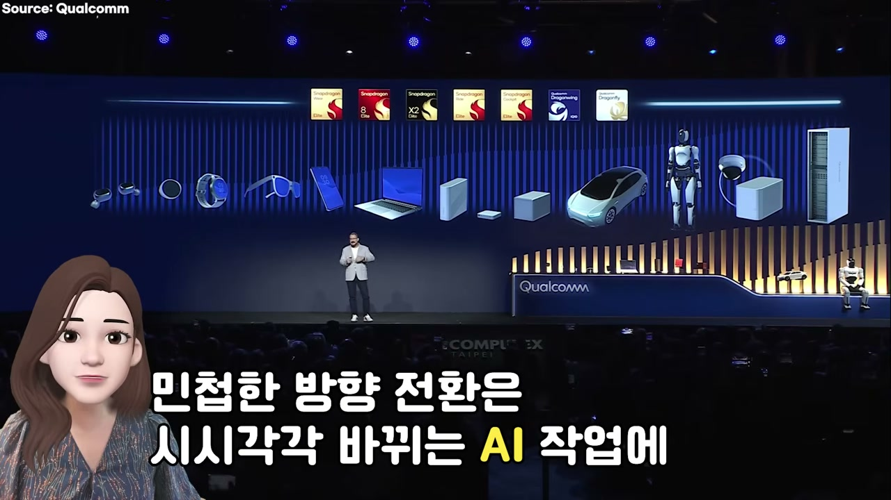

### 칩이 아닌 '풀세트'로 승부

퀄컴의 접근 방식에서 더욱 흥미로운 점은 단순히 칩 하나를 출시한 것이 아니라는 점입니다. 이들은 데이터 센터 서버 한 대를 통째로 구성할 수 있는 '부품 풀세트'를 한 번에 공개했습니다. 이 풀세트는 크게 세 가지 핵심 요소로 구성됩니다.

1.  **AI 가속기(NPU)**: AI 연산을 전담하는 핵심 칩입니다.
2.  **네트워크 기술**: 수십 개의 NPU 칩을 하나의 거대한 서버 랙(Rack)으로 묶어주는 고속 통신망 역할을 합니다. 칩들 간의 원활한 데이터 소통을 위해 필수적입니다.
3.  **서버용 CPU**: 이 모든 구성 요소를 총괄하고 지휘하는 중앙 처리 장치입니다.

여기에 메모리와 소프트웨어까지 더해, 고객이 서버 한 대를 구축하는 데 필요한 모든 것을 제공하는 종합 솔루션을 제시한 것입니다.

이러한 '풀세트' 전략은 현재 AI 반도체 시장의 흐름을 정확히 반영합니다. 시장의 절대 강자인 엔비디아는 이미 GPU 단품이 아니라, 자체 CPU(Grace), 네트워킹 기술(NVLink, InfiniBand), 소프트웨어(CUDA)까지 모두 묶어 하나의 플랫폼으로 판매하고 있습니다. 이러한 통합 생태계 때문에 다른 회사가 부품 하나만 가지고는 비집고 들어갈 틈이 없습니다. 이에 대응해 AMD는 '헬리오스(Helios)'라는 랙 단위 플랫폼을, 구글은 자체 칩 TPU를 중심으로 데이터 센터 전체를 직접 설계하는 방식으로 경쟁하고 있습니다. 이제 AI 데이터 센터 시장의 '입장권'은 칩 하나가 아니라, 서버 전체를 설계하고 제공할 수 있는 역량 그 자체가 된 것입니다.

### 퀄컴의 출사표, 그 배경은?

퀄컴이 이처럼 거대한 도전에 나선 배경에는 '기회'와 '절박함'이라는 두 가지 요인이 있습니다.

첫 번째는 **기회**입니다. 퀄컴의 CEO 크리스티아노 아몬은 2024년 6월 컴퓨텍스(Computex)에서 "2026년은 AI 에이전트의 해가 될 것"이라고 선언했습니다. 이는 AI가 단순히 질문에 답하는 챗봇 시대를 넘어, 스스로 여러 단계를 추론하고 다양한 도구를 활용해 복잡한 결과물을 만들어내는 'AI 에이전트' 시대로 진입한다는 의미입니다. 이렇게 되면 데이터 센터가 처리해야 할 작업량이 폭발적으로 증가하게 되므로, 급성장하는 시장에 진입할 최적의 타이밍이라고 판단한 것입니다.

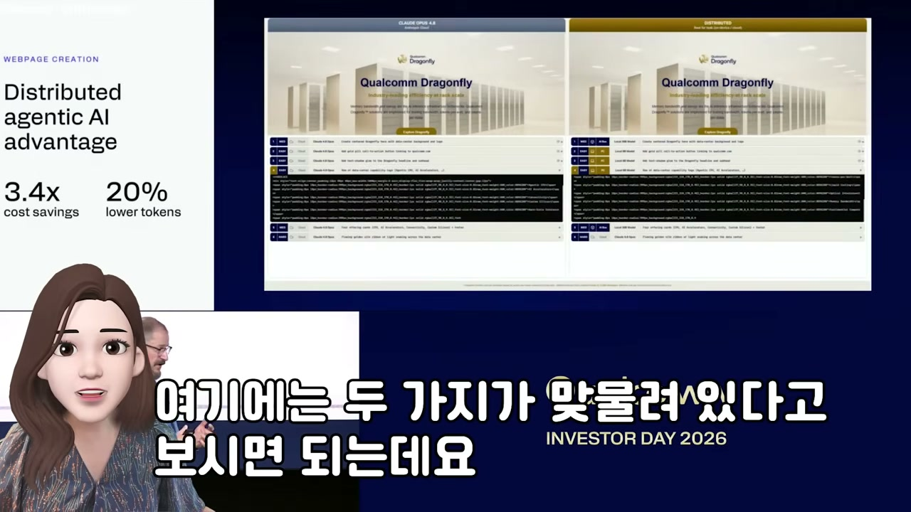

두 번째는 **절박함**입니다. 퀄컴의 매출은 여전히 성장세가 둔화된 스마트폰 시장에 크게 의존하고 있습니다. 새로운 성장 동력이 절실한 상황에서, 퀄컴은 데이터 센터 시장에서 활로를 찾기로 결정했습니다. 이러한 의지는 인베스터 데이에서 발표한 목표를 통해 명확히 드러납니다. 퀄컴은 2029년 회계연도까지 스마트폰을 제외한 비(非)핸드셋 부문 매출 목표를 400억 달러로 대폭 상향 조정했습니다. 이는 스마트폰 의존에서 벗어나 데이터 센터라는 새로운 무대에서 승부를 보겠다는 강력한 선언인 셈입니다.
<!-- /dig-section -->

<!-- dig-section: 269 -->
## AI 추론의 메모리 병목 현상과 HBM의 한계

AI가 텍스트를 생성하는 과정은 크게 두 단계로 나뉩니다. 첫 번째는 사용자의 질문을 이해하는 '프리필(Prefill)' 단계이고, 두 번째는 그 이해를 바탕으로 답변을 만들어내는 '디코드(Decode)' 단계입니다. 특히 디코드 단계의 작동 방식과 그로 인한 비효율성은 현재 AI 하드웨어의 가장 큰 과제를 낳았고, 이것이 바로 '메모리 월(Memory Wall)' 문제입니다.

### AI 텍스트 생성의 두 단계: 프리필과 디코드

AI가 글을 만드는 과정은 크게 두 부분으로 구성됩니다.

1.  **프리필 (Prefill) 단계:** 이 단계에서는 사용자가 입력한 프롬프트(질문, 텍스트, 이미지 등) 전체를 한 번에 읽고 그 의미와 문맥, 토큰 간의 관계를 파악합니다. 마치 시험 문제를 풀기 전에 문제지 전체를 한 번 훑어보는 것과 같습니다. 이 작업은 입력된 모든 토큰을 병렬로 동시에 처리할 수 있어, GPU의 막대한 병렬 연산 능력을 효율적으로 활용할 수 있습니다. 그래서 덩치 큰 계산을 한 번에 끝낼 수 있습니다.

2.  **디코드 (Decode) 단계:** 프리필 단계에서 질문을 이해하고 나면, AI는 답변을 생성하기 시작합니다. 이때 AI는 한 번에 전체 문장을 만들어내는 것이 아니라, 한 글자씩, 정확히는 '한 토큰'씩 순차적으로 생성합니다. 바로 직전에 생성한 토큰을 바탕으로 다음에 올 가장 확률 높은 토큰을 예측하고, 그 결과를 다시 다음 토큰 예측에 사용하는 방식입니다. 이를 '자기회귀(Autoregressive)' 방식이라고 부르며, 마치 도미노처럼 하나씩 순서대로 쓰러지는 구조입니다. 문제는 바로 이 순차적인 디코드 단계에서 발생합니다.

### 디코드 단계의 병목: 메모리 월

디코드 단계는 본질적으로 매우 비효율적인 작업을 반복해야 합니다. 토큰 하나를 생성할 때마다 AI는 메모리에서 두 가지 거대한 데이터를 매번 다시 불러와야 합니다.

*   **모델 가중치 (Model Weights):** AI가 학습한 모든 지식이 담겨있는 수백 기가바이트(GB)에 달하는 데이터 덩어리입니다. AI는 토큰 하나를 만들 때마다 이 거대한 지식 전체를 처음부터 끝까지 훑어봐야 합니다. 비유하자면, 글자 하나를 쓰기 위해 수백 권짜리 백과사전 전집을 매번 완독하는 것과 같습니다.
*   **KV 캐시 (KV Cache):** 지금까지 대화한 내용의 핵심 정보를 저장해두는 '메모장'입니다. 대화가 길어질수록 이 메모장의 내용도 점점 늘어납니다. AI는 문맥을 잃지 않기 위해 다음 토큰을 생성할 때마다 이 KV 캐시도 함께 읽어야 합니다.

이 과정의 진짜 문제는 계산 자체가 아니라 '데이터를 읽어오는 시간'입니다. 최신 GPU는 토큰 하나를 계산하는 연산 자체는 순식간에 끝낼 수 있지만, 수백 GB의 가중치와 계속 커지는 KV 캐시를 메모리에서 GPU로 가져오는 데 대부분의 시간을 허비합니다. 영상의 표현을 빌리자면 "계산기는 노는데, 책 나르느라 바쁜" 전형적인 '데이터 병목' 현상입니다.

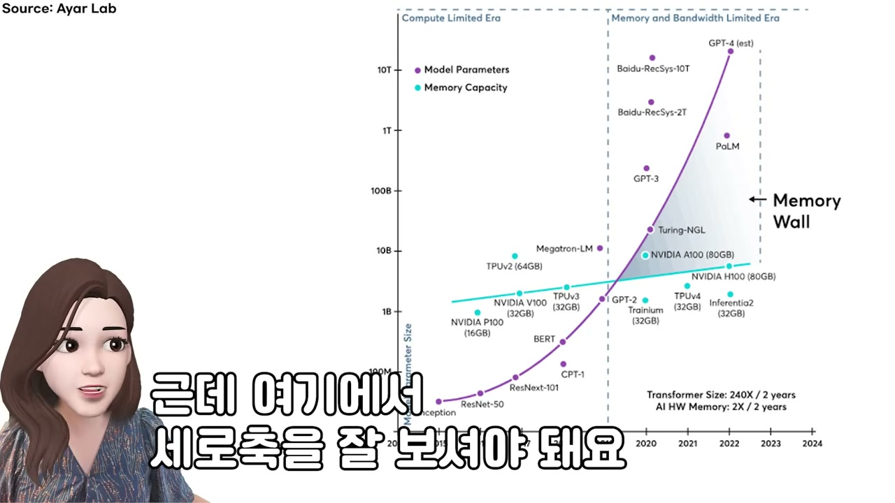

이것이 바로 반도체 업계가 수십 년간 씨름해 온 '메모리 월' 문제입니다. AI 모델의 크기(그래프의 보라색 선)는 매년 기하급수적으로, 거의 10배씩 폭발적으로 증가해왔습니다. 하지만 데이터를 공급하는 메모리의 속도와 용량(하늘색 선)은 그 성장세를 따라가지 못하면서 둘 사이의 격차가 극심하게 벌어졌습니다. 결국 AI 성능의 발목을 잡는 것은 더 이상 '얼마나 빨리 계산하느냐'가 아니라 '데이터를 얼마나 제때 가져오느냐'가 된 것입니다. 이 문제를 해결하기 위한 궁여지책으로 나온 것이 바로 HBM(고대역폭 메모리)입니다. HBM은 극단적으로 비싸고 수율이 낮지만, 폭증하는 모델의 계산량을 감당할 유일한 방법이었기에 어쩔 수 없이 채택되었습니다.

### 작은 배치 크기의 비효율성

디코드 단계의 비효율성은 또 다른 문제도 야기합니다. AI 서버는 여러 사용자의 요청을 한 번에 묶어서 처리하는 '배치(Batch)' 방식을 사용할 때 가장 효율적입니다. 식당에서 여러 테이블의 주문을 모아 한 번에 조리하는 것과 같습니다.

하지만 챗봇처럼 실시간 응답이 중요한 서비스에서는 사용자를 오래 기다리게 할 수 없어 요청을 많이 모으지 못하고 작은 묶음(낮은 배치)으로 처리해야 합니다. 이 경우, 비싼 GPU의 연산 능력 중 아주 일부만 사용하고 나머지는 낭비하게 됩니다. 게다가 데이터를 처리하는 시간은 대부분 메모리에서 데이터를 가져오는 데 쓰이므로, GPU는 대부분의 시간을 제대로 활용되지 못한 채 대기하게 됩니다.

### 새로운 접근법: 분리형 추론

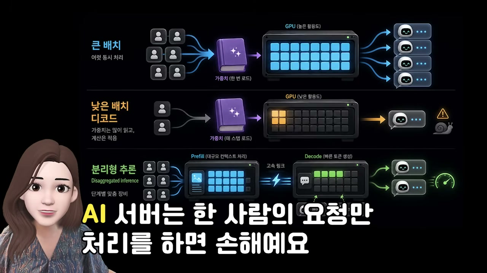

이러한 문제들 때문에 최근 AI 하드웨어 업계는 발상을 전환하고 있습니다. 성격이 전혀 다른 프리필과 디코드 작업을 하나의 칩에 모두 맡기는 대신, 각 작업에 최적화된 별도의 전문 장비를 사용하자는 것입니다. 이를 '분리형 추론(Disaggregated Inference)'이라고 부릅니다.

*   **프리필:** 대규모 병렬 연산이므로 기존처럼 강력한 GPU가 담당합니다.
*   **디코드:** 메모리 접근이 병목이므로, 계산 능력은 조금 낮더라도 데이터 이동에 특화된 전용 칩이 담당합니다.

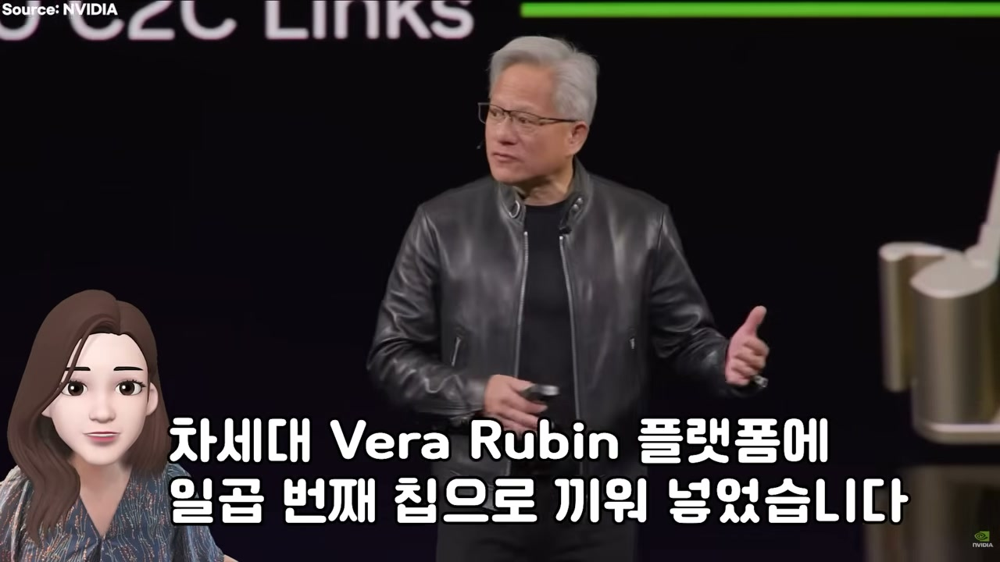

이 흐름을 가장 상징적으로 보여준 것이 업계 1위인 NVIDIA의 행보입니다. NVIDIA는 디코드 전용 칩을 만들던 '그록(Groq)'이라는 회사의 기술을 사실상 흡수하여, 차세대 '베라 루빈(Vera Rubin)' 플랫폼에 그록의 칩을 디코드 전용으로 탑재했습니다. GPU의 황제인 NVIDIA조차 디코드 작업만큼은 자신들의 GPU만으로는 감당이 안 된다고 인정하고, 자존심을 굽혀 전용 칩을 도입한 것입니다. 이는 디코드 작업을 별도 하드웨어에 맡기는 것이 거스를 수 없는 대세임을 증명하는 사건입니다. 퀄컴의 HBC 또한 바로 이 지점, 즉 디코드 병목이라는 동일한 문제 인식에서 출발하지만, 다른 방식으로 해법을 제시하고 있습니다.
<!-- /dig-section -->

<!-- dig-section: 646 -->
## 퀄컴의 HBC: 데이터 이동량 감소를 통한 해법

퀄컴은 메모리 월 문제를 해결하기 위한 새로운 접근법으로 'HBC(High-Bandwidth Compute)'를 제시했습니다. HBM과 이름이 비슷해 새로운 메모리 규격으로 오해할 수 있지만, HBC는 메모리가 아닌 '컴퓨팅' 구조에 대한 개념입니다.

### 메모리 위에 연산을 쌓는 3D 적층 기술

HBC의 핵심을 이해하려면 먼저 반도체 제조 과정과 패키징 기술을 알아야 합니다. 반도체 칩(다이, Die)은 둥근 원판(웨이퍼)에서 피자 조각처럼 잘라내어 만듭니다. 전통적으로 이 다이들은 바닥에 평평하게 한 층으로 깔아서 사용했지만, 최근에는 발상을 전환하여 다이를 위로 차곡차곡 쌓아 올리는 '3D 적층' 기술이 주목받고 있습니다. 이는 마치 단독주택을 여러 채 짓는 대신, 같은 땅에 아파트를 높게 올리는 것과 같은 원리입니다.

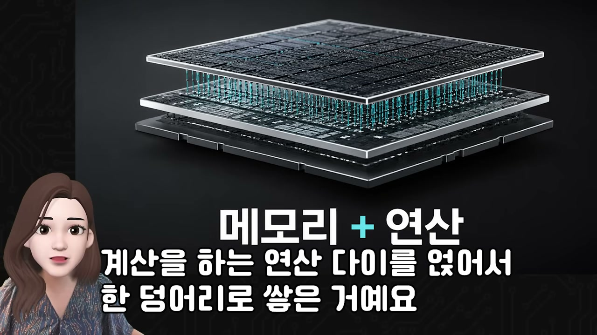

HBC는 바로 이 3D 적층 기술을 활용합니다. 데이터를 저장하는 메모리 다이 바로 위에, 계산을 수행하는 연산 다이를 수직으로 쌓아 올린 구조입니다. 이렇게 두 개의 다른 역할을 하는 층을 위아래로 정밀하게 이어 붙여 하나의 덩어리처럼 작동하게 만듭니다. 이 구조의 핵심은 '위치'입니다. 계산기를 메모리 바로 옆(정확히는 바로 위층)에 붙여놓음으로써 데이터 이동 거리를 극단적으로 줄이는 '니어 메모리 컴퓨팅(Near-Memory Computing)'을 구현한 것입니다.

### 메모리 월 해결법: 길을 넓히거나(HBM), 짐을 줄이거나(HBC)

이러한 구조를 만든 이유는 '메모리 월' 문제를 해결하기 위해서입니다. 기존 구조에서는 계산을 담당하는 GPU와 데이터를 저장하는 메모리(DRAM)가 멀리 떨어져 있어, 데이터를 꺼내와 GPU로 보내고, 계산 결과를 다시 메모리로 가져오는 과정을 반복해야 했습니다. 이 과정에서 데이터가 오가는 통로를 쉴 새 없이 왕복하며 시간을 허비하는 문제가 발생합니다.

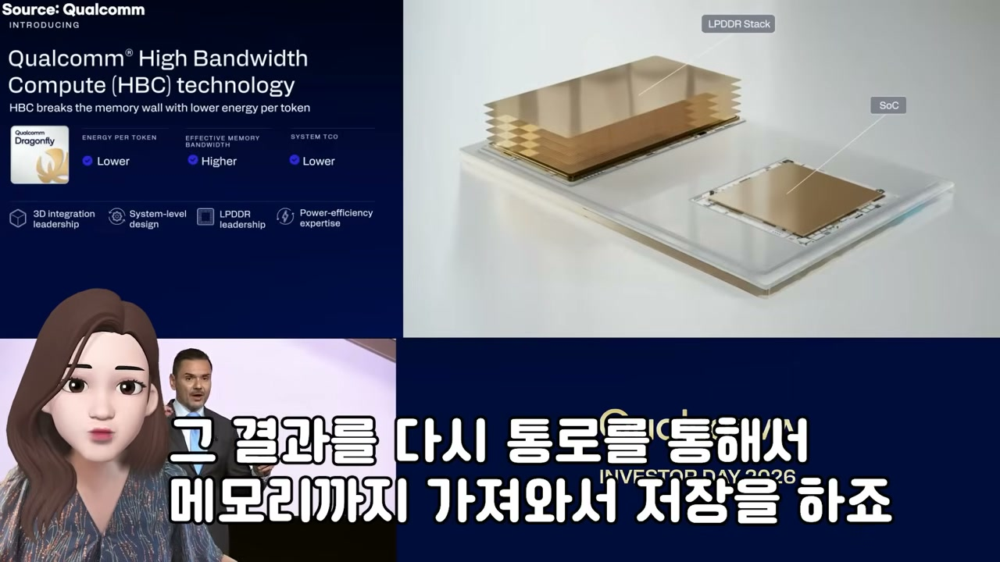

이 문제를 해결하기 위해 HBM은 데이터가 다니는 통로 자체를 2차선에서 16차선 도로처럼 아주 넓게 만들어, 한 번에 많은 데이터를 빠르게 전송하는 '길을 넓히는' 방식을 택했습니다.

반면 HBC는 전혀 다른 방식으로 접근합니다. 길을 넓히는 대신, 아예 '옮겨야 할 짐(데이터)의 양을 줄이자'는 생각입니다. 굳이 멀리 있는 GPU까지 데이터를 보낼 필요 없이, 가벼운 계산은 메모리 바로 위에 붙어있는 연산 다이가 그 자리에서 바로 처리해버리는 것입니다. 비유하자면, 공장에서 자잘한 부품들을 조립하기 위해 멀리 있는 라인까지 보내지 않고, 창고 앞에서 바로 조립할 수 있는 건 다 처리한 뒤 꼭 필요한 완성품만 골라서 보내는 것과 같습니다.

결국 HBM과 HBC는 메모리 월이라는 같은 문제를 두고, HBM은 '데이터를 더 빨리 보내는' 방향으로, HBC는 '옮길 데이터 자체를 줄이는' 방향으로 정반대의 해법을 내놓은 셈입니다.

### AI 250 가속기와 '유효' 대역폭의 함정

퀄컴이 HBC 1세대 기술을 탑재한 첫 제품은 AI 250 가속기 카드입니다. 이 카드의 주요 사양은 메모리 용량 768GB, 유효 메모리 대역폭은 초당 133TB에 달합니다. 이는 평범한 모바일 메모리를 사용했던 이전 세대 AI 200 카드와 비교하면 유효 대역폭이 무려 18배나 향상된 엄청난 수치입니다. HBC라는 새로운 구조를 도입한 것만으로 세대 간 성능이 비약적으로 상승한 것입니다.

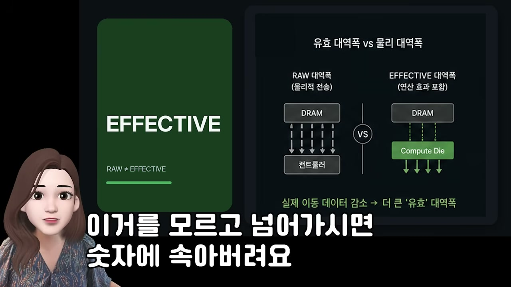

하지만 여기서 '유효(Effective)' 대역폭이라는 개념을 정확히 이해해야 합니다. 133TB/s는 메모리에서 실제로 물리적으로 데이터를 전송한 속도(Raw 대역폭)가 아닙니다. HBC 구조 덕분에 연산 다이가 메모리 옆에서 미리 계산을 처리함으로써, 굳이 외부로 보낼 필요가 없었던 데이터의 양까지 '이만큼의 일을 한 셈이다'라고 환산하여 합친 값입니다. 즉, 실제로 길을 통과한 데이터 양이 아니라, 연산 효과를 포함해 가상으로 계산한 성능 지표인 것입니다. 따라서 HBM의 실제 물리적 대역폭(Raw) 수치와 HBC의 유효 대역폭(Effective) 수치를 놓고 단순 비교하는 것은 적절하지 않습니다. 애초에 측정하는 기준(자)이 다른 셈입니다.

### 다음 비교를 위한 기초: SRAM과 DRAM

HBC 구조를 보면 자연스럽게 비교할 만한 다른 기술이 떠오르는데, 바로 엔비디아가 인수한 그록(Groq)의 LPU(Language Processing Unit)입니다. 이 둘의 차이를 이해하려면, 먼저 메모리의 두 가지 주요 종류인 SRAM과 DRAM의 특징을 알아야 합니다.

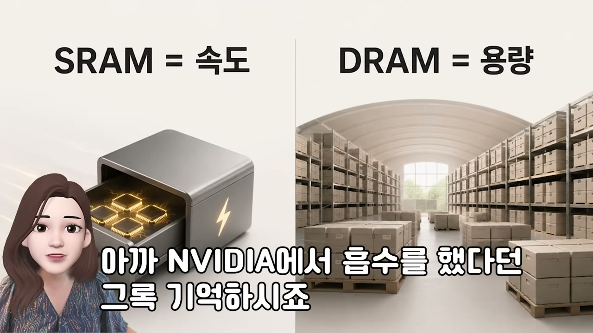

*   **DRAM**: 우리가 흔히 사용하는 메모리로, 용량이 크고 가격이 저렴한 대신 상대적으로 속도가 느립니다. '용량'에 집중한 메모리입니다.
*   **SRAM**: 정반대로, 가격이 매우 비싸고 용량도 작지만, 반응이 즉각적이고 속도가 엄청나게 빠릅니다. '속도'에 특화된 메모리입니다.

쉽게 말해 '빠르지만 작은 SRAM'과 '느리지만 큰 DRAM'으로 구분할 수 있습니다. 속도의 SRAM과 용량의 DRAM, 둘 중 무엇을 택하느냐에 따라 칩의 성격이 완전히 달라집니다.
<!-- /dig-section -->

<!-- dig-section: 1073 -->
## HBC, Groq LPU, 삼성 PIM/PNM 비교

AI 추론 병목 문제를 해결하기 위한 접근 방식은 크게 두 가지로 나뉩니다. 바로 속도를 중시하는 SRAM과 용량을 중시하는 DRAM 중 무엇을 택할 것인가의 갈림길입니다. 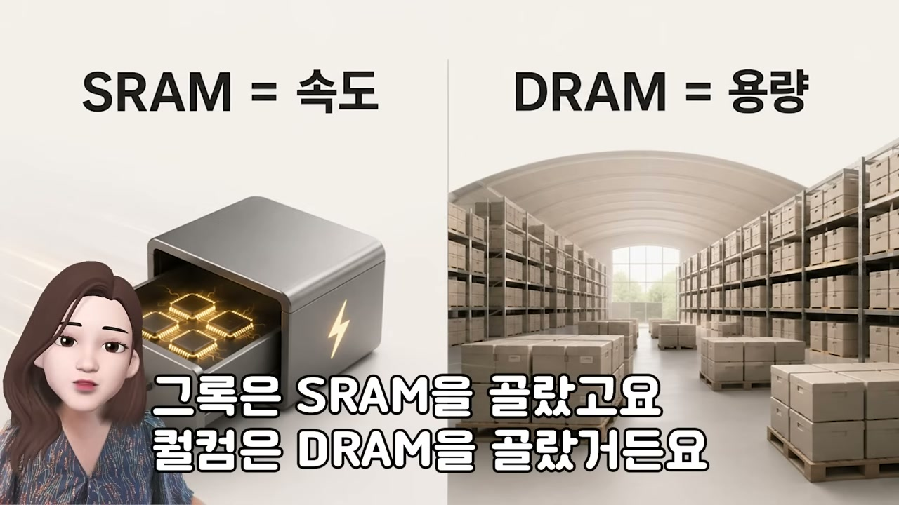 그록(Groq)은 전자인 SRAM을, 퀄컴은 후자인 DRAM을 선택하며 각기 다른 해법을 제시했습니다.

### 그록(Groq)의 선택: 압도적이고 일관적인 속도

그록은 LPU(Language Processing Unit)의 핵심으로 SRAM을 채택하며 '속도'에 모든 것을 걸었습니다. 이들이 속도에 얼마나 진심인지는 LPU 시스템의 구성에서 명확히 드러납니다.

-   **물량 공세**: 칩 하나에 500MB의 빠른 SRAM을 탑재하고, 이 칩을 하나의 랙(Rack)에 256개나 집적했습니다.
-   **경이로운 대역폭**: 그 결과 랙 전체의 SRAM 대역폭은 초당 40페타바이트(PB/s)에 달합니다. 1페타바이트가 1,000테라바이트(TB)임을 감안하면, 그야말로 '미친 듯이 빠르다'고 표현할 수 있는 수준입니다. 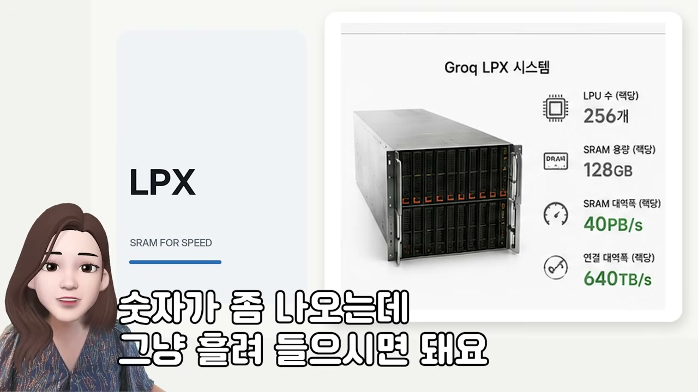

하지만 그록의 진짜 무기는 단순히 빠르다는 점이 아닙니다. 바로 **한결같이 빠르다**는 점, 즉 '일관성'입니다. SRAM을 연산기(계산기) 바로 옆에 두는 것은, 필요한 데이터를 항상 책상 위에 올려두고 손만 뻗어 즉시 사용하는 것과 같습니다. 서랍을 열고 찾는 과정(DRAM에서 데이터를 가져오는 과정)이 생략되므로 지연 시간이 없습니다.

여기에 그록의 컴파일러 기술이 더해집니다. 컴파일러(소프트웨어)가 전체 실행 순서를 미리 완벽하게 계획하여 언제 어떤 데이터를 가져올지 모두 짜놓습니다. 덕분에 응답 속도가 변덕스럽게 변하지 않고, 마치 시계 초침처럼 또박또박 일정한 속도를 유지합니다. 업계 용어로 '지터(Jitter)', 즉 속도의 떨림이 없는 것이 그록이 내세우는 핵심 강점입니다.

#### 작업 분담을 통한 효율 극대화

그렇다고 그록의 LPX가 모든 작업을 혼자 처리하는 것은 아닙니다. 엔비디아의 GPU와 협력하여 역할을 분담합니다.

-   **Rubin GPU**: 큰 그림을 그리고 전체적인 연산을 처리하는 무거운 작업(Prefill, Decode Attention)을 담당합니다.
-   **LPX (LPU)**: 전체 작업 중에서도 0.1초라도 지체되면 응답 품질이 저하되는 매우 급하고 시간 민감적인 부분만 맡아서 처리합니다. 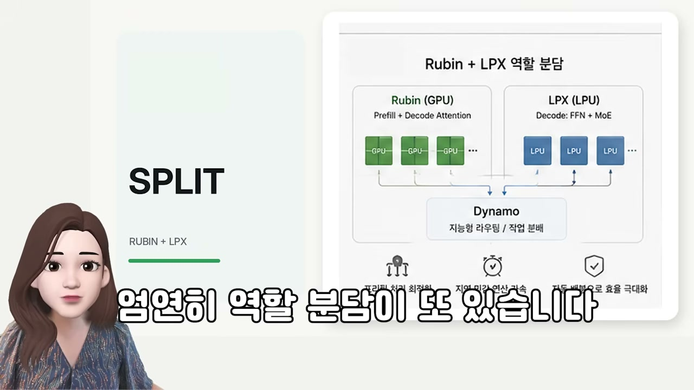

LPX가 전담하는 '급한 부분'은 주로 FFN(Feed-Forward Network)과 MoE(Mixture of Experts) 같은 작업입니다. FFN은 모델이 답을 내기 전 정보를 한 번 더 곱씹어 다듬는 추가 사고 과정이며, MoE는 여러 분야별 전문가 모델 중 질문에 가장 적합한 전문가를 불러 쓰는 방식입니다. 두 작업 모두 응답의 마지막 단계에서 매끄러운 결과물을 위해 순식간에 처리되어야 하므로, 속도가 생명인 LPX에게 맡겨진 것입니다. 이러한 작업 분배는 사람이 일일이 지정하는 것이 아니라, '다이나모(Dynamo)'라는 관리 소프트웨어가 교통정리를 하듯 알아서 최적으로 나눠줍니다.

### 퀄컴의 선택: 용량과 효율성으로 우회

퀄컴 역시 동일한 문제에 직면했지만, 그록과는 정반대의 해법을 내놓았습니다. 바로 용량을 선택한 것입니다. 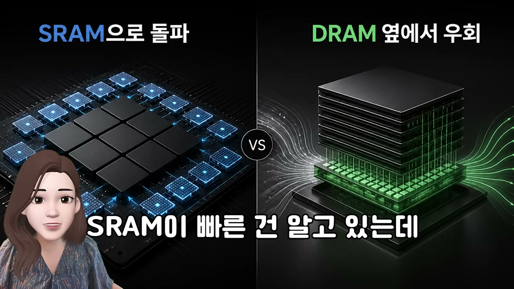

퀄컴은 SRAM이 빠르다는 것을 알았지만, 물리적으로 자리를 너무 많이 차지하고 비싸서 거대한 AI 모델 전체를 올리기에는 용량이 부족하다고 판단했습니다. 그래서 퀄컴은 다음과 같은 전략을 선택했습니다.

1.  **DRAM 채택**: 빠르지만 작은 SRAM을 수백 개 묶는 대신, 조금 느리더라도 데이터를 왕창 담을 수 있는 대용량 DRAM을 기반으로 삼았습니다.
2.  **HBC 기술**: DRAM 바로 옆에 연산기(계산기)를 붙여 데이터 이동 거리를 극단적으로 줄였습니다. 이것이 바로 퀄컴의 HBC(High Bandwidth Compute) 기술입니다.

즉, 속도를 약간 양보하는 대신 용량을 확보하고, 최소화된 데이터 이동을 통해 속도 손해를 만회하는 전략입니다. 이는 메모리 다이 위에 연산 다이를 쌓는 구조로, 삼성전자의 PNM(Processor-Near-Memory)과 유사한 철학을 공유합니다.

결론적으로 그록은 SRAM의 압도적인 속도로 병목을 정면 돌파하려 했고, 퀄컴은 DRAM의 용량을 지키면서 데이터 이동을 줄이는 방식으로 문제를 우회한 것입니다. 어느 쪽이 맞고 틀린 것이 아니라, 같은 문제를 푸는 철학의 차이입니다.

#### 퀄컴의 성능 지표: 함정을 주의하라

퀄컴은 HBC 기술을 홍보하며 두 가지 인상적인 수치를 제시했습니다.

-   HBM 대비 와트당 대역폭 **6배**
-   SRAM 대비 와트당 용량 **200배**

언뜻 보면 엄청난 성능 향상 같지만, 여기에는 해석의 주의가 필요합니다. '200배'라는 숫자를 보고 HBC가 200배 빠르다고 생각하면 완전히 틀린 것입니다.

-   **비교 기준의 차이**: 6배는 카드 한 장, 200배는 랙 전체를 기준으로 측정되어 재는 단위가 다릅니다.
-   **비교 항목의 차이**: 6배는 '대역폭'(속도)에 관한 이야기지만, 200배는 '용량'에 관한 이야기입니다.

따라서 '200배'의 의미는 "같은 전력으로 200배 더 많은 용량을 담을 수 있다"는 뜻이지, 속도가 200배 빠르다는 의미가 결코 아닙니다. 비교하는 항목과 기준이 다르므로 수치를 곧이곧대로 받아들여서는 안 됩니다.
<!-- /dig-section -->

<!-- dig-section: 1306 -->
## 퀄컴 드래곤플라이 플랫폼의 전체 그림 (CPU 및 소프트웨어)

퀄컴 드래곤플라이 플랫폼에서 HBC(High Bandwidth Compute)는 핵심 기술 중 하나이지만, 이 발표의 진정한 의미를 이해하려면 서버용 CPU 'C1000'과 소프트웨어 전략까지 함께 살펴봐야 합니다. 퀄컴은 하드웨어부터 소프트웨어, 그리고 주요 고객사 확보까지 아우르는 거대한 청사진을 제시했습니다.

### 퀄컴의 주장에 대한 검증

영상에서는 먼저 퀄컴이 HBC 기술을 통해 달성했다는 '6배의 전력당 대역폭'과 '200배의 전력당 용량'이라는 수치에 대해 주의를 환기시킵니다. 이 숫자들은 제3자가 동일한 조건에서 경쟁 제품과 비교하여 측정한 독립적인 벤치마크 결과가 아닙니다. 퀄컴이 경쟁사의 제품 사양서를 바탕으로 직접 계산한 '추정치'이며, 심지어 HBC 제품 자체가 아직 출시되지도 않았기 때문에 이는 검증된 사실이 아닌 퀄컴의 '주장'이라고 봐야 합니다. 따라서 이 수치들은 앞으로 주의 깊게 지켜봐야 할 목표치에 가깝습니다.

### 메모리 근접 처리: 새로운 개념이 아니다

데이터를 저장하는 메모리와 이를 계산하는 연산 장치(프로세서)를 최대한 가깝게 붙여 데이터 이동을 줄이고 효율을 높이자는 아이디어는 사실 퀄컴이 처음 제시한 것이 아닙니다. 삼성전자는 이미 수년 전부터 이와 관련된 기술을 연구하고 공개해왔습니다.

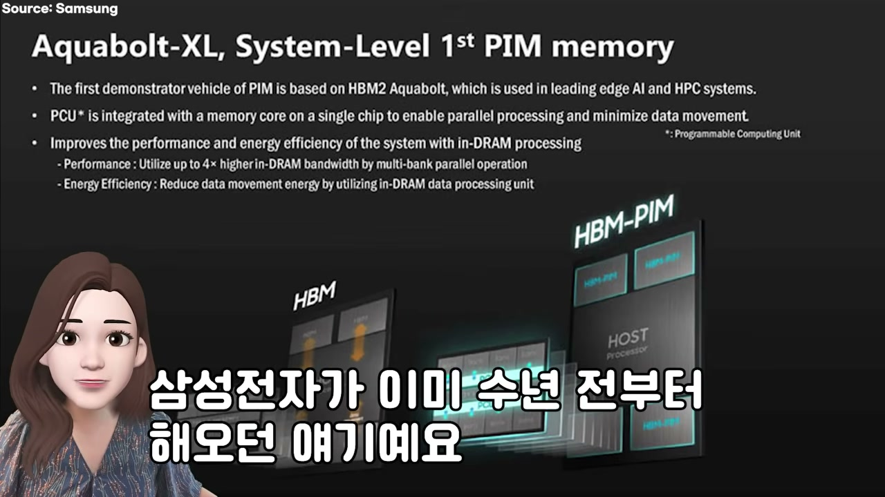

삼성은 HBM-PIM, LPDDR5-PIM과 같은 이름으로 '메모리 근접 처리' 기술을 선보였습니다. 여기서 **PIM(Processing-In-Memory)**은 말 그대로 메모리 안에서 직접 연산을 수행한다는 의미입니다. AI 모델이 다음 단어를 생성하는 '디코드(Decode)' 과정에서 반복적으로 발생하는 자잘하고 가벼운 계산들을 굳이 멀리 있는 CPU나 GPU까지 보내지 않고, 데이터가 저장된 메모리 칩 안에서 바로 처리하여 병목 현상을 해결하려는 시도입니다. 이는 퀄컴이 HBC를 통해 풀려는 문제와 정확히 일치합니다.

### HBC, PIM, PNM: 위치의 차이

이 기술들은 연산 장치를 어디에 두느냐에 따라 미묘한 차이를 보입니다.

*   **PIM (Processing-In-Memory)**: 삼성전자가 구현한 방식으로, 데이터 저장을 담당하는 D램 칩 '내부'에 연산 회로를 함께 심는 구조입니다.
*   **HBC (High Bandwidth Compute)**: 퀄컴의 방식으로, 메모리 다이(Die)와 연산 다이를 따로 만든 후, 두 칩을 '위아래'로 쌓아 붙이는 3D 스태킹 구조입니다.
*   **PNM (Processing-Near-Memory)**: 삼성이 연구한 또 다른 방식으로, 연산 장치를 메모리 칩 '옆'에 두는 방식입니다.

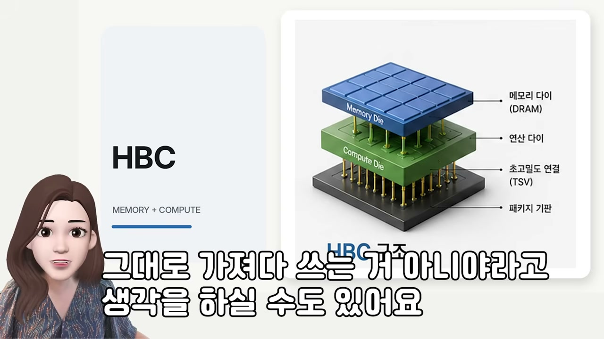

결국 세 기술 모두 '계산기를 메모리에 최대한 가깝게 붙이자'는 동일한 방향성을 가집니다. 퀄컴의 HBC가 삼성의 기술을 그대로 가져다 쓴 것이냐는 질문에 대해, 영상에서는 단정하기 어렵다고 말합니다. 구조적으로는 별도의 연산 칩을 쓴다는 점에서 PNM에 더 가깝지만, 퀄컴이 어떤 종류의 메모리를 누구에게 공급받아 구현하는지 등 핵심 정보가 빠져있기 때문입니다. 따라서 '방향은 같지만, 구현 방식은 퀄컴의 독자적인 구조'라고 정리할 수 있습니다.

### 더 큰 그림: 드래곤플라이 플랫폼의 핵심

HBC는 퀄컴이 구상하는 '드래곤플라이(Dragonfly)'라는 거대 플랫폼의 한 조각에 불과합니다. 드래곤플라이는 AI 가속기, 네트워크, CPU, 메모리, 소프트웨어를 모두 묶은 서버용 풀세트 솔루션이며, 그 중심에는 퀄컴이 직접 설계한 서버용 CPU **'C1000'**이 있습니다.

C1000은 퀄컴이 인수한 팹리스 회사 '누비아(Nuvia)'의 '오라이언(Oryon)' 코어를 기반으로 하며, 250개가 넘는 코어를 탑재했습니다. 놀라운 점은 전력 효율입니다. 퀄컴은 스마트폰 칩을 만들며 축적한 저전력 설계 노하우를 데이터센터 CPU에 적용하여, 경쟁사 대비 '전력당 성능이 2배'라고 주장합니다. 이는 작은 배터리로 하루 종일 작동해야 하는 스마트폰의 극한 환경에서 단련된 기술을 데이터센터로 가져온 것입니다.

또한 C1000은 PCIe 7세대, CXL 등 최신 연결 규격을 지원하여 단순히 연산만 하는 CPU가 아니라, 여러 AI 가속기들에게 일감을 분배하고 관리하는 '관제탑' 역할을 수행하도록 설계되었습니다.

### 소프트웨어 전략: CUDA에 대한 정면 도전

하드웨어만으로는 AI 시장을 장악할 수 없습니다. 엔비디아의 진짜 힘이 칩이 아닌 '쿠다(CUDA)'라는 소프트웨어 생태계에 있는 것처럼, 퀄컴 역시 소프트웨어의 중요성을 인지하고 과감한 투자를 단행했습니다.

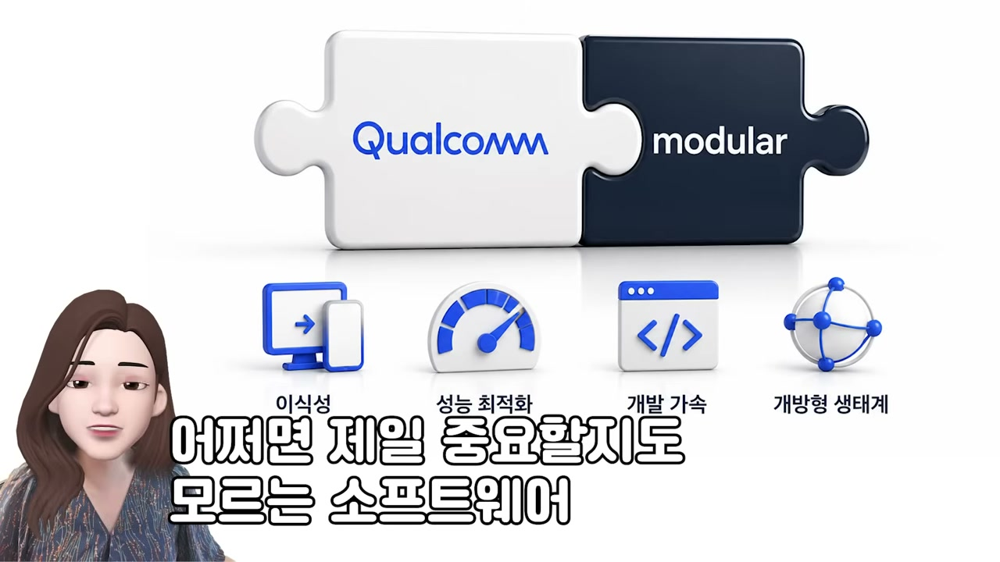

퀄컴은 AI 소프트웨어 회사 '모듈러(Modular)'를 약 39억 달러어치의 주식으로 인수했습니다. 모듈러는 일종의 '통역사' 같은 역할을 합니다. 개발자가 CPU, GPU, NPU 등 하드웨어 종류에 상관없이 AI 모델 코드를 한 번만 작성하면, 모듈러의 소프트웨어가 각 하드웨어에 맞게 최적화하여 실행해 줍니다. 이는 특정 하드웨어에 종속되지 않는 개방형 생태계를 만들겠다는 의지로, 사실상 엔비디아의 CUDA에 정면으로 도전장을 내민 것입니다. 여기에 더해, AI 모델 공유 플랫폼인 허깅페이스(Hugging Face)와의 협력도 발표하며 개발자들이 손쉽게 모델을 올릴 수 있도록 지원할 계획입니다.

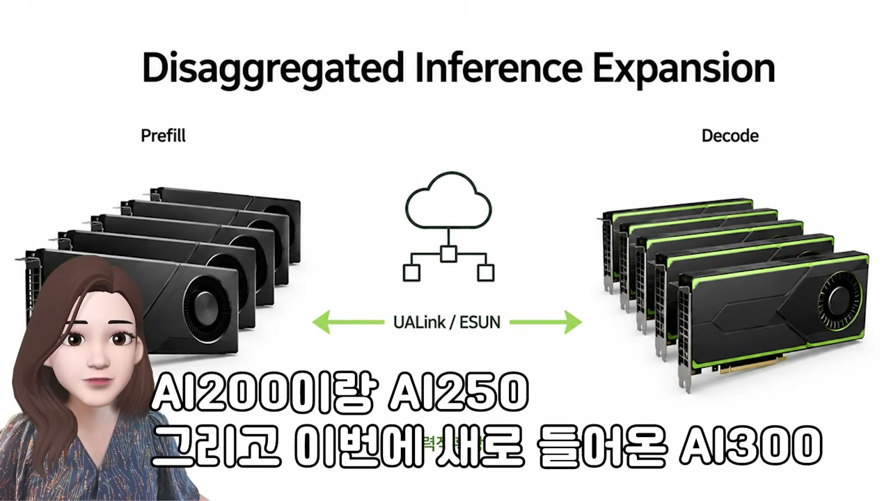

가속기들을 연결하는 방식에서도 퀄컴은 엔비디아의 독점 기술인 NVLink 대신 UALink, ESUN과 같은 개방형 규격을 택했습니다. 이는 고객사들이 특정 회사 기술에 종속될 걱정 없이 자유롭게 시스템을 구성할 수 있게 하는 매력적인 카드가 될 수 있습니다.

### 강력한 고객 확보와 미래의 과제

이러한 퀄컴의 청사진은 단순한 선언에 그치지 않았습니다. 이미 굵직한 고객들을 확보하며 시장에 강력한 신호를 보냈습니다.

*   **CPU (C1000)**: **메타(Meta)**가 차세대 서버에 사용하겠다고 마크 저커버그가 직접 발표했습니다.
*   **HBC**: **마이크로소프트(Microsoft)**가 자사 클라우드 서비스인 애저(Azure)에 도입하기로 했습니다.
*   **맞춤형 칩**: **바이트댄스(ByteDance)**와의 공급 계약을 발표했습니다.

서버 시장의 후발주자치고는 매우 성공적인 출발입니다. 다만 주의할 점도 있습니다. 첫째, 이들 제품의 실제 양산 시점은 2028년 하반기로, 아직 시간이 많이 남은 미래의 약속이라는 점입니다. 둘째, '2배의 성능' 같은 수치들은 현재가 아닌 2028년의 경쟁 제품들과 비교해야 하므로, 그사이 인텔이나 AMD가 얼마나 발전할지는 미지수입니다.

한국 기업인 삼성전자와 SK하이닉스에 대한 직접적인 공급 계약은 발표되지 않았습니다. 퀄컴이 공개한 35곳의 협력사 명단에 SK하이닉스 아메리카, 삼성SDS 등은 포함되어 있지만, 이것이 HBC 메모리 납품을 의미하는 것은 아니므로 섣부른 기대는 금물입니다.
<!-- /dig-section -->

<!-- dig-section: 1939 -->
## 한국 메모리 기업의 역할 및 AI 메모리 시장의 변화

단순히 누가 수주를 했냐는 단기적인 관점을 넘어, HBC(Hybrid Bonding Compute)라는 기술이 요구하는 능력의 본질이 한국 메모리 기업들이 가장 잘하는 분야와 정확히 겹친다는 점이 핵심입니다. 이는 AI 시대의 반도체 패권이 왜 한국으로 기울 수밖에 없는지에 대한 구조적인 이유를 설명합니다.

### HBC, 기술의 집약체

HBC는 단순히 D램을 잘 만드는 것만으로는 구현할 수 없는 복합적인 기술의 결정체입니다. 여러 층의 칩을 위아래로 쌓아 올리는 과정은 말처럼 간단하지 않으며, 매우 까다로운 여러 기술을 필요로 합니다.

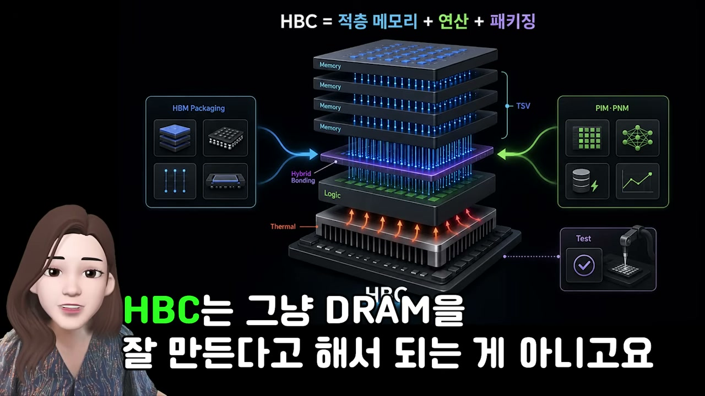

HBC의 구조를 살펴보면 그 복잡성을 알 수 있습니다.
*   **메모리 칩과 로직(계산) 칩:** 데이터를 저장하는 여러 층의 메모리 칩과 그 아래에 연산을 담당하는 로직 칩이 결합됩니다.
*   **TSV(실리콘 관통 전극):** 이 두 종류의 칩을 연결하기 위해 머리카락보다 가는 수천 개의 미세한 수직 통로(구멍)를 뚫어 전기적으로 연결합니다.
*   **하이브리드 본딩:** 각 칩을 거의 맞붙이다시피 정밀하게 접합하는 첨단 패키징 기술입니다.
*   **방열 설계:** 칩을 높게 쌓을수록 내부에서 발생하는 엄청난 열을 효율적으로 빼내는 설계가 필수적입니다.
*   **테스트 공정:** 이 모든 과정을 거쳐 완성된 칩에 불량이 있는지 검사하는 공정까지, 모든 요소가 하나의 패키지로 완벽하게 통합되어야 비로소 하나의 HBC가 탄생합니다.

이처럼 HBC는 어마어마하게 어렵고 정교한 기술이기 때문에 아무나 할 수 있는 영역이 아닙니다.

### 한국 기업의 강점과 정확히 일치

놀랍게도 이 어려운 기술들을 세계에서 가장 잘하는 기업이 바로 한국 기업들입니다.
*   **첨단 패키징(SK하이닉스):** 칩을 정밀하게 쌓고 붙이는 기술은 SK하이닉스가 HBM을 수년간 개발하며 세계 최고 수준으로 끌어올린 주특기입니다.
*   **메모리 내 연산(삼성전자):** 메모리 칩 안에 연산 기능을 넣는 노하우는 삼성전자의 PIM(Processing-in-Memory)과 PNM(Processing-near-Memory) 기술 그 자체입니다.

결국 HBC가 요구하는 핵심 역량들이 SK하이닉스와 삼성전자의 전문성과 정확히 포개지는 것입니다.

### 메모리, 연산의 무대가 되다

더 큰 흐름에서 보면, 메모리의 역할 자체가 근본적으로 변하고 있습니다. 과거 메모리는 단순히 데이터를 담아두는 그릇(Storage)에 불과했습니다. 하지만 AI가 폭발적인 컴퓨팅 파워를 요구하면서, 데이터를 연산 장치까지 멀리 옮기는 데 드는 비용과 시간이 감당할 수 없는 수준에 이르렀습니다. 이로 인해 연산을 데이터가 있는 곳으로 가져오는, 즉 메모리 안에서 직접 연산을 수행하는(Compute) 흐름이 가속화되고 있습니다.

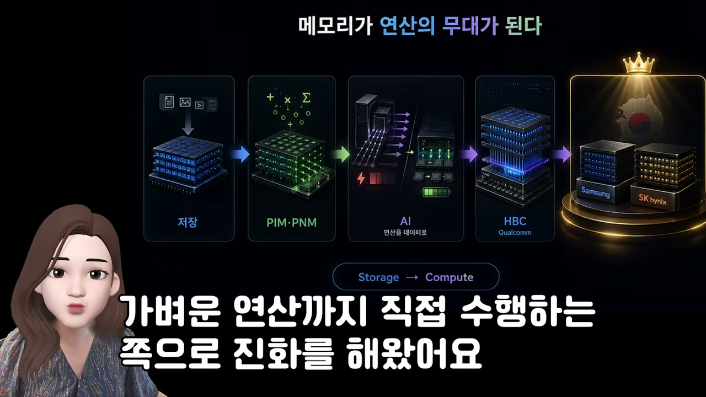

가속기 전문 회사인 퀄컴이 HBC를 데이터센터 전략의 핵심으로 내세운 것은 이러한 변화를 상징하는 중요한 사건입니다. 이는 이제 메모리가 곧 연산의 중심 무대가 되고 있다는 강력한 신호이며, 그 무대의 주연은 메모리를 가장 잘 만들고 가장 잘 쌓는 회사, 즉 삼성전자와 SK하이닉스가 될 수밖에 없다는 것을 의미합니다. 이것이 바로 메모리 주도권이 한국으로 기울고 있는 구조적인 이유입니다.

### 부품 공급사에서 코디자인 파트너로

이러한 변화는 메모리 회사의 위상 자체를 바꾸고 있습니다. 지금까지 메모리 회사는 칩 설계 회사가 정해준 규격에 맞춰 D램을 대량 생산해 납품하는 '부품 공급사', 즉 '을'의 위치에 가까웠습니다.

하지만 HBC와 같은 구조에서는 이 방식이 통하지 않습니다. 메모리 안에 연산 기능을 넣고 고객사의 가속기 설계에 맞춰 칩을 쌓아야 하므로, 메모리도 고객의 요구에 따라 완전히 다르게 설계되어야 합니다. "당신의 가속기에는 어떤 연산 기능을 얼마나 넣을까요?", "칩은 몇 층으로 쌓을까요?"와 같은 질문을 던지며 설계 단계부터 고객사와 함께 머리를 맞대고 논의해야 합니다.

이를 '코디자인(Co-Design)'이라고 하며, 이는 메모리 회사가 단순 부품 공급사에서 설계 단계부터 함께하는 핵심 '파트너'의 위치로 격상됨을 의미합니다.

AI 메모리 시장은 대규모 학습처럼 묵직한 범용 계산에는 여전히 HBM과 GPU 조합이 강세를 보이겠지만, 추론(Decode)과 같이 낮은 지연 시간과 효율이 중요한 작업에서는 SRAM, HBC, PIM 등 다양한 구조가 경쟁하는 구도로 재편되고 있습니다. 즉, 하나의 HBM 경쟁에서 작업 성격에 따라 메모리 구조를 골라 쓰는 다각화된 시장으로 진화하는 것입니다. 이는 한국 기업에게 더 많은 종류의 제품을 개발해야 하는 도전인 동시에, 더 넓어진 무대에서 활약할 수 있는 거대한 기회이기도 합니다.
<!-- /dig-section -->

<!-- dig-section: 2172 -->
## Conclusion

화려한 발표 뒤에 숨은 현실과 AI 반도체 시장의 미래를 냉정하게 짚어보는 부분입니다. 발표자는 '김치국부터 마시지 않도록' 몇 가지 중요한 현실을 점검해야 한다고 강조합니다.

### 현실 점검: 아직은 미래의 약속

가장 중요한 사실은 퀄컴이 발표한 기술들이 아직 실제로 검증된 완제품이 아니라는 점입니다. 발표는 화려했지만, 실제 제품은 아직 시장에 나오지 않았습니다.

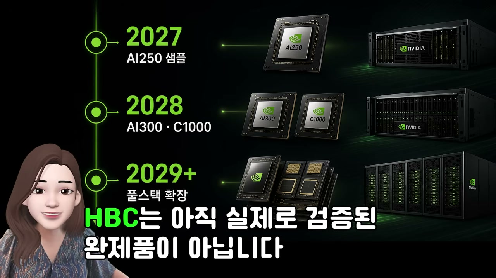

구체적인 출시 일정을 보면, 1세대 HBC 기술을 탑재한 AI250 샘플은 2027년 중반에야 나올 예정이며, 2세대 HBC를 적용한 AI300과 C1000 CPU는 2028년에 출시됩니다. 즉, 빨라야 1년 반, 길게는 2년 이상 남은 '미래의 약속'인 셈입니다.

### 검증되지 않은 주장과 베일에 싸인 세부 사항

발표에서 언급된 인상적인 숫자들 역시 신중하게 접근해야 합니다. 예를 들어 '133TB/s'라는 대역폭은 물리적 대역폭(physical bandwidth)이 아니라, 퀄컴이 주장하는 유효 대역폭(effective bandwidth)입니다. 또한 HBM보다 효율이 몇 배 높다는 등의 성능 자랑 역시 아직은 퀄컴의 자체 주장일 뿐, 제3자에 의한 독립적인 테스트와 검증을 거쳐야 합니다.

게다가 아직 공개되지 않은 중요한 정보들이 많습니다.
*   3D로 쌓은 칩에서 구체적으로 어떤 연산을 처리하는지
*   어떤 종류의 메모리를 사용하는지
*   심각해질 수 있는 발열 문제는 어떻게 해결할 것인지
*   복잡한 구조의 수율은 괜찮을지
*   소프트웨어가 여러 종류의 칩에 작업을 효율적으로 분배할 수 있는지
*   (많은 이들이 기대하는) 삼성의 기술을 사용했는지, SK하이닉스가 메모리 공급사로 확정되었는지에 대한 근거도 아직 없습니다.

따라서 현재로서는 기대를 하되, 사실관계를 냉정하게 구분하여 지켜봐야 합니다.

### AI 패러다임의 변화와 새로운 경쟁의 시작

물론 이 발표가 당장 엔비디아의 데이터센터 독점을 흔들지는 못할 것입니다. 하지만 더 큰 그림에서 중요한 신호를 보내고 있습니다. AI 시장의 중심이 대규모 모델을 '학습'시키는 것에서, 이미 학습된 모델을 활용해 '추론'하고 '에이전트'를 만드는 방향으로 이동하고 있다는 것입니다.

이러한 변화는 모든 작업을 GPU 하나에 떠넘기던 기존의 구조가 비효율적임을 의미하며, AI 시스템이 더 잘게 나뉘는 계기가 됩니다.
*   **프리필(Prefill)**: GPU 사용
*   **빠른 디코드(Decode)**: SRAM 사용
*   **대용량 디코드**: HBC와 PIM 같은 새로운 메모리 기술 사용

결과적으로 AI 반도체 경쟁의 본질이 바뀌고 있습니다. 과거에는 '가장 빠른 단일 칩'을 만드는 경쟁이었다면, 이제는 'CPU, 가속기, DRAM, SRAM 등 다양한 부품을 어떤 순서로 어떻게 배치해야 가장 적은 전력으로 가장 많은 토큰을 생성할 수 있는가'의 싸움, 즉 시스템 아키텍처 최적화 경쟁으로 넘어가고 있습니다.

이는 마치 잠자리(Dragonfly)가 네 개의 날개를 각기 따로 움직이면서도 하나로 협력하여 적은 힘으로 효율적으로 나는 것과 같습니다. 퀄컴의 드래곤플라이는 단순히 서버 시장에 발을 들이겠다는 선언이 아니라, AI 시장의 근본적인 변화에 맞춰 새로운 게임의 룰을 제시하려는 전략적 움직임으로 해석할 수 있습니다. 이 잠자리가 과연 얼마나 멀리 날아오를 수 있을지 지켜봐야 할 것입니다.
<!-- /dig-section -->
