<!-- dig-section: 0 -->
## The Ornith 1.0 Release and Initial Misconception

When Deep Reinforce announced Ornith 1.0 on June 25th, 2026, the internet framed it as a "cage match" against Claude Code. This perception pitted a brand-new, open-weight model against one of the industry's best coding tools. However, this head-to-head narrative was fundamentally flawed.

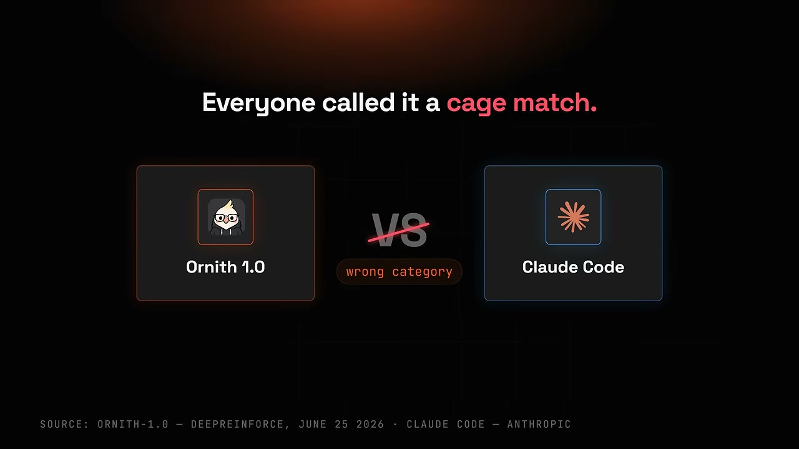

### A Self-Scaffolding Model

Ornith 1.0 is not just another coding model. It's an open-weight, MIT-licensed model with no regional locks, meaning anyone can download and run it on their own hardware. What truly sets it apart is a capability developed during its training: Ornith learned to write its own "scaffold." Instead of just generating code, it autonomously creates a plan, calls the necessary tools, inspects the results of its actions, and rewrites any part that fails.

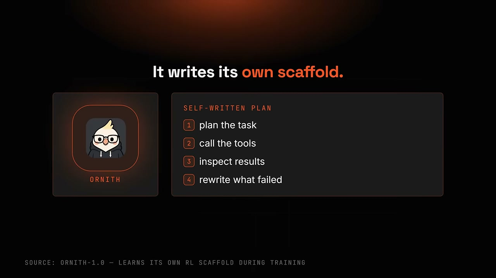

Most models require an external framework or explicit instructions on how to behave and structure their problem-solving process. Ornith, by contrast, figured out this "how" on its own. This led to a wave of speculation that if a model could scaffold itself, it would render external "agent harnesses" like Claude Code obsolete.

### A Brain and a Pair of Hands

This assumption is a category error. The relationship between Ornith and Claude Code isn't one of competition, but composition. The video presents a powerful analogy:
*   **Ornith is a brain.** It thinks, reasons, and plans. Its strength lies in its cognitive ability to devise a strategy for solving a problem.
*   **Claude Code is a pair of hands.** It acts, executing commands and interacting directly with your machine's environment. It's the mechanism that turns the brain's plan into tangible actions.

They operate on two different layers. One provides the intelligence, the other provides the interface to the real world. They are not the same kind of tool, and the idea of them fighting is a misunderstanding of their respective roles.

The ultimate proof of their complementary nature comes from the Ornith creators themselves. When Deep Reinforce benchmarked Ornith's performance, they ran it *inside* the Claude Code harness. They used Claude Code as the "hands" to execute the plans formulated by the Ornith "brain." They composed, they didn't compete.

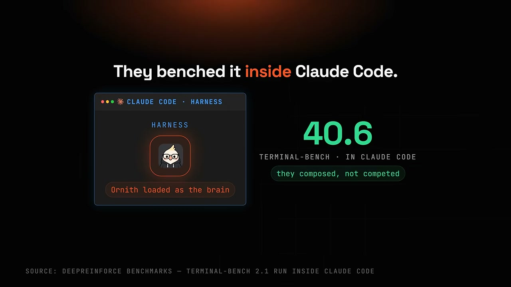

### A Family of Frontier Models

Ornith was released as a family of four models, scaling from a size that can run on a laptop to one that fills a data center:
*   **9B:** A dense model designed for a single GPU.
*   **31B:** A larger, dense workhorse model.
*   **35B:** A Mixture-of-Experts (MoE) model.
*   **397B:** The flagship model.

This flagship is a serious contender at the frontier of AI capabilities. On the SWE-Bench verified benchmark, it scored 82.4, effectively matching the performance of Claude Opus 4.7 and sitting just behind Opus 4.8. This places a fully open-weight model in the same performance conversation as the top proprietary models.

### The New Paradigm

This creates a genuinely new and powerful combination: an open, frontier-level "brain" like Ornith running inside a best-in-class agent harness like Claude Code. This setup offers capabilities that were unavailable just a year prior: a coding agent that is private, runs locally on your own hardware, is fully MIT-licensed for commercial use, and costs nothing in per-token API fees. To leverage this, it's essential to properly understand what each component is and how to wire them together.
<!-- /dig-section -->

<!-- dig-section: 137 -->
## Deep Dive into Ornith's Architecture and Performance

Ornith is a family of open coding models from Deep Reinforce designed specifically for agentic tasks. Rather than building a new model from scratch, the team started with two powerful, existing open-source models—Gemma 4 and Qwen 3.5—and enhanced them significantly.

### Foundation and Training

The core innovation of Ornith is its post-training process. It takes the strong foundational capabilities of Gemma and Qwen and uses reinforcement learning (RL) to elevate them, teaching them to function as autonomous agents. This approach leverages the immense pre-training of the base models while focusing the additional training on developing sophisticated reasoning and tool-use abilities.

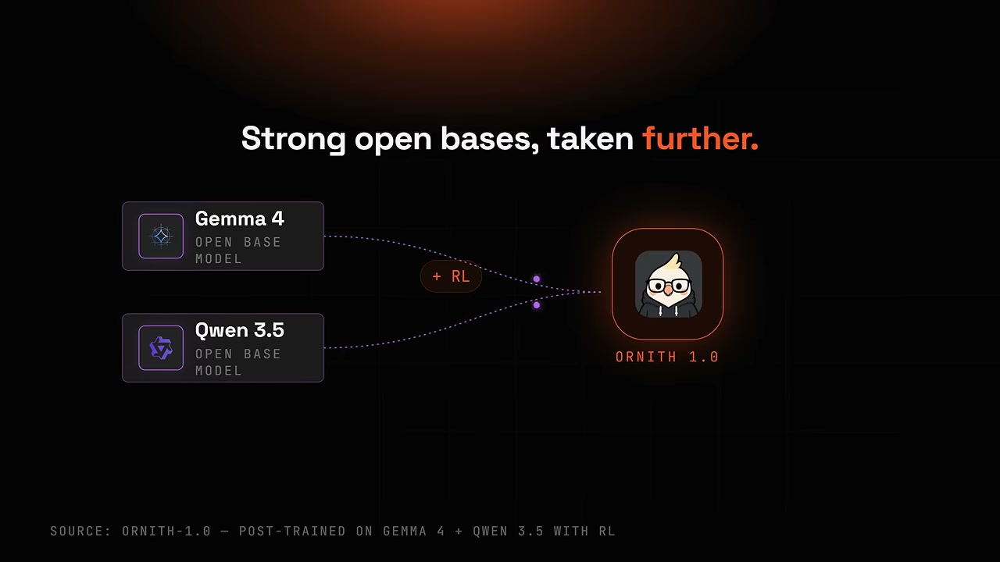

### The Ornith Model Family

The Ornith family consists of four distinct sizes, all sharing a common design philosophy:

*   **9B:** A dense model designed for accessibility, capable of running on a single GPU.
*   **31B:** A larger dense model that serves as the "workhorse" of the family, offering a balance of performance and resource requirements.
*   **35B MoE:** A Mixture-of-Experts model that contains 35 billion total parameters but only activates ("fires") approximately 3 billion for any given token. This architecture provides high-quality outputs with greater inference efficiency than a dense model of the same size.
*   **397B MoE:** The frontier-scale flagship model, also using a Mixture-of-Experts architecture for state-of-the-art performance.

### Large Context on Consumer Hardware

Despite their power, Ornith models are not "short context toys." Every model in the lineup supports a context window of a quarter-million (256,000) tokens. This can be extended to 400,000 tokens for tasks that require analyzing an entire code repository at once. The entry-level 9B model makes this large-context capability highly accessible; it can run with its full 256K context on a single 80GB GPU, consuming around 19GB of VRAM in half precision (bf16).

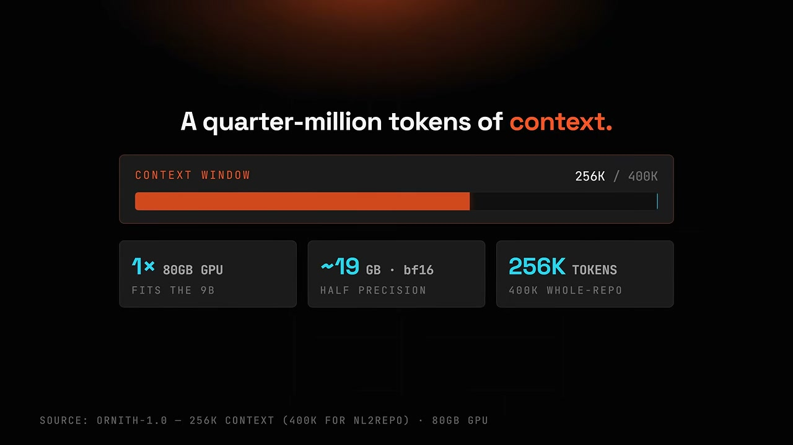

### Out-of-the-Box Agentic Behavior

A key feature of Ornith is that it is "agentic right out of the box." Its responses are structured to facilitate agentic workflows and provide transparency into its reasoning process. Each response begins with a `<think>` block, where the model outlines its plan. This is followed by clean, well-formed `<tool_call>` blocks that can be easily parsed and executed.

Crucially, this output format is fully compatible with the OpenAI API standard for tool calls. This deliberate design choice means that developers can integrate Ornith into any existing agent framework or harness that already supports OpenAI models, eliminating the need for custom parsers or "exotic glue."

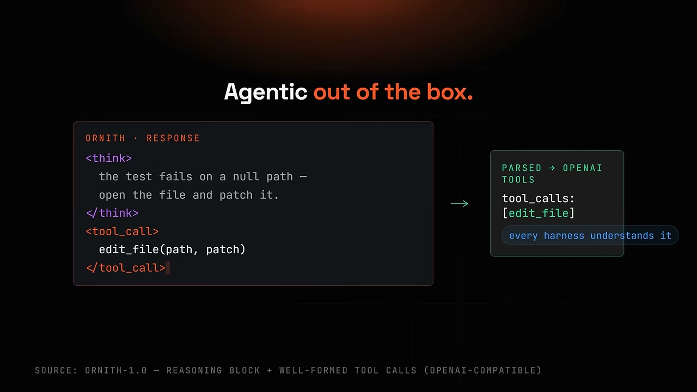
<!-- /dig-section -->

<!-- dig-section: 199 -->
## The Power of Self-Scaffolding

The key innovation in Ornith is that the "scaffold"—the operational process or plan the model follows to solve a task—is not fixed and human-written, but becomes a learnable object itself.

### The Learnable Scaffold

Most models are trained within a rigid, human-designed framework that dictates their problem-solving steps. This scaffold never changes. Ornith, in contrast, treats the scaffold as something to be discovered, not just followed. 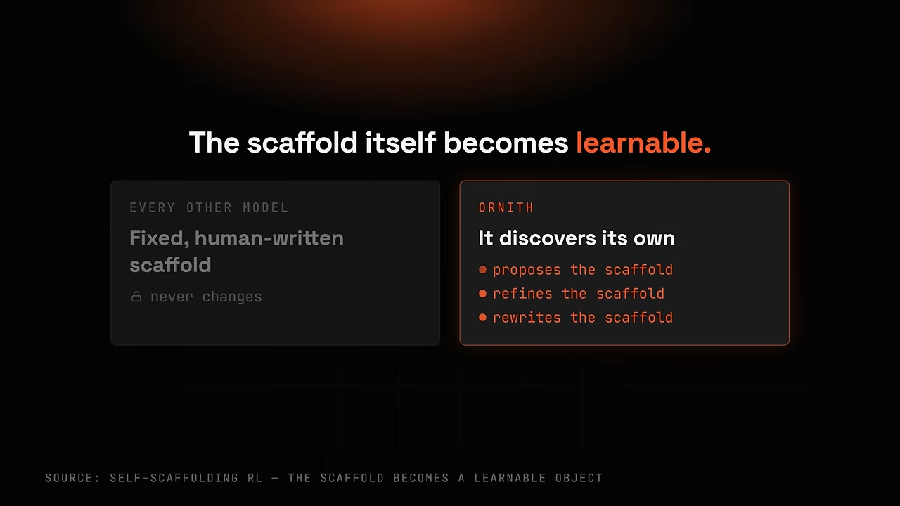 Using a technique called Self-Scaffolding Reinforcement Learning (RL), the model itself proposes, refines, and rewrites its own operational process over time. It learns not just the answer to a problem, but a better way to find the answer.

### A Two-Stage Learning Loop

This learning happens in a two-stage cycle.
1.  **Stage 1: Propose a Scaffold.** The model first generates a plan or process for how it will tackle the given task.
2.  **Stage 2: Solve the Task.** It then executes that plan to produce a solution.

The crucial part is the feedback mechanism. The reward signal, based on how successfully the task was solved, flows back to update the model's parameters for *both* stages. 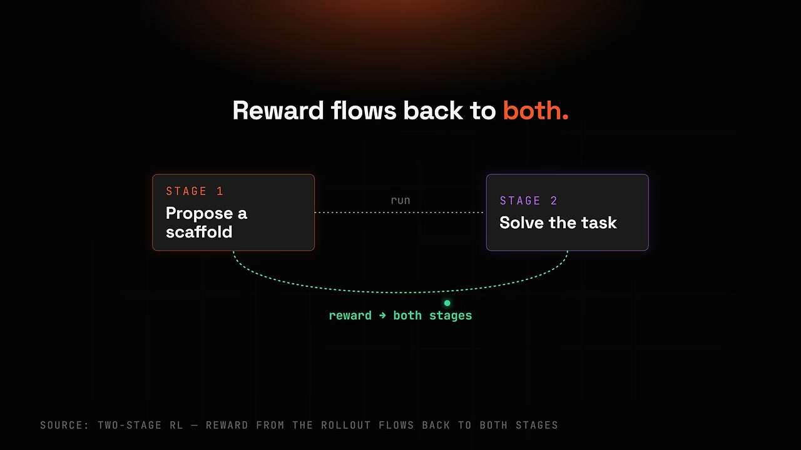 This means the model simultaneously learns to create better plans (Stage 1) and to execute those plans more effectively (Stage 2). Over thousands of iterations, the model isn't just memorizing solutions; it's fundamentally learning "how to work."

### Guardrails Against Gaming

Allowing a model to design its own process introduces the risk that it could "game" the system—finding shortcuts to a reward without actually solving the problem correctly. To prevent this, Ornith is built with three specific guardrails:
1.  **Trust Boundary:** A hard, inviolable outer wall that the model's operations cannot cross.
2.  **Deterministic Monitor:** A component that watches for and flags any forbidden or illegitimate moves during the process.
3.  **Frozen Judge:** A separate, unchanging model that evaluates the final output and can veto an entire run if it deems the solution invalid or achieved through improper means.

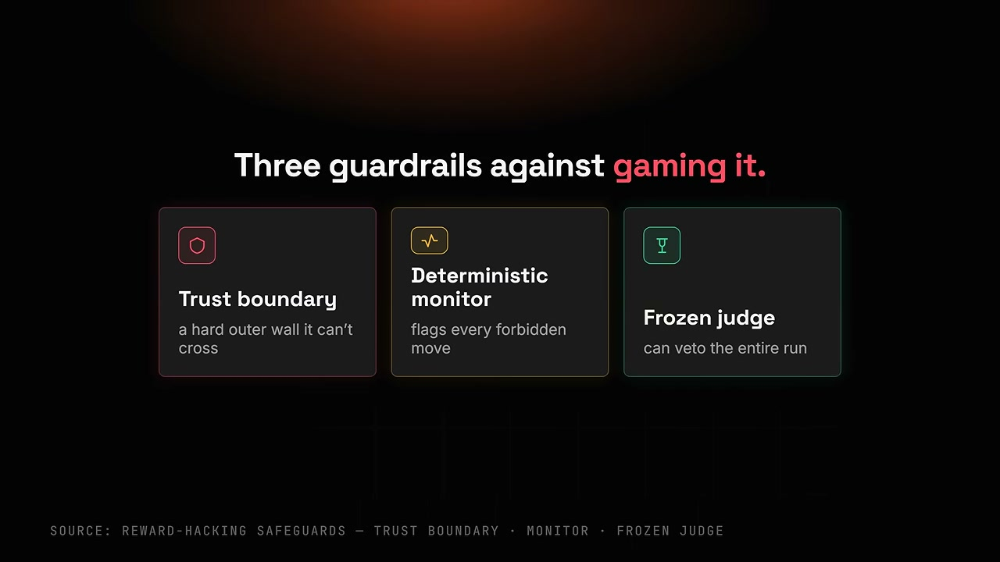 These safeguards ensure that as the model refines its process, it does so in a way that is robust and aligned with solving the task correctly.

### The Payoff: Parameter Efficiency

The primary benefit of this sophisticated learning process is remarkable efficiency. By learning a better process, a smaller model can achieve the performance of much larger ones. On the SWE-Bench Verified benchmark, the 9-billion parameter Ornith model scores 69.4. This performance is nearly identical to the 35B-parameter Qwen3.5 model (70.0) and significantly surpasses the 31B-parameter Gemma 4 (52.0).

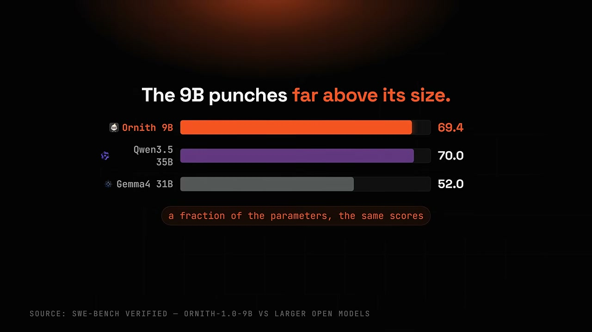 Ornith achieves comparable or better results with only a fraction of the parameters, demonstrating that learning a more effective problem-solving process can be more valuable than simply scaling up model size.
<!-- /dig-section -->

<!-- dig-section: 263 -->
## Understanding Claude Code as an Agent Harness

A crucial distinction is made between an AI model and the system that controls it. Claude Code is not a model itself; it is an "agent harness," an operational loop that gives a model the ability to act.

### The Agent Loop

The harness is a cyclical process designed to achieve a specific goal. It starts by taking a goal, then plans the first step. It proceeds to run a tool—like a command-line utility or a file editor—to execute that step. After the tool runs, the harness reads the result, whether it's a success, an error, or some other output. 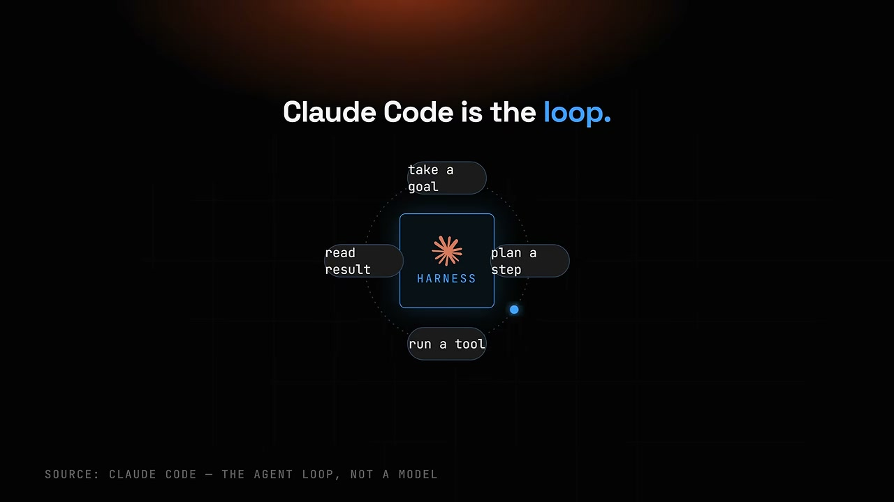 This result then informs the next cycle of planning and action. The loop continues until the initial goal is genuinely complete. This iterative process is what transforms a model's intelligence into tangible progress on a task.

### From "Talk" to "Do"

A raw AI model, no matter how intelligent, can only "talk"—it emits text. For example, it might output the sentence, "You should open the file and patch the null path..." This is just a suggestion; nothing actually happens. The harness is the component that translates this text into concrete actions. 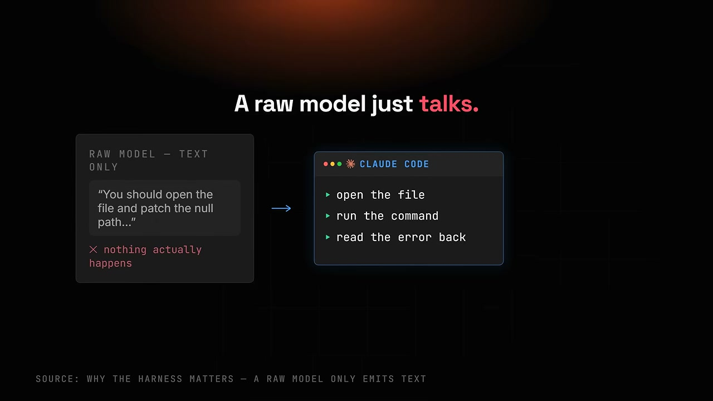 It parses the model's textual output and executes corresponding commands, such as opening a file, running a patch command, and then reading any resulting errors to feed back into the model for the next step. Without the harness, the model is a brain with no hands; the harness provides the means to "do."

### A Layer of Safety and Control

The harness also serves as a critical security and control layer by owning all the "real keys" to the system—capabilities that should never be given directly to an AI model. These include:
*   **Real file system access:** The ability to edit, create, and move files.
*   **A real terminal:** The power to run any command.
*   **A permission gate:** A checkpoint that pauses and asks a human for approval before executing potentially significant actions, like deploying code.

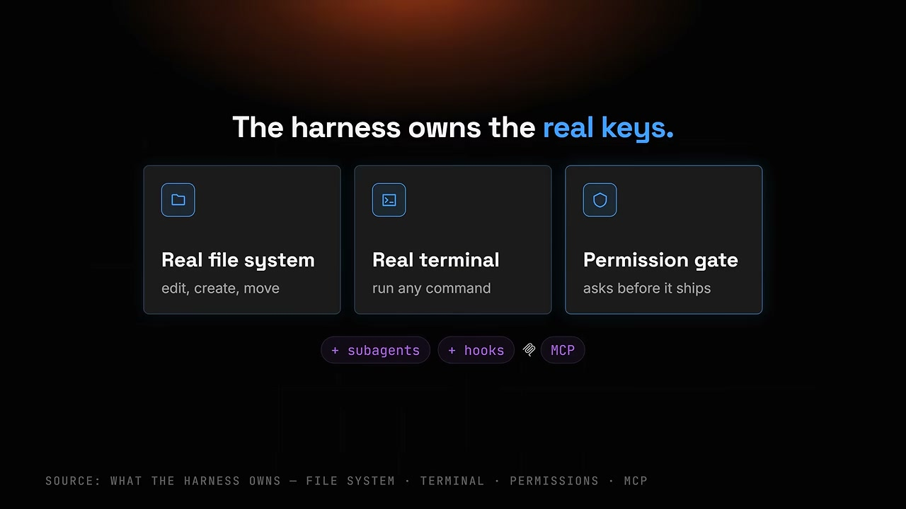

Furthermore, the harness manages connections to sub-agents, hooks for custom logic, and integrations with external tools via a protocol called MCP. None of these powerful capabilities are stored in the model's weights; they are all managed externally by the harness.

### The Model-Agnostic Superpower

A key feature of Claude Code is that it is model-agnostic. The harness doesn't care which "brain" is powering its decisions. By changing a single environment variable that points to a different model's API endpoint, the exact same harness can be used to drive a completely different model. 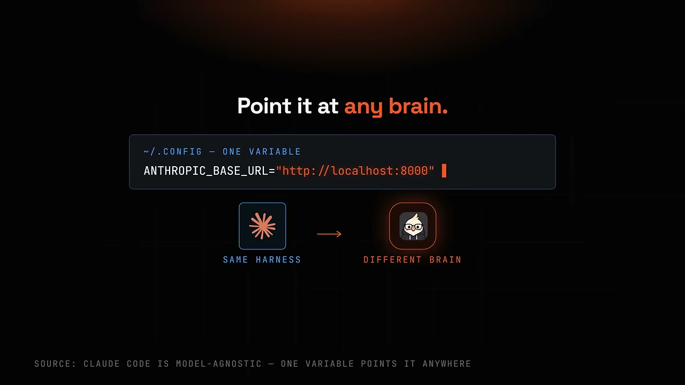 This makes the harness a flexible and portable layer that can be paired with any suitable AI, separating the mechanism of action from the source of intelligence.

This leads to a three-layer architecture:
1.  **You:** At the top, providing the goal.
2.  **Harness (Claude Code):** In the middle, acting as the hands.
3.  **Model (Ornith):** At the bottom, serving as the brain.

Ornith and Claude Code aren't competitors; they are two distinct and complementary components of a complete agentic system.
<!-- /dig-section -->

<!-- dig-section: 337 -->
## The Synergy: Brain and Hands Working Together

Since the Ornith model has learned to "scaffold itself," a natural question arises: does this make a separate harness like Claude Code redundant dead weight? The answer is a clear "no," because the model's internal scaffolding and the harness's external scaffolding are two fundamentally different things serving different purposes.

### Training-Time vs. Runtime Scaffolding

The core distinction lies in *when* and *what* each scaffold does. Ornith's self-scaffolding is a product of its training; it's a set of learned *behaviors* that make it a more effective cognitive agent. The Claude Code harness, in contrast, is a *runtime* tool that provides the agent with safe, controlled access to a real-world environment.

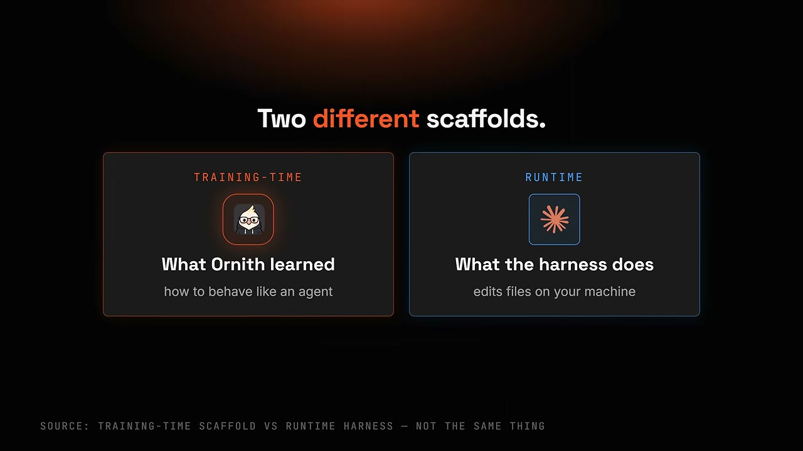

What Ornith learned during its training was how to behave like a disciplined, methodical agent. It did *not* learn the specific, low-level mechanics of editing a file on your laptop or executing commands in your shell. The training focused on cognitive habits, not environmental interaction.

### What a "Good Agent" Learns

The reinforcement learning (RL) training endowed Ornith with a set of valuable habits. These are the "scaffolds" it built for itself:
*   **It plans before it acts.** It doesn't just react impulsively.
*   **It reaches for tools, not guesses.** It understands when to use a defined capability instead of trying to hallucinate a solution.
*   **It checks its own output.** It has a built-in verification step.
*   **It recovers when a step fails.** It is resilient to errors.

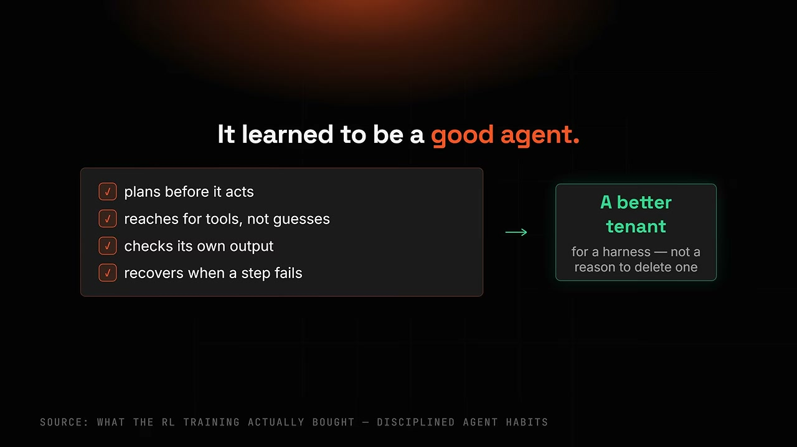

These traits don't eliminate the need for a harness; they make Ornith a far better "tenant" *for* a harness. A model that already knows how to plan and self-correct is perfectly aligned with the goals of a safety-oriented harness.

### Judgment Meets Rails

At runtime, when the agent needs to act on your machine, something must still hold the keys to the kingdom. This is the role of the Claude Code harness. It provides the "rails" that guide and constrain the agent's actions.
*   **Ornith provides the judgment:** It decides what to do next based on its sophisticated planning and reasoning abilities.
*   **Claude Code provides the rails:** It manages access to the actual repository, the real shell, and requires user approval before a command is allowed to run.

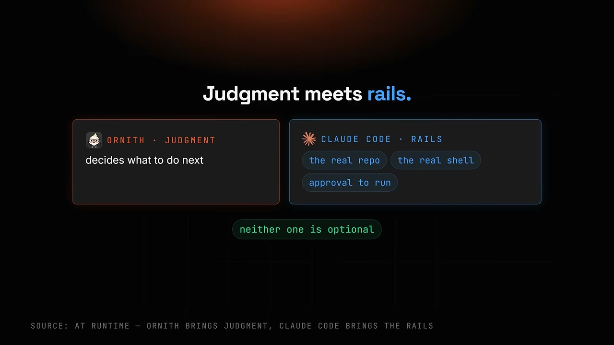

Neither of these components is optional. You need the agent's expert judgment to formulate a plan, and you need the harness's rails to execute that plan safely and with oversight.

### The Payoff: A Brain Wired into Hands

The ultimate goal is not to have these two systems compete, but to have them work together. By combining them, you get the best of both worlds.

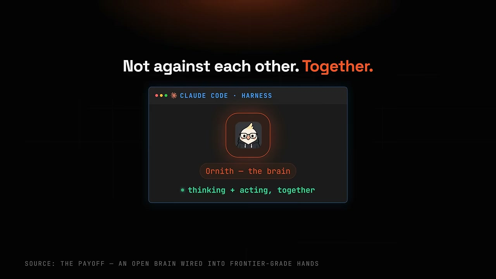

You get a "brain" (Ornith) that has already been trained on how to think and act effectively, wired into a set of "hands" (Claude Code) that can safely interact with your real machine. This synergy—a well-trained agent and a solid harness working in concert—is the key to unlocking the full potential of AI-powered development. They work *with* each other, not against each other.
<!-- /dig-section -->

<!-- dig-section: 407 -->
## Practical Integration Steps

### Step 1: Serving the Local Model

The process begins by making the Ornith model available on your local machine. This is accomplished with a single command using VLLM, a high-throughput serving engine. The command spins up an OpenAI-compatible API endpoint, making the local model accessible just like a cloud-based service.

By running `vllm serve` with the specific Ornith model name and a chosen port (e.g., 8000), you create a server listening for requests on `http://localhost:8000`. This approach is entirely self-contained, requiring no cloud account, no waiting lists for API access, and no rate limits, giving you complete control over the model's availability.

### Step 2: Bridging the Format Gap

A challenge arises because Claude Code and Ornith speak different "languages." The Claude Code CLI is designed to communicate using Anthropic's specific message format, while the VLLM-served Ornith model expects requests in the standard OpenAI format. To solve this, a small, lightweight proxy service acts as a translator.

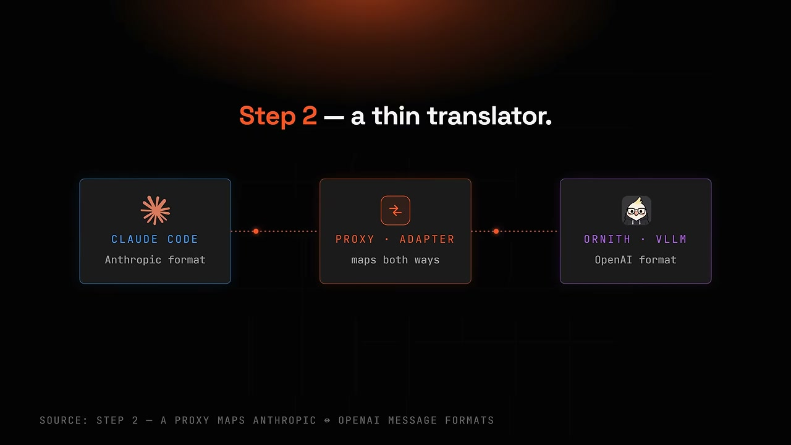

This proxy, or adapter, sits between the two components. When Claude Code sends a request in the Anthropic format, the proxy intercepts it, translates it into the OpenAI format that Ornith understands, and forwards it. When Ornith replies, the proxy translates the OpenAI-formatted response back into the Anthropic format for Claude Code. This "thin translator" works silently in both directions, allowing the two systems to communicate seamlessly.

### Step 3: Re-routing the CLI

The final configuration step is to tell the Claude Code CLI to stop talking to Anthropic's servers and instead send its requests to the local proxy. This is done by setting two environment variables.

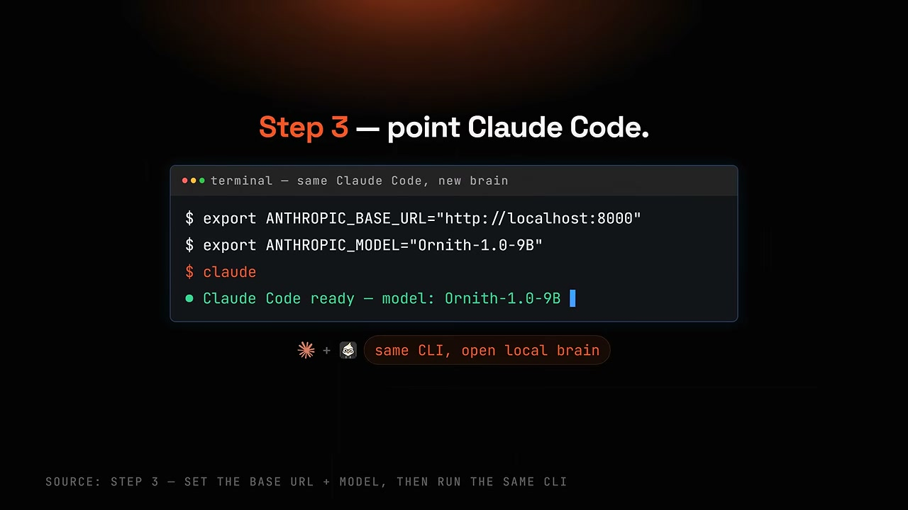

First, `ANTHROPIC_BASE_URL` is set to the address of the local server (`http://localhost:8000`). Second, `ANTHROPIC_MODEL` is set to the name of the model being served, in this case, `Ornith-1.0-9B`. With these variables exported, running the `claude` command is unchanged. The CLI looks and feels exactly the same, but it's now powered by an "open local brain" running entirely on your machine.

### The Agentic Loop in Action

Once set up, the system operates in an agentic loop. You give Claude Code a high-level goal, such as "make the build pass." Claude Code passes this to Ornith, which thinks, forms a plan (e.g., open a specific file, then run a test command), and sends the plan back.

The Claude Code harness executes each step of the plan. Crucially, before performing any potentially destructive action like editing a file, it pauses and prompts for user approval, often showing a diff of the proposed changes. This "plan, act, and pause" cycle ensures you remain in control.

In a live example, the goal is to "Fix the failing test." A test named `auth.test.ts` is failing with a `TypeError`. Ornith reads the error, identifies the broken function (`getToken()`), and patches the code. Claude Code then re-runs the entire test suite. The result is a successful fix, with the failing test now passing.

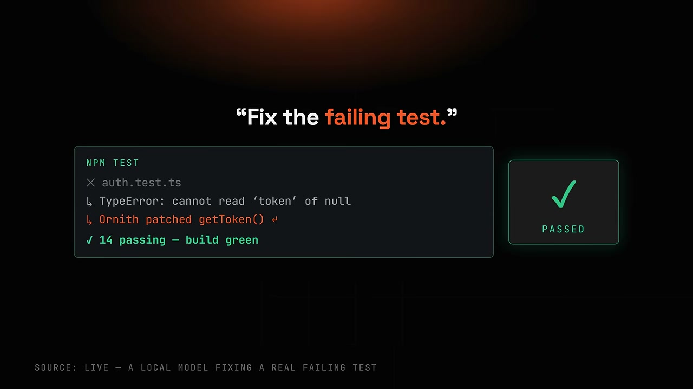

This demonstrates the power of the complete system: a local model, integrated with real development tools, autonomously executing a plan to solve a real-world coding problem and producing a finished, working result.
<!-- /dig-section -->

<!-- dig-section: 479 -->
## Conclusion

On the verified SWE-bench, Ornith's flagship model demonstrates its competitive standing. It scores 82.4, outperforming models like DeepSeek-V4 (80.6) and MiniMax M3 (80.5), and tying with Claude's own Opus 4.7 (80.8). However, it still trails the absolute state-of-the-art, Opus 4.8, which scores 87.6. The conclusion is clear: the open model is genuinely close to the frontier, but not ahead.

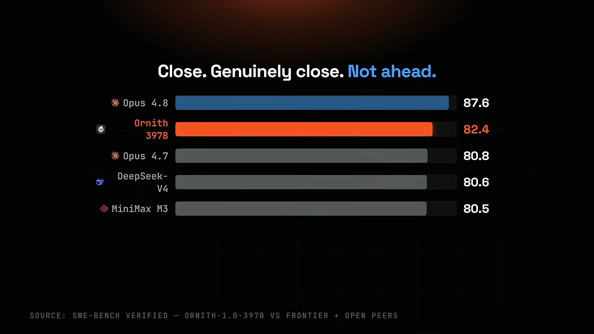

### When to Choose Open vs. Frontier

This performance gap clarifies the distinct use cases for open versus closed models. The "open brain," Ornith, wins outright in specific scenarios:
*   **Data Sovereignty:** When code and data must stay on your own hardware for privacy or security reasons.
*   **Offline Capability:** When the system needs to operate without any internet connection.
*   **Licensing Freedom:** When a permissive license, like the MIT license, is a requirement for commercial use or modification.
*   **Cost Control:** When you want to avoid per-token API costs entirely.

Conversely, the frontier models still win on the most demanding jobs. For sprawling, multi-step tasks with the longest horizons, that small performance advantage—the handful of benchmark points separating Ornith from Opus 4.8—can be the deciding factor between a task successfully finishing or quietly stalling out.

### The Pro Setup: A Swappable Brain

The most effective solution isn't to pick one model and discard the other, but to build a system that can leverage both. The "pro setup" involves keeping the agent harness—in this case, Claude Code—as a constant and swapping the "brain" based on the task's needs.

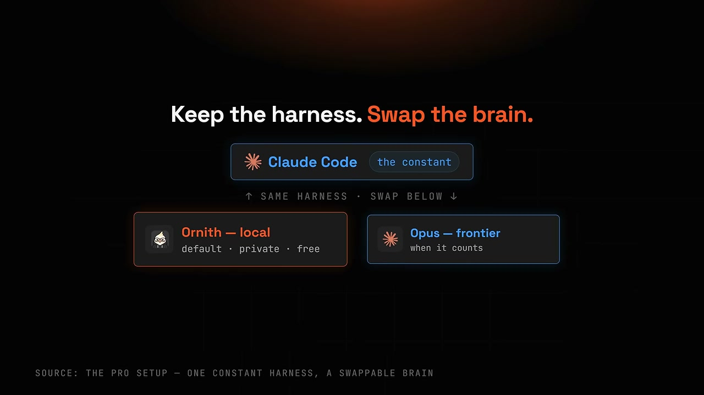

In this architecture, Ornith becomes the default choice: local, private, and free. For the majority of tasks, it is more than capable. However, for the most critical, complex jobs where absolute peak performance is necessary, you can swap in a frontier model like Opus. This "same hands, different brain" approach allows you to tailor the tool to the job, only incurring the cost and overhead of a frontier model when it actually counts.

### Not a Fight, A Stack

This reveals a fundamental misunderstanding in the AI space. The relationship between the model and the harness is not a competition; it's a stack. A more capable model doesn't make the harness obsolete, just as a better car engine doesn't retire the car's chassis, wheels, and steering. They are different, complementary layers.

The real headline is that for the first time, a powerful, open-weight model that you can run yourself is good enough to be the "brain" inside a top-tier "harness." A year ago, this concept was a research demo; today, it's a practical, everyday workflow. The line between open and frontier has never been this thin.

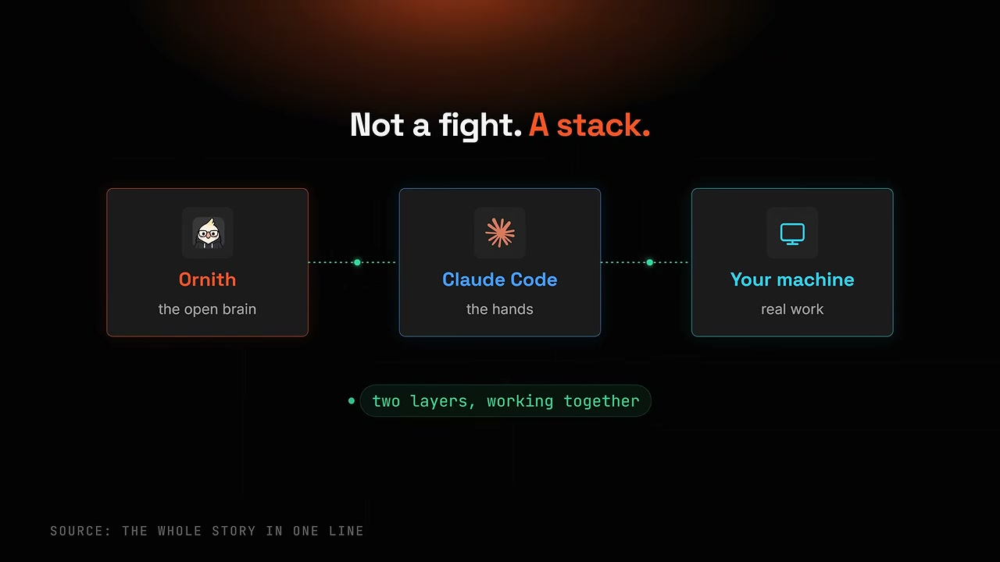

Ornith is the open, self-scaffolding brain. Claude Code provides the "hands" that safely interact with your machine to perform real work. You drop one into the other. The "cage match" between open and closed models was never a fight—it was always about building the right stack.
<!-- /dig-section -->
