<!-- dig-section: 0 -->
## The Limitations of Current AI Knowledge Retrieval

When even the most advanced AI agents are asked questions about a specific business's internal knowledge, they can provide answers that are confident, instantaneous, and completely wrong. The video opens by demonstrating this problem. An AI agent is asked, "What's our refund window?" It confidently replies, "About 30 days, I think." However, a look at the business's actual knowledge base, a file named `refund-policy.md`, shows the correct answer is 14 days. The core issue is that the AI never actually opened or read the policy file. Instead, it "hallucinated" an answer by guessing from its vast, generic training data, where a 30-day refund window is a common pattern. The response is an ungrounded guess, not a factual retrieval.

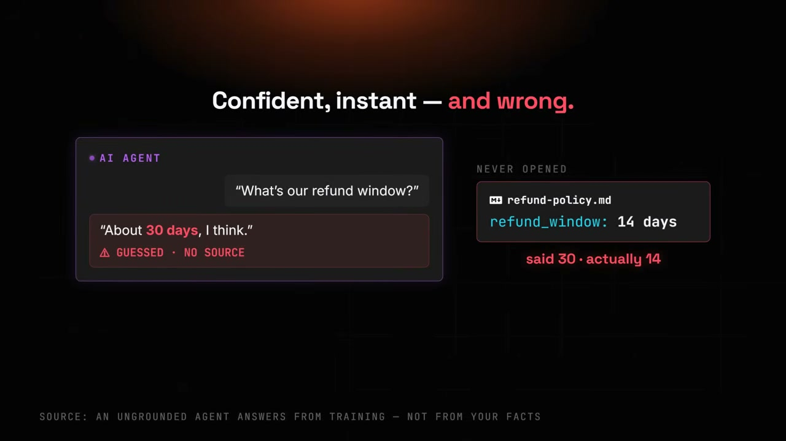

For the past few years, the standard solution to this problem has been Retrieval-Augmented Generation (RAG). This technique follows a standard pipeline to ground the AI's answers in specific documents. First, you take all your documents (DOCS). Second, you split them into smaller pieces (CHUNKS). Third, each chunk is converted into a numerical representation of its meaning, called a vector (VECTORS). Finally, these vectors are stored in a specialized database (VECTOR DB) that allows for searching by semantic similarity. When a user asks a question, the system finds the most relevant chunks from the vector database and provides them to the AI model along with the original question, enabling it to generate an answer based on the provided facts.

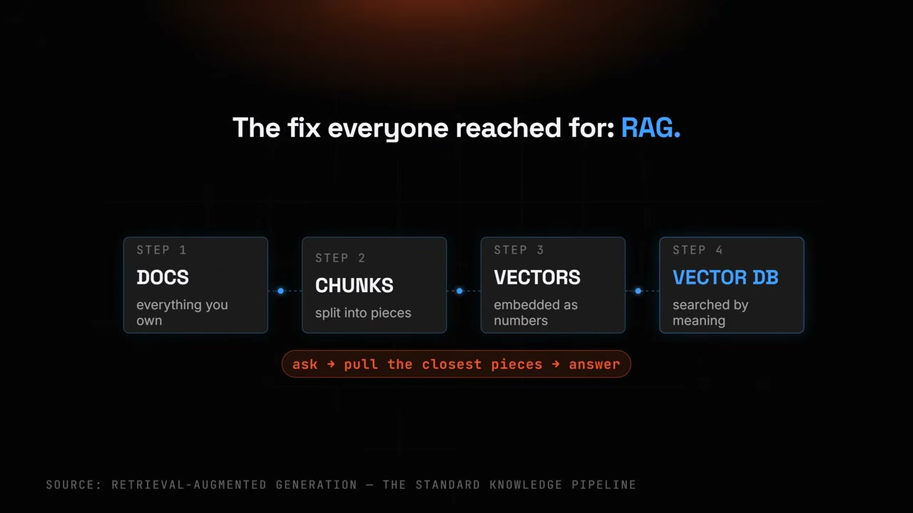

While RAG is a powerful approach, it has a fundamental flaw: it shreds the inherent structure of the source documents. The video illustrates this with a clean, structured policy document written in Markdown, which contains a table defining different refund windows for different customer tiers (e.g., 14 days for "pro" tier, 7 days for "free" tier). The "chunking" step of the RAG pipeline breaks this meaningful table into disconnected, out-of-order fragments. The retrieval process then grabs the few chunks that seem most semantically similar to the query, but in doing so, it discards the structural relationship—the rows and columns—that made the information meaningful. The AI model receives these isolated fragments and is forced to guess the relationship between them. The final output may look like a sourced answer, but it's ultimately just a guess dressed up as a citation.

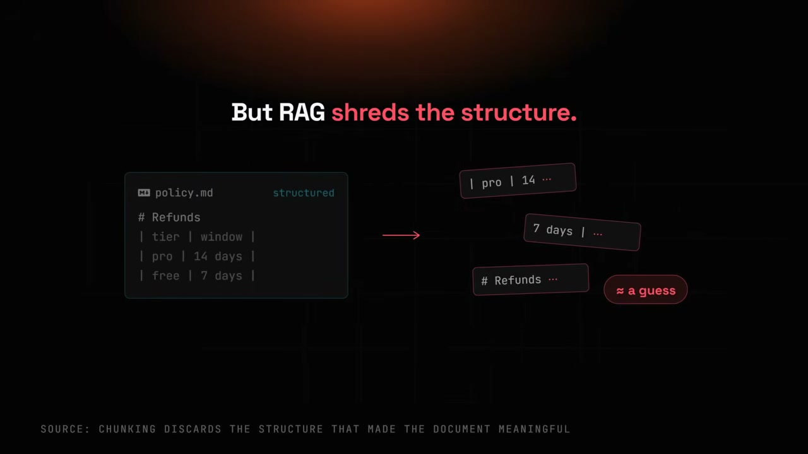
<!-- /dig-section -->

<!-- dig-section: 42 -->
## Introducing Open Knowledge Format (OKF)

A second, alternative approach to grounding AI agents is presented: the Open Knowledge Format (OKF), a hypothetical technology shipped by Google Cloud in June 2026. Unlike the unstructured nature of a large corpus used in RAG, OKF is based on curated knowledge written as plain, structured markdown files.

This method's strength is its precision. Using the same refund policy example, an agent powered by OKF provides an exact, unambiguous answer: "14 days." The answer isn't just correct; it's auditable, with a direct link back to the specific source policy file. 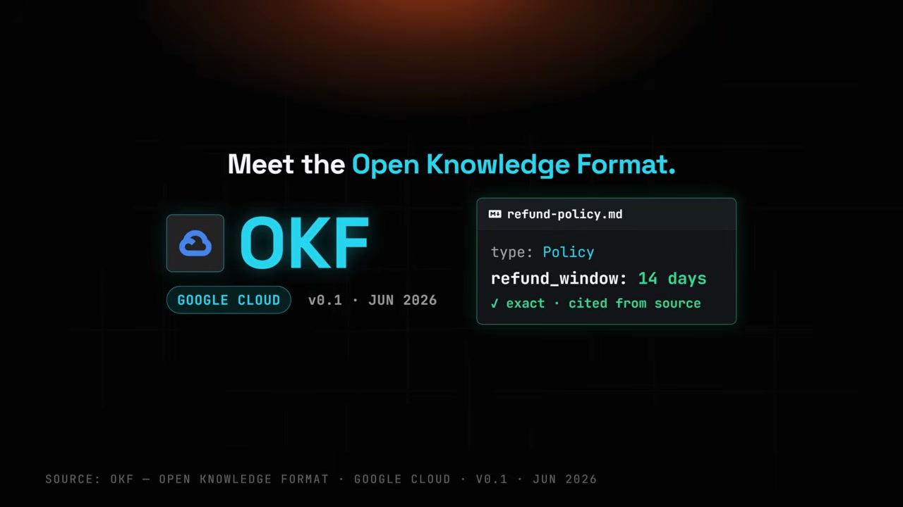 This is possible because the information is stored as explicit key-value pairs within the markdown, such as `refund_window: 14 days`, making the data machine-readable and removing ambiguity.

However, OKF's precision comes at a cost: scalability. Its primary limitation is that it relies on direct human authorship. Every piece of knowledge must be manually written and curated. While this makes the knowledge base trustworthy and auditable, it creates a "ceiling" bounded by human effort. This approach works well for dozens of core, hand-written documents but cannot realistically cover the millions of messy, unstructured documents that make up an organization's full knowledge corpus. 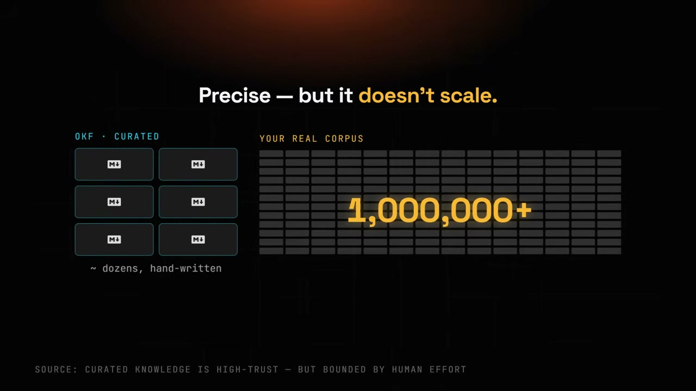

This leads to what the video frames as a forced choice for development teams. On one hand, there is RAG, offering "endless scale" and "fuzzy search" over a vast, messy corpus. On the other, there is OKF, offering "precision" and "structure" for a small, curated set of knowledge. 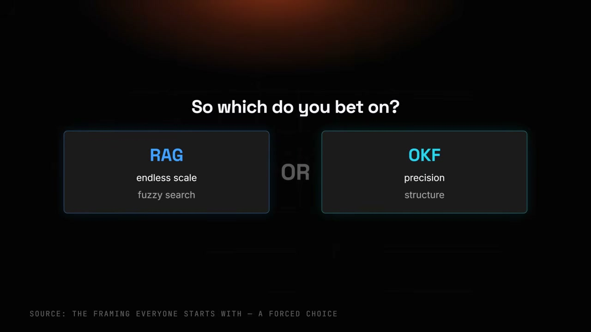 The fundamental question becomes which approach to bet on for building a reliable AI agent. The narrator concludes, however, that framing it as an either/or decision is the "wrong question."
<!-- /dig-section -->

<!-- dig-section: 82 -->
## The Hybrid Approach: OKF + RAG

The central question isn't whether to choose Retrieval-Augmented Generation (RAG) or an Organized Knowledge Format (OKF), but rather how to combine them. The most effective architecture uses both, creating a hybrid system that leverages the strengths of each. This approach uses an agent, acting as a router, to direct user queries to the most appropriate knowledge layer.

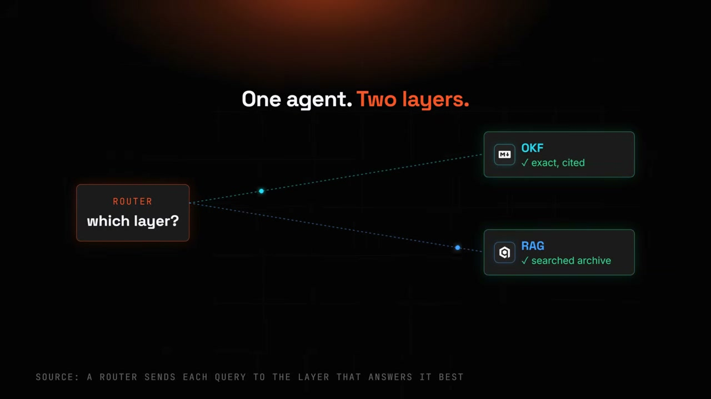

For example, a high-stakes question that requires a precise, verifiable answer is routed to the OKF layer. This layer contains structured, curated knowledge, allowing the system to return an exact, cited response. Conversely, an open-ended or exploratory question is sent to the RAG layer, which can perform a broad search across the entire, unstructured archive of documents to synthesize a relevant answer. This creates a powerful system with two distinct layers of knowledge managed by a single agent.

This division of labor can be understood through an 80/20 principle. The OKF manages the "canonical 80%"—the core, high-stakes information that an organization absolutely cannot get wrong. This is the curated, trusted knowledge base. RAG, in contrast, handles the "long tail 20%." This includes the vast, messy, and constantly changing information that would be impossible to manually curate and structure.

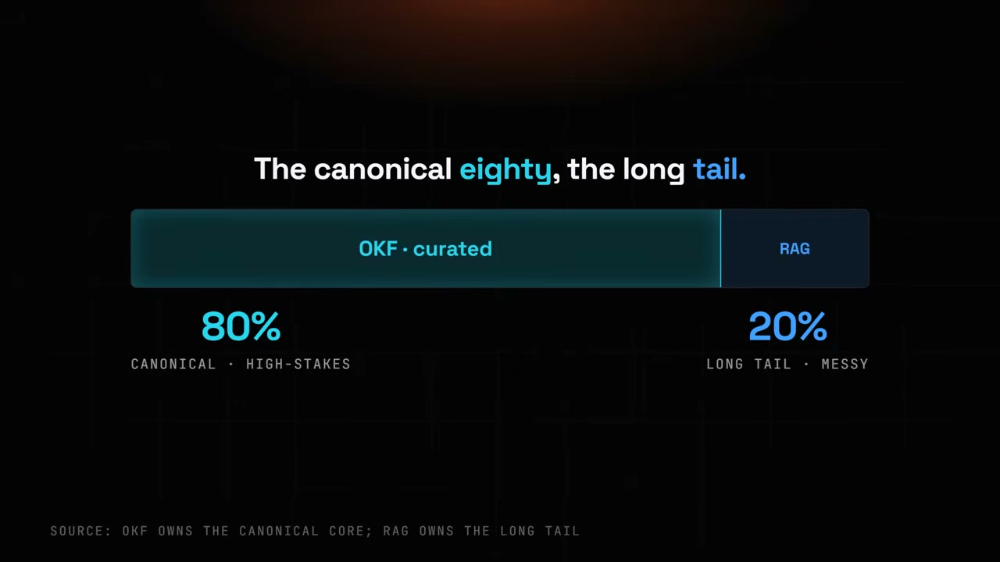

The payoff of this hybrid stack is the combination of complementary strengths: OKF provides precision, trust, and structure, while RAG delivers scale, reach, and powerful search capabilities. Together, they create a system that is both highly accurate for critical queries and broadly capable for everything else.
<!-- /dig-section -->

<!-- dig-section: 121 -->
## Deep Dive into RAG Mechanics and Drawbacks

To build a Retrieval-Augmented Generation (RAG) system, documents are first processed through an ingestion pipeline. 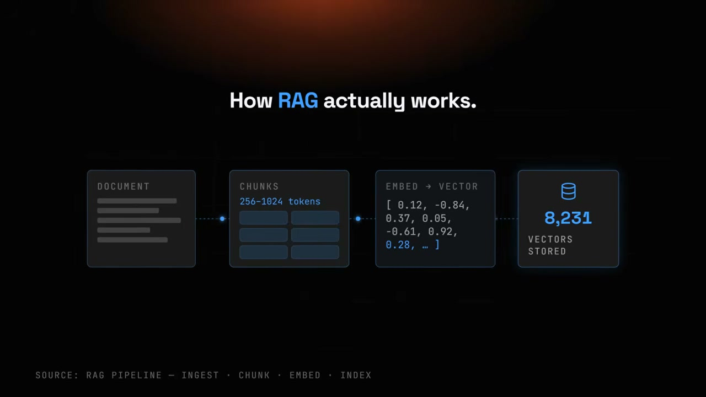 A document is split into smaller "chunks," typically a few hundred tokens each. An embedding model then converts each chunk into a vector—a long list of numbers that numerically represents the chunk's semantic meaning. These vectors are then stored and indexed in a specialized vector database.

When a user asks a question, the query itself is converted into a vector using the same embedding model. The vector database then performs a similarity search, finding the chunks whose vectors are closest to the query vector within that high-dimensional space. This is the core advantage of RAG: it matches by meaning, not by keywords. 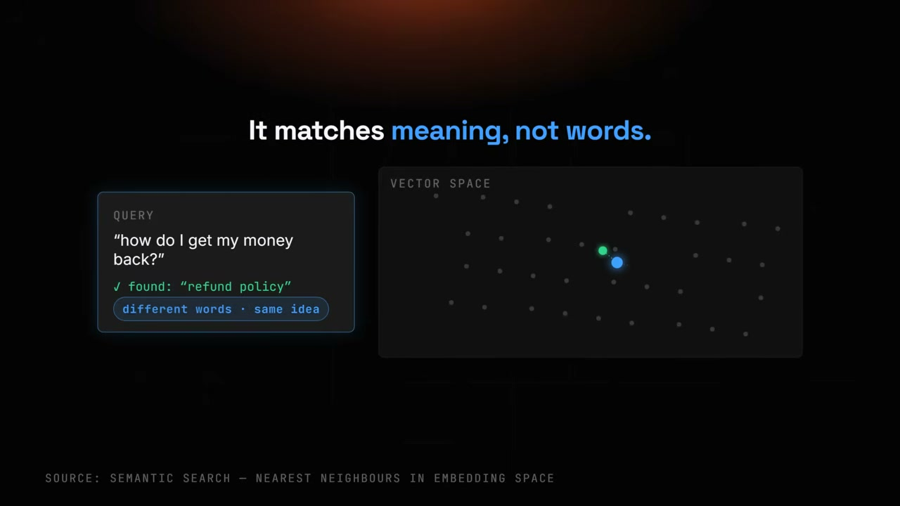 For example, the query "how do I get my money back?" can successfully find a chunk containing the "refund policy," even if the exact words don't overlap. The system understands that they represent the same idea.

This technology has given rise to an entire industry of vector databases like Pinecone, Weaviate, Qdrant, Chroma, Milvus, and extensions like `pgvector` for PostgreSQL. These systems provide immense, open-ended scale, capable of storing billions of vectors and searching them in milliseconds.

However, this approach has significant drawbacks. The process of "chunking" is indiscriminate and can break the structure of the source data. 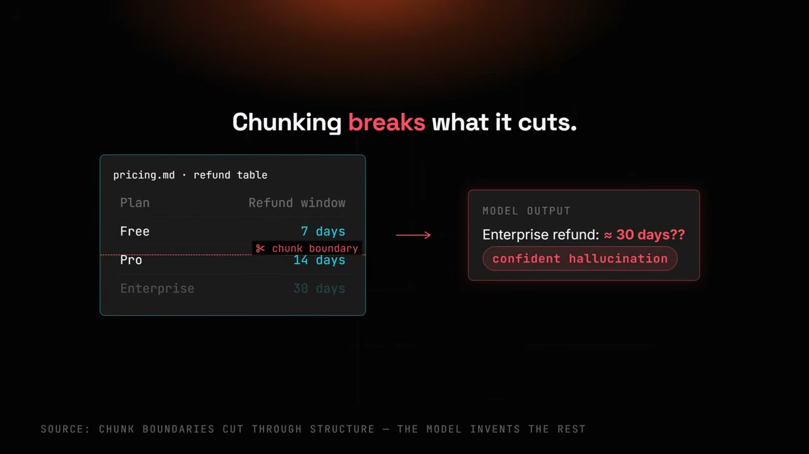 If a chunk boundary cuts through the middle of a table, a step-by-step procedure, or a legal clause, the resulting fragments lose their original context. When the language model receives these disconnected pieces, it quietly fills in the gaps, which is precisely how a "confident hallucination" is created.

Furthermore, retrieval is probabilistic by design. The system returns chunks that are *likely* to be relevant based on a similarity score, not ones that are guaranteed to be factually correct. This is acceptable for fuzzy, exploratory questions but becomes dangerous when precision is required, such as finding an exact price, a specific refund window, or a correct medical dosage.

Finally, the vector index itself operates as a black box. 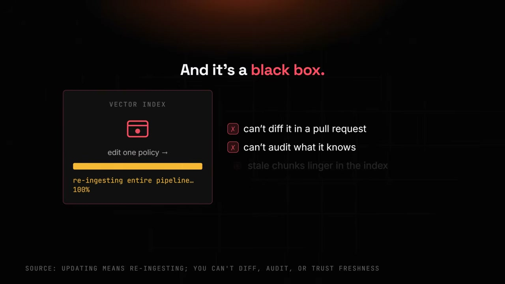 Updating a single piece of information, like one company policy, often requires re-running the entire ingestion pipeline. The resulting changes to the vector index can't be easily reviewed in a pull request, and it's difficult to audit what the system actually knows. This also means stale, outdated chunks can linger in the index long after the source of truth has changed, leading the system to provide incorrect answers.
<!-- /dig-section -->

<!-- dig-section: 217 -->
## Deep Dive into OKF Mechanics and Advantages

The Open Knowledge Format, or OKF, takes the opposite approach to the complex, opaque pipelines of vector search. Instead of requiring pipelines, embeddings, and vector stores, OKF is built on a simple, transparent foundation: a folder of markdown files. Each file contains a bit of YAML front matter at the top, but the core idea is so straightforward that, as the spec says, "If you can `cat` a file, you can read OKF. If you can `git clone` a repo, you can ship it."

This simplicity starts with the principle of "one file, one concept." Each markdown file represents a single, distinct piece of knowledge. The structure is composed of two parts. At the top is the YAML front matter, which contains metadata about the concept. The only required field is `type`, which defines what the concept is (e.g., a "BigQuery Table"). Optional fields provide richer context, including a `title`, `description`, `tags`, a `timestamp`, and a `resource`—a URI that links directly to the live, real-world asset being described. 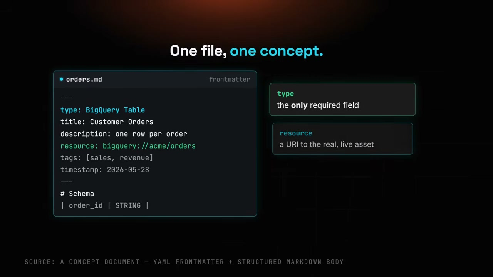 Below the front matter is the body of the file, which uses structured markdown—standard headings, tables, and lists—that a language model can parse cleanly and reliably.

These individual concept files are not isolated. They connect to one another using ordinary markdown links, transforming a simple collection of files into a traversable knowledge graph. 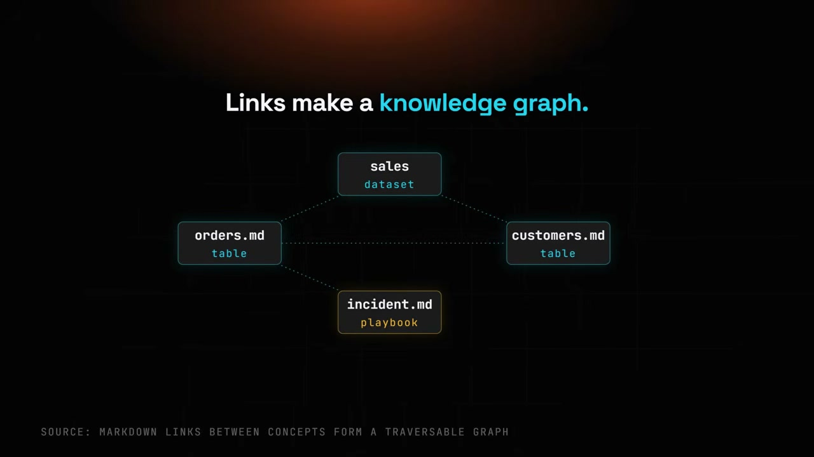 For example, a file describing a database table might link to the file for the dataset it belongs to. A file documenting an incident-response playbook could link to the table it's designed to repair. This creates a network of genuine, explicit relationships between concepts, a stark contrast to the "bag of disconnected chunks" produced by typical retrieval-augmented generation (RAG) systems.

Because every OKF file is authored by a human, retrieval is deterministic. You have precise control over what information the model sees, eliminating the "cosine-distance lottery" where a model might retrieve a semantically similar but factually incorrect chunk of text. The document's original structure—its headings, lists, and tables—survives intact, preserving crucial context. Furthermore, the entire knowledge base lives in Git. 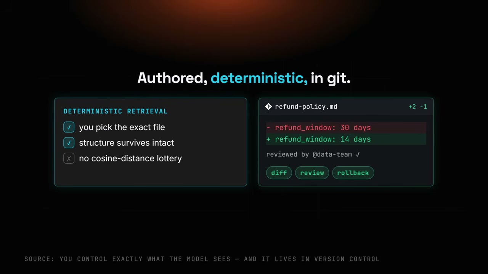 This allows you to apply standard software engineering workflows: you can `diff` changes, review updates in a pull request, assign ownership, and roll back bad edits.

This pattern of hand-engineering context isn't new; it's the core of what AI researcher Andrej Karpathy calls the "LLM Wiki"—a curated set of documents, like a `claude.md` file, that you deliberately create for a model to read. OKF's contribution is to formalize this concept into a shared, open, and vendor-neutral specification that any tool can target.

However, this approach has an "honest limit": the cost of curation. OKF does not scale itself. Every concept file is the result of human work. This makes the format perfect for high-stakes knowledge you cannot afford to get wrong—canonical, structured facts and exact answers. 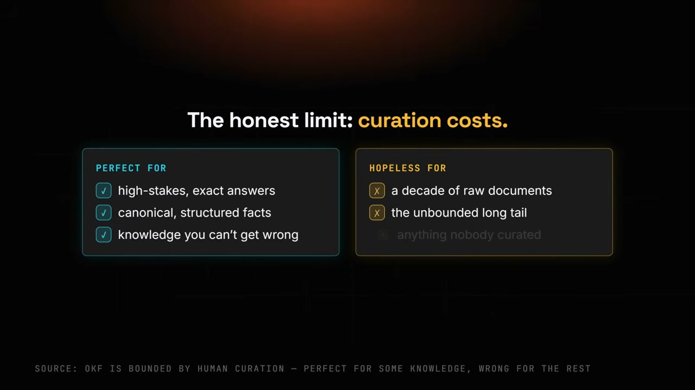 Conversely, it is completely unsuitable as a dumping ground for a decade of raw, uncurated documents or the unbounded "long tail" of miscellaneous information.
<!-- /dig-section -->

<!-- dig-section: 313 -->
## Building the Hybrid Stack and Practical Use Cases

Instead of choosing between a curated knowledge base and a broad retrieval system, the most effective architecture uses both. The solution is to place a smart **router** in front of the two knowledge layers. When a query comes in, the router determines its nature. If the question is canonical and high-stakes, like "What is our refund policy?", it's sent to the Organized Knowledge Format (OKF) layer for a precise, citable answer. If the question is open-ended, exploratory, or requires digging through archives—like "Has anyone seen this specific billing bug before?"—it's sent to the Retrieval-Augmented Generation (RAG) layer. This ensures every query is handled by the system best suited for it.

This hybrid approach can be pictured as an 80/20 split. The OKF is the **spine**: the 20% of curated, structured, high-trust core knowledge that answers the most frequent 80% of questions. RAG is the **reach**: the huge, messy, unbounded "long tail" of information that you could never realistically hand-write or curate.

A concrete example illustrates this dual-path system. A support agent might receive two questions.
1.  "What's our refund window?" The router identifies this as a canonical question and sends it to OKF, which returns the exact answer: "14 days," complete with a link to the official policy document.
2.  "Anyone hit this weird billing bug before?" The router sees this is an open-ended, exploratory query. It sends it to RAG, which performs a semantic search across 40,000 old support tickets to find similar past incidents. 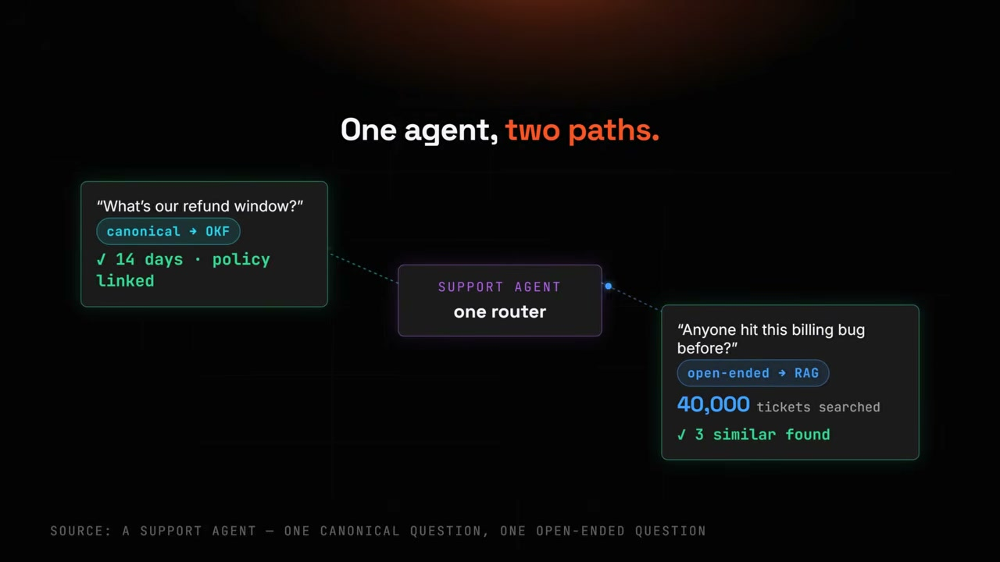

The two systems don't just coexist; they make each other better. OKF provides RAG with **ground truth**. When a curated OKF concept exists for a given topic, the agent is programmed to trust that authoritative source over any fuzzy, retrieved chunk from RAG. This single rule makes a measurable dent in hallucinations. OKF also gives the agent a **map** of the knowledge base. Its index files list what curated information exists, allowing for progressive disclosure. The agent first checks this map and only drills into RAG to fill the gaps where curated answers run out, avoiding wasteful, blind searches from scratch every time. In return, RAG gives OKF **reach**. Semantic search can be run across the entire knowledge base—both the sprawling archive and the curated OKF bundle itself—allowing for fuzzy, semantic queries even on the structured core.

The complexity of this routing can be hidden from the agent. By placing the OKF bundle and the RAG vector index behind a single retrieval interface—even a single server—the agent simply makes a call for `get_knowledge()`. The underlying plumbing of routing the query to the correct layer remains entirely abstracted away. 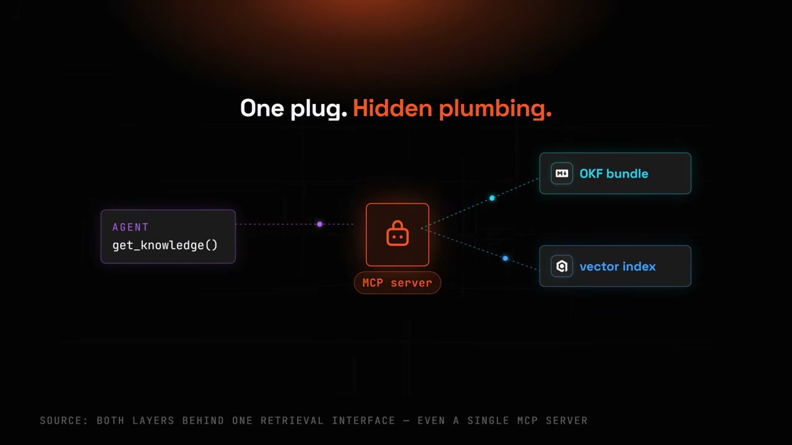 This hybrid approach finally stops the trade-offs, offering precision *and* scale, trust *and* breadth, structured access *and* fuzzy search.

The economics also align. OKF, being just text in a Git repository, has virtually no infrastructure cost. RAG, however, carries real running costs for embedding documents, re-embedding them on every change, and hosting a 24/7 vector database. The principle becomes: curate what's worth curating, and pay to index the rest.

In practice, you should use both for almost any serious, production-grade agent. The high-stakes core knowledge lives in OKF, the long-tail archive lives in RAG, and a thin router decides which to use for each query. This debunks two common myths:
1.  **"OKF kills RAG."** False. The moment a knowledge corpus is too large or messy to curate by hand, RAG's vector search is essential and remains the clear winner for scale.
2.  **"Just use a 1M token context window."** False. Dumping irrelevant information into the context window actively degrades the quality of the answer and burns tokens. Selective, routed retrieval is far more efficient and effective than brute force.

Building this stack is a team sport. Data owners curate the OKF bundles, engineers index the archive into a vector store for RAG, and frameworks like LangChain or LlamaIndex wire the two together. The agent—whether it's Claude, ChatGPT, or Gemini—then consumes knowledge from this unified, hybrid source. Curated structure and raw retrieval are converging, folding graph, vector, authored, and searched knowledge into a single, powerful stack.
<!-- /dig-section -->

<!-- dig-section: 562 -->
## Conclusion

The video concludes by presenting a unified architecture that leverages the strengths of both Organizational Knowledge Frameworks (OKF) and Retrieval-Augmented Generation (RAG). The key insight is that these are not competing technologies but complementary ones. The solution is not "OKF versus RAG" but "OKF plus RAG."

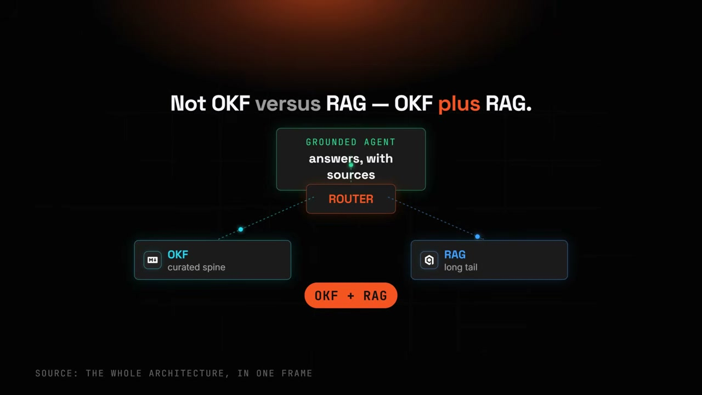

This hybrid system is visualized as a complete picture in a single frame. At the top sits a **grounded agent**, whose purpose is to provide final answers complete with verifiable sources. Below this agent is a **router**. This component is the intelligent dispatcher; it analyzes an incoming query and determines the best path to find an answer.

The router directs the query to one of two specialized systems:
1.  **OKF**, described as the "curated spine" of the knowledge base. It handles queries that map to well-defined, structured, and highly reliable information. This is the system for precision and auditability.
2.  **RAG**, which handles the "long tail." It provides scale, performing semantic searches over vast quantities of unstructured documents to find relevant information for more open-ended or less common queries.

By having a single grounded agent that sits above both systems, the architecture ensures a consistent, reliable final output, regardless of which underlying method was used to retrieve the information. It was never about choosing one over the other; the optimal approach is a synergistic one where the curated precision of OKF and the broad reach of RAG work together.
<!-- /dig-section -->
