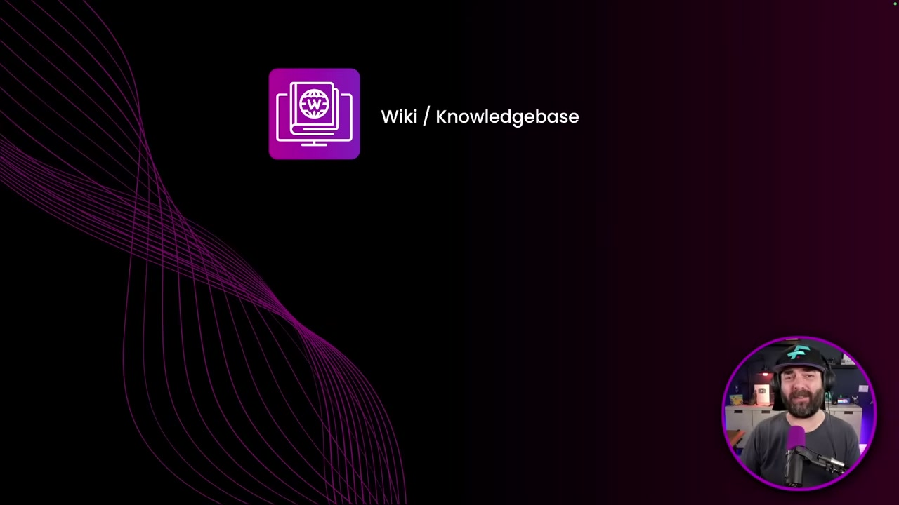
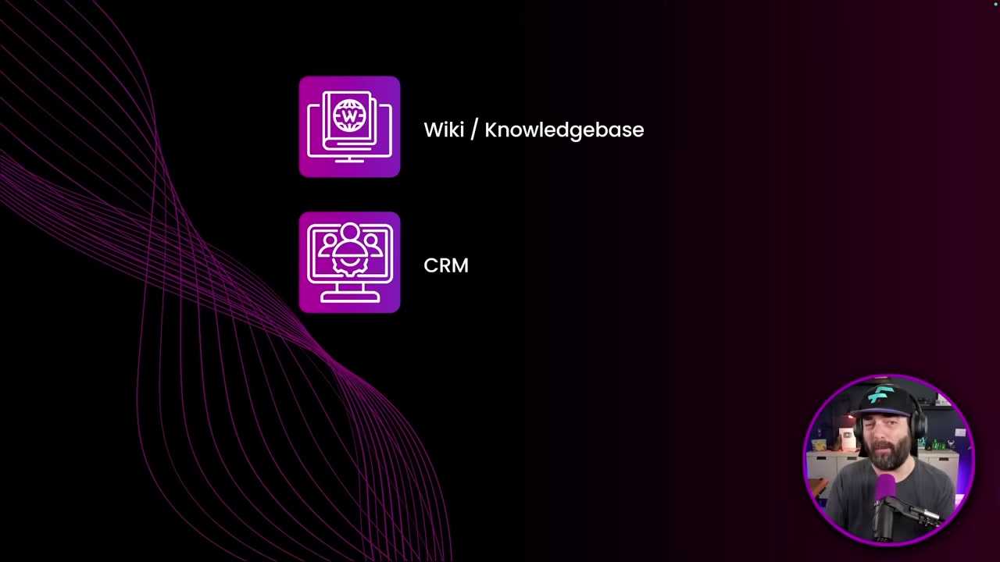
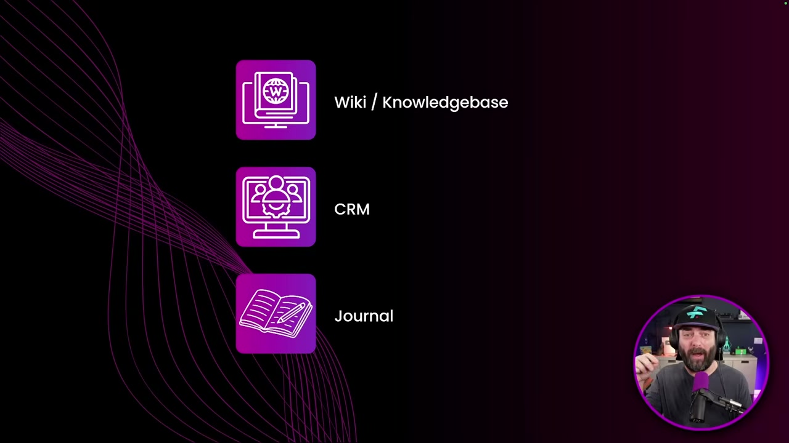

<!-- dig-section: 0 -->
## The Limitations of Traditional Second Brains

The speaker begins by showcasing an advanced, interactive knowledge management system he built, which he calls a "second brain." Unlike typical systems that are just passive storage, his is dynamic. It has a built-in wiki that he can chat with, a customer relationship management (CRM) tool, and an intelligent journaling function that can cross-reference the wiki to provide helpful insights on his journal entries. The system is a massive, interconnected web of all the content he's saved—from YouTube videos and podcasts to articles and tweets—all accessible through a simple chat interface.

### The problem with typical "second brain" systems

Most second brain systems, the speaker argues, are just "storage." You find interesting content like YouTube transcripts, articles, blog posts, or podcasts and simply dump them into one central place. The problem, he says, is that this is "where the information just goes to die." Unless you are actively and manually going back to review notes and search through your repository, it becomes a "dumping ground" for information you never look at again.

### Three pillars for an active knowledge base

To create a more useful and interactive system, the speaker designs his second brain around three core pillars:

1.  **Wiki/Knowledge Base**: This is the central repository where all external information is stored.  Anything he finds interesting on the web—YouTube transcripts, articles, tweets, podcast transcripts—gets saved here. This forms the foundation of the entire system.
2.  **CRM (Customer Relationship Management)**: This component is for managing personal and professional relationships.  Whenever he meets new people at events or on Zoom calls, he can log the details of the conversation. The CRM stores information like who he met, where and how they met, what they discussed, and their contact information. This adds a layer of personal context to his knowledge base.
3.  **Journal**: This is the interactive element that ties everything together.  The speaker is an avid journaler, writing daily about both his successes (what went right, things he's grateful for) and his struggles (videos underperforming, creative blocks, business decisions). The journal acts as the primary interface for interacting with the AI, which can then pull relevant information from the wiki, past journal entries, and the CRM to offer grounded, helpful responses.

While these are the speaker's chosen pillars, he emphasizes that the system is flexible. Others might replace the CRM or journal with inputs more relevant to their own lives, such as client notes, workout logs, research papers, recipes, or classroom notes. The central concept remains the same: a dynamic knowledge base at the core, connected to various streams of information that feed into it and can be intelligently cross-referenced.
<!-- /dig-section -->
