<!-- dig-section: 8 -->
## Building a Self-Improving AI System

The conventional way of using AI with personal files is inefficient. Each time you ask a question, the AI must read through all your documents from scratch, figure out what they are and how they relate to each other, and then try to answer. A week later, it has to do the entire process over again. It never remembers, learns, or gets faster.

This video proposes a different approach: building a self-improving knowledge base. It's a system that proactively gets smarter every day by automatically forming connections between all your scattered ideas and information. This concept, inspired by Andrej Karpathy's "LLM Wiki," is best understood as creating a structured "map" for your AI.

### How the AI Knowledge Map Works

Instead of pointing your AI at a messy pile of files, you give it a clean, organized map of everything you know, with all the connections between concepts already drawn. The AI consults this map first, allowing it to instantly understand what information it needs and where to find it. 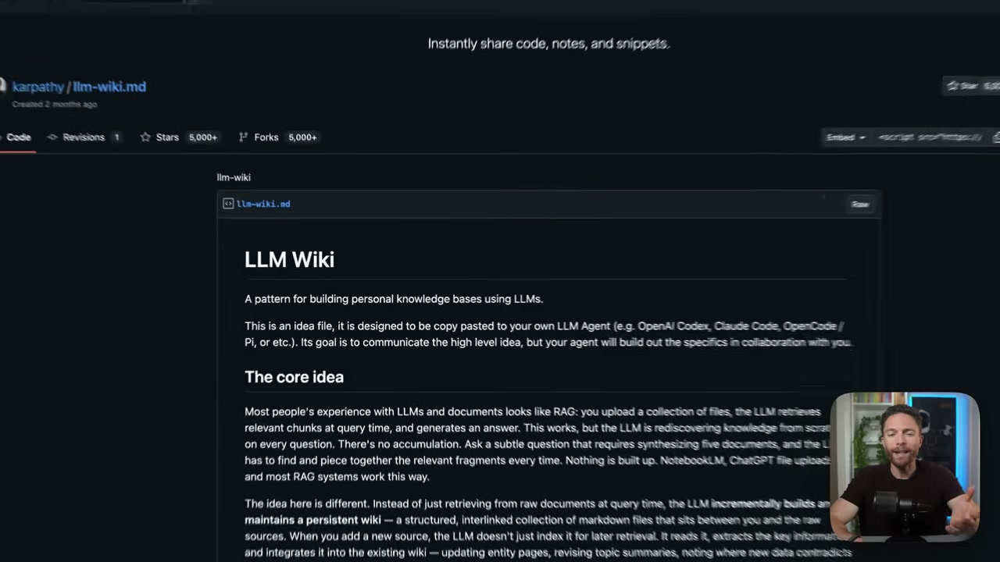

The best part is that the AI builds and maintains this map for you. You simply use your system as you normally would—capturing ideas, saving articles, logging data. Every night, an automated process has the AI review what you've created, determine where it fits on the map, and link it to other relevant files from the past. As it forms these new connections, it gets smarter and gains more context about you, your work, and your interests. This turns your collection of files into a true AI system that's more powerful than anything you could buy off the shelf, and it can be built in minutes using simple files on your computer.

### A Professional Knowledge Base in Action

The speaker demonstrates this with his own professional knowledge base, which is contained in a folder called "Knowledge." This folder is organized into sub-folders for topics, tools, sponsors, and important people. The information comes from various sources, including transcripts of his YouTube videos, saved articles, and tweets.

The AI organizes this raw information and creates an `index` file, which serves as a master table of contents for the AI itself. This index allows the AI to navigate the knowledge base efficiently. For example, a page dedicated to the "Gemini" AI model doesn't just contain raw transcripts. It's a synthesized document that lists every video the speaker has made about Gemini, consolidates articles he's saved, and analyzes how he personally positions the tool. 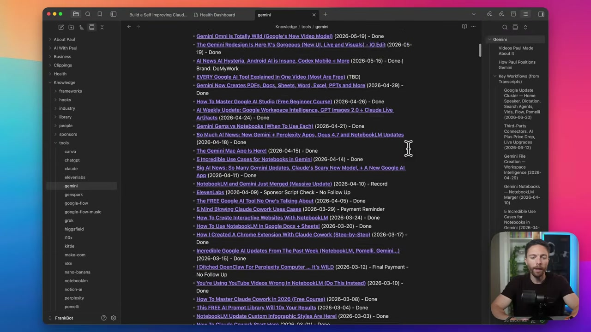 When he needs to create a new video or answer a question about Gemini, the AI already has a deep, contextual understanding of his specific perspective on the topic.

### Personal and Health Applications

This system isn't limited to work. The speaker runs a second, separate knowledge base for his personal health. He tracks daily metrics like sleep quality, calorie intake, weight, resting heart rate, and heart rate variability (HRV). This data is automatically fed into daily notes. 

The AI then processes these daily pages, organizing the information and building its map of his health trends. This allows him to have high-level conversations with his data, asking questions like, "How well is my progress going towards my goals?" Because the AI has already formed the connections and understands the context, it can quickly surface the relevant information and provide a synthesized assessment.

The setup is identical for any area of your life, whether it's your business, fitness, or a hobby. You simply add information, and the AI organizes it, creates a map, and keeps it updated automatically, ensuring it can always provide the most relevant and helpful answers.
<!-- /dig-section -->

<!-- dig-section: 292 -->
## Setting Up Your Knowledge Vault with Obsidian

The video uses an application called Obsidian to visualize and manage the knowledge base. It's a free app that presents your notes and their connections in a "graph view," showing clusters of related information as interconnected dots. 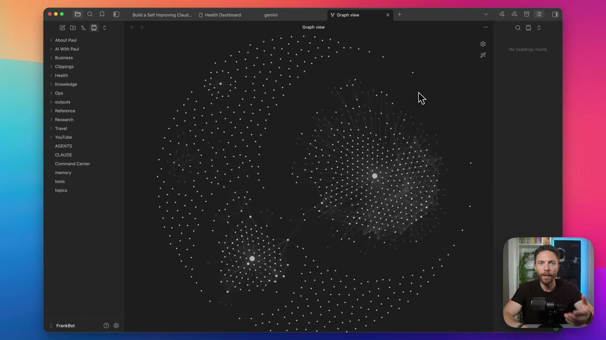 This visual approach helps in understanding the relationships between different pieces of information.

### Setting Up Your Obsidian Vault

When you first launch Obsidian, you need to create a "vault." This is simply Obsidian's term for a folder on your computer that will contain all your notes.

1.  From the initial screen, select "Create new vault."
2.  Give your vault a name, such as "Knowledge Base."
3.  Choose a location on your computer to save this folder (e.g., your Desktop).
4.  Click "Create."

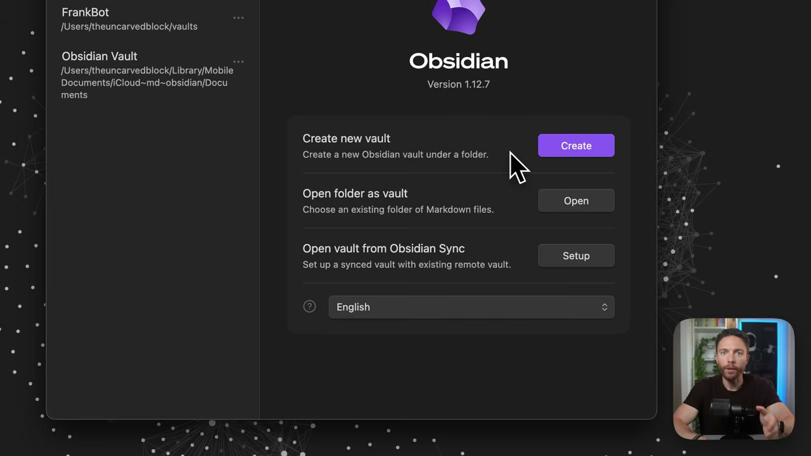

Obsidian will open this new, empty vault. The left sidebar will list all the files inside the vault's folder, which initially contains only a single "Welcome" note.

### Populating Your Knowledge Base

Since a vault is just a standard folder, you can add notes to it in a couple of ways.

*   **Manual File Transfer**: You can directly interact with the vault folder on your computer's file system. The speaker demonstrates this by dragging a collection of pre-existing note files from another folder directly into the new "Knowledge Base" folder on his desktop. 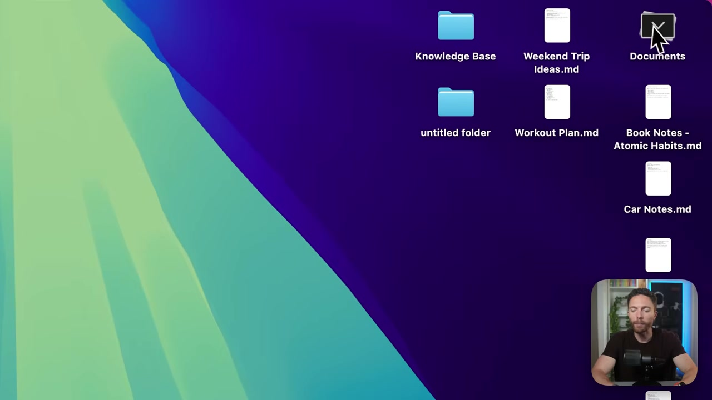 Immediately, these files appear in the Obsidian sidebar, ready to be viewed and edited.
*   **Creating Notes in the App**: You can also create new notes from within Obsidian itself. By clicking the "New note" icon, a blank note is created, and you can begin typing your ideas directly into the application.

### Capturing Web Content

A powerful way to grow your knowledge base is by saving content from the internet. The video recommends the free "Obsidian Web Clipper" Chrome extension. Once installed, if you're on a web page with an article or even a YouTube video you want to save, you can click the extension's icon in your browser toolbar. A window will pop up, allowing you to save the formatted content of the page directly into your Obsidian vault with a single click. 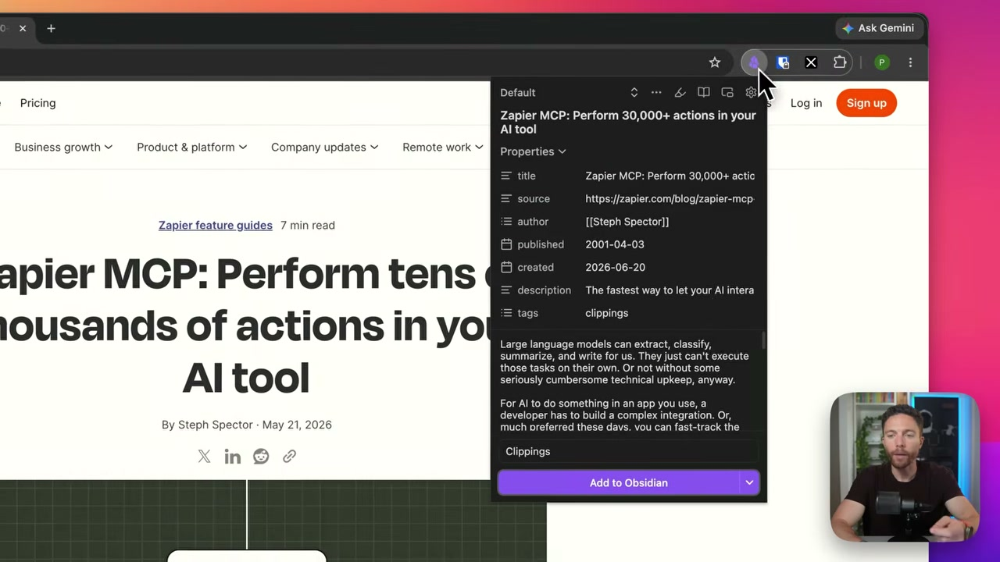 This is an efficient way to add new information to your knowledge base for later processing by your AI.
<!-- /dig-section -->

<!-- dig-section: 389 -->
## Integrating AI Tools and Expanding Data Input

The first step is to select a tool for knowledge base management. The speaker uses Claude Co-work, an AI assistant that can be grounded in your personal data.

### The Foundation: Claude Co-work

Claude Co-work offers two primary ways to build a knowledge base. The first is by connecting it to local files on your computer. You can point the AI to a specific folder, and it will gain access to all the files within it. For example, you can click "Work in a project or folder," select "Choose a different folder," and navigate your file system to select the folder where your knowledge base (like an Obsidian vault) resides. Once selected, Claude can read and utilize the information from every file in that directory.

The second method is through native integrations called "Connectors." By navigating to the "Customize" section and then to "Connectors," you can browse a directory of third-party applications that Claude can interact with directly. This includes popular tools like Notion, Gmail, and Google Calendar. This allows Claude to pull information from these services without you having to manually export files and place them in your knowledge base folder, making them a seamless part of your AI's context.

### The Limitation: The Connector Gap

The main problem with this approach is that Claude Co-work doesn't have a native connector for every application. With thousands of software tools available, the built-in connectors only cover a small fraction. If the information you need to feed into your knowledge base lives in an unsupported app, you are left with the tedious task of manually copying and pasting that data into files that Claude can access.

### The Bridge: Zapier MCP

This is where Zapier and its MCP (Multi-Channel Platform) feature provide a powerful solution. While Zapier is well-known for creating automated workflows between different apps, its MCP acts as a universal bridge for AI assistants. It connects Claude Co-work to the thousands of apps in Zapier's ecosystem, even those without a native Claude connector. 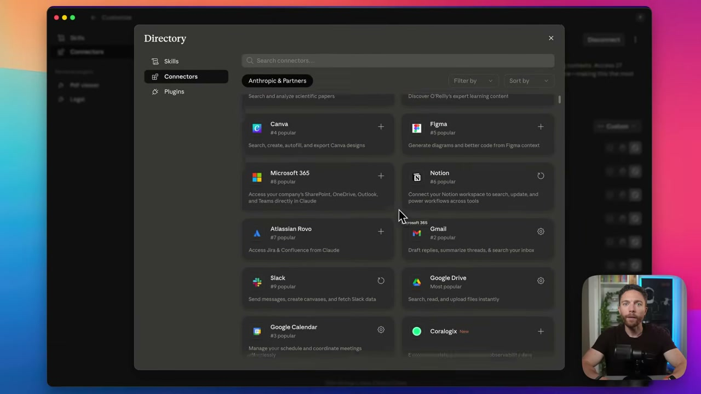

To set this up, you sign up for a Zapier account and navigate to the "MCP servers" section. There, you create a "New MCP Server" and select "Claude Co-work" as the client you want to connect. After a simple authorization process where you add the Zapier MCP to your Claude account, you can begin adding apps.

### Key Benefits of the Zapier Integration

The integration via Zapier MCP dramatically expands the potential of your knowledge base.

First, it gives you **granular permissions**. When you connect an application like Gmail through Zapier, you don't just grant blanket access. You can specify exactly which actions the AI is allowed to perform. You can permit it to find an email but not to delete one, or to create a draft but not to send it. This level of control is crucial for security and ensures the AI only has access to the functions you are comfortable with. 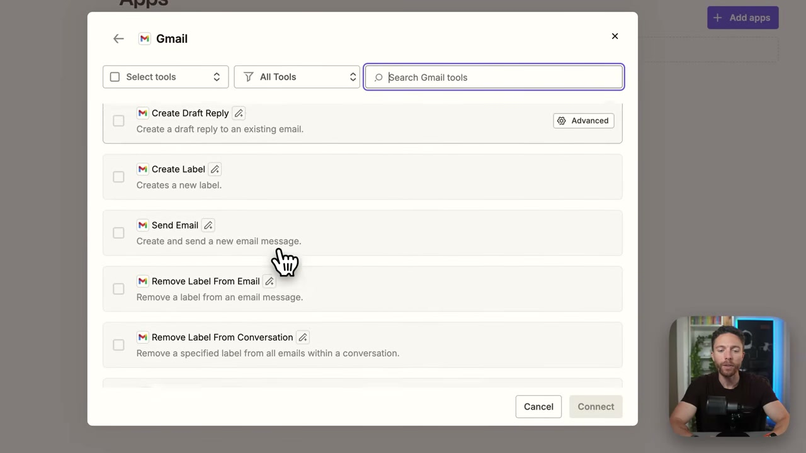

Second, it turns your knowledge base into an **automated, self-updating system**. The speaker provides an example of connecting his YouTube account—an app without a native Claude connector. Using Zapier MCP, he has set up an automation where Claude can pull analytics and other information from his YouTube channel every night and integrate it into the knowledge base automatically.

This transforms the knowledge base from a static folder that requires manual feeding into a dynamic system that actively pulls information from all the different places you work, creating a far richer and more comprehensive context for your AI.
<!-- /dig-section -->

<!-- dig-section: 569 -->
## Automating Knowledge Organization and Indexing

With your knowledge base files in a single folder, the next step is to build an intelligent system that organizes, connects, and maintains them. This is accomplished using a powerful prompt that instructs an AI agent to act as a self-improving knowledge manager.

### Executing the Prompt

The process begins by copying a detailed prompt from a Google Doc linked in the video's description. You then take this prompt to an AI tool with local file access, such as Claude Co-work. First, you point the AI to the specific folder containing your knowledge base. Then, you paste the entire prompt into the chat interface and send it.

This action kicks off a multi-step process. The AI, now acting as your dedicated agent, begins by analyzing the entire contents of the folder to understand what's there.

### The Organization Plan

Critically, the AI does not make any changes immediately. It first reads all the files and then proposes a detailed plan for approval. It identifies the types of notes, sees what themes are present, and suggests a new folder structure.

The proposed structure typically involves:
*   A `sources/` folder to hold the original, raw notes, kept as the untouched "source of truth."
*   A `wiki/` folder for the clean, organized, and interlinked pages that the AI will build and maintain. This is the primary interface for your knowledge.
*   A `_review/` folder to set aside junk files, empty notes, or default application files (like Obsidian's "Welcome" note) for you to decide on later.

The AI presents this plan and asks for explicit permission to proceed. After the user approves the overall structure, the AI asks a clarifying question: where the main `index.md` file (the "front door" of the map) should live. It recommends placing it inside the `wiki/` folder, which the user confirms.

### Enabling Self-Improvement

Once the initial organization is approved and complete, the AI moves to the final and most crucial step: making the system self-improving. It proposes creating a scheduled task that will run automatically.

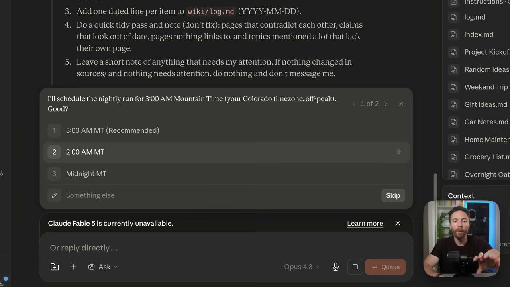

The user is prompted to choose a time for this daily task to run; 2:00 AM is selected as an off-peak time. Every night at this time, the AI will automatically perform a maintenance routine:
1.  Check the `sources/` folder for any new notes you've added or existing notes you've changed.
2.  Read and process each new or updated item.
3.  Integrate the new knowledge into the `wiki/`, either by updating an existing page or creating a new one.
4.  Update the `index.md` map and the `log.md` file to reflect the changes.
5.  Perform a quick "tidy pass" to identify any potential issues like contradictory pages or notes that lack links, leaving a note for you if anything needs your attention.

The user approves this final step, and the scheduled task is created.

### The Final Structure

Returning to the note-taking application (Obsidian), the transformation is complete. The previously flat list of files has been reorganized into the new folder structure.

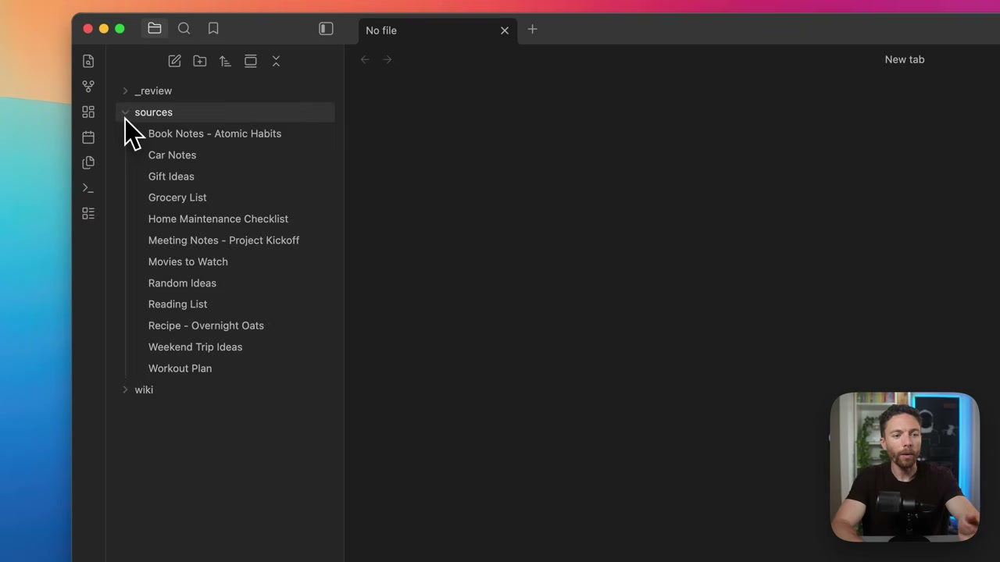

The `wiki/` folder now contains the clean, organized version of your knowledge. Most importantly, it contains the `index.md` file.

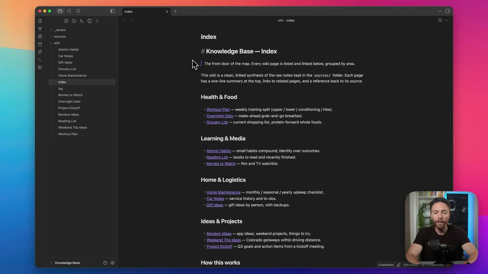

This index serves as a dynamic table of contents for your entire knowledge base. The AI has grouped related notes under clear headings like "Health & Food," "Learning & Media," and "Home & Logistics." Each item in the index is a direct link to its corresponding page. This index is the "map" the AI will read from and update each night, creating a knowledge base that automatically organizes and improves itself over time without any manual effort.
<!-- /dig-section -->

<!-- dig-section: 687 -->
## Harnessing Your Enriched AI for Advanced Insights

Once your knowledge base is set up, the AI assistant begins leveraging it automatically. You don't need to use special commands or phrasing; the AI will proactively pull relevant information from your notes to enhance its responses. For instance, if you start discussing a problem with a new client, the AI might recognize the pattern from a past project documented in your knowledge base. It could then surface the resolution you found for that similar, previous problem, providing a relevant solution that you might have forgotten.

This process happens naturally, but you can also be more direct and prompt the AI to perform analysis across your entire knowledge base. You can ask high-level questions to uncover latent patterns and insights, such as:
*   "What patterns have you noticed with my thinking lately?"
*   "Are there any missed opportunities you can identify based on my notes?"
*   "Based on what you know about me, are there any revenue streams I might be missing out on?"

The AI is adept at parsing your documented history to find these connections and provide thoughtful answers.

### Practical Implementations

The speaker highlights two specific, advanced ways he uses this capability beyond a general-purpose knowledge base.

#### Business Journal
Every few days, the speaker engages in a "journaling" session with the AI, discussing what's on his mind regarding his business—what's going well, where he's struggling, and his general thoughts. The AI captures this conversation. The key step happens at the end of each session: the AI is automatically prompted to find connections between the thoughts discussed in the *current* session and all *past* journaling entries. 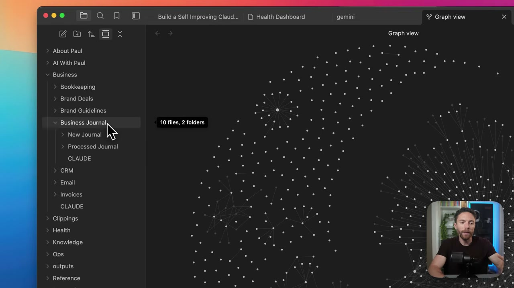 This creates a powerful feedback loop, helping to surface long-term patterns, recurring challenges, and evolving ideas within the business that might otherwise go unnoticed.

#### Health Knowledge Base
A second, dedicated knowledge base is used for tracking personal health. This system logs daily data points including workouts, caloric intake, water consumption, and even how the body reacts to different foods. All of this information is collected and then synthesized into a single, comprehensive health dashboard. 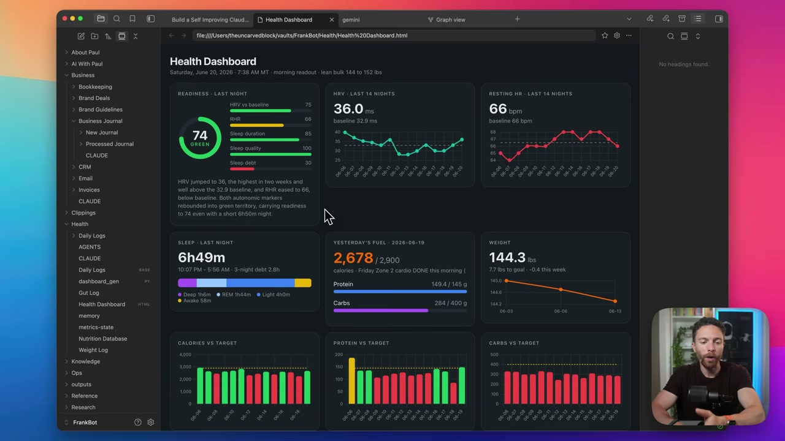 This allows the speaker to visualize trends, understand the impact of different lifestyle choices, and get a clear, data-driven overview of his health over time. The prompts and setup for both the business journal and health dashboard are available for others to use.
<!-- /dig-section -->

<!-- dig-section: 812 -->
## Conclusion

The tutorial concludes by summarizing the final result: a knowledge base that automatically builds and maintains itself. The speaker enthusiastically endorses this system as the single most useful thing he has set up for his AI coworker, emphasizing that it takes less than 15 minutes to configure.

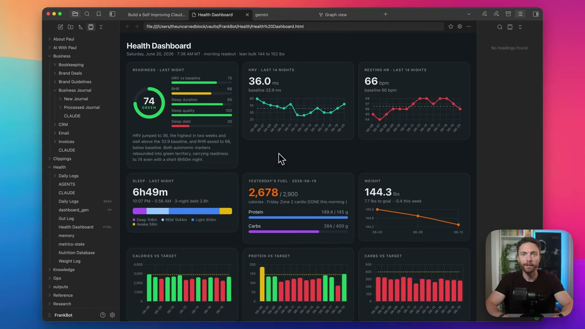

The true power of this setup is unlocked once you begin feeding it your personal or professional knowledge. As the AI ingests this information, it becomes a significantly more powerful and capable assistant. The on-screen example of a detailed "Health Dashboard" illustrates this point, showing how an AI can synthesize complex data streams (like sleep, heart rate variability, calories, and weight) into a coherent, actionable overview once it has access to that knowledge base.

Having demonstrated the value and relative ease of implementation, the speaker transitions to a call to action. He suggests that viewers who have watched the entire video must have found it useful and asks them to give it a thumbs-up and subscribe to the channel. He promises more tutorials of a similar nature and encourages viewers to subscribe to ensure they don't miss future content. He then signs off, thanking the audience for watching.
<!-- /dig-section -->
