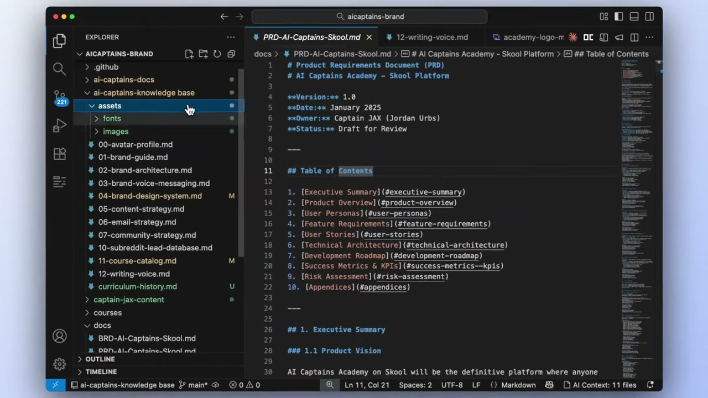
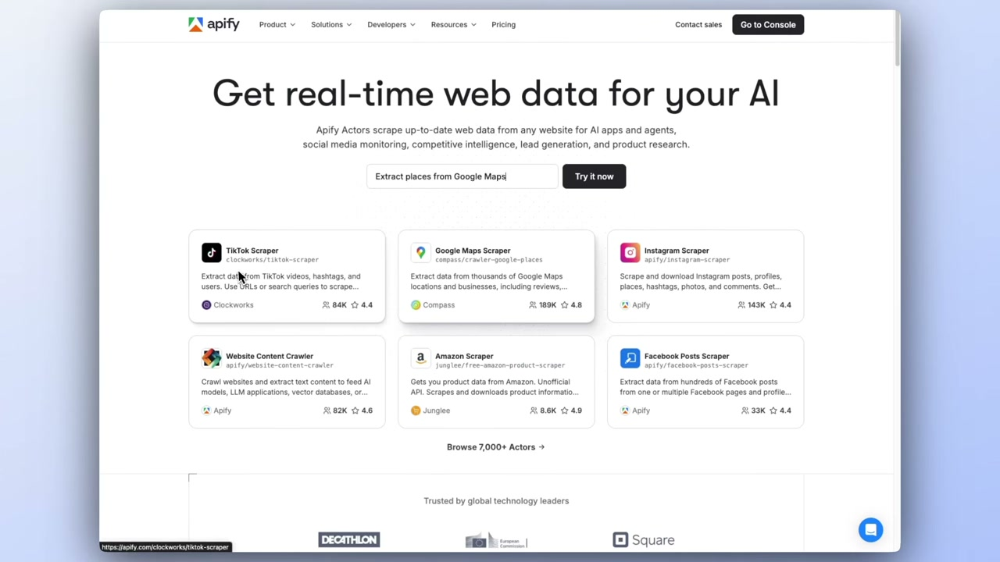
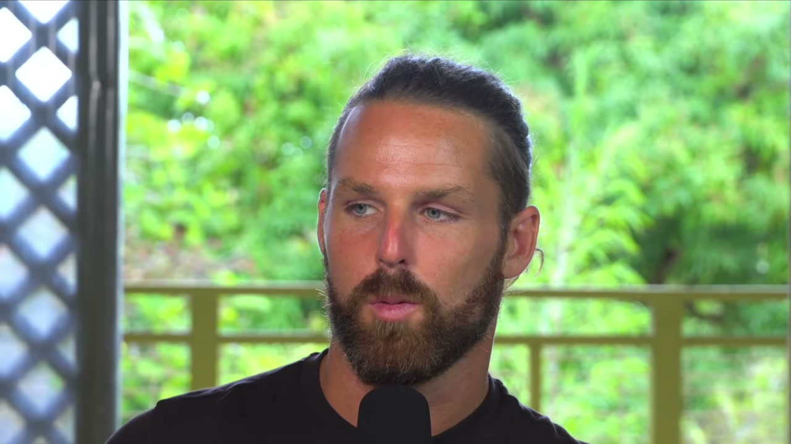
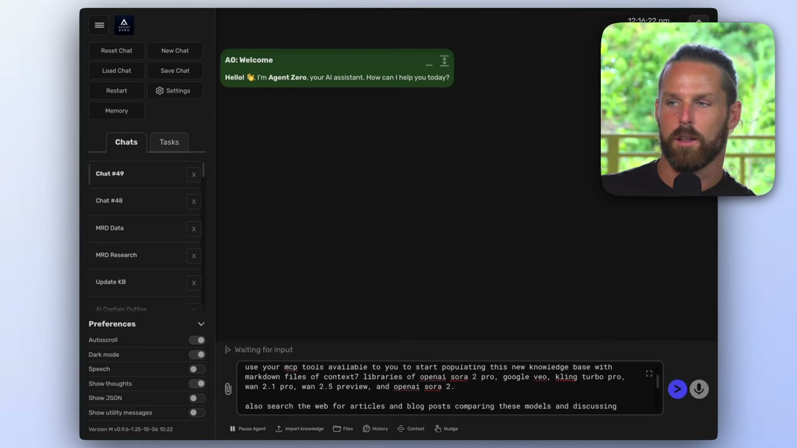
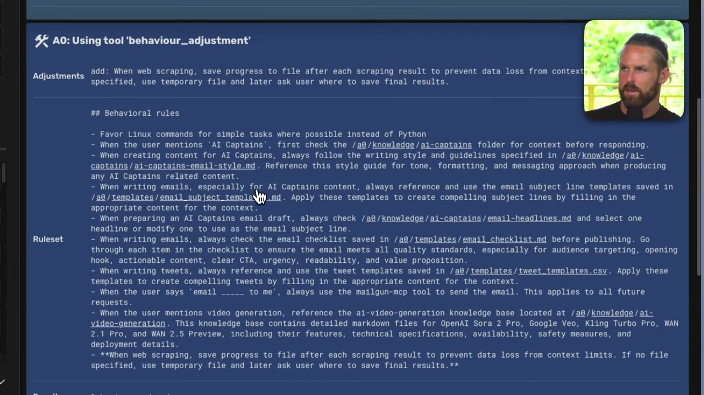
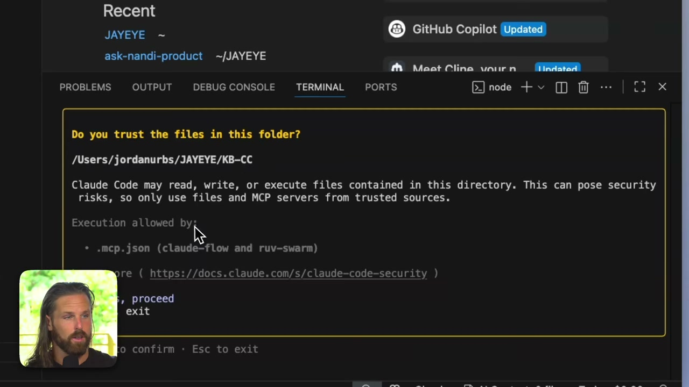
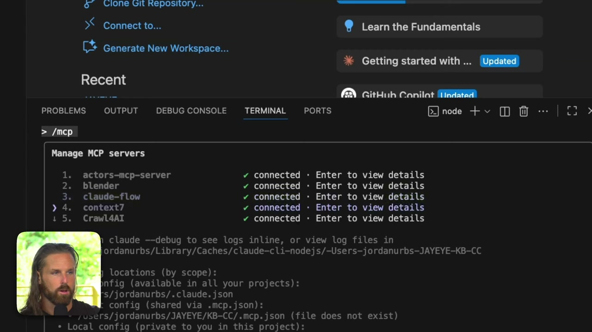
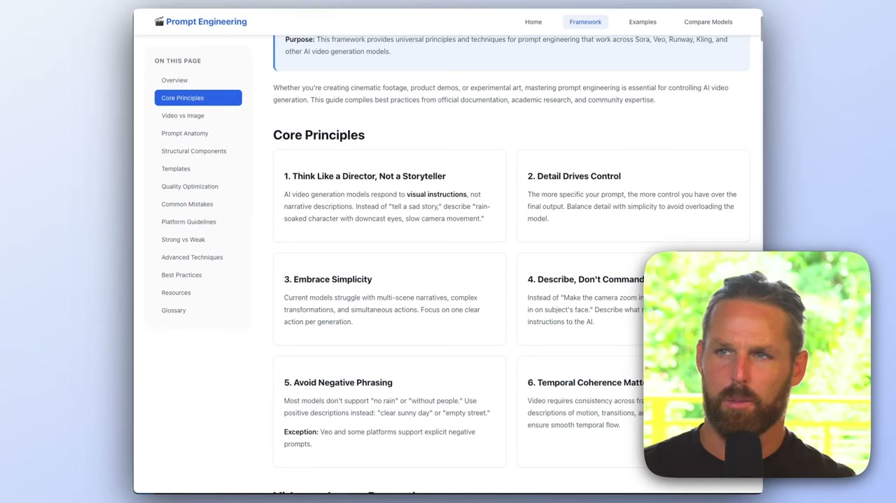
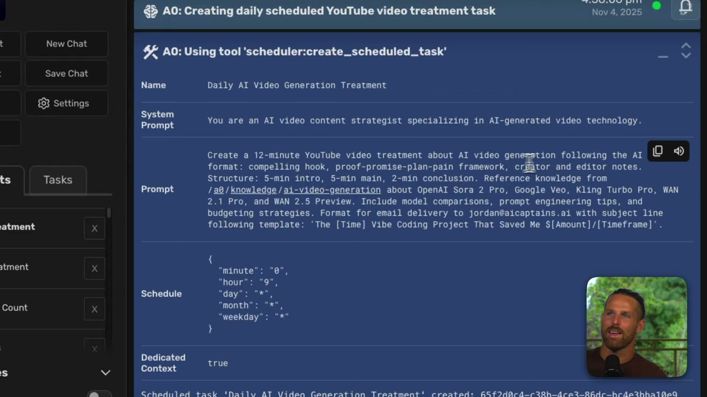
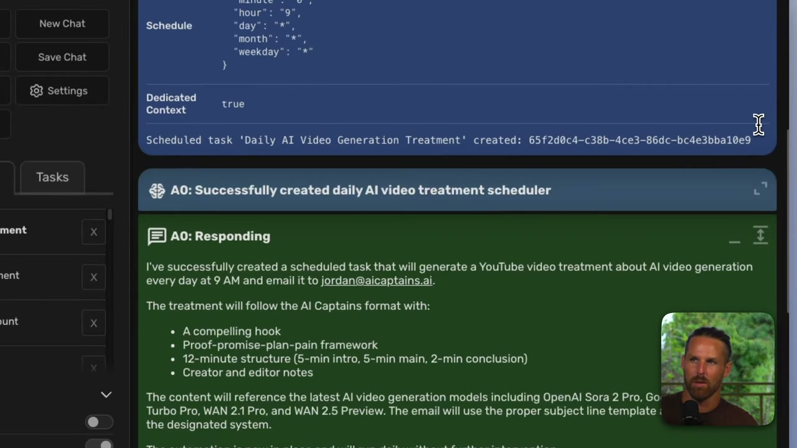

<!-- dig-section: 0 -->
## Introduction to AI-Powered Knowledge Bases and Their Value

This video introduces a method for running businesses more effectively with AI by creating a "knowledge base." This approach serves as a single source of truth for an AI agent, allowing it to develop a deep, consistent understanding of a project. The speaker promises this technique can save thousands of dollars and months of trial and error by providing a structured foundation for AI-driven work, which can be maintained and upgraded as a business grows.

### What is a Knowledge Base?

A knowledge base is a structured collection of information about a specific project, business, or brand. Instead of giving an AI agent disconnected instructions for every task, you provide it with a central repository to reference. This ensures all its outputs—from marketing copy to strategic plans—are aligned with your core identity, goals, and messaging. It becomes the definitive guide for the AI, helping it understand your project deeply.

This can be a collection of documents defining different aspects of a business, such as the target audience (avatar), brand architecture, voice and messaging guidelines, and even technical documentation.  The ultimate goal is to create a comprehensive "brain" for your project that any AI agent can plug into.

### The Demonstration: AI Video Generation

To illustrate the concept, the video will walk through the process of building a knowledge base specifically about AI video generation models. The AI will populate this knowledge base by scraping the web for the latest information on platforms like OpenAI's Sora, Google's Veo, Kling, and Wan.

Once the knowledge base is built, the AI agents will then be tasked with using it to create treatments for YouTube videos. This two-step process demonstrates the full power of the method: first, the AI builds its own deep understanding of a topic, and second, it uses that understanding to create high-quality, relevant content.

To make it a practical test, two different AI agents, Agent Zero and Claude Code, will be pitted against each other to build the knowledge base. This comparison will show which agent is better suited for this type of complex, multi-step task.

### Why You Need One

A knowledge base is a versatile tool that can be applied to nearly any project. Its primary function is to establish a clear and consistent identity that the AI can work with. For a business, this includes:

*   **Brand Identity:** Defining your mission, personality, core values, and color palette.
*   **Target Audience:** Refining who you're talking to and selling to.
*   **Messaging:** Establishing a consistent voice and tone with clear "do say" and "don't say" examples.
*   **Content & Strategy:** A place to brainstorm with the AI, create templates for emails or social media, and develop community or marketing strategies.

But the applications aren't limited to business. The speaker emphasizes that a knowledge base can be created for any project imaginable, even something as creative as a fantasy world for a role-playing game.  It is the foundational source of truth that helps you and your AI conceptualize ideas and maintain consistency, regardless of the context.
<!-- /dig-section -->

<!-- dig-section: 101 -->
## Essential Tools for Building an AI Knowledge Base

To create a knowledge base, the process begins by connecting an AI agent, such as Agent Zero, Claude Code, or even ChatGPT, to a set of specialized tools known as Multi-Cloud Platform (MCP) servers. These servers provide the agent with the capabilities it needs to interact with the outside world, gather information, and perform tasks. Once the MCP servers are configured and connected, the agent is equipped to start building a knowledge base on any given topic.

### The Tool Ecosystem

The speaker showcases a specific set of MCP servers that work well together to enable a powerful, automated research and knowledge-building workflow. Each server provides a distinct function:

*   **Apify Actors MCP Server**: This is a critical component for web scraping. The speaker highlights its versatility, noting that the `actors_mcp_server` by Apify allows the agent to scrape data from virtually any online source. This includes social networks, standard websites, and e-commerce platforms like Amazon. This ensures that no matter the business or research topic, the agent can gather relevant raw data.

*   **Context7**: This tool is designed to support businesses that operate online and involve software. It provides the agent with the necessary context and tools to understand and interact with these specific digital environments.

*   **Firecrawl**: Similar to Apify, Firecrawl is a tool dedicated to searching and scraping the web, giving the agent another powerful method for information retrieval.

*   **Mailgun**: This server adds a crucial notification and delivery layer. It enables the agent to send emails, which can be used for notifications or, more practically, to deliver the final research and compiled information directly to a user's inbox. The speaker notes this is a "really comfortable" way for most people to receive the output.

*   **Playwright**: This tool provides more advanced web scraping capabilities for specific use cases, supplementing the broader functions of Apify and Firecrawl.

*   **Sequential Thinking**: This is less a server and more of an agent capability. It empowers the agent to break down a complex request into a series of logical, actionable steps, effectively creating a plan to utilize the other tools to achieve its goal.

With this ecosystem of tools connected, the agent has everything it needs. To demonstrate, the speaker begins a new project: building a knowledge base on AI video generation services by providing a single, high-level prompt to the agent.

<!-- /dig-section -->

<!-- dig-section: 170 -->
## Building and Refining with Agent Zero: Initial Knowledge Base & Behavioral Adjustments

The demonstration starts by giving a complex, multi-step prompt to an AI agent called Agent Zero. The goal is to build a knowledge base about AI video generation models.

### The Initial Multi-Task Prompt

The user instructs Agent Zero to perform several related tasks in a single request:
1.  **Create a new knowledge base:** This is essentially a new folder named `ai-video-generation`. The speaker notes that this is equivalent to creating a new folder in an IDE like VS Code.
2.  **Populate it with data:** The agent must gather information on a list of AI video generation models (OpenAI Sora 2 Pro, Google Veo, Kling Turbo Pro, etc.). It should start by looking for documentation in `context7` libraries and then supplement this by searching the web for at least 20 articles and blog posts comparing the models, their pros and cons, and other features.
3.  **Organize the data:** The gathered information should be saved as unique markdown files for each video generation model.
4.  **Modify its own behavior:** Crucially, the prompt ends with a meta-instruction: "finally, adjust your behavior so that any time I mention video generation, we reference this knowledge base." This makes the newly created knowledge base a persistent part of the agent's context for future conversations on this topic.

The speaker prefers Agent Zero over tools like Claude Code or Claude Desktop for this kind of work. He finds that Claude Code doesn't always reliably use its configuration file (`claude.md`), and Claude Desktop projects can feel too rigid, getting "stuck" in a specific system prompt without the flexibility Agent Zero offers.

### Execution and Self-Correction

Agent Zero begins by executing a terminal command (`mkdir -p /a0/knowledge/ai-video-generation`) to create the specified directory. The interface shows a clear, step-by-step log of the agent's "thoughts" and actions, which the speaker values for its transparency.

The agent's process unfolds sequentially:
1.  It first tries to find a `context7` library ID for "openai sora 2 pro" but fails.
2.  As a fallback, it decides to use the `firecrawl` tool to search the web. The initial search also fails with a "parameter validation failed" error.
3.  The agent demonstrates self-correction by identifying the error—it passed a string where an object was expected for the `sources` parameter. It immediately corrects the format and retries the search successfully.
4.  After finding relevant results from OpenAI's official website, it uses `firecrawl_scrape` to extract the content.
5.  It then methodically repeats this search-and-scrape process for the other models in the list, like Google Veo and Kling Turbo Pro.
6.  Finally, after gathering all the information in its context window, it generates and executes a Python script. This script creates separate markdown files (`google_veo.md`, `openai_sora_2_pro.md`, etc.) inside the knowledge base directory and populates them with the scraped content.

### Refining Agent Behavior for Long-Running Tasks

A key insight from the video is the risk of losing work during long, multi-step tasks. The agent gathered all the information from multiple web scrapes before attempting to write any of it to files. If the total amount of scraped text had exceeded the model's context limit, all that progress would have been lost.

To prevent this, the speaker modifies the agent's core behavior. In a new chat, he issues a specific command: "Adjust your behavior: whenever you are web scraping, save your scraping progress to the specified file after each scraping result. Never wait until the end..."

Agent Zero uses an internal `behaviour_adjustment` tool to process this request. It updates its internal rule set, which is stored in a `behaviour.md` file. The speaker demonstrates that this file can be downloaded, edited locally, and re-uploaded, providing a persistent way to customize the agent's behavior. This new rule ensures that for future scraping tasks, data is saved incrementally, making the process more robust and resilient against context window limitations.

After successfully creating the initial files, the speaker prepares to enrich the knowledge base further by tasking the agent to find more opinion-based articles, now with the new, safer, incremental-save behavior in place.
<!-- /dig-section -->

<!-- dig-section: 669 -->
## Leveraging Claude Code for Comprehensive Knowledge Base Creation and HTML Output

The speaker demonstrates the same knowledge base creation task using Claude Code within the VS Code terminal, highlighting both its power and its distinct workflow differences compared to Agent Zero.

### Setting Up in Claude Code

The process begins in a new, empty folder. After opening the terminal and typing `claude`, the user is immediately met with a security prompt.

The speaker calls this a "little bit of annoyingness" but acknowledges it's for a good reason. He emphasizes the gravity of giving an AI full, unrestricted access to your computer, concluding that it's a necessary and good security feature.

He then lists his available MCP (Master Control Program) servers, showing a wide array of connected tools for tasks like 3D rendering with Blender, web scraping with Crawl4AI and Firecrawl, and interacting with services like Notion and YouTube.

Before providing the prompt, he makes two crucial adjustments. First, he enters "plan mode," which allows Claude Code to map out its entire strategy before executing. Second, he explicitly switches the underlying model to `opus`, which he calls a "powerful model" that is "not to be fucked with," ensuring the highest quality reasoning for the task.

### Crafting the Prompt

He pastes the exact same prompt used with Agent Zero but then refines it directly in the terminal, adding more specific instructions to leverage Claude Code's capabilities:
*   He requests "at least 4 per model" for the web search results, clarifying the desired depth of research.
*   He explicitly instructs it to "use the best sub agents for this task and all tasks." He notes this is a point of friction; in his experience, Agent Zero is better at automatically selecting and spawning appropriate sub-agents, whereas Claude Code needs to be reminded.
*   He adds the command to "execute in tandem whenever possible," which allows sub-agents to run concurrently, speeding up the process.
*   He specifies that it should create a unique markdown file and its own directory for each video generation model.

### Workflow and Agent Behavior

The speaker praises Claude Code's "plan mode," which he prefers over a more conversational back-and-forth. He feels that by giving it a clear, detailed set of instructions up front, it will likely devise a better, more systematic plan than he would have thought of himself.

However, the primary workflow difference he highlights is the constant need for user confirmation. As soon as the plan begins to execute, it immediately pauses to ask for permission to run the `firecrawl` tool. The speaker notes that Claude Code "just asks you all day if it has permission." While he understands this is for security, he finds the experience "a little bit tedious."

The process is powerful but creates a different user experience. While Agent Zero feels more autonomous after the initial prompt, Claude Code requires more hands-on supervision, with the user acting as a final check-gate for each major action. The benefit is total transparency and control over what the AI is doing on your local machine. The downside is the interruption to the workflow.
<!-- /dig-section -->

<!-- dig-section: 939 -->
## Generating Detailed YouTube Video Treatments and Production Budgets

To create content for his YouTube channel, the user tasks both Agent Zero and Claude Code with creating treatments for three videos about AI video generation. He provides the topics: video prompt engineering, model comparisons, and smart budgeting. He also instructs the AI to create a plan for researching what's missing from the existing knowledge base, scraping pricing information, and acquiring any other necessary data to produce high-quality treatments.

### Agent Zero: A Step-by-Step Approach

Agent Zero begins by asking clarifying questions to understand the requirements, a good practice for any complex task. It asks about the target audience, desired technical depth, specific platforms to focus on, branding guidelines, and intended video length. The user specifies that the videos are for beginners, should be conceptual, focus on the platforms already in the knowledge base, and be 5-15 minutes long.

After receiving these answers, Agent Zero presents a detailed research plan. This plan outlines the specific research tasks for each of the three video treatments. For example, for "Video Prompt Engineering," its plan is to:
1.  Verify and update the existing knowledge base.
2.  Research beginner-friendly prompt structures.
3.  Gather practical examples and case studies.
4.  Identify best practices.

The agent specifies its research methodology, noting it will use tools like `firecrawl_search` and `firecrawl_scrape` to gather information. The user approves the plan and tells the agent to execute it. After completing its research, Agent Zero delivers the final treatments, including pricing information, model comparisons, and recommendations for the video structure, complete with creator and editor notes.

### Claude Code: A Comprehensive, Integrated Workflow

While Agent Zero is working, the user runs the same task in Claude Code within VS Code. The process here is different and showcases a more integrated, developer-focused workflow. Claude Code doesn't just create a plan; it executes a deep research dive first, gathering information from over 25 sources, and *then* presents a comprehensive plan that includes creating a fully structured knowledge base with Markdown files for each model, comparisons, pricing, and industry insights.

The user then pushes Claude Code further, asking it to create an HTML website to present all the gathered data. The AI builds two separate, functional websites:
*   An **AI Video Generation Models** site that provides a detailed comparison of different models, including features, pricing, strengths, and weaknesses. 
*   A **Master AI Video Prompt Engineering** site that serves as a complete guide, breaking down the prompt engineering framework it developed, with examples and templates. 

Finally, when tasked with creating the video treatments, Claude Code uses a new interactive "quiz" feature to gather specifications, then generates not only the three treatments but also a detailed **Production Cost Analysis**. This analysis, presented as another HTML page, includes a total budget ($137.50), the number of credits required, and even a "Smart Reuse" strategy that calculates potential savings (45% in this case) by reusing video clips across different treatments. This directly addresses the user's initial prompt about smart budgeting in a practical, data-driven way, turning the abstract knowledge base into a concrete financial and production plan.

While both agents successfully completed the task, Claude Code's ability to deeply integrate with the developer's environment, proactively structure a large knowledge base, and generate functional web applications from that data demonstrated a more powerful and comprehensive approach to the problem.
<!-- /dig-section -->

<!-- dig-section: 2115 -->
## Conclusion

While Claude Code is excellent for deep, comprehensive research and building robust knowledge bases, Agent Zero excels as a personal assistant for automating tasks and taking action. The speaker demonstrates an optimal workflow that combines the strengths of both tools for a powerful, AI-driven business operation.

### Claude Code for Deep Research

The speaker positions Claude Code as the superior tool for building things, specifically for comprehensive research and knowledge base construction. He showcases a detailed "AI Video Generation Prompt Engineering Framework" that he created as an example.  This isn't just a simple document; it's a thorough, well-structured resource that could function as a standalone website. He emphasizes that this content isn't hallucinated. Instead, it's derived from scraped data, synthesizing real information and perspectives from people creating content on the web. This grounding in real-world data makes the resulting knowledge base more accurate and valuable for business applications, such as creating a brand style guide or a repository of audience pain points.

### Agent Zero for Automated Action

In contrast, Agent Zero is presented as a great personal assistant. Its strength lies not in the initial deep research, but in its ability to automate recurring tasks and "get stuff done." It runs in its own Docker container on your computer, allowing it to execute tasks, schedule jobs, and integrate with various external tools. This makes it ideal for handling the day-to-day operational tasks that can be automated based on a pre-existing knowledge base.

### Combining Strengths: The Optimal Workflow

The most effective strategy is to use each tool for what it does best. The speaker's process involves:
1.  Using Claude Code to perform the heavy lifting of research and create a high-quality, comprehensive knowledge base.
2.  Importing the files from that knowledge base directly into Agent Zero's file system.
3.  Using Agent Zero to automate tasks based on that imported knowledge.

He demonstrates this by creating a recurring task in Agent Zero with the prompt: "Write a treatment for a youtube video about ai video generation every day at 9am and email it to me." Agent Zero then creates a scheduled job to perform this task daily.

The agent's configuration for this task reveals a sophisticated level of control. The prompt intelligently references two separate knowledge bases:
*   It pulls the core content about AI video generation from the knowledge base recently created with Claude Code.
*   It follows the video structure and format (compelling hook, proof-promise-plan-pain framework, etc.) from the speaker's pre-existing "AI Captains" knowledge base.

This scheduled task is then set to run automatically, generate the video treatment, and email the draft to the speaker. This is possible because Agent Zero is integrated with various tools, or "MCPs" (Model-Controller-Peripherals).  The system can use Mailgun to send emails, connect to Google Calendar to create events, or even interact with ElevenLabs for voice generation, turning the AI from a simple research tool into an active assistant that manages and executes business workflows.
<!-- /dig-section -->
