<!-- dig-section: 9 -->
## Navigating and Creating Projects

To begin, navigate to the "Projects" tab. This is accessible via the vertical icon bar on the far left of the Claude.ai interface. The icon looks like a folder or a set of documents.

### Managing Your Projects

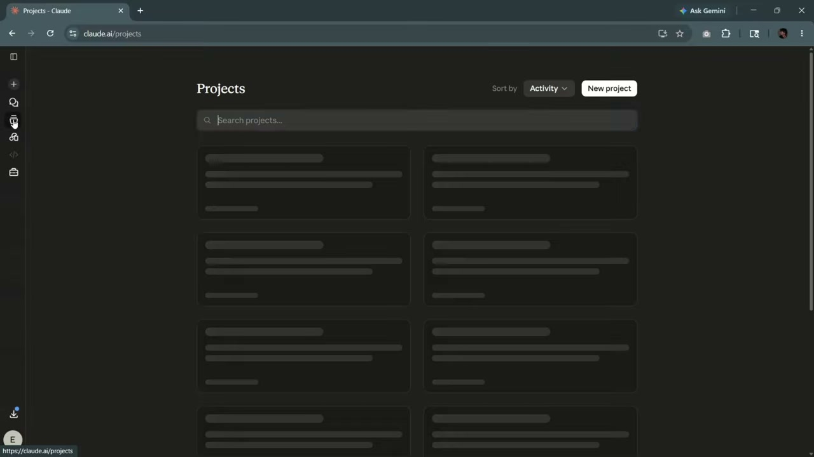

Upon entering the Projects section, you'll see a dashboard displaying all your existing projects. Each project is presented as a card, showing its title, a brief description, and when it was last updated. For example, the screen shows projects titled "Personal Coding Projects," "Personal Hobbies," and "Research Projects."

### Creating a New Project

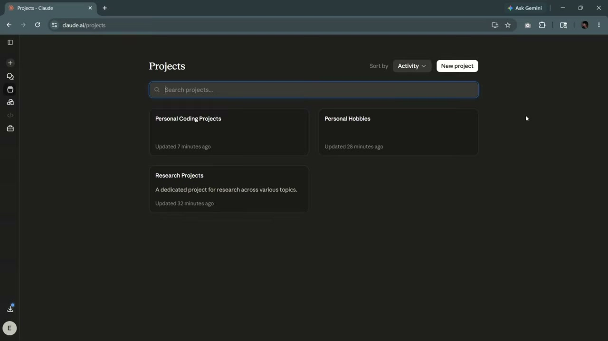

If you don't have any projects or wish to start a new one, click the "New project" button located in the upper-right area of the dashboard. This action opens a "Create a project" dialog box. You are prompted to provide two pieces of information:
*   **Name your project**: A required field for the project's title.
*   **What are you trying to achieve?**: An optional field where you can describe the project's goals, subject, or other relevant context.

Once you fill in the details, click "Create project" to finalize.

### Inside a Project

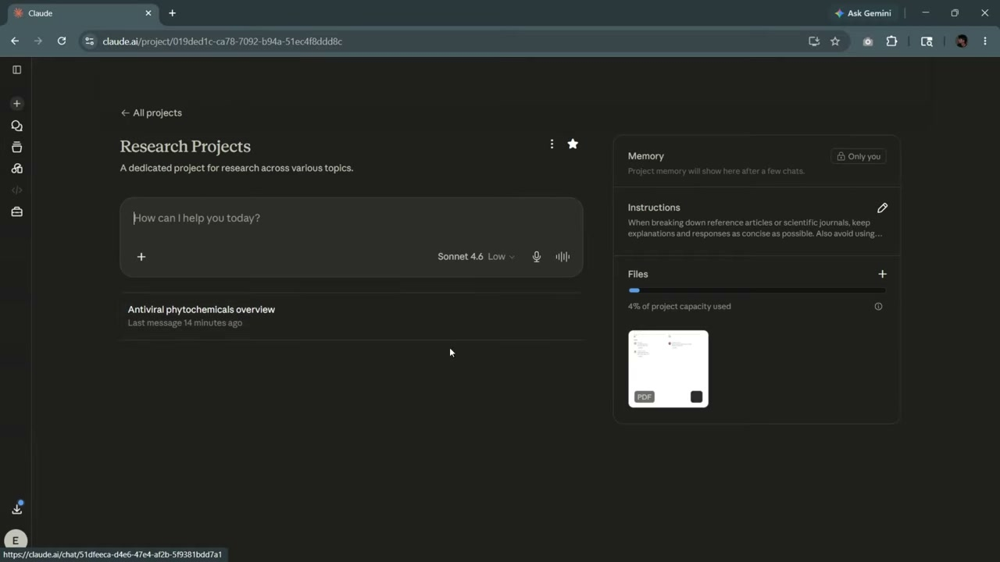

After creating or selecting an existing project, you are taken to its dedicated workspace. This view retains the familiar chat interface in the main area but adds project-specific context. The project's title and description are displayed at the top. On the right-hand side, a panel appears with sections for "Memory," "Instructions," and "Files," allowing you to manage the context and resources for all conversations within that specific project.
<!-- /dig-section -->

<!-- dig-section: 31 -->
## Understanding Cloud Project Components

Within a Claude project, a control panel on the right side of the screen houses three essential components that shape the AI's behavior and context for that specific workspace. These are the project's memory, instructions, and files.

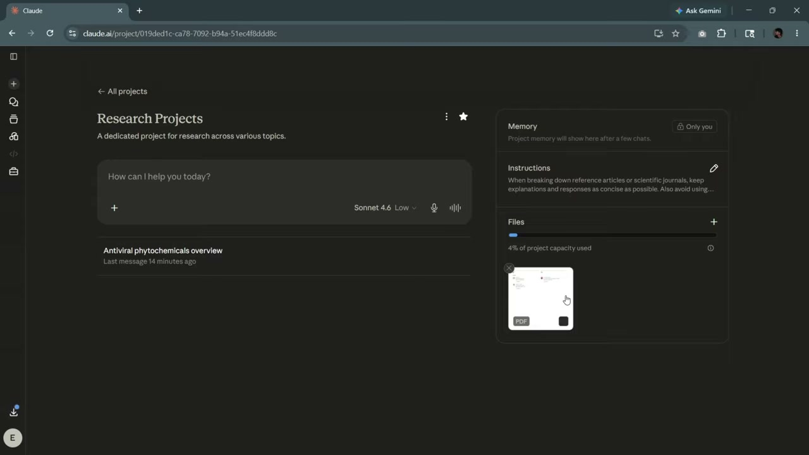

### Memory
The "Memory" section is designed to provide conversational continuity. According to the on-screen text, "Project memory will show here after a few chats." This feature automatically distills and retains key facts and context from your interactions within the project, allowing the AI to remember important details across multiple conversations without needing to be reminded.

### Instructions
This section acts as a persistent system prompt. Here, you can provide specific directives that guide the AI's personality, tone, and response format for all conversations within the project. In the video's example "Research Projects," the instructions direct the AI to "keep explanations and experiments as concise as possible" when summarizing scientific articles, ensuring a consistent output style tailored to the project's goal.

### Files (Knowledge Base)
Labeled "Files," this area serves as the project's dedicated knowledge base. You can upload documents, articles, or other reference materials for the AI to use as a source of truth. The AI will then draw upon the information contained in these files to answer questions and complete tasks. The interface displays a "project capacity used" meter (showing 4% in the video), indicating that there is a storage limit for the knowledge base.
<!-- /dig-section -->

<!-- dig-section: 39 -->
## Adding Files to Your Knowledge Base

To add a file to your project's knowledge base, navigate to the "Files" section located on the right-hand panel of the project interface. Clicking the plus (+) icon next to the "Files" heading reveals a context menu with several options for adding content.

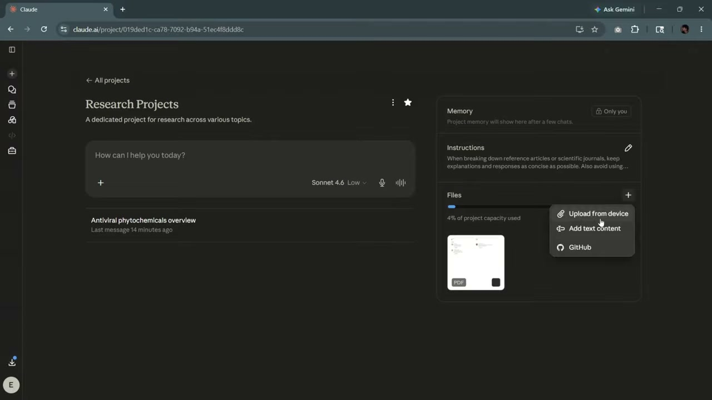

The primary method demonstrated is uploading directly from your computer. By selecting "Upload from device," you can add local documents to the project. Other options available include "Add text content" for pasting raw text and "GitHub" for integrating code repositories. The narrator advises choosing whichever option is most appropriate for the content you wish to add.

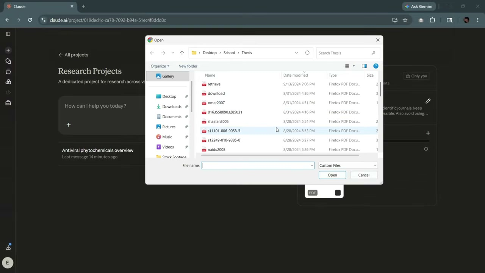

Upon choosing to upload from a device, a standard file-picker dialog box opens. This allows you to browse your local file system. In the video, the user navigates to a "Thesis" folder and selects a PDF document to upload. After selecting the desired file and clicking "Open," the upload process begins.

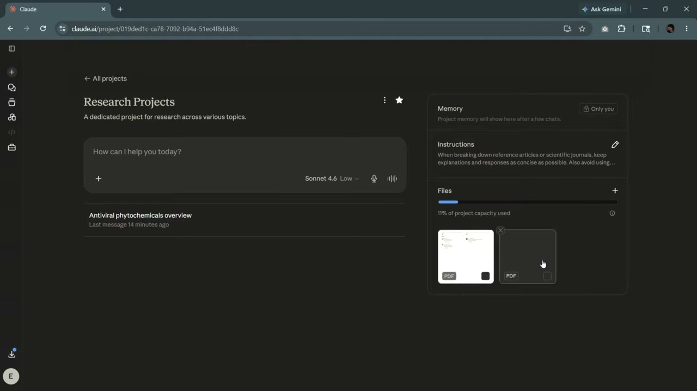

Once the upload is complete, a new thumbnail representing the added file appears in the "Files" section of the project. The "project capacity used" indicator also updates to reflect the addition of the new file, confirming that it is now part of the project's knowledge base and ready to be used.
<!-- /dig-section -->

<!-- dig-section: 57 -->
## Impact of Knowledge Base on AI Responses

In the "Research Projects" workspace, the user demonstrates how to establish a persistent knowledge base for the AI model. On the right side of the interface is a "Files" panel where documents can be stored. The user selects a specific PDF from this panel, `umezawa2002.pdf`, which then opens in a new browser tab.

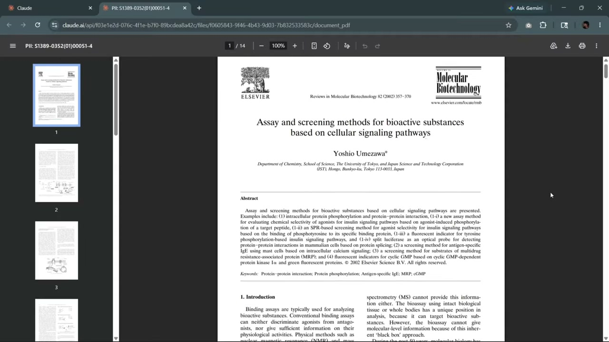

This document is a scientific paper titled "Assay and screening methods for bioactive substances based on cellular signaling pathways." The narrator explains the key functionality: this file is now part of the project's permanent knowledge base. This means that for any future conversation started within this project, the AI will automatically use the contents of this document as a reference. When generating responses, it will draw upon the specific information and context provided in the paper, effectively creating a specialized assistant knowledgeable about that particular scientific topic.
<!-- /dig-section -->

<!-- dig-section: 83 -->
## Achieving Consistent Output with Instructions

By combining a project's knowledge base (uploaded files) with project-level instructions, you can ensure the AI generates responses in a consistent style and format across all chats within that project. This feature is particularly useful for maintaining a uniform tone, level of detail, or structure for recurring tasks like summarizing research papers.

The user demonstrates this by navigating to their "Research Projects" dashboard. On the right-hand side, there are panels for "Memory," "Instructions," and "Files." The "Instructions" panel contains persistent guidelines for the AI.

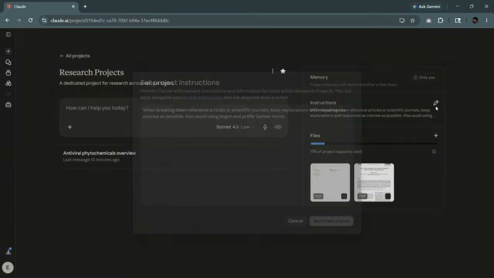

In this example, the user has set the following instructions: "When breaking down reference articles or scientific journals, keep explanations and responses as concise as possible. Also avoid using jargon and prefer layman terms." These instructions apply to every chat created within this specific project.

To show this in action, the user opens a previous chat about "Antiviral phytochemicals." They had asked the AI to "Quickly summarize information about antiviral phytochemicals," a topic covered in a document uploaded to the project's "Files."

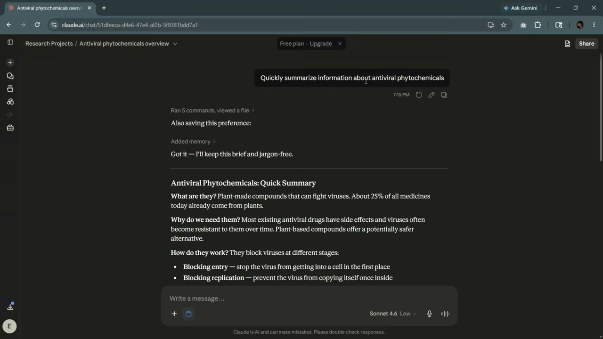

Crucially, Claude's response begins by acknowledging the project-level rules: "Added memory... Got it — I'll keep this brief and jargon-free." This confirms that the AI has internalized the instructions and will apply them to the task. The resulting "Antiviral Phytochemicals Quick Summary" is, as requested, concise and written in simple, easy-to-understand language.

The key benefit is that if the user were to start a new chat and ask the AI to summarize a different document from the knowledge base, it would automatically apply the same "brief and jargon-free" style without needing to be prompted again. This creates a predictable and consistent workflow for analyzing documents within the project.
<!-- /dig-section -->

<!-- dig-section: 128 -->
## Conclusion

The video demonstrates how to create a dedicated project space within an AI assistant to customize its behavior for specific tasks. This is achieved by providing a persistent knowledge base and a set of instructions, ensuring the AI's responses are consistently relevant and styled to the user's preference.

### Customizing AI Behavior with Projects

The core idea is to move beyond one-off chats and establish a long-term context for the AI. In the video, the user has created a "Research Projects" space. Within this project, two key features are highlighted for tailoring the AI's output: Memory and Files.

### Persistent Instructions (Memory)

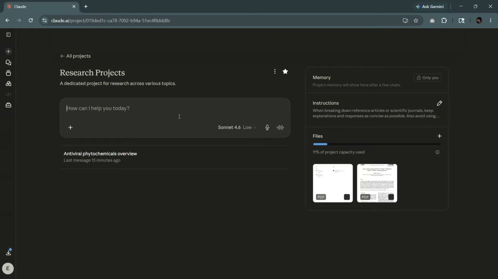

The "Memory" section allows the user to set standing instructions that the AI will adhere to across all conversations within that specific project. The on-screen example instructs the AI: "When breaking down reference articles or scientific journals, keep explanations and experiments as concise as possible." This ensures that whenever the user discusses scientific papers in this project, the AI will automatically adopt a concise, summary-oriented style without being prompted each time. The earlier interaction, where the AI confirms, "Got it -- I'll keep this brief and jargon-free," is a direct result of these saved preferences. This feature is crucial for maintaining a consistent tone and format, which is particularly useful for ongoing work.

### Contextual Knowledge (Files)

The "Files" section serves as a dedicated knowledge base for the project. The user can upload specific documents, which the AI will then use as a primary source of information for its responses. This grounds the AI's answers in the user-provided context, making them highly accurate and relevant to the user's specific domain. By referencing these documents, the AI can answer questions, summarize content, and generate insights based on proprietary or specialized information that is not part of its general training data. Combining this custom knowledge base with the persistent instructions in "Memory" creates a powerful, specialized AI assistant tailored to a specific workflow.
<!-- /dig-section -->
