<!-- dig-section: 66 -->
## 옵시디언 엑스칼리드로 플러그인 소개 및 설치

Excalidraw 플러그인을 설치하고 활성화하는 과정은 간단하지만, 좋은 플러그인을 선택하는 요령을 알아두는 것이 중요합니다.

### 플러그인 설치 및 활성화 과정

1.  Obsidian 창 좌측 하단에 있는 톱니바퀴 모양의 '설정' 아이콘을 클릭합니다.
2.  설정 메뉴에서 '커뮤니-티 플러그인' 탭으로 이동합니다.
3.  '탐색' 버튼을 클릭하면 커뮤니티에서 개발한 수많은 플러그인 목록이 나타납니다. 영상에서는 5,125개의 플러그인이 있다고 언급합니다.
4.  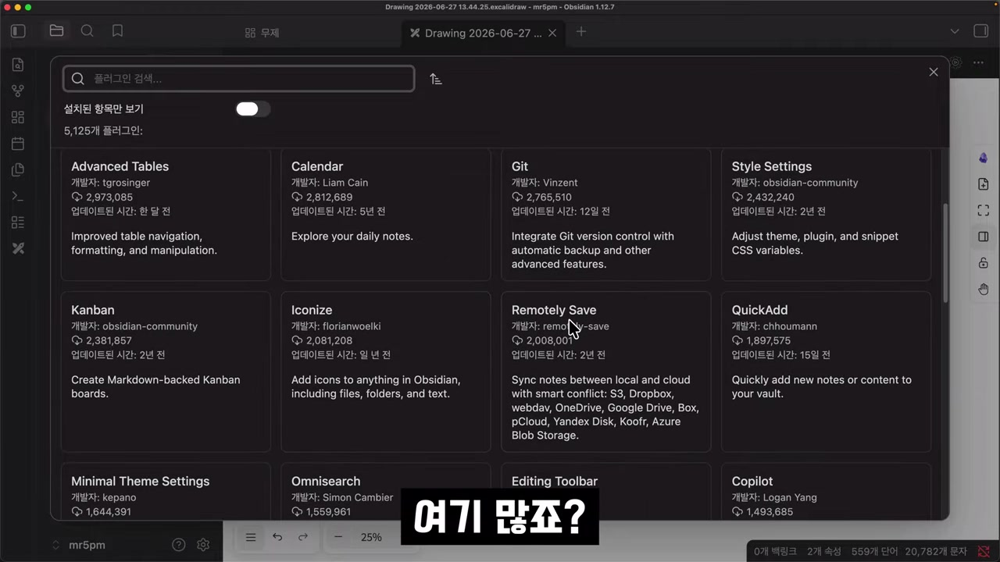
    가장 인기 있는 플러그인 중 하나인 'Excalidraw'를 찾아 클릭합니다.
5.  '설치' 버튼을 누르면 플러그인이 다운로드됩니다.
6.  설치가 완료되면 버튼이 '활성화'로 바뀝니다. 이 버튼을 클릭해야 플러그인이 Obsidian 내에서 실제로 동작하기 시작합니다.
7.  활성화가 완료되면 'Welcome to Excalidraw'라는 팝업 창이 나타나며 설치가 성공적으로 끝났음을 알립니다. 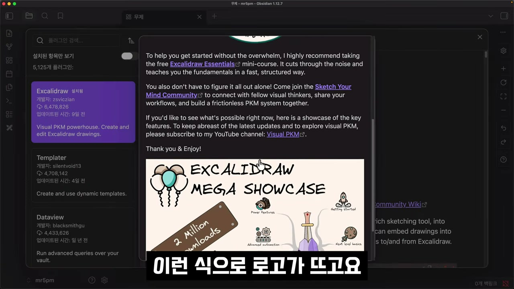

### 좋은 플러그인을 선택하는 기준

영상에서는 수많은 커뮤니티 플러그인 중에서 안정적이고 유용한 것을 고르는 두 가지 중요한 기준을 제시합니다.

*   **다운로드 수**: 플러그인의 인기도와 신뢰도를 가늠할 수 있는 지표입니다. 많은 사용자가 다운로드했다는 것은 그만큼 널리 사용되고 검증되었다는 의미입니다. 영상에서 Excalidraw는 647만 회 이상 다운로드된 것을 확인할 수 있습니다.
*   **최근 업데이트 날짜**: 플러그인이 활발하게 유지보수되고 있는지 판단하는 핵심 기준입니다. 영상에서는 Excalidraw가 '최근 업데이트: 9일 전'이라고 표시된 것을 보여주며, 이는 개발자가 버그를 수정하고 기능을 개선하는 등 꾸준히 관리하고 있다는 신호입니다.  반면, 업데이트가 1년 이상 중단된 플러그인은 최신 Obsidian 버전과 호환성 문제가 발생하거나 보안에 취약할 수 있으므로 설치를 피하는 것이 좋습니다.
<!-- /dig-section -->

<!-- dig-section: 156 -->
## AI를 활용한 엑스칼리드로 드로잉

유튜브 크리에이터들이 개념을 시각적으로 설명할 때 자주 사용하는 도구로 '엑스칼리드로(Excalidraw)'가 있습니다. 이 도구는 손으로 그린 듯한 자연스러운 느낌의 다이어그램이나 스케치를 쉽게 만들 수 있게 해줍니다. 영상의 발표자 역시 개념 설명 시 엑스칼리드로를 주로 사용한다고 밝히며, 이 도구와 AI의 결합 가능성에 대한 흥미로운 질문을 던집니다. 과연 AI가 엑스칼리드로를 이용해 그림을 그릴 수 있을까요?

### 엑스칼리드로 설치 및 기본 사용법

Obsidian 내에서 엑스칼리드로를 사용하려면 먼저 커뮤니티 플러그인에서 검색하여 설치해야 합니다. 설치가 완료되면 Obsidian 좌측 사이드바에 'New drawing'을 위한 새로운 아이콘이 나타납니다. 이 아이콘을 클릭하면 새로운 드로잉 캔버스가 생성됩니다.

사용법은 매우 직관적입니다. 툴바에서 사각형이나 원 같은 도형을 선택해 캔버스에 그릴 수 있으며, 각 도형의 색상이나 디자인을 손쉽게 변경할 수 있습니다. 또한, 화살표 도구를 이용해 도형들을 연결하여 관계나 흐름을 표현하는 것도 가능합니다. 줌인/줌아웃 기능으로 캔버스의 특정 영역을 확대하거나 전체 구조를 조망할 수도 있습니다. 이렇게 만들어진 그림은 개념을 설명하거나 생각을 정리하는 데 유용하게 활용됩니다.

### AI가 그림을 이해하는 방식

발표자는 "AI가 이 그림을 그릴 수 있는가?"라는 질문에 대한 답을 찾기 위해 엑스칼리드로 파일의 본질을 파헤칩니다. Obsidian에서 만든 엑스칼리드로 파일이 저장된 폴더를 비주얼 스튜디오 코드(Visual Studio Code)와 같은 코드 편집기에서 열어봅니다.

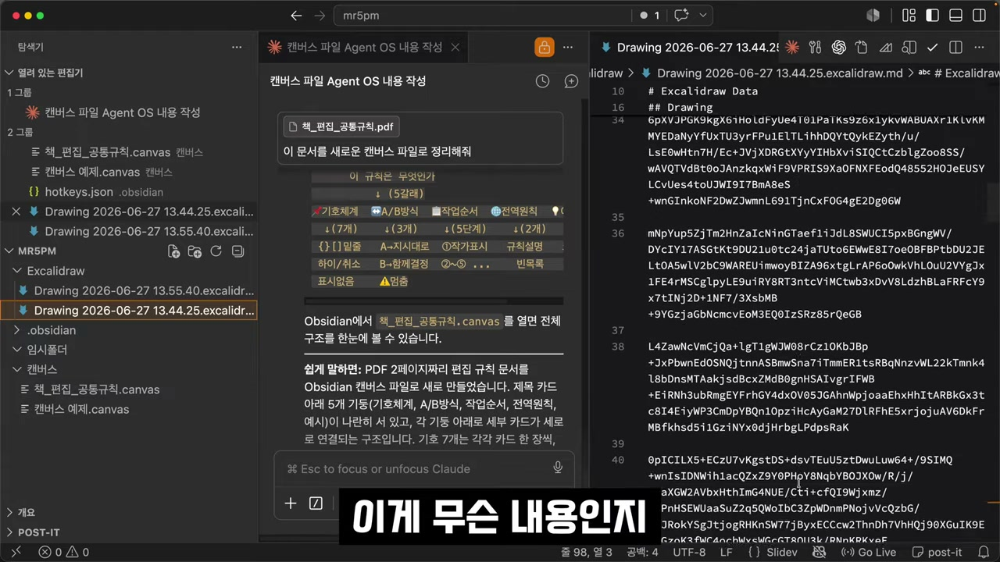

놀랍게도, 우리가 시각적으로 인식하는 그림 파일(.excalidraw)의 내용은 이미지 데이터가 아니라, 사람이 해독하기 어려운 문자들의 조합으로 이루어진 텍스트 파일입니다. 이 파일에는 도형의 종류, 위치, 색상, 연결 관계 등 그림을 구성하는 모든 정보가 텍스트 형태로 암호화되어 저장되어 있습니다.

사람의 눈에는 의미 없는 문자열로 보이지만, AI는 이 텍스트를 읽고 그 구조와 내용을 완벽하게 이해할 수 있습니다. 이는 마치 AI가 코드를 읽고 프로그램의 동작을 이해하는 것과 같은 원리입니다.

### 텍스트 기반 시각화의 가능성

이러한 특성은 이전 영상에서 다루었던 Obsidian의 '캔버스(Canvas)' 기능과 동일합니다. 캔버스 역시 다이어그램을 만드는 기능이며, 그 결과물은 텍스트 파일로 저장됩니다.

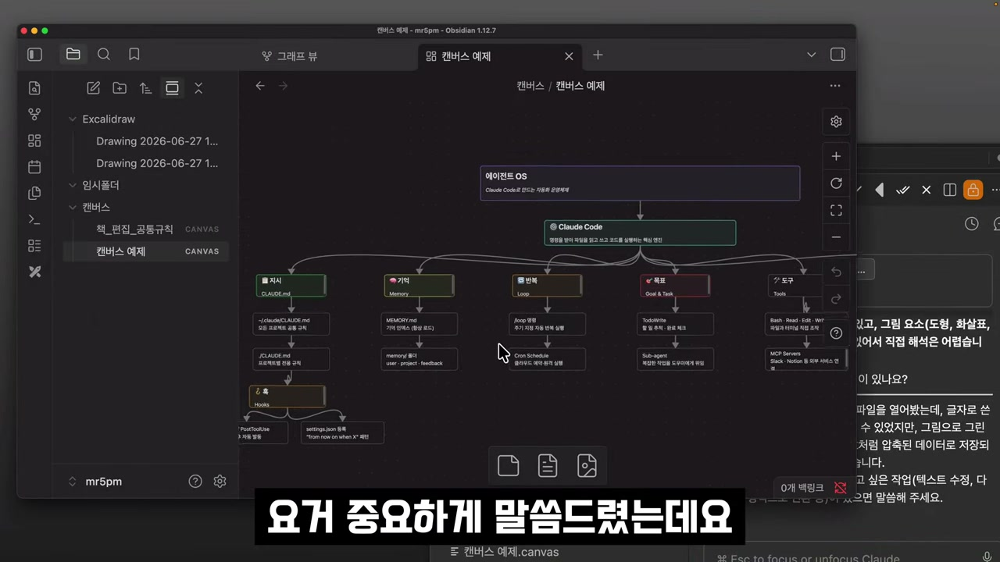

결론적으로, 엑스칼리드로나 캔버스 파일은 본질적으로 '그림으로 표현된 텍스트 데이터'입니다. AI는 이 텍스트를 읽고, 쓰고, 구조화할 수 있기 때문에, 기존의 다이어그램을 수정하거나 완전히 새로운 다이어그램을 생성하는 것이 이론적으로 가능합니다. 즉, 우리는 AI에게 "두 개의 사각형을 그리고 화살표로 연결해 줘"와 같이 텍스트로 지시를 내리고, AI는 그 지시에 따라 엑스칼리드로 파일의 텍스트 데이터를 조작하여 우리가 원하는 그림을 '그려낼' 수 있는 것입니다. 이는 AI와의 상호작용을 통해 시각적 자료를 생성하는 새로운 작업 방식의 가능성을 열어줍니다.
<!-- /dig-section -->

<!-- dig-section: 283 -->
## 옵시디언 그래프 뷰와 AI 시각화

### 캔버스 다이어그램을 엑스칼리드로 변환하기

이 영상 부분에서는 AI 에이전트를 활용하여 옵시디언의 캔버스(Canvas) 파일을 엑스칼리드로우(Excalidraw) 다이어그램으로 변환하는 과정을 시연합니다. 이는 AI가 단순히 텍스트만 처리하는 것을 넘어, 특정 파일 형식을 읽고 그 구조를 이해하여 다른 시각적 형식으로 재창조할 수 있는 능력을 보여주는 중요한 예시입니다.

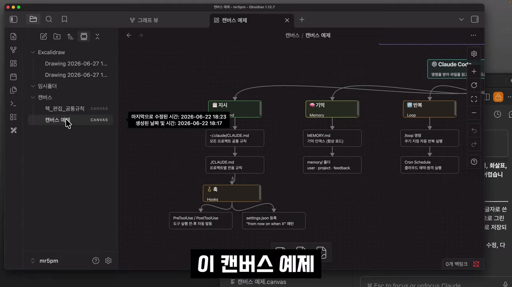

변환을 요청하기 위해 가장 먼저 해야 할 일은 AI에게 어떤 파일을 읽어야 하는지 정확히 알려주는 것입니다. 이를 위해 사용자는 변환할 대상인 '캔버스 예제.canvas' 파일에서 마우스 오른쪽 버튼을 클릭합니다. 그리고 '경로 복사' > '시스템 루트에서' 옵션을 선택하여 파일의 절대 경로를 클립보드에 복사합니다. 이 방법은 파일 이름만으로는 위치를 특정할 수 없는 경우에 AI가 파일을 찾는 데 실패하지 않도록 하는 가장 확실한 방법입니다.

경로를 복사한 후, AI 에이전트의 입력창에 붙여넣고 "이 파일을 excalidraw로 그려줘"라는 간단한 명령을 내립니다. AI는 즉시 "파일을 먼저 읽겠습니다"라고 응답하며 '캔버스 예제.canvas' 파일을 읽기 시작합니다.

### AI가 생성한 엑스칼리드로우 다이어그램

잠시 후, AI는 원본 캔버스 파일의 노드, 텍스트, 연결 관계를 모두 분석하여 새로운 엑스칼리드로우 파일을 생성합니다. 파일 탐색기에는 '에이전트OS.excalidraw'라는 이름의 파일이 새로 만들어진 것을 확인할 수 있습니다.

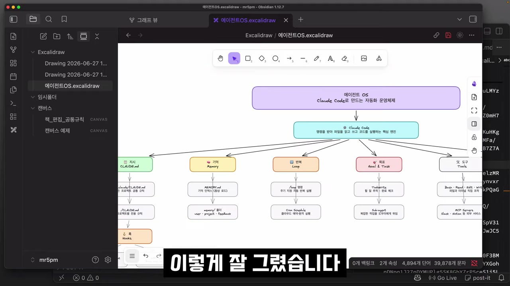

생성된 파일을 열어보면, 원래 캔버스에 있던 복잡한 다이어그램이 깔끔한 엑스칼리드로우 형식으로 완벽하게 재구성된 것을 볼 수 있습니다. 각 노드의 색상, 위치, 연결선까지 원본의 구조를 충실히 반영하여 그려냈습니다. 이 결과는 AI가 파일 시스템에 직접 접근해 데이터를 읽고, 그 내용을 바탕으로 새로운 파일을 쓸 수 있다는 것을 명확히 보여줍니다. 즉, AI는 단순한 정보 검색 도구를 넘어 창의적인 작업을 보조하는 강력한 파트너가 될 수 있음을 의미합니다.

### 옵시디언의 핵심 기능: 플러그인과 그래프 뷰

이어서 영상은 옵시디언의 핵심적인 확장 기능인 '플러그인' 개념을 소개합니다. 옵시디언은 '코어 플러그인'과 '커뮤니티 플러그인'으로 기능을 확장할 수 있는데, 여기서는 옵시디언 개발사가 공식적으로 제공하는 코어 플러그인 중 하나인 '그래프 뷰(Graph View)'에 주목합니다.

그래프 뷰는 볼트(Vault) 내의 모든 노트와 그들 사이의 연결 관계를 시각적인 그래프 형태로 보여주는 기능입니다. 현재 예시로 사용 중인 볼트의 그래프 뷰를 열어보면, 몇 개의 점(노트)들이 서로 연결되지 않은 채 흩어져 있는 것을 볼 수 있습니다. 이는 아직 노트들 간에 링크가 설정되지 않았기 때문입니다.

### 연결된 지식의 시각화

단순한 그래프 뷰와 대조적으로, 사용자는 자신이 메인으로 사용하는 실제 작업 볼트의 그래프 뷰를 예시로 보여줍니다. 화면에는 수많은 노트들이 촘촘하게 연결되어 거대한 구(Sphere) 형태의 지식 네트워크를 형성하고 있습니다.

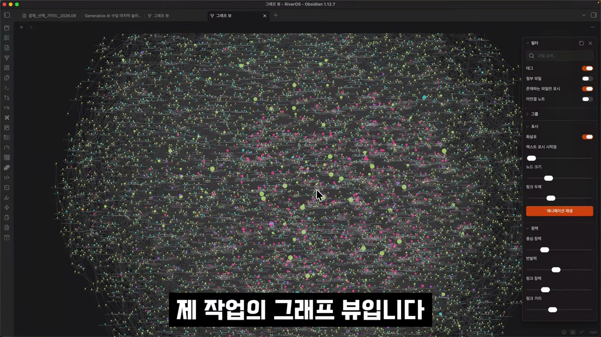

이 복잡하고 아름다운 그래프는 각 노트가 어떻게 유기적으로 연결되어 지식 체계를 구축하는지를 한눈에 보여줍니다. 이를 통해 사용자는 자신의 작업물과 아이디어들이 어떤 식으로 분포하고 연결되어 있는지 직관적으로 파악할 수 있습니다. AI를 활용해 캔버스를 엑스칼리드로우로 변환하는 것과 같은 작업들은 결국 이러한 거대한 지식 네트워크를 더 효율적으로 구축하고 시각화하기 위한 과정의 일부라고 할 수 있습니다.
<!-- /dig-section -->

<!-- dig-section: 403 -->
## AI와의 효율적인 문서 작업: 파일 경로 활용

### 그래프 뷰: 지식의 시각화

옵시디언(Obsidian)의 그래프 뷰는 작성된 모든 문서(노트)들이 서로 어떻게 연결되어 있는지를 한눈에 보여주는 강력한 시각화 도구입니다. 화면에 보이는 수많은 점들은 각각 하나의 노트를 의미하며, 이 점들을 잇는 선은 노트 간의 연결 관계를 나타냅니다.

이 복잡해 보이는 네트워크 속에서 노트의 색상, 연결성 등은 중요한 정보를 담고 있습니다. 각 노트는 독립된 정보 조각이지만, 서로 연결되면서 거대한 지식 네트워크를 형성합니다. 이 연결 패턴을 통해 사용자는 자신의 생각이나 정보가 어떤 구조를 이루고 있는지 직관적으로 파악할 수 있습니다.

### 태그와 그룹을 통한 정보의 구조화

노트 간의 연결은 주로 태그(Tag)나 내부 링크를 통해 이루어집니다. 예를 들어, 영상에서는 'Claude'라는 태그를 클릭하자 해당 태그를 포함하는 수많은 문서들이 방사형의 붉은 선으로 연결되는 것을 보여줍니다. 이는 'Claude'라는 공통 주제 아래 여러 문서가 어떻게 묶여 있는지를 명확히 보여주는 예시입니다.

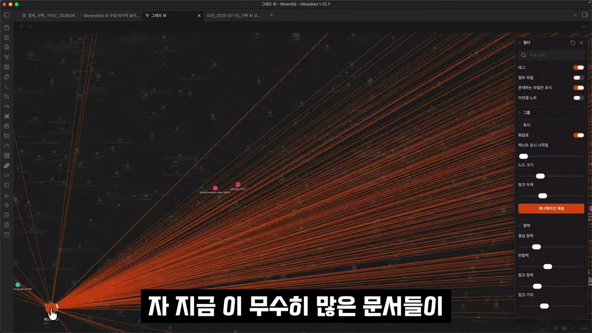

더 나아가, 특정 기준에 따라 노트를 그룹화하고 각 그룹에 고유한 색상을 부여할 수 있습니다. 영상에서는 특정 폴더 경로(path)에 포함된 노트들을 그룹으로 묶고 색깔을 지정하는 설정 화면을 보여줍니다. 예를 들어, '오후 5시'와 관련된 문서들을 모두 분홍색으로 지정하면, 전체 그래프 뷰에서 분홍색 노트들이 하나의 클러스터(군집)를 형성하여 시각적으로 쉽게 구분할 수 있습니다. 이러한 작업은 사용자가 직접 할 수도 있지만, AI에게 요청하여 자동으로 분류하고 태그를 지정하게 할 수도 있습니다.

### AI와 대규모 노트 관리의 어려움

문제는 노트의 수가 수백, 수천 개를 넘어갈 때 발생합니다. 파일이 몇 개 없을 때는 AI에게 "A 파일과 B 파일을 연결해 줘"라고 간단히 요청하면 되지만, 영상의 그래프 뷰처럼 파일이 무수히 많아지면 상황이 복잡해집니다.

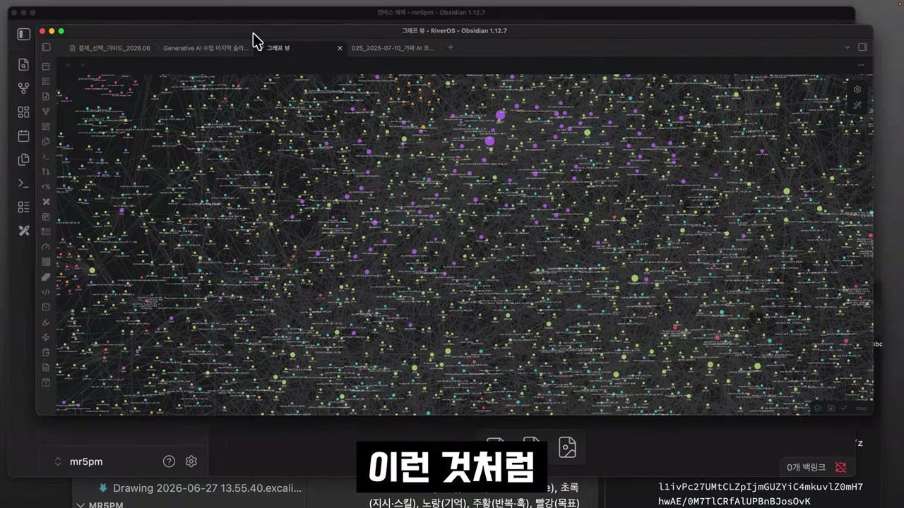

예를 들어 "프로젝트 폴더에 있는 회의록 파일을 요약해 줘"라고 AI에게 지시했다고 가정해 봅시다. 만약 해당 폴더에 수많은 회의록 파일이 있다면 AI는 어떤 파일이 사용자가 원하는 특정 파일인지 즉시 알 수 없습니다. 관련된 폴더나 태그 정보를 알려준다 하더라도, AI는 정확한 파일을 찾아내기 위해 수많은 파일 목록을 검토하고 분석해야 하는 불필요한 과정을 거치게 됩니다.

### 비효율적인 AI 작업의 문제: 비용과 자원 낭비

이러한 비효율적인 탐색 과정은 여러 문제를 야기합니다.

1.  **토큰 소모 및 비용 증가**: AI가 정확한 파일을 찾기 위해 파일 목록을 검색하고 내용을 분석하는 과정에서 상당한 양의 토큰(Token)을 소모하게 됩니다. 토큰 사용량은 곧 API 사용 비용으로 직결되므로, 불필요한 비용 낭비가 발생합니다.
2.  **메모리 및 자원 낭비**: AI가 쓸데없는 작업을 수행하면서 시스템 메모리와 처리 능력을 낭비하게 됩니다.
3.  **작업의 정확도 저하**: 최악의 경우, AI가 사용자의 의도를 잘못 파악하여 엉뚱한 파일을 찾아 작업할 수도 있습니다.

따라서 수많은 문서 속에서 AI와 효율적으로 작업하기 위해서는 모호한 지시 대신, 작업 대상이 되는 파일의 정확한 경로를 명시하여 AI가 다른 파일을 탐색할 필요 없이 즉시 해당 파일을 찾아 작업하게 하는 것이 중요합니다. 이는 비용과 시간을 절약하고 AI 작업의 정확성을 높이는 핵심적인 전략입니다.
<!-- /dig-section -->

<!-- dig-section: 511 -->
## 작업 효율을 높이는 단축키 설정

AI와 협업 시 작업에 필요한 파일의 위치를 정확히 알려주는 것은 매우 중요합니다. 파일 경로를 일일이 마우스로 클릭해 복사하는 것은 번거롭고 비효율적입니다. 이 과정을 단축키 하나로 해결하여 작업 속도를 크게 향상시키는 방법을 자세히 알아보겠습니다.

### 수동 경로 복사와 단축키 설정

옵시디언에서 특정 파일의 경로를 얻으려면, 파일 목록에서 해당 파일을 마우스 오른쪽 버튼으로 클릭한 후 '경로 복사' 메뉴를 통해 원하는 형식의 경로를 선택해야 합니다. 이는 최소 3번의 클릭이 필요한 번거로운 작업입니다.

이러한 반복 작업을 피하기 위해 단축키를 설정할 수 있습니다. 단축키를 사용하면 파일 선택 후 키 조합 한 번만으로 즉시 경로를 클립보드에 복사할 수 있어 매우 편리합니다.

### 옵시디언 단축키 설정 방법

파일 경로 복사 단축키는 다음 단계에 따라 설정할 수 있습니다.

1.  좌측 하단의 톱니바퀴 아이콘을 눌러 '설정' 메뉴로 들어갑니다.
2.  '단축키' 탭을 선택합니다.
3.  검색창에 '경로'라고 입력하면 경로 복사와 관련된 두 가지 주요 명령어를 찾을 수 있습니다.
    *   **파일 경로 복사**: 현재 옵시디언 보관소(Vault)를 기준으로 한 **상대 경로**를 복사합니다.
    *   **시스템 루트에서 현재 파일 경로 복사**: 컴퓨터의 최상위 디렉토리(루트)부터 시작하는 **절대 경로**를 복사합니다.

4.  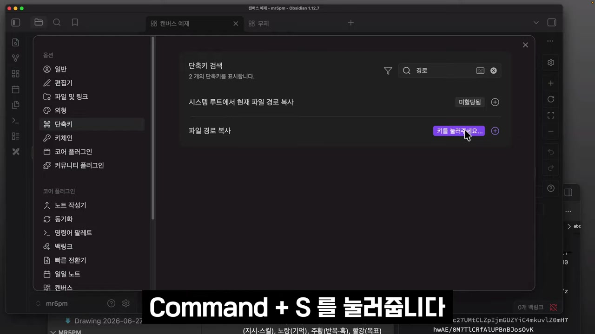 원하는 명령어 옆의 '+' 아이콘(단축키 사용자화)을 클릭합니다.
5.  원하는 키 조합을 직접 누릅니다. 영상에서는 macOS 기준으로 `Option + Command + S`를 '파일 경로 복사'에 할당했습니다.

단축키를 설정한 후, 파일 목록에서 파일을 선택하고 해당 단축키를 누르면 화면 우측 상단에 "클립보드에 복사됨"이라는 알림이 나타나며 경로가 성공적으로 복사됩니다. 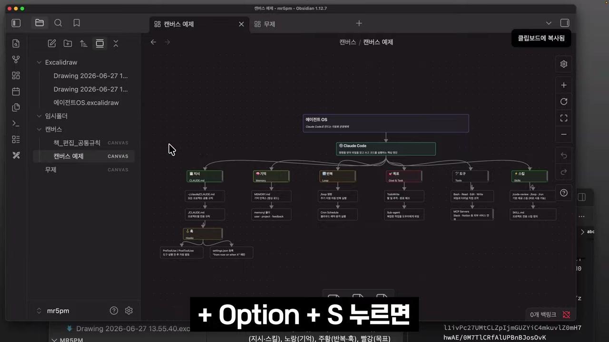

#### 단축키 충돌 방지하기

단축키를 설정할 때 주의할 점은 기존에 사용 중인 단축키와 겹치지 않도록 하는 것입니다. 예를 들어, '파일 경로 복사'에 `Command + S`를 할당하려고 하면, 이 키 조합은 이미 '파일 저장' 기능에 할당되어 있으므로 "1개의 중복되는 단축키가 있습니다"라는 경고 메시지가 표시됩니다. 이런 경우, 다른 프로그램이나 기능과 충돌하지 않는 자신만의 고유한 키 조합(예: `Ctrl + Option + S` 또는 `Command + Option + S`)을 사용하는 것이 좋습니다.

### 상대 경로와 절대 경로: 무엇을 써야 할까?

옵시디언에서는 두 가지 종류의 파일 경로를 복사할 수 있으며, 각각의 용도가 다릅니다.

*   **상대 경로 (파일 경로 복사)**: 이 단축키(`Option + Command + S`)로 복사된 경로는 `캔버스/캔버스 예제.canvas`와 같이 현재 프로젝트(보관소) 내부에서의 위치만 나타냅니다. 이 경로는 해당 옵시디언 프로젝트 내에서 링크를 만들 때는 유용하지만, 다른 프로그램이나 다른 옵시디언 프로젝트에서는 파일의 위치를 찾을 수 없습니다.

*   **절대 경로 (시스템 루트에서 현재 파일 경로 복사)**: 이 단축키(`Control + Option + S`)로 복사된 경로는 `/Users/mr.5pm_public/.../캔버스 예제.canvas`와 같이 컴퓨터의 전체 파일 시스템 경로를 포함합니다. 이 경로는 어떤 프로그램에서든, 심지어 다른 옵시디언 프로젝트에서도 파일의 정확한 위치를 가리킬 수 있습니다.

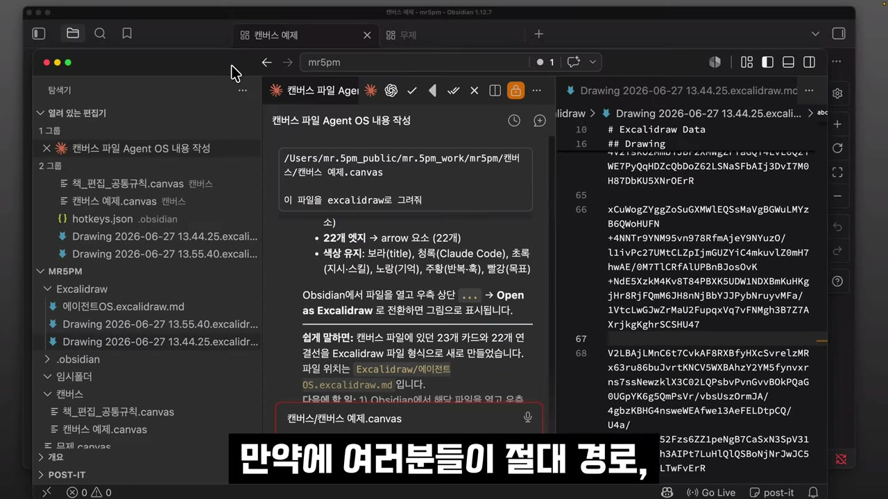

영상에서는 여러 프로젝트(보관소)를 동시에 사용하는 경우가 많기 때문에, 어떤 상황에서든 파일의 위치를 정확하게 지정할 수 있는 **절대 경로** 사용을 권장합니다. 절대 경로를 복사하는 단축키를 설정해두면 외부 AI 도구나 다른 애플리케이션과 연동할 때 혼동 없이 명확하게 파일을 참조할 수 있습니다.
<!-- /dig-section -->

<!-- dig-section: 666 -->
## Conclusion

### AI를 활용한 시각적 노트 작성: 엑스칼리드로
영상에서는 옵시디언의 강력한 기능 중 하나로 커뮤니티 플러그인 '엑스칼리드로(Excalidraw)'를 다시 한번 강조합니다. 이 플러그인은 단순히 그림을 그리는 도구를 넘어, AI와 상호작용하며 시각적 자료를 만들 수 있다는 점에서 특별합니다. 사용자가 텍스트로 개념을 설명하면 AI가 이를 이해하고 그림으로 그려주는 기능을 통해, 복잡한 아이디어나 구조를 손쉽게 시각화할 수 있습니다. 이는 생각의 흐름을 끊지 않고 시각적인 노트를 작성할 수 있게 하여 생산성을 크게 향상시킵니다.
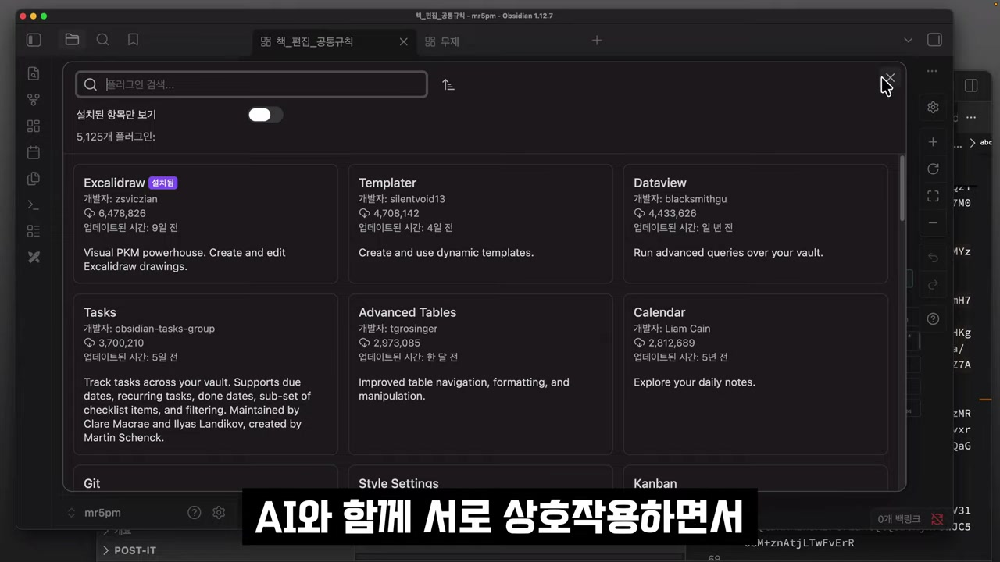

### 전문가처럼 작업 속도 높이기: 단축키 활용
옵시디언을 더욱 효율적으로 사용하는 방법으로 '단축키(Hotkeys)' 설정이 소개됩니다. 영상에서는 방대한 양의 기능에 각각 단축키를 할당할 수 있는 설정 화면을 보여줍니다. 자주 사용하는 기능, 예를 들어 새로운 엑스칼리드로 드로잉을 생성하거나 특정 형식의 파일을 삽입하는 등의 작업을 단축키로 지정해두면, 마우스를 여러 번 클릭하거나 메뉴를 찾아 헤맬 필요가 없어집니다. 이러한 단축키 활용은 작업 속도를 비약적으로 향상시킬 뿐만 아니라, 사용자를 더욱 전문가처럼 보이게 만드는 효과도 있습니다.
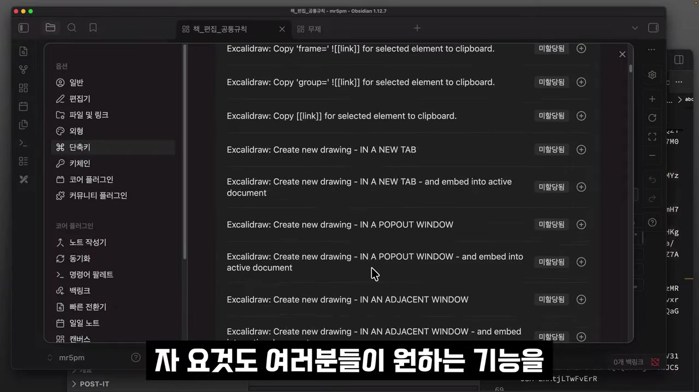

### 지식의 연결을 한눈에: 그래프 뷰
마지막으로 코어 플러그인 중 하나인 '그래프 뷰(Graph view)'의 중요성을 언급합니다. 그래프 뷰는 옵시디언의 핵심 철학인 '연결된 생각'을 시각적으로 보여주는 기능입니다. 각각의 노트가 점으로, 노트 간의 링크가 선으로 표시되어 자신의 지식 베이스가 어떤 구조로 연결되어 있는지 한눈에 파악할 수 있습니다. 이를 통해 개별 정보들을 전체적인 맥락 속에서 이해하고, 생각지도 못했던 새로운 연결고리를 발견하는 데 도움을 줍니다. 이러한 시각화 작업은 지식을 단순히 저장하는 것을 넘어, 창의적으로 활용하고 확장하는 데 필수적입니다.
<!-- /dig-section -->
