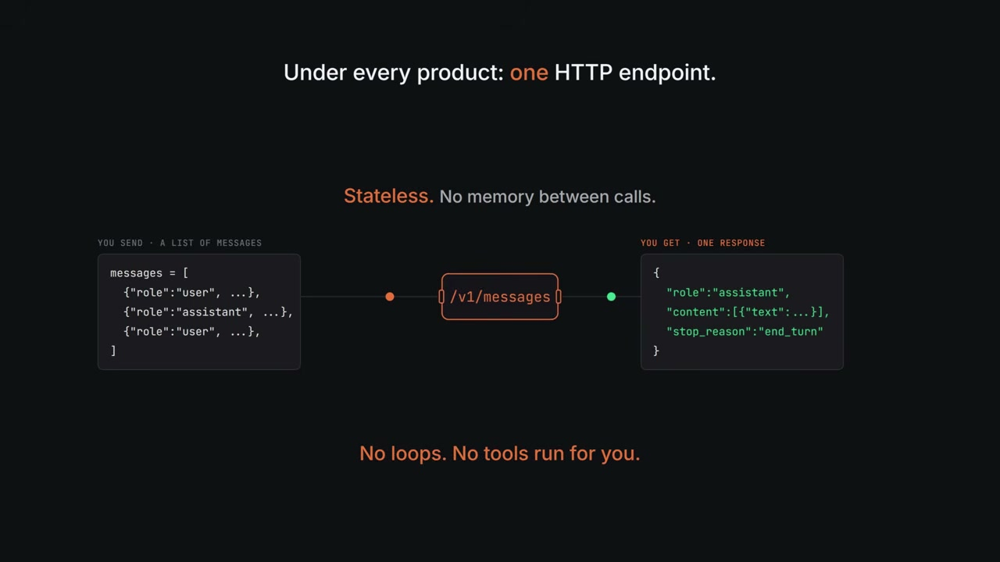
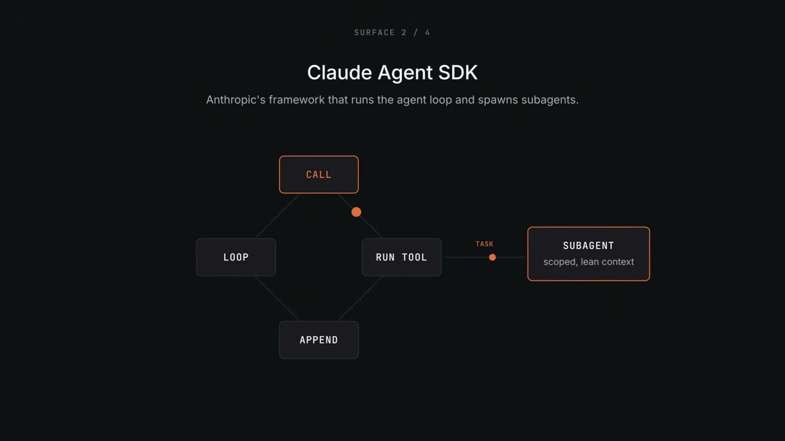
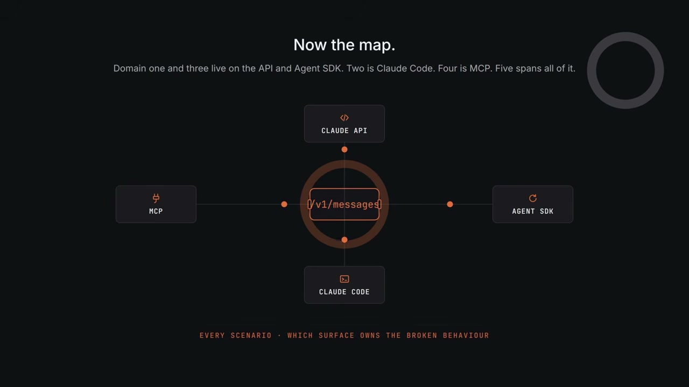
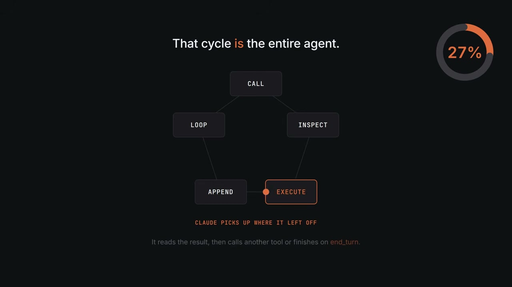
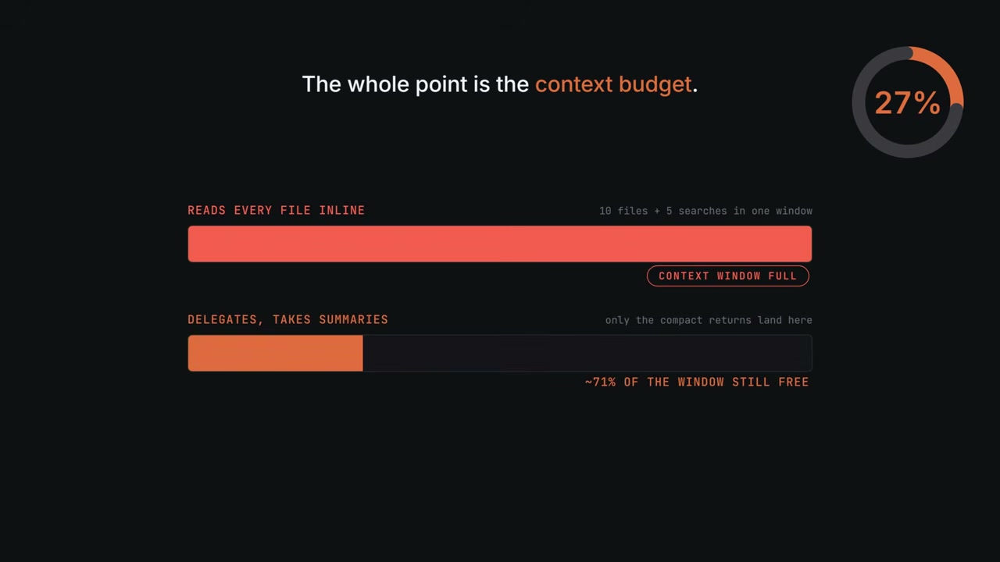
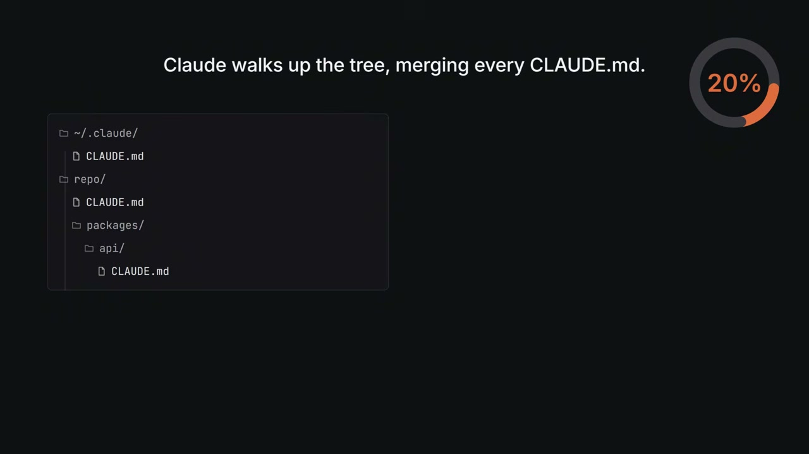
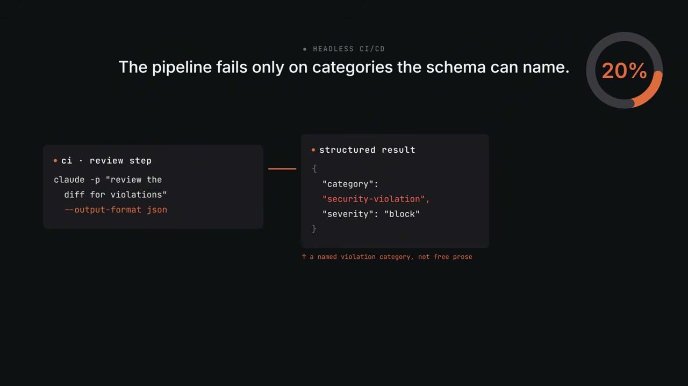
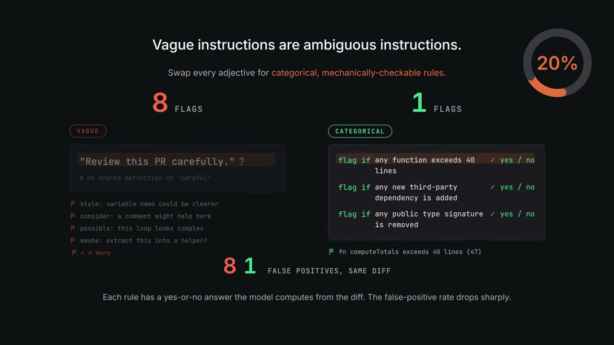

<!-- dig-section: 6 -->
## Exam Overview and Claude Fundamentals

The Anthropic Certified Architect exam is designed to test your ability to make sound architectural decisions in real-world situations. To pass, you must correctly answer at least 75% of 60 multiple-choice, scenario-based questions within a 120-minute, proctored session.

The questions are drawn from a pool based on six distinct production scenarios. During your exam, the system will randomly select four of these scenarios, and all 60 questions you face will be anchored to them. This means you won't be asked simple definition questions. Instead, each question places you inside a working system—often one that is actively breaking—and requires you to choose the correct architectural fix given a specific set of circumstances. With only about two minutes per question, a solid foundational understanding is critical.

### The Core Engine

Before examining the specific test domains, it's essential to understand what Claude is at its most fundamental level. The exam assumes you already know this. At the heart of every Anthropic product is a single, simple component: a language model exposed via one stateless HTTP endpoint: `api.anthropic.com/v1/messages`.

The interaction is a basic request-response cycle. You send the endpoint a list of messages, and you receive a single response. This core engine has three critical limitations you must remember:
1.  **It is stateless.** The model has no memory of previous calls.
2.  **It does not run loops.** The engine processes a single turn and stops.
3.  **It does not execute code.** The model can suggest code or tool calls, but it cannot run them for you.

This simple, stateless endpoint and its inherent limitations constitute the entire engine.

### The Four Surfaces

Everything else Anthropic provides is a layer of disciplined abstraction built on top of that core engine. The exam tests your knowledge across four of these "surfaces," and you must be able to recognize them by name to understand which layer is responsible for a given behavior.

*   **Claude API:** This is the most direct way to interact with the engine. It consists of the raw HTTP endpoint itself, plus the official Python and TypeScript SDKs that provide convenient wrappers for it.
*   **Claude Agent SDK:** This is a framework built on top of the API to overcome the core engine's limitations. It provides the logic for running agentic loops, managing conversation state, spawning sub-agents for specific tasks, and using built-in tools without having to implement the boilerplate yourself. 
*   **Claude Code:** This is a specialized terminal agent designed to operate within a software repository. It is given access to the local filesystem through a specific set of tools: `read`, `write`, `edit`, `bash`, and `grep`. This allows it to read existing code, make changes, and run tests directly in your environment.
*   **MCP (Model Context Protocol):** This is an open standard, not a specific product. Its purpose is to define a common way for any external tool or data source—like a payment processor, an internal wiki, or a database—to plug into *any* compliant language model, not just Claude. This prevents the need to write custom "glue code" for every integration.

### Mapping Surfaces to Exam Domains

These four surfaces provide a mental map for navigating the exam domains. The questions are structured to test your understanding of where responsibility lies within this layered architecture.

*   **Domains 1 (API & SDKs) and 3 (Agents & Tool Use)** primarily test your knowledge of the **Claude API** and the **Agent SDK**.
*   **Domain 2 (Dev Tools & CI/CD)** is centered on **Claude Code**.
*   **Domain 4 (Structured Extraction & MCP)** focuses on the **Model Context Protocol**.
*   **Domain 5 (Reliability & Trust)** spans all four surfaces, as ensuring a system is reliable is a property of the whole architecture.

Ultimately, every scenario-based question is a puzzle about identifying which surface is involved and "owns" the broken or required behavior. Holding this architectural map in your head is the key to reasoning through the exam's challenges.
<!-- /dig-section -->

<!-- dig-section: 186 -->
## Agentic Architecture and Orchestration

Because the Claude API is stateless—meaning it doesn't remember previous interactions—your application code is entirely responsible for managing the conversation history and orchestrating multi-step tasks. This is the fundamental principle of agentic architecture with Claude. Your code implements the loop that gives the agent memory and the ability to perform sequences of actions.

### The Single-Agent Loop

When you want Claude to use tools, you call the `messages.create` endpoint and provide a list of available tools. The API response then includes a crucial field called `stop_reason`, which dictates what your code should do next. There are two primary values to handle:

*   **`end_turn`**: This value signifies that Claude has finished its thought process and has provided a final, textual answer. Your code can then return this response to the user and terminate the loop.
*   **`tool_use`**: This value indicates that Claude has paused mid-task and is requesting that your code execute a specific function on its behalf. The response will contain the name of the function to call and the arguments to pass to it.

This `stop_reason` field is the control mechanism for a complete agentic cycle, which consists of five steps: **Call**, **Inspect**, **Execute**, **Append**, and **Loop** (which is the next Call).

1.  **Call**: Your code calls `messages.create` with the current conversation history and available tools.
2.  **Inspect**: Your code inspects the `stop_reason` in the response. If it's `tool_use`, you extract the function name and arguments.
3.  **Execute**: Your code runs the requested function locally.
4.  **Append**: You create a new `tool_result` message containing the output from the function and append it to your conversation history.
5.  **Loop**: You call `messages.create` again with the updated history, allowing Claude to process the tool's result and decide on the next step.

Failing to implement this cycle correctly will break the agent. If you forget the **Append** step, Claude never receives the result of the tool call. Because it has no memory of the result, it will simply re-request the exact same tool call again, getting stuck in a loop. Exam questions often present code snippets with a missing step from this cycle and ask you to identify the bug.

### Multi-Agent Systems and Context Budget

For complex tasks that require processing large amounts of information—like reading ten files and running five searches—a single agent will quickly exhaust its context window. The solution is a multi-agent pattern involving a **coordinator** and **sub-agents**.

A top-level coordinator agent breaks the main task into smaller, manageable pieces. It then spawns specialized, smaller-scoped sub-agents to handle each piece. This is done using a built-in function in the Agent SDK called the `task` tool. The entire purpose of this pattern is to manage the context budget.

Instead of loading the full content of ten files into its own context, the coordinator delegates the reading of each file to a sub-agent. Each sub-agent reads its assigned file, processes it, and returns only a compact summary. The coordinator only ever sees these summaries, keeping its own context window lean and available for high-level reasoning and planning.

### Decomposition and Failure Recovery

There are two primary ways a coordinator can split the work:

*   **Sequential Decomposition**: The coordinator waits for sub-agent #1 to complete before starting sub-agent #2. This is the correct approach when the steps are interdependent, and the output of one sub-agent is required as the input for the next.
*   **Adaptive Decomposition**: The coordinator is not given a fixed plan. Instead, it chooses the next sub-agent to spawn based on the results from the previous one. This is ideal for open-ended, investigative work, such as researching a competitor's pricing strategy, where each finding informs the next line of inquiry.

When a sub-agent fails midway through a multi-step process, it's critical to handle the failure correctly. The successful sub-agents may have already performed actions with real-world side effects, like writing data to a database or sending emails. A naive, full re-run of the entire job would cause these actions to be dangerously duplicated. The correct recovery is almost always a **targeted retry** of *only* the sub-agent that failed.
<!-- /dig-section -->

<!-- dig-section: 374 -->
## Claude Code Configuration and Workflows

Claude Code is a command-line agent that runs directly in your project's repository. By default, it's stateless—each new session starts with zero memory of your project's conventions, tooling rules, or other important context. The `CLAUDE.md` file is the mechanism that solves this problem, providing a way to inject persistent memory into every session.

### The CLAUDE.md Hierarchy

When Claude Code boots, it traverses the directory tree upwards from your current location, searching for files named `CLAUDE.md`. It then merges the contents of all the files it finds and prepends them to the session's system prompt. This process creates a three-tiered hierarchy for project rules and conventions.

*   **User Level:** This file is located at `~/.claude/claude.md`. Its rules apply to every project on your local machine. Because it lives in your home directory and is never committed to version control, it's the ideal place for personal preferences, such as "my editor is nvim" or "prefer concise diffs."

*   **Project Level:** This file sits at the root of your repository (e.g., `./CLAUDE.md`). It is committed to Git and shared with everyone who clones the project. This is where you should define team-wide conventions that apply to the entire repository, like "use bun, never npm" or "lint before commit."

*   **Directory Level:** You can place a `CLAUDE.md` file inside any subdirectory of your project (e.g., `packages/api/CLAUDE.md`). The rules in this file are scoped to apply only when Claude is working on code within that specific folder. For example, a rule like "never log PII" might be critical for an API package but less relevant elsewhere.

The exam frequently tests this hierarchy. A common question involves a team-wide rule, such as "everyone runs lint before commit." The correct answer is to place this rule in the project-level `CLAUDE.md` at the repo root. Placing it in the user-level file is a common mistake; since that file isn't version-controlled, your teammates would never see the rule. If rules conflict, the one in the "nearest" file (closest to your current directory) wins, meaning directory-level rules override project rules, which in turn override user rules.

### Custom Slash Commands

Slash commands are reusable, named prompts you can invoke in the Claude Code terminal by typing a forward slash, such as `/review`. You create a custom command by adding a Markdown file to the `.claude/commands/` directory in your project. The name of the file becomes the command's name.

The command file has two parts:
1.  **YAML Front Matter:** This section at the top of the file configures the command's behavior. You can use the `allowed-tools` field to restrict which of Claude's built-in tools the command can use. For instance, a `/review` command can be locked down to read-only tools like `Read` and `Grep`, preventing it from writing files or executing shell commands. The `argument-hint` field provides a placeholder text in the UI to show users what kind of argument the command expects (e.g., `<pr-number>`).
2.  **Prompt Body:** The main content of the Markdown file is the prompt that gets injected into the session when the command is run.

### Headless CI/CD

Claude Code can be integrated into automated pipelines using the `-p` flag, which runs it non-interactively with a pre-defined prompt. This is particularly powerful for CI/CD workflows. When combined with a request for structured output (like JSON), you can build automated review steps. For example, a pipeline can ask Claude to "review the diff for violations" and return a JSON object.

A key architectural principle tested here is that pipelines should be designed to fail only on specific, named violation categories defined in the output schema (e.g., `"category": "security-violation"`). A pipeline that fails on a vague, free-text "concern" will generate too much noise and be ignored by the team. A noisy, ignored review process is considered worse than no review at all.

### Prompt Engineering and Structured Output

This domain focuses on making instructions clear and outputs reliable.

#### Vague vs. Categorical Instructions

Vague instructions are ambiguous. A prompt like "Review this PR carefully" is ineffective because the model has no shared definition of "careful." It will flag anything that pattern-matches to "caution," resulting in numerous false positives. The correct approach is to replace subjective adjectives with a list of specific, categorical, and mechanically-checkable rules.

*   **Vague:** "Review this PR carefully."
*   **Categorical:** "Flag if any function exceeds 40 lines. Flag if any new third-party dependency is added. Flag if any public type signature is removed."

Each categorical rule has a clear yes/no answer, which dramatically reduces the false-positive rate.

#### Getting Reliable JSON

While you can ask the model to "return JSON," this approach is brittle. The model might prepend conversational text (e.g., "Sure, here is your JSON..."), which will break your parser. The reliable method is to **declare the desired output shape as a tool**. This involves three steps:
1.  **Declare:** Define a tool with an `input_schema` that describes the exact JSON structure you need.
2.  **Pass:** Include this tool definition in the `tools` array of your API call.
3.  **Force:** Use the `tool_choice` parameter to force the model to call that specific tool.

The model will then respond with a `tool_use` block containing perfectly formatted, schema-compliant JSON. This is far more reliable because Claude models are heavily fine-tuned against tool schemas.

### Reliability, Retries, and Batching

Even with well-defined tools, failures happen. The correct way to handle them is with a **validation and retry loop**. Instead of retrying blindly, your code should:
1.  Validate the model's JSON response against your schema.
2.  If it fails, create a new user message containing the specific validation error (e.g., "Your previous response failed validation: missing field 'total'").
3.  Append this feedback to the conversation and call the model again.

With this explicit feedback, the model has the context of its own mistake and corrects itself over 90% of the time on the second attempt.

For large-scale, offline tasks with independent prompts (like classifying 100,000 documents overnight), the **Message Batches API** is the right choice. It allows you to submit a large batch of prompts at once and retrieve the results within 24 hours for about 50% of the cost of real-time calls. You should choose batch processing when the work is offline, latency can be measured in hours, and the prompts are independent.

### Tool Design and the Model Context Protocol (MCP)

MCP is an open standard for how external tools and data sources connect to a language model. Instead of writing custom glue code for each tool and model, MCP provides a single protocol that any compliant server (a database, wiki, payments API, etc.) can use to plug into the model.

Effective tool design under MCP requires three key considerations:
1.  **Clear Descriptions:** At decision time, the model only sees a tool's name, description, and schema. Ambiguous or identical descriptions for different tools (e.g., `get_user`, `lookup_user`) will cause the model to pick one at random. Descriptions should be written like API documentation, clearly stating the tool's purpose, *when to use it* (the disambiguator), an example invocation, and possible error conditions.
2.  **Structured Error Responses:** When a tool fails, it should return a structured JSON object containing an `isError` flag, a `category` string (like `rate_limited`), a `retryable` boolean, and an optional `retry_after_ms` value. This gives the model the information it needs to form a correct recovery plan in a single step, rather than getting stuck in a retry loop.
3.  **Transport Selection:** MCP supports two transports. Use **`stdio`** (standard in/out) by default, as it offers zero network latency when the tool server runs on the same machine as the client. Use **`SSE`** (Server-Sent Events) only when the server *must* live on a different host, which adds network latency and requires an authentication scheme.

### Context Management

Two critical concepts for managing context are the "lost in the middle" effect and prompt caching.

#### The Lost in the Middle Effect

Language models, including Claude, have a U-shaped attention curve. They recall information best from the very beginning and very end of the context window, while information in the middle is often forgotten. For example, in a 40-turn support chat, an account number mentioned in turn 3 might be lost.

The solution is to identify **durable facts** (account numbers, order IDs, etc.), place them in a structured `<case_block>`, and re-anchor this block at the very *bottom* of the context on every turn. This ensures the model's attention always lands on these crucial details. Simply asking the model to "summarize the conversation" is a trap, as summarization is lossy and will likely drop the specific IDs you need to preserve.

#### Prompt Caching

Sending a large, static prefix (like a system prompt or few-shot examples) on every API call costs money each time. Prompt caching solves this. By adding a `cache_control` parameter after the static portion of your prompt, you instruct Anthropic to cache the model's internal state for that prefix. The first call pays full price, but subsequent calls that reuse the exact same prefix within five minutes pay only about 10% of the original cost for that cached section. You should only cache parts of the prompt that are identical across calls, like the system prompt and few-shot examples. The final user turn, which is unique to each call, should never be cached.

### Exam Distractor Patterns

The video highlights five common "traps" or distractor patterns that appear frequently on the exam:
1.  **Vague Adjective:** Suggesting to fix a prompt by adding a word like "careful" or "thorough." The correct answer is to use a numbered list of categorical rules.
2.  **Summarize:** Proposing to summarize a long conversation to save space. The correct answer is to extract durable facts into a `<case_block>` at the end of the context.
3.  **Blanket Retry:** Re-running all subagents in a multi-agent system when one fails. The correct answer is to retry only the one that failed.
4.  **User `CLAUDE.md`:** Placing team-wide rules in the user-level `CLAUDE.md` file. The correct answer is to place them in the project-level file at the repo root.
5.  **SSE on Localhost:** Choosing the SSE transport for a server running on the same machine as the client. The correct answer is to use `stdio` for zero network latency.
<!-- /dig-section -->
